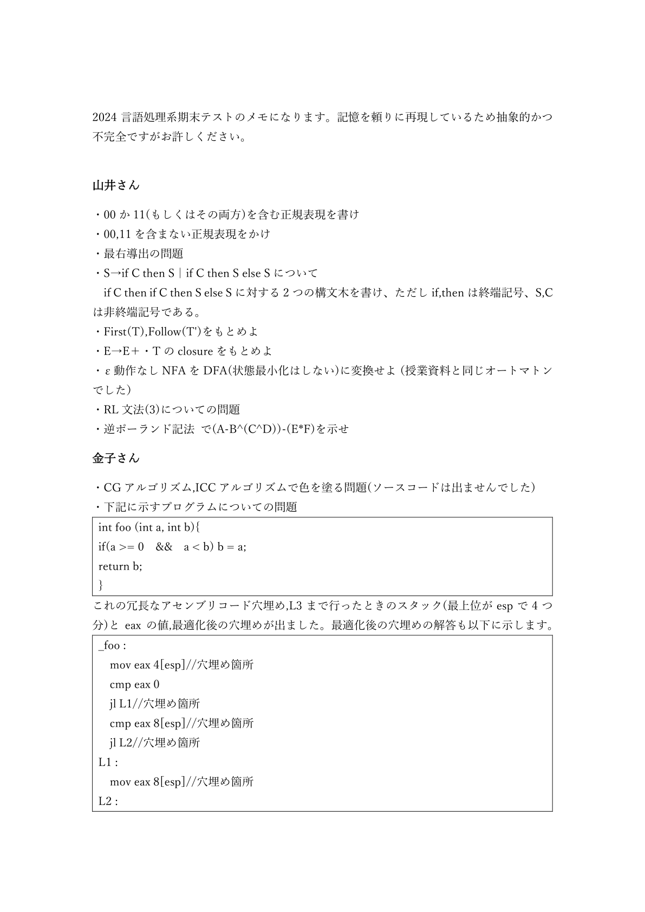
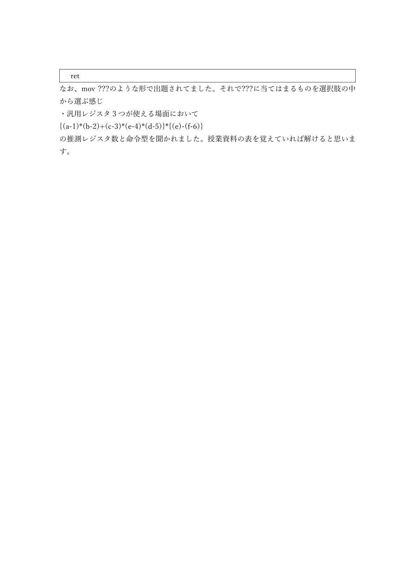

# 金子&山井2024期末

<!-- source: 金子&山井2024期末.pdf -->

## 金子&山井2024期末_p001
<!-- source: 金子&山井2024期末.pdf page 1 -->

2024 言語処理系期末テストのメモになります。記憶を頼りに再現しているため抽象的かつ
不完全ですがお許しください。

山井さん
・00 か11(もしくはその両方)を含む正規表現を書け
・00,11 を含まない正規表現をかけ
・最右導出の問題
・S→if C then S｜if C then S else S について
if C then if C then S else S に対する2 つの構文木を書け、ただしif,then は終端記号、S,C
は非終端記号である。
・First(T),Follow(T')をもとめよ
・E→E＋・T のclosure をもとめよ
・ε動作なしNFA をDFA(状態最小化はしない)に変換せよ（授業資料と同じオートマトン
でした）
・RL 文法(3)についての問題
・逆ポーランド記法 で(A-B^(C^D))-(E*F)を示せ
金子さん
・CG アルゴリズム,ICC アルゴリズムで色を塗る問題(ソースコードは出ませんでした)
・下記に示すプログラムについての問題
int foo (int a, int b){
if(a >= 0  &&  a < b) b = a;
return b;
}
これの冗長なアセンブリコード穴埋め,L3 まで行ったときのスタック(最上位がesp で4 つ
分)とeax の値,最適化後の穴埋めが出ました。最適化後の穴埋めの解答も以下に示します。
_foo :
  mov eax 4[esp]//穴埋め箇所
  cmp eax 0
  jl L1//穴埋め箇所
  cmp eax 8[esp]//穴埋め箇所
  jl L2//穴埋め箇所
L1 :
  mov eax 8[esp]//穴埋め箇所
L2 :

## 金子&山井2024期末_p002
<!-- source: 金子&山井2024期末.pdf page 2 -->

ret
なお、mov ???のような形で出題されてました。それで???に当てはまるものを選択肢の中
から選ぶ感じ
・汎用レジスタ3 つが使える場面において
{(a-1)*(b-2)+(c-3)*(e-4)*(d-5)}*{(e)-(f-6)}
の推測レジスタ数と命令型を聞かれました。授業資料の表を覚えていれば解けると思いま
す。

