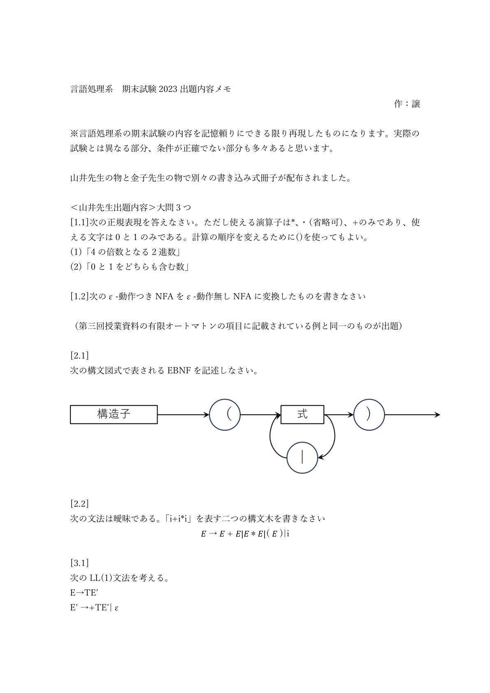
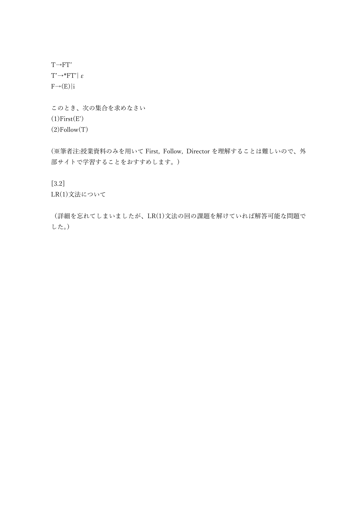
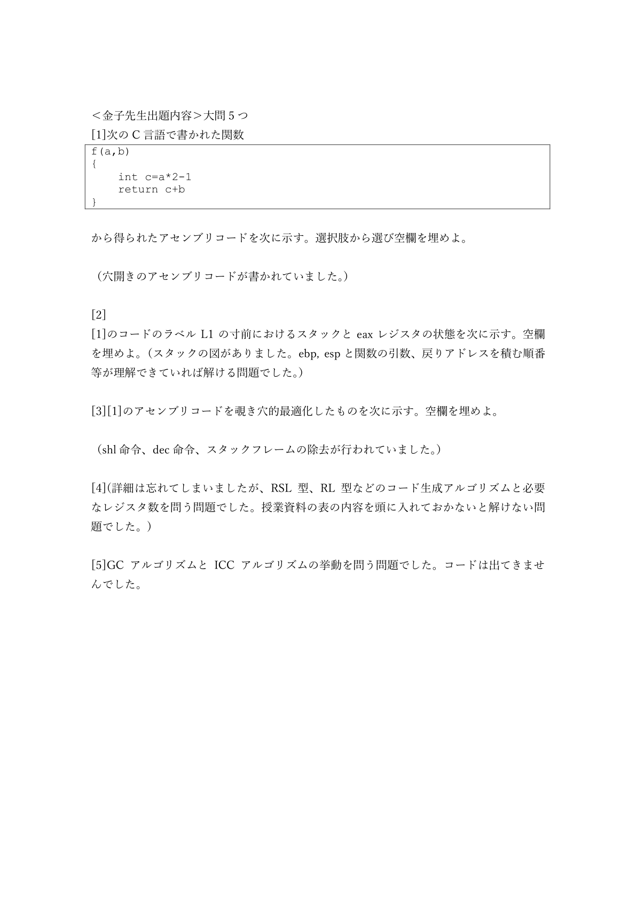

# 山井&金子_2023期末メモ

<!-- source: 山井&金子_2023期末メモ.pdf -->

## 山井&金子_2023期末メモ_p001
<!-- source: 山井&金子_2023期末メモ.pdf page 1 -->

言語処理系 期末試験 2023 出題内容メモ
作：譲

※言語処理系の期末試験の内容を記憶頼りにできる限り再現したものになります。実際の
試験とは異なる部分、条件が正確でない部分も多々あると思います。

山井先生の物と金子先生の物で別々の書き込み式冊子が配布されました。

＜山井先生出題内容＞大問3 つ
[1.1]次の正規表現を答えなさい。ただし使える演算子は*、・（省略可）、+のみであり、使
える文字は0 と1 のみである。計算の順序を変えるために()を使ってもよい。
(1)「4 の倍数となる2 進数」
(2)「0 と1 をどちらも含む数」

[1.2]次のε-動作つきNFA をε-動作無しNFA に変換したものを書きなさい

（第三回授業資料の有限オートマトンの項目に記載されている例と同一のものが出題）

[2.1]
次の構文図式で表されるEBNF を記述しなさい。

[2.2]
次の文法は曖昧である。「i+i*i」を表す二つの構文木を書きなさい
𝐸 → 𝐸 + 𝐸|𝐸 ∗ 𝐸|( 𝐸 )|i

[3.1]
次のLL(1)文法を考える。
E→TE’
E’ →+TE’|ε

## 山井&金子_2023期末メモ_p002
<!-- source: 山井&金子_2023期末メモ.pdf page 2 -->

T→FT’
T’→*FT’|ε
F→(E)|i

このとき、次の集合を求めなさい
(1)First(E’)
(2)Follow(T)

(※筆者注:授業資料のみを用いてFirst, Follow, Director を理解することは難しいので、外
部サイトで学習することをおすすめします。)

[3.2]
LR(1)文法について

（詳細を忘れてしまいましたが、LR(1)文法の回の課題を解けていれば解答可能な問題で
した。）

## 山井&金子_2023期末メモ_p003
<!-- source: 山井&金子_2023期末メモ.pdf page 3 -->

＜金子先生出題内容＞大問5 つ
[1]次のC 言語で書かれた関数
f(a,b)
{
    int c=a*2-1
    return c+b
}

から得られたアセンブリコードを次に示す。選択肢から選び空欄を埋めよ。

（穴開きのアセンブリコードが書かれていました。）

[2]
[1]のコードのラベルL1 の寸前におけるスタックとeax レジスタの状態を次に示す。空欄
を埋めよ。（スタックの図がありました。ebp, esp と関数の引数、戻りアドレスを積む順番
等が理解できていれば解ける問題でした。）

[3][1]のアセンブリコードを覗き穴的最適化したものを次に示す。空欄を埋めよ。

（shl 命令、dec 命令、スタックフレームの除去が行われていました。）

[4](詳細は忘れてしまいましたが、RSL 型、RL 型などのコード生成アルゴリズムと必要
なレジスタ数を問う問題でした。授業資料の表の内容を頭に入れておかないと解けない問
題でした。)

[5]GC アルゴリズムとICC アルゴリズムの挙動を問う問題でした。コードは出てきませ
んでした。

