# 言語処理系（１）

<!-- source: 言語処理系（１）.pdf -->

## 言語処理系（１）_p001
<!-- source: 言語処理系（１）.pdf page 1 -->

言語処理系（１）
金子敬一

## 言語処理系（１）_p002
<!-- source: 言語処理系（１）.pdf page 2 -->

１コンパイラ入門
１．１
コンパイラと翻訳系
１．２翻訳系の必要性
１．３コンパイラの構造
１．４字句解析
１．５構文解析
１．６中間コード生成
１．７最適化
１．８コード生成
１．９記帳
１．１０誤り処理
１．１１
コンパイラ作成道具
１．１２
始めるにあたって

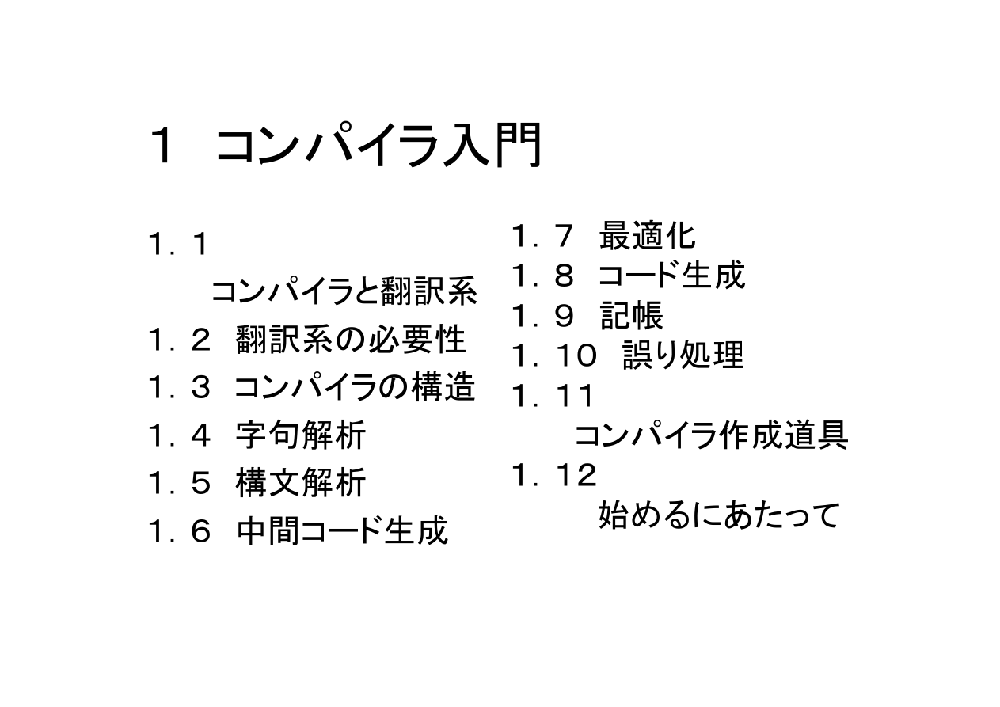

## 言語処理系（１）_p003
<!-- source: 言語処理系（１）.pdf page 3 -->

１．１コンパイラと翻訳系
• 翻訳系
1つのプログラミング言語(原始言語(source language)を
別のプログラミング言語(目的言語(object languageある
いはtarget language))に変換するプログラムを一般に翻
訳系(translator)とよぶ．

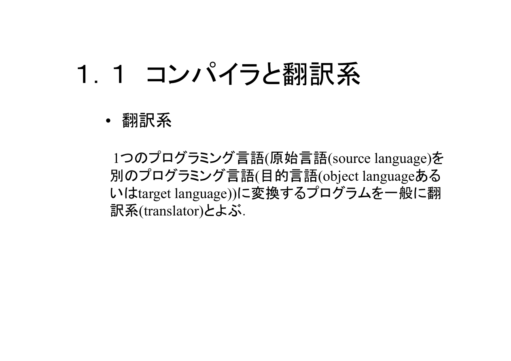

## 言語処理系（１）_p004
<!-- source: 言語処理系（１）.pdf page 4 -->

１．１コンパイラと翻訳系
• コンパイラ
目的言語がアセンブリ言語や機械語であるような翻訳
系をコンパイラ(compiler)と呼ぶ．

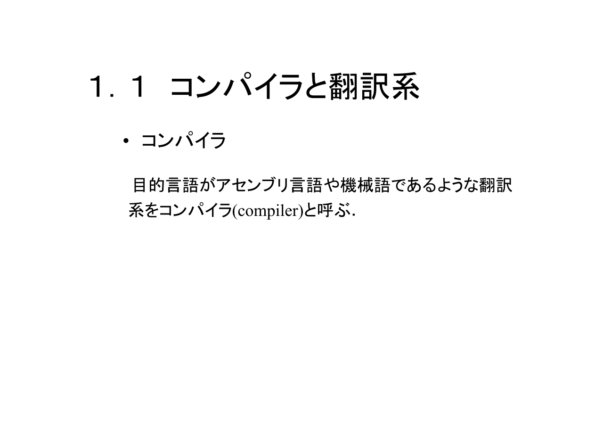

## 言語処理系（１）_p005
<!-- source: 言語処理系（１）.pdf page 5 -->

１．１コンパイラと翻訳系
• コンパイルと実行
コンパイルと実行は個別の２段階からなる．
コンパイラ
原始
コード
目的
コード
目的コード
入力
出力

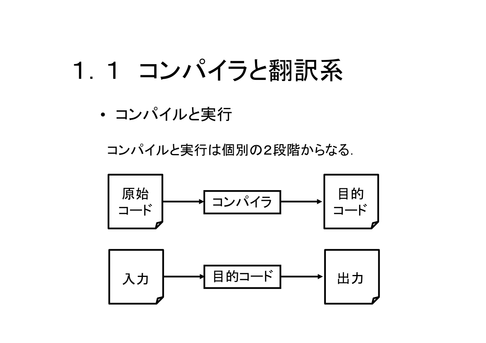

## 言語処理系（１）_p006
<!-- source: 言語処理系（１）.pdf page 6 -->

１．１コンパイラと翻訳系
• コンパイラの発展
• モジュール化手法の開発
• 技法の開発
• 道具の開発
コンパイルの過程を系統立てて，モジュール化
する方法が分かった
多くの作業に対して系統的な技法が見つかった
有用なソフトウェアツールの開発

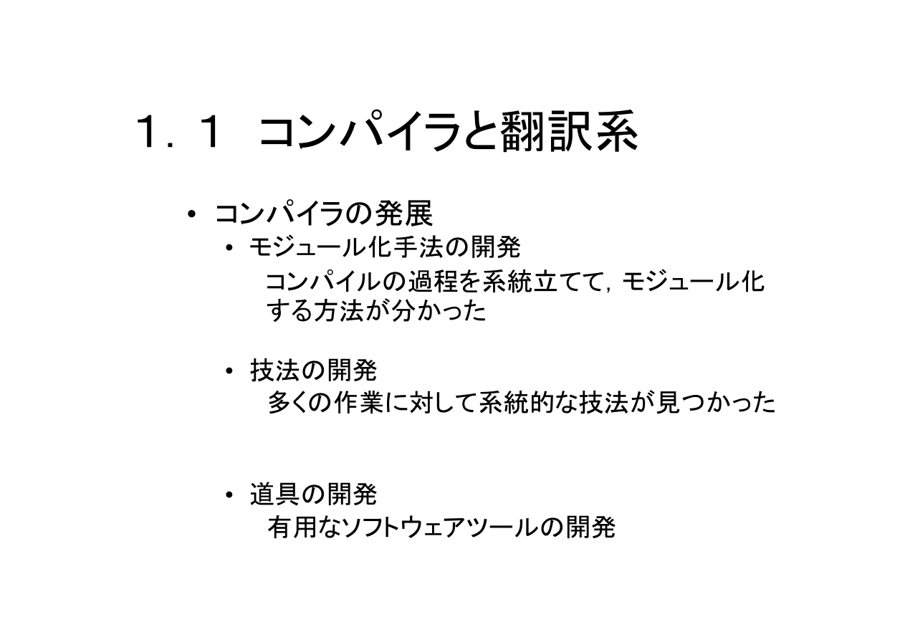

## 言語処理系（１）_p007
<!-- source: 言語処理系（１）.pdf page 7 -->

１．１コンパイラと翻訳系
• 他の翻訳系
• 中間コード
• アセンブラ
• 前処理系
プログラミング言語を中間コードへ翻訳し，
解釈系(interpreter)で直接実行
原始言語がアセンブリ言語で，目的言語が機械語
高水準言語のプログラムを同一の高水準言語の
別のプログラムへと翻訳

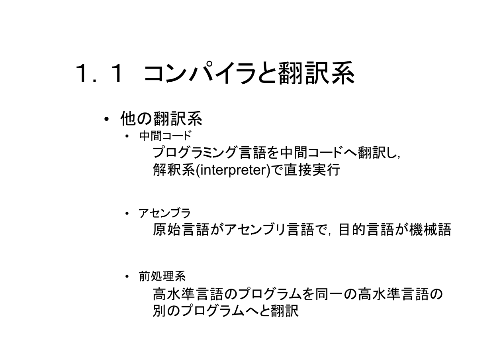

## 言語処理系（１）_p008
<!-- source: 言語処理系（１）.pdf page 8 -->

１．２翻訳系の必要性
• 機械語
• 機械語プログラムは0と1の列であり，莫大な労力を
必要とする割りに，非常に誤り易いという欠点をも持
つ．

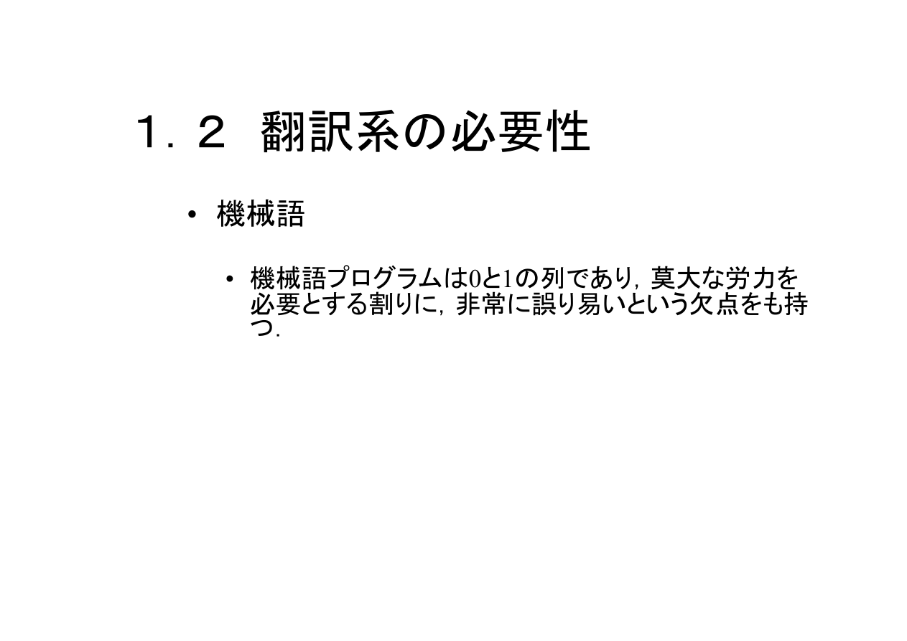

## 言語処理系（１）_p009
<!-- source: 言語処理系（１）.pdf page 9 -->

１．２翻訳系の必要性
• 記号アセンブリ言語
• 命令コードやデータ番地に対して簡略名(mnemonic
name)を用いてプログラミングの効率を向上させよう
としている．
• 記号アセンブリ言語は，最も機械語に近い「高水準」
言語であり，機械語とほぼ1対1に対応する．
• しかしながら，計算機がアセンブリ言語を直接実行
することはできず，翻訳系であるアセンブラを必要と
する．

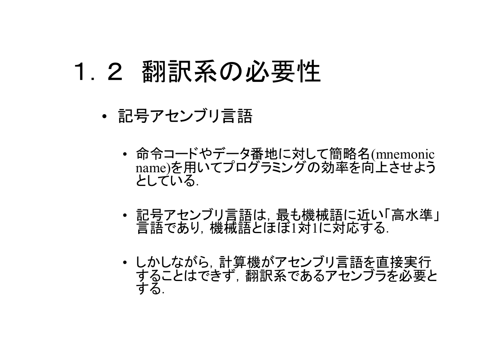

## 言語処理系（１）_p010
<!-- source: 言語処理系（１）.pdf page 10 -->

１．２翻訳系の必要性
• マクロ
• アセンブリ言語などにあるテキストの置換機能のこと
MACRO ADD2 X, Y
LOAD Y
ADD X
STORE Y
ENDMACRO
ADD2 a, b
LOAD b
ADD a
STORE b

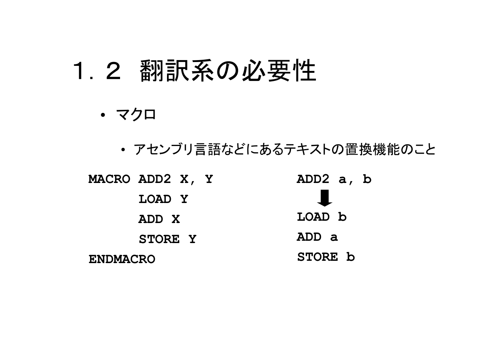

## 言語処理系（１）_p011
<!-- source: 言語処理系（１）.pdf page 11 -->

１．２翻訳系の必要性
• 高水準言語
– マクロ機能を備えたアセンブリ言語を用いても，プロ
グラマは依然として特定の計算機に依存したコード
を生成することしかできない．
– 複雑な命令やデータ構造の内部表現を常に意識し
てプログラミングするには，莫大な労力を必要とする．
– 高水準言語では，AとBを足すにはA＋Bでよい．
– コンパイラが必要．若干の性能低下．

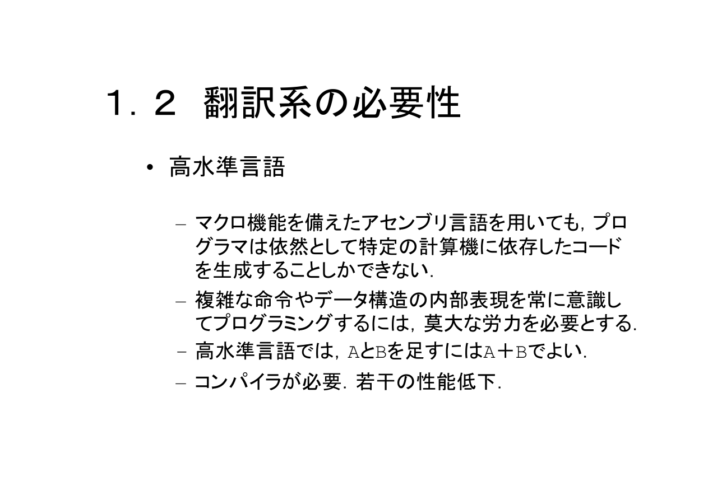

## 言語処理系（１）_p012
<!-- source: 言語処理系（１）.pdf page 12 -->

１．３コンパイラの構造
• フェーズ
字
句
解
析
構
文
解
析
中
間
コ
ー
ド
生
成
コ
ー
ド
の
最
適
化
コ
ー
ド
生
成
表管理
誤り処理

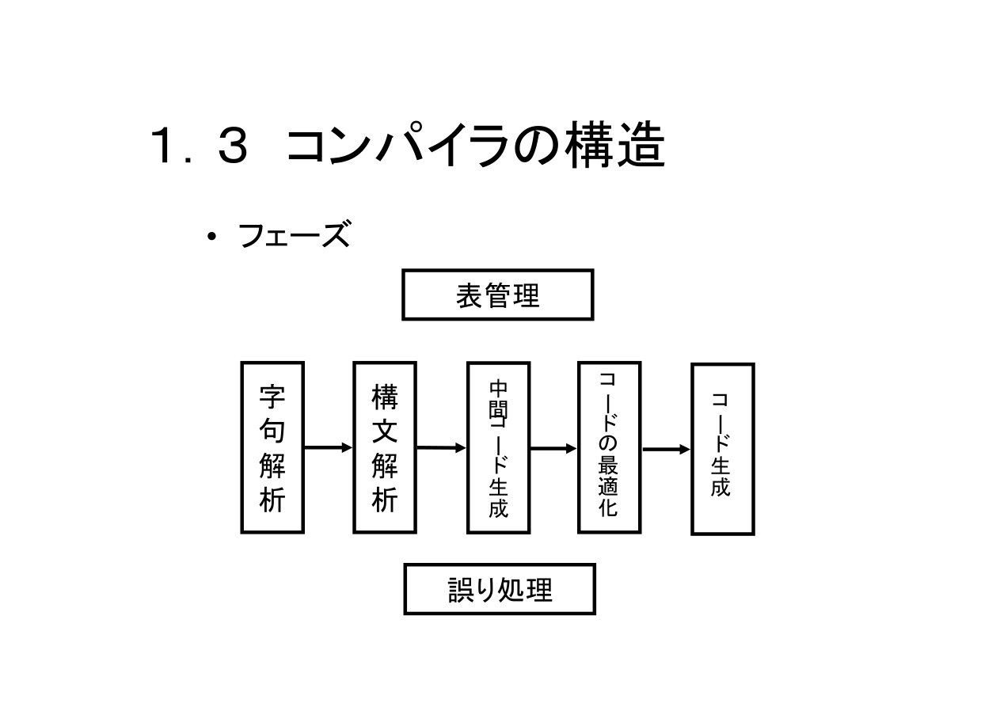

## 言語処理系（１）_p013
<!-- source: 言語処理系（１）.pdf page 13 -->

• 字句解析系
• 最初のフェーズを字句解析系(lexical analyzer)と呼
ぶ．
• 原始言語の文字を字句(token)と呼ぶ論理的な塊ご
とに分離する．
• 字句にはDOとかIFとかの手掛かり語(keyword)，X
やNUMとかいった識別子(identifier)，+や<=といっ
た演算子記号(operator symbol)がある．
１．３コンパイラの構造

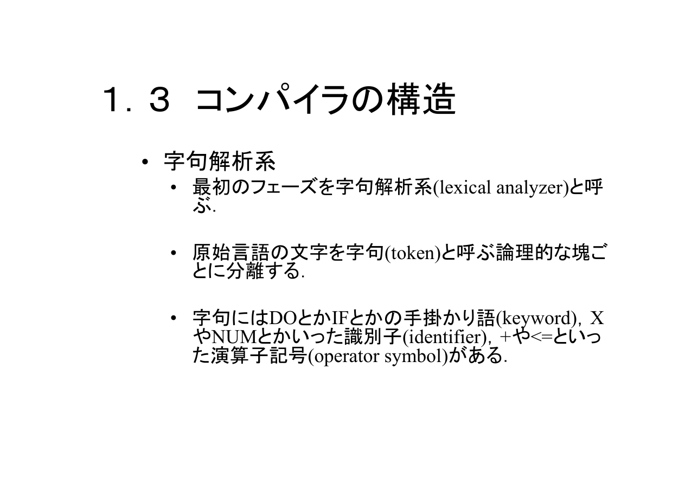

## 言語処理系（１）_p014
<!-- source: 言語処理系（１）.pdf page 14 -->

• 構文解析系
• 構文解析系(syntax analyzer)は，字句解析系から
字句を受けとり，構文単位のまとまりを構成していく．
• 例えばA+Bを表現している3つの字句は，式
(expression)と呼ぶ1つの構文構造へまとめられる．
• 式はさらに他の構文構造とまとめられて文を形成
• 構文構造を葉が字句からなる木構造で表現すること
が多く，この木構造を解析木(parse tree)と呼ぶ．
１．３コンパイラの構造

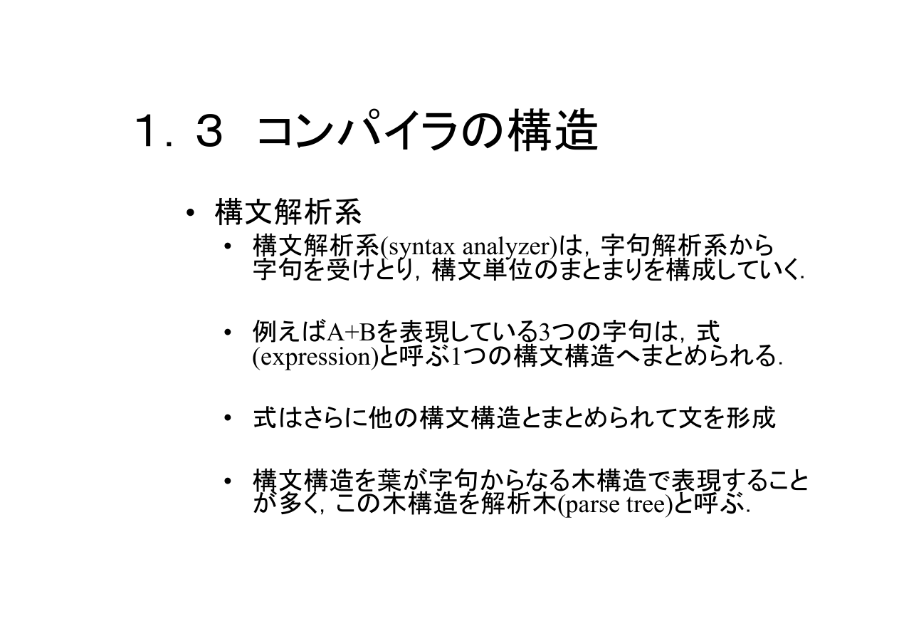

## 言語処理系（１）_p015
<!-- source: 言語処理系（１）.pdf page 15 -->

• 中間コード生成系
• 構文解析系の生成した構文構造を用いて，中間コー
ド生成系(intermediate code generator)は，中間コード
と呼ぶ一連の簡単な命令列を生成する．
• 中間コードは，マクロのようなものであり，計算機の
詳細とは独立な構造となっている．
１．３コンパイラの構造

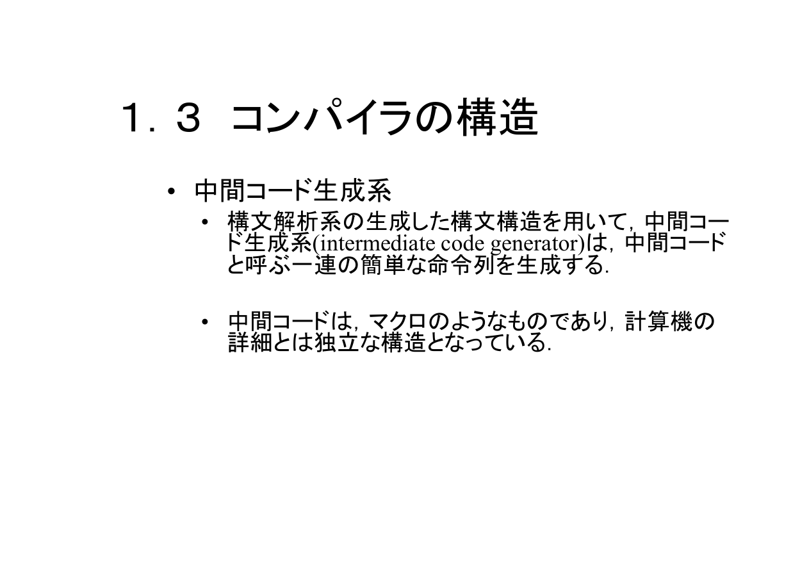

## 言語処理系（１）_p016
<!-- source: 言語処理系（１）.pdf page 16 -->

• コード最適化
• 最終的な目的プログラムにおいて実行速度の向上
や使用する記憶域の抑制などを目指して中間コード
を改良するためのフェーズをコード最適化(code
optimization)という．
• 必ずあるとは限らない．
１．３コンパイラの構造

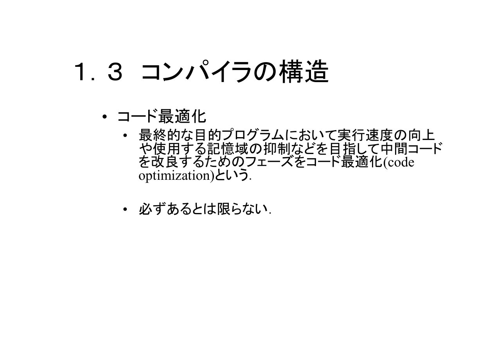

## 言語処理系（１）_p017
<!-- source: 言語処理系（１）.pdf page 17 -->

• コード生成
• 最後のフェーズであるコード生成(code generation)で
は，以下の項目などを決定し目的コードを生成：
• データ用の記憶位置；
• 各々のデータをアクセスするためのコード；
• 計算遂行のためのレジスタ．
１．３コンパイラの構造

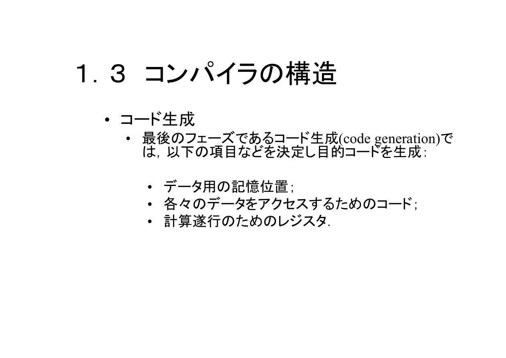

## 言語処理系（１）_p018
<!-- source: 言語処理系（１）.pdf page 18 -->

• 表管理
• 表管理(table management)では，プログラム中で使
用される名前を登録し，型などの情報を記憶しておく．
• 情報保持のデータ構造を記号表(symbol table)．
１．３コンパイラの構造

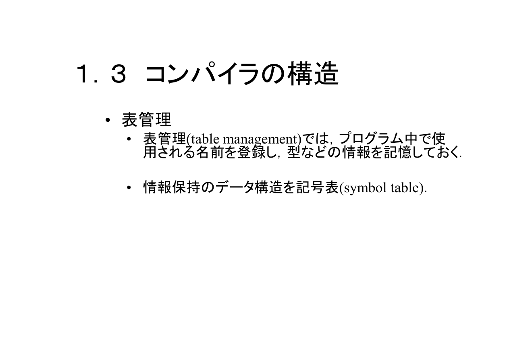

## 言語処理系（１）_p019
<!-- source: 言語処理系（１）.pdf page 19 -->

• 誤り処理
• ソース中に誤りを検出したときに呼び出すフェーズ．
• できるだけ先のフェーズに進めるように，誤り処理系
(error handler)が調整する．
１．３コンパイラの構造

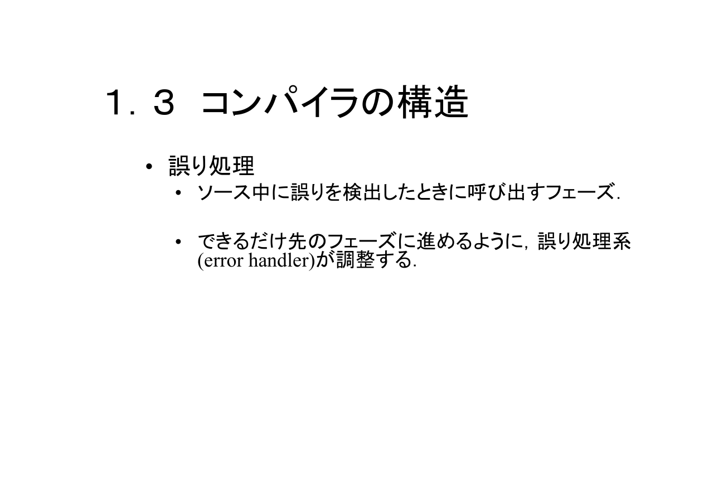

## 言語処理系（１）_p020
<!-- source: 言語処理系（１）.pdf page 20 -->

• パス
• いくつかのフェーズをまとめてパス(pass)という．
• パス間のデータのやり取りは中間ファイルで行う．
• パス内のフェーズはコルーチンになりうる．
• 原則は存在しない．
１．３コンパイラの構造

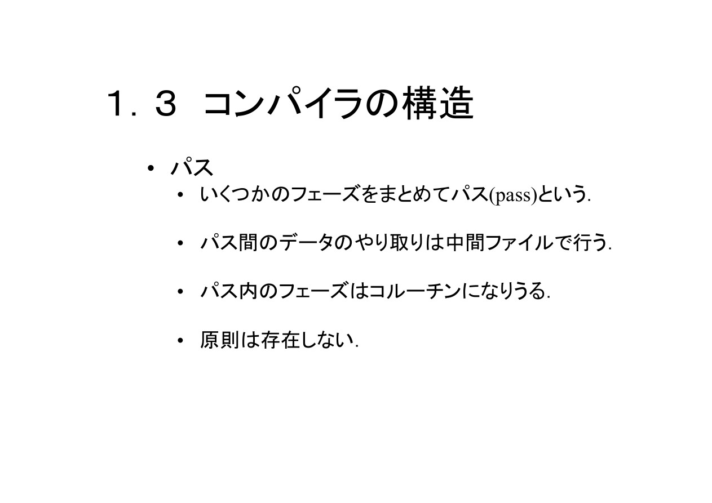

## 言語処理系（１）_p021
<!-- source: 言語処理系（１）.pdf page 21 -->

１．４字句解析
•
字句解析系
–
ソースプログラムとコンパイラとのインタフェース
–
原始プログラムを１文字ずつ読み込み，字句
(token)ごとにまとめる．

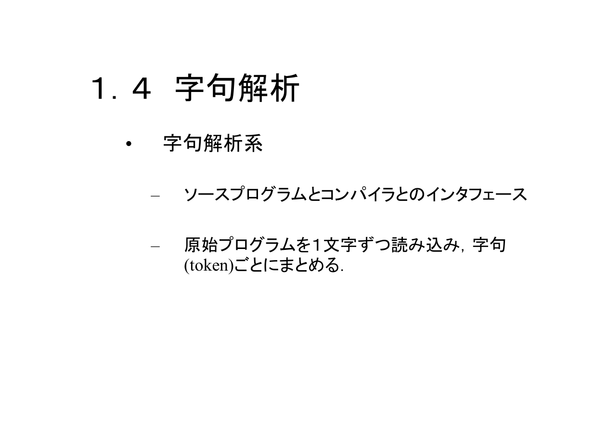

## 言語処理系（１）_p022
<!-- source: 言語処理系（１）.pdf page 22 -->

１．４字句解析
•
字句
–
単一の論理的対象として扱うことのできる文字列
–
識別子，手掛り語，定数，演算子，区切り記号など．
–
コンパイラ設計者による任意性を持つ．しかし，
MAXをMとAXに分けるのは不自然

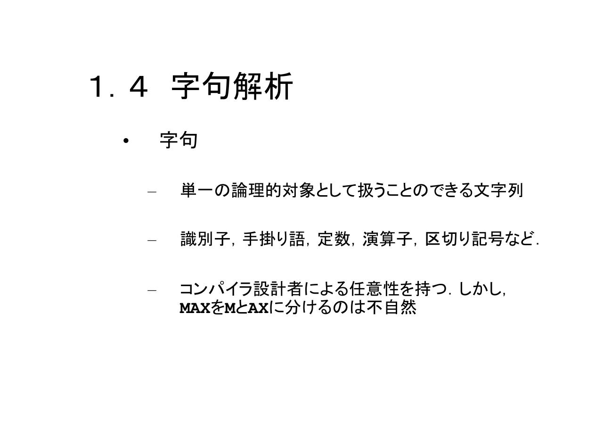

## 言語処理系（１）_p023
<!-- source: 言語処理系（１）.pdf page 23 -->

１．４字句解析
•
字句の分類
–
字句は，型と値からなる対として扱う．
–
値を持たない型もある．
•
値を持たないもの：IFや;など
•
値を持つもの：識別子，定数，名札など

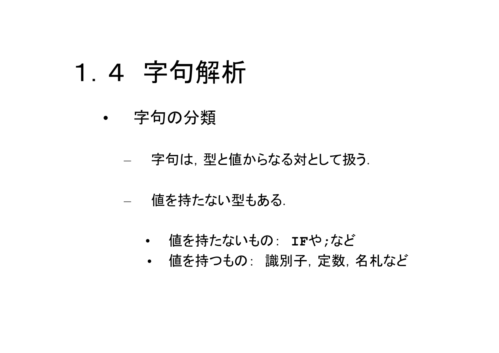

## 言語処理系（１）_p024
<!-- source: 言語処理系（１）.pdf page 24 -->

１．４字句解析
•
字句の取出し
–
原始プログラムを走査し，取り出す．先読みが必
要
IF(5.EQ.MAX)GOTO100
5か，5.0か，ある
いは5.E-10か？

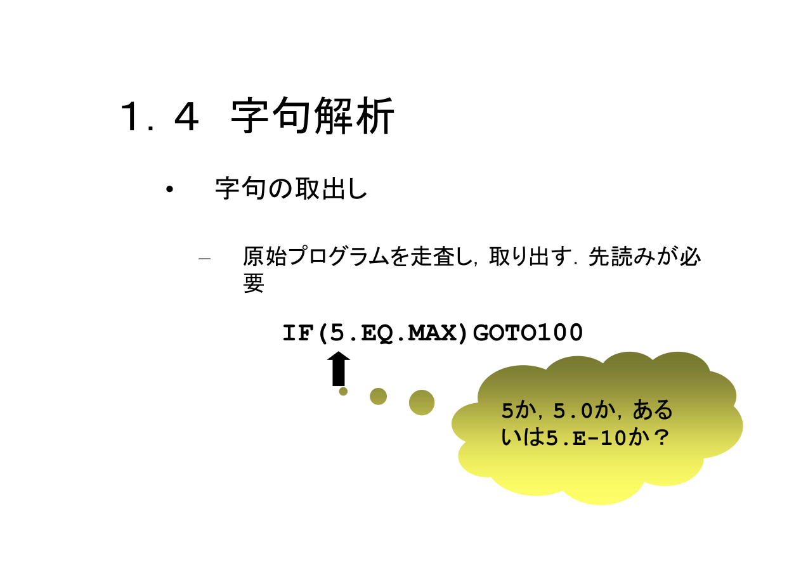

## 言語処理系（１）_p025
<!-- source: 言語処理系（１）.pdf page 25 -->

１．４字句解析
•
字句の取出し
–
原始プログラムを走査し，取り出す．先読みが必
要
IF(5.EQ.MAX)GOTO100
［if,-]     [(,-]     [const,341]     [eq,-]
[id,729]     [),-]     [goto,-]     [label,554]

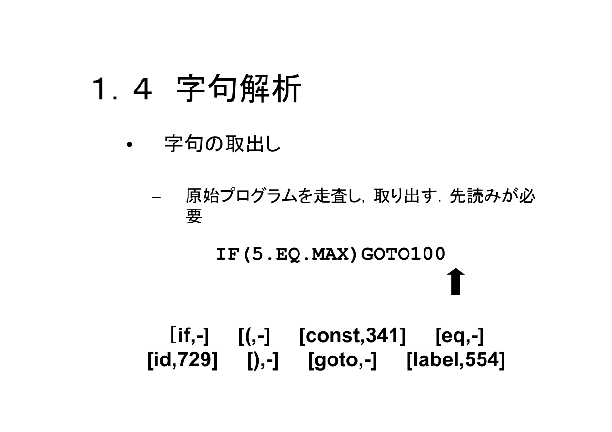

## 言語処理系（１）_p026
<!-- source: 言語処理系（１）.pdf page 26 -->

１．５構文解析
•
構文解析系
–
字句が原始言語として許されるか検査
–
字句を以降のフェーズで使用する木構造データに
変換

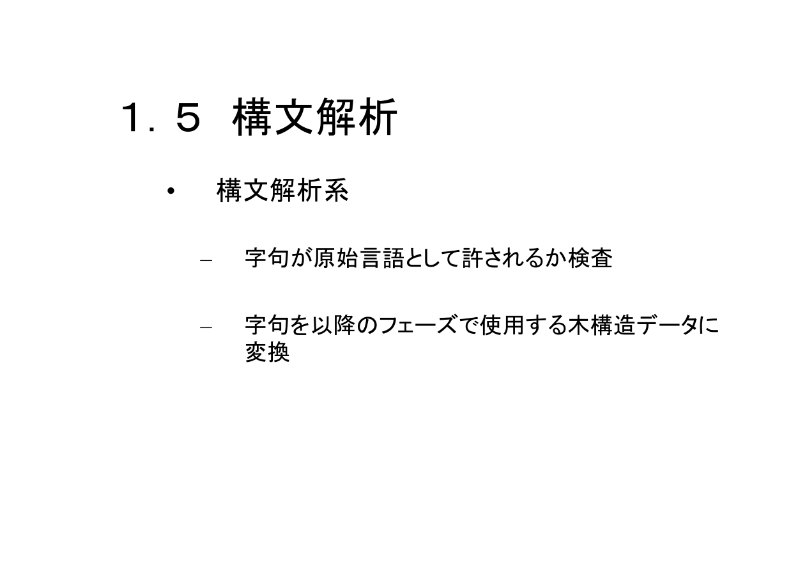

## 言語処理系（１）_p027
<!-- source: 言語処理系（１）.pdf page 27 -->

１．５構文解析
•
検査
–
プログラミング言語PL/IにおけるA + / Bのよう
な式は，[id,…], [+,-], [/,-], [id,…]のような字句の
並びとなる．
–
演算子が２つ続くことはないので，誤りであること
がわかる．

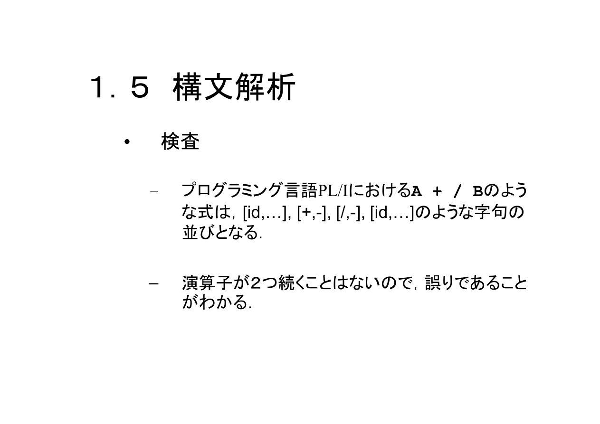

## 言語処理系（１）_p028
<!-- source: 言語処理系（１）.pdf page 28 -->

１．５構文解析
•
解析木
–
式A / B * Cの解釈
•
CやFortran：(A / B) * C
•
APL:              A / (B * C)
A
/
B
*
C
A
/
B
*
C
式
式
式
式
式
式
式
式
式
式

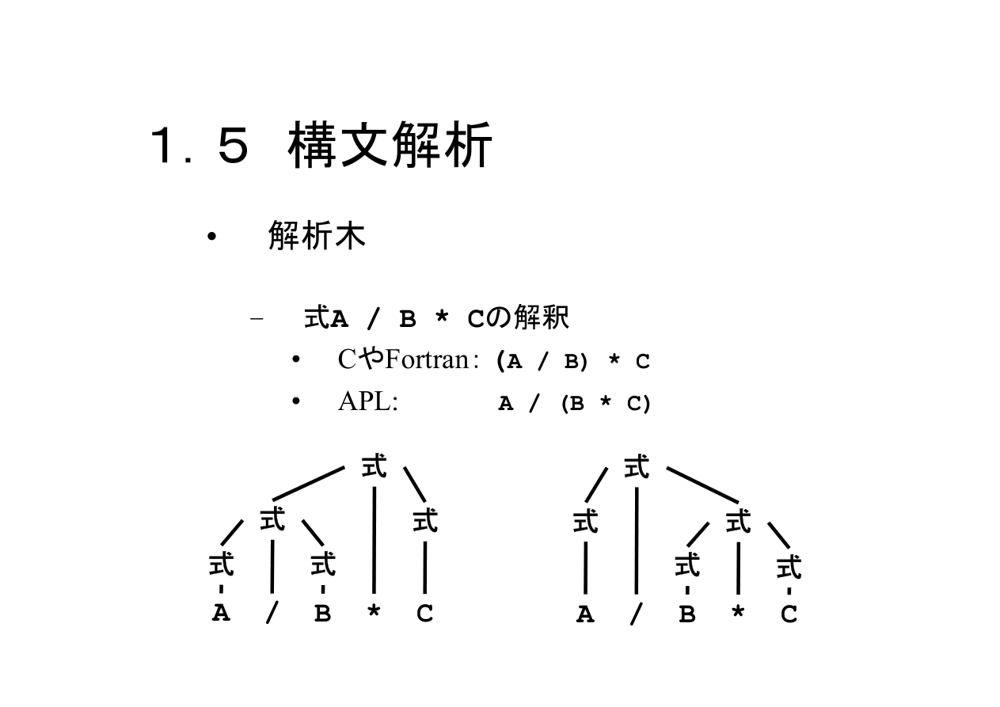

## 言語処理系（１）_p029
<!-- source: 言語処理系（１）.pdf page 29 -->

１．６中間コード生成
•
中間コード生成系
–
解析木を中間言語の表現へと変換する

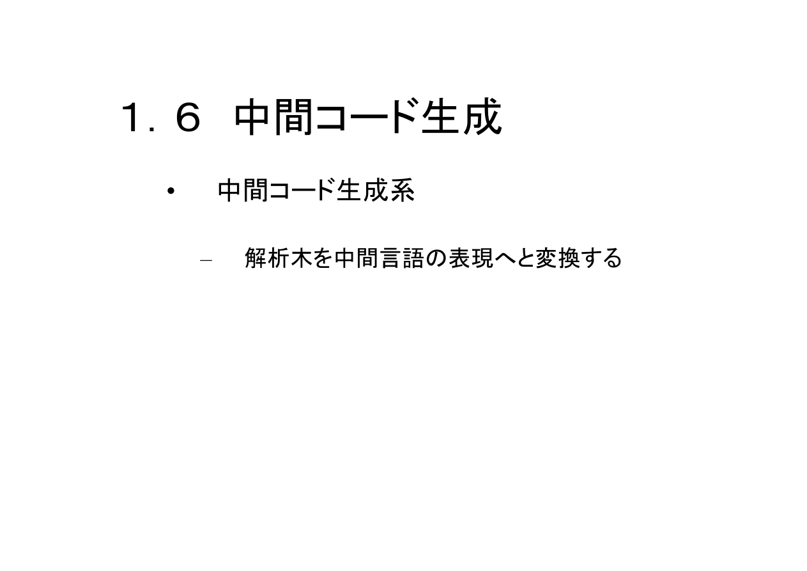

## 言語処理系（１）_p030
<!-- source: 言語処理系（１）.pdf page 30 -->

１．６中間コード生成
•
３番地コード
–
代表的な３番地コード(three-address code)の文は，
A := B op C
被演算子
演算子

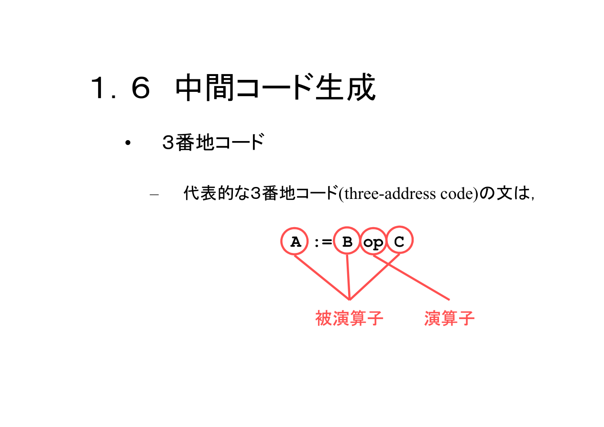

## 言語処理系（１）_p031
<!-- source: 言語処理系（１）.pdf page 31 -->

１．６中間コード生成
•
３番地コード
while A>B & A<=2*B-5 do A:=A+B;
L1:
if A>B goto L2
goto L3
L2:
T1 := 2 * B
T2 := T1 – 5
if A <= T2 goto L4
goto L3
L4:
A := A + B
goto L1
L3:

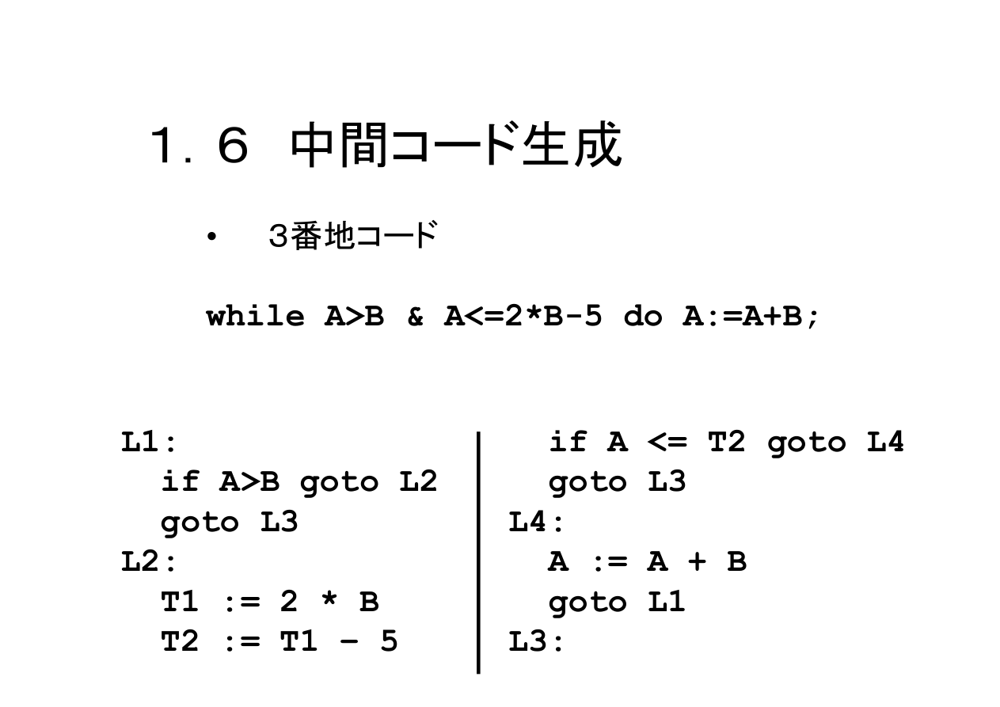

## 言語処理系（１）_p032
<!-- source: 言語処理系（１）.pdf page 32 -->

１．７最適化
•
最適化フェーズ
中間コードを変換して，より速く，より小さなプ
ログラムを目指す．

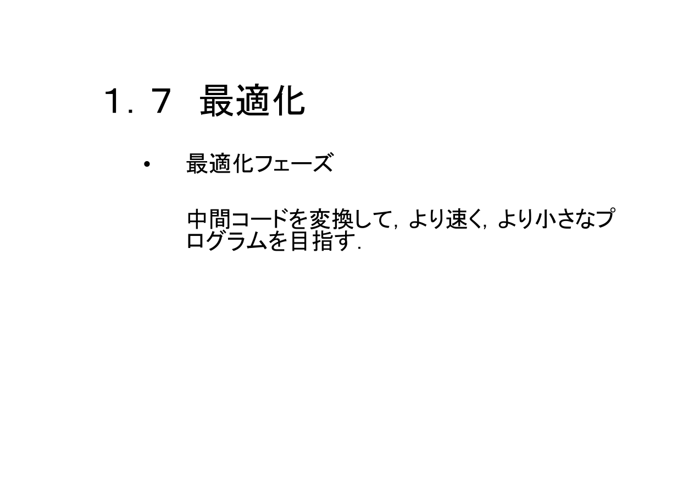

## 言語処理系（１）_p033
<!-- source: 言語処理系（１）.pdf page 33 -->

１．７最適化
•
局所最適化(local optimization)
•
局所的なプログラム変換による最適化
L1:
if A > B goto L2
goto L3
L2:
T1 := 2 * B
T2 := T1 – 5
L1:
if A <= B goto L3
L2:
T1 := 2 * B
T2 := T1 - 5

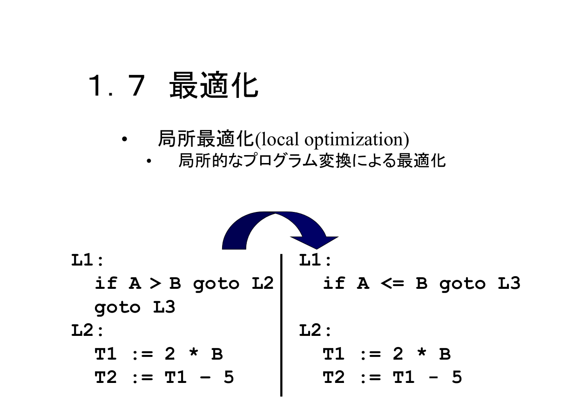

## 言語処理系（１）_p034
<!-- source: 言語処理系（１）.pdf page 34 -->

１．７最適化
•
共通部分式の削除
A := B + C + D
E := B + C + F
•
ループ最適化
•
ループ内で不変な計算(loop invariant
computation)をループの直前に移動
T1 := B + C
A := T1 + D
E := T1 + F

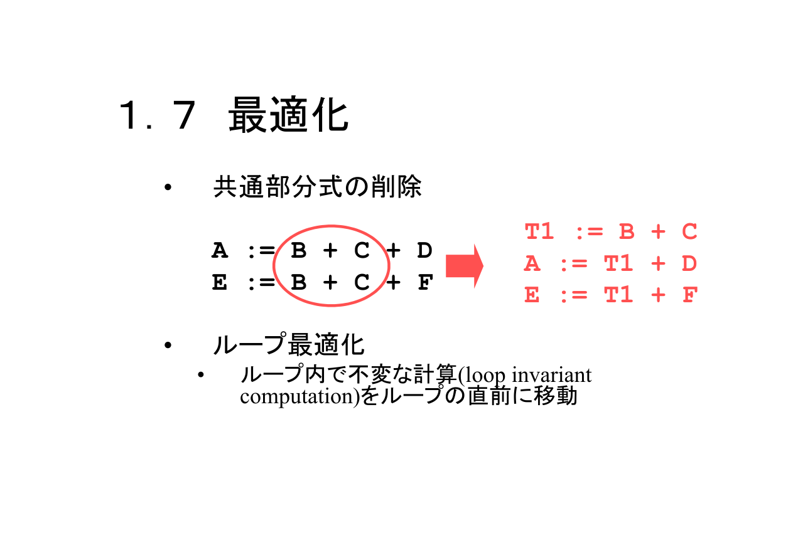

## 言語処理系（１）_p035
<!-- source: 言語処理系（１）.pdf page 35 -->

１．８コード生成
•
コード生成系
•
コード生成系は，中間コードを機械コードへと変換
する．
•
機械的で単純な変換は，冗長なデータ転送を多く
含む非能率的な目的コードを生成する．

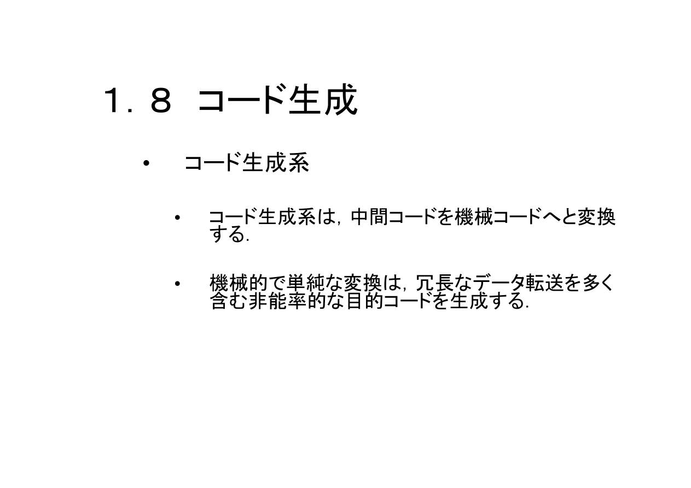

## 言語処理系（１）_p036
<!-- source: 言語処理系（１）.pdf page 36 -->

１．８コード生成
•
レジスタ割当て
•
コード生成系では，レジスタの内容を記憶しておき，
不要なデータ転送命令を削除する．
•
これらのレジスタを効率良く使うために，レジスタ
割当て(register allocation)を行う．
•
一般に最善な割当てを求めることはNP困難な問
題⇒発見的な手法を用いる．

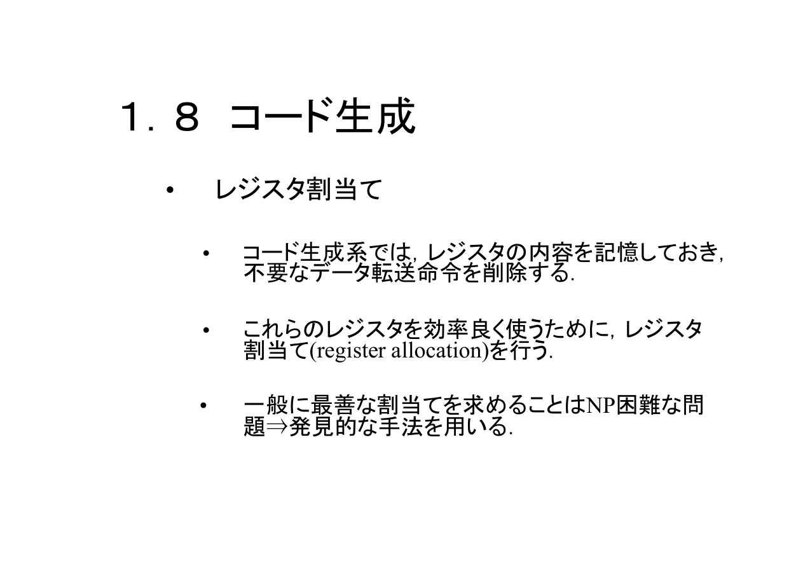

## 言語処理系（１）_p037
<!-- source: 言語処理系（１）.pdf page 37 -->

１．９表管理（記帳）
•
記号表
•
原始プログラム中の全データ対象に関する情報を
記入
•
変数が，整数なのか実数なのか，配列の大きさは
いくつか，関数の引数の数はいくつかなど．

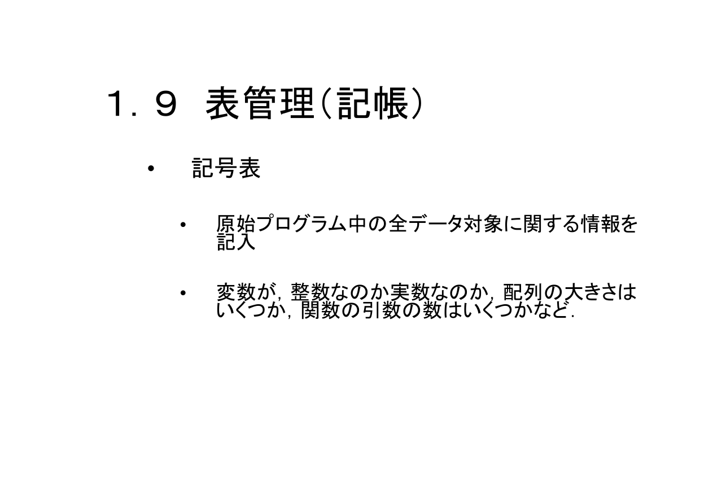

## 言語処理系（１）_p038
<!-- source: 言語処理系（１）.pdf page 38 -->

１．９表管理（記帳）
•
情報の収集
•
情報はいくつかのフェーズにまたがる．
•
字句解析系で，識別子MAXを発見すると，記号表
に未記入であれば登録
•
さらに，integer MAXなる宣言を発見すると，記
号表にMAXが整数型であることを記入

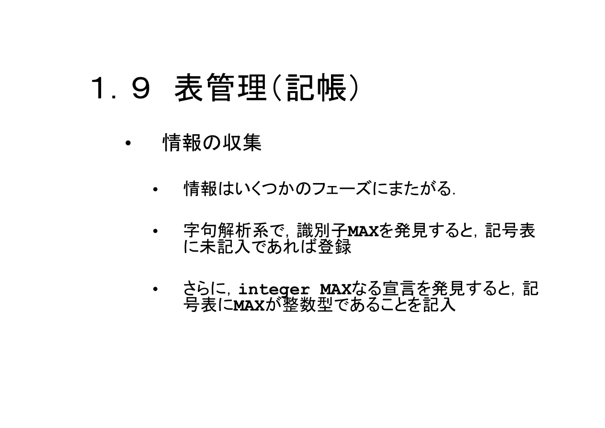

## 言語処理系（１）_p039
<!-- source: 言語処理系（１）.pdf page 39 -->

１．９表管理（記帳）
•
情報の利用
•
収集した情報は多くのフェーズで利用される．
•
型誤りの検出や，暗黙の型変換．
•
意味解析(semantic analysis)

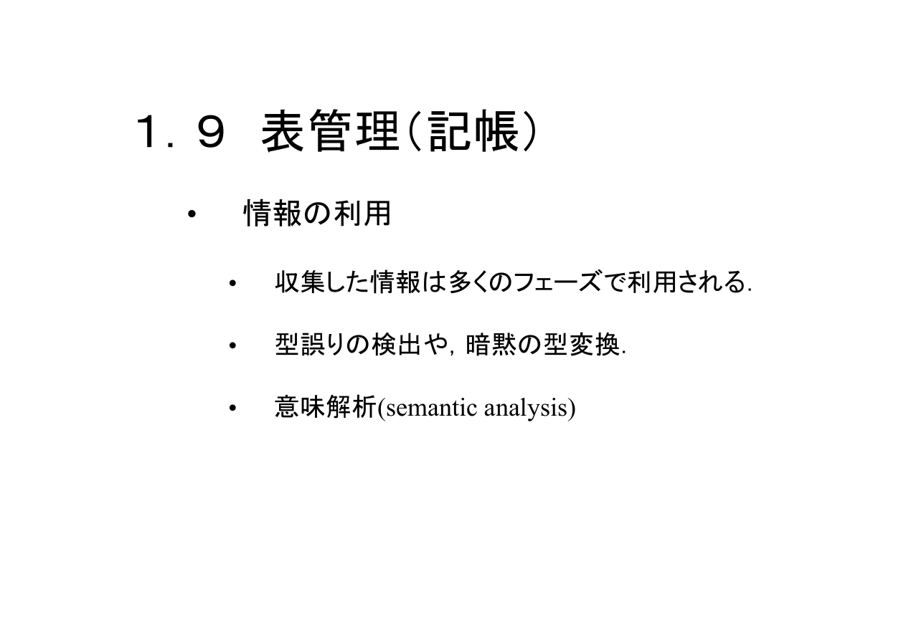

## 言語処理系（１）_p040
<!-- source: 言語処理系（１）.pdf page 40 -->

１．１０誤り処理
•
誤りの発生
•
字句解析系：原始プログラムの字句の綴り誤り
•
構文解析系：入力構造を確定できない構文上の
誤り
•
中間コード生成系：中間コードを生成できないよ
うな不適切な型の被演算子
•
コード最適化系：制御の解析の結果，到達不能
な文の検出
•
コード生成系：目的機械の１語に合わない定数
•
記帳：多重宣言された識別子

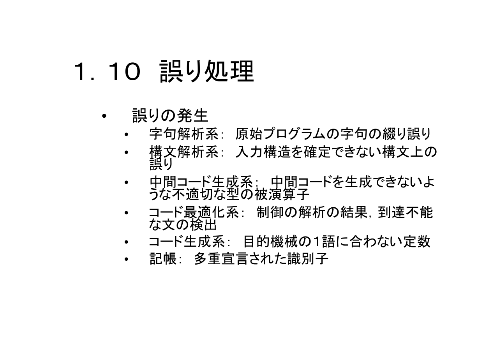

## 言語処理系（１）_p041
<!-- source: 言語処理系（１）.pdf page 41 -->

１．１０誤り処理
•
誤りメッセージ
•
各フェーズは，誤りを見つけたときに誤り処理系に
報告する．
•
誤り処理系は，適切なメッセージを生成する．
•
処理の継続を試みる

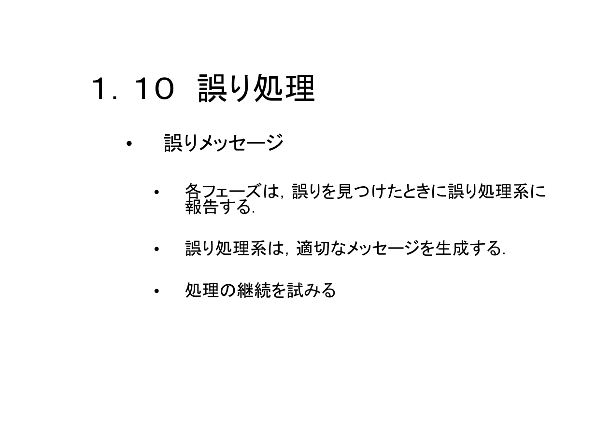

## 言語処理系（１）_p042
<!-- source: 言語処理系（１）.pdf page 42 -->

１．１１コンパイラ作成道具
•
作成道具
•
走査系生成系
•
構文解析系生成系
•
コンパイラコンパイラ

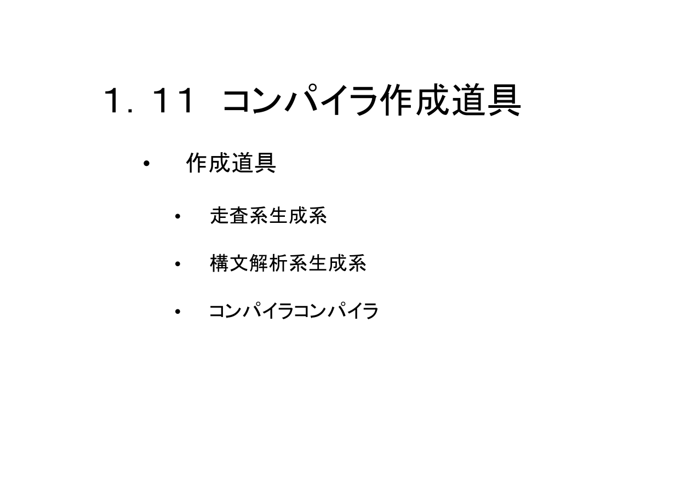

## 言語処理系（１）_p043
<!-- source: 言語処理系（１）.pdf page 43 -->

１．１１コンパイラ作成道具
•
入力仕様
•
原始言語の字句および構文構造の記述
•
原始言語の各構文要素に対して生成すべき出力
の記述
•
目的機械の記述

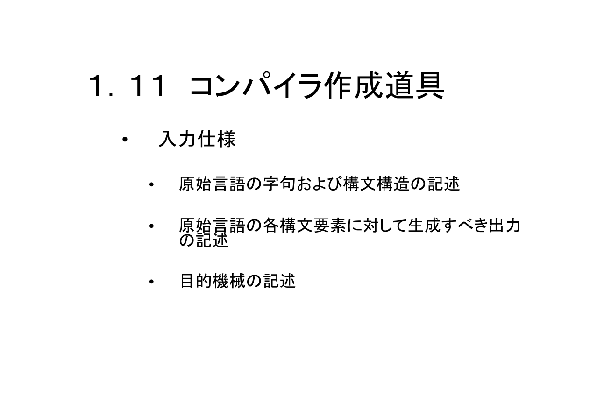

## 言語処理系（１）_p044
<!-- source: 言語処理系（１）.pdf page 44 -->

１．１１コンパイラ作成道具
•
コンパイラコンパイラの機能
•
走査系生成系
•
構文解析系生成系
•
コード生成機能

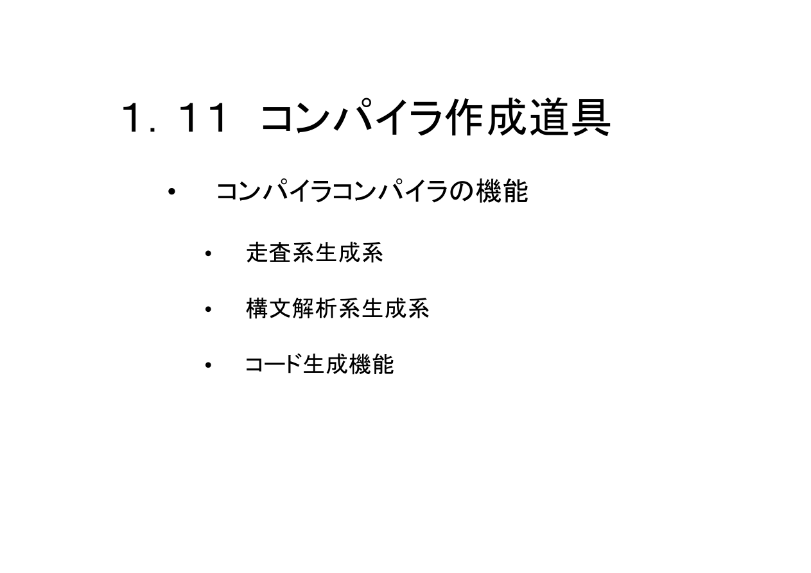

## 言語処理系（１）_p045
<!-- source: 言語処理系（１）.pdf page 45 -->

• 設計上の留意点
• 原始言語の利用目的…力点はどこか？
• コンパイル時間と出力コードの質とのバランス…コン
パイル速度の重要性は？
• 誤り診断と誤り回復の能力…目的は？
• 目的機械の性質と操作環境…コード生成も重要
• 実現言語
• コンパイラの作成環境
• 変更や修正のしやすさ…改良
コンパイラの生成期間
１．１２始めるにあたって

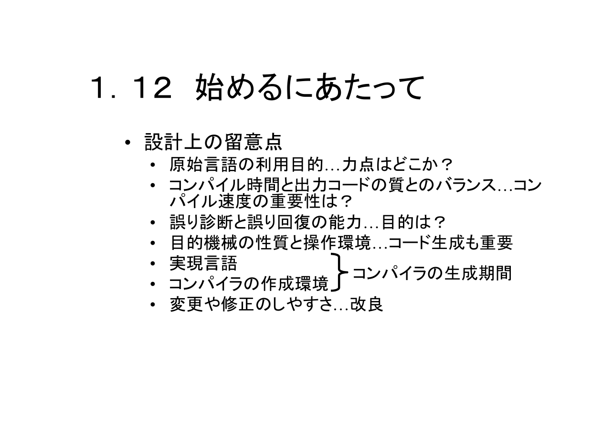

## 言語処理系（１）_p046
<!-- source: 言語処理系（１）.pdf page 46 -->

int foo(int x) {
int y = x * x;
return y + 2;
}
int foo(int x) {
int y = x * x;
return y + 2;
}
• 字句解析系
１．１２始めるにあたって

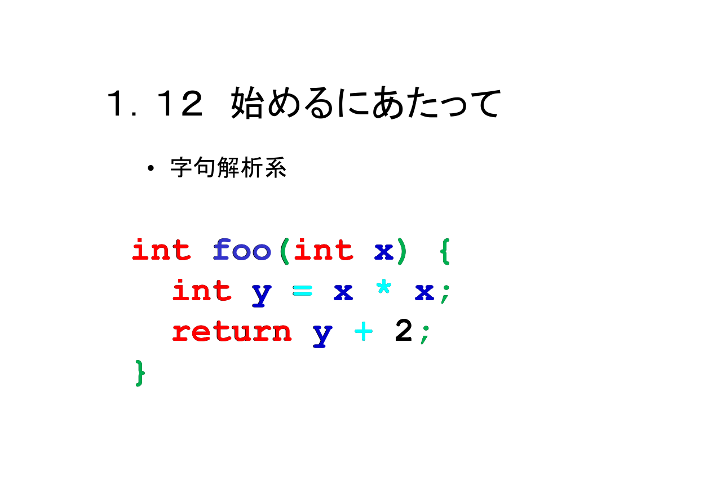

## 言語処理系（１）_p047
<!-- source: 言語処理系（１）.pdf page 47 -->

• 構文解析系
１．１２始めるにあたって
関数定義
指定子リスト
foo
パラメータリスト
複合文
int
パラメータ
指定子リスト
x
int
宣言リスト
文リスト
変数宣言
int
y
*
x
x
return
+
y
2

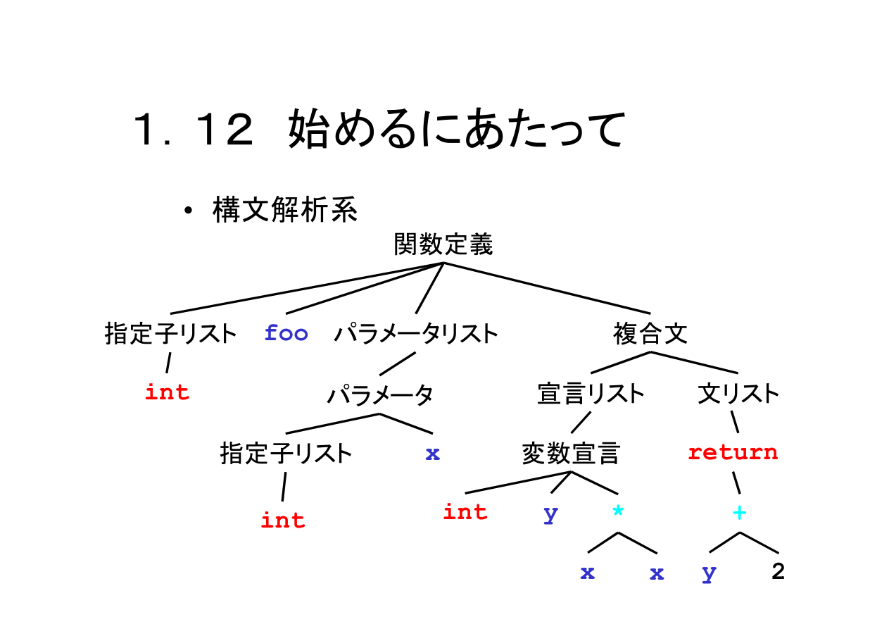

## 言語処理系（１）_p048
<!-- source: 言語処理系（１）.pdf page 48 -->

• コード生成系
１．１２始めるにあたって
_foo: push ebp
mov ebp, esp
sub esp, 4
mov eax, 8[ebp]
imul eax, 8[ebp]
mov -4[ebp], eax
mov eax, -4[ebp]
add eax, 2
mov esp, ebp
pop ebp
ret
_foo: mov eax, 4[esp]
imul eax, eax
add eax, 2
ret
さ
ら
に
最
適
化
す
る
と

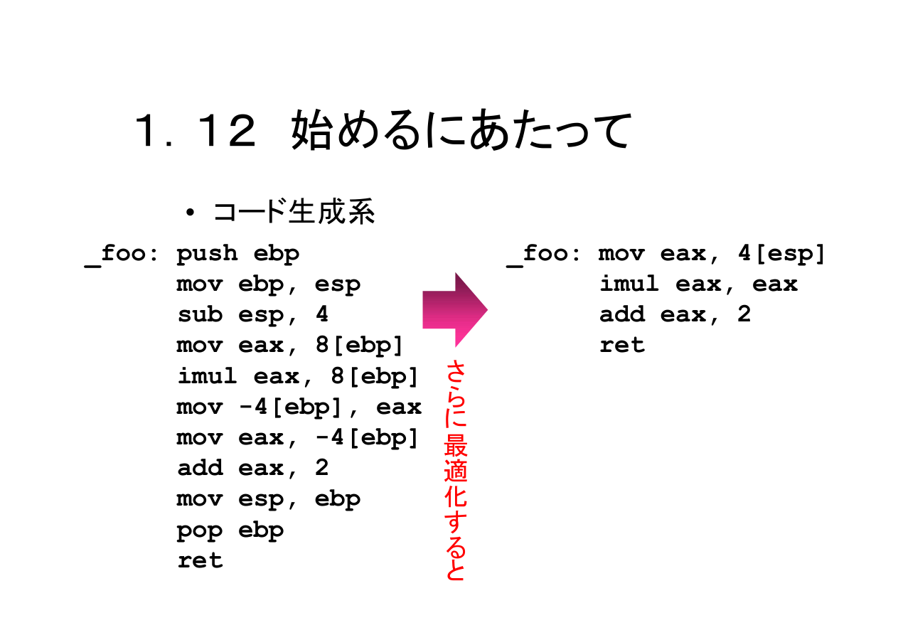
