# 言語処理系（２）

<!-- source: 言語処理系（２）.pdf -->

## 言語処理系（２）_p001
<!-- source: 言語処理系（２）.pdf page 1 -->

言語処理系（２）
金子敬一

## 言語処理系（２）_p002
<!-- source: 言語処理系（２）.pdf page 2 -->

２コード生成の環境モデル
２．１実行環境モデル
２．２関数呼出し
２．３局所変数の割当て

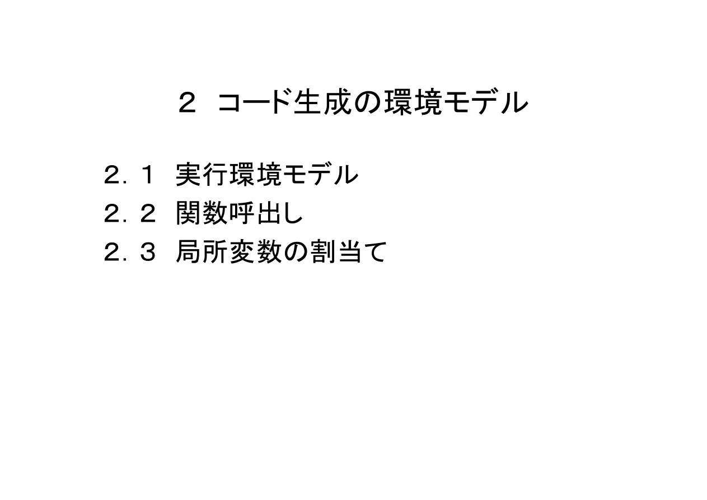

## 言語処理系（２）_p003
<!-- source: 言語処理系（２）.pdf page 3 -->

２．１実行環境モデル
２．１．１メモリ領域
２．１．２ＣＰＵとレジスタ
２．１．３アセンブリ命令

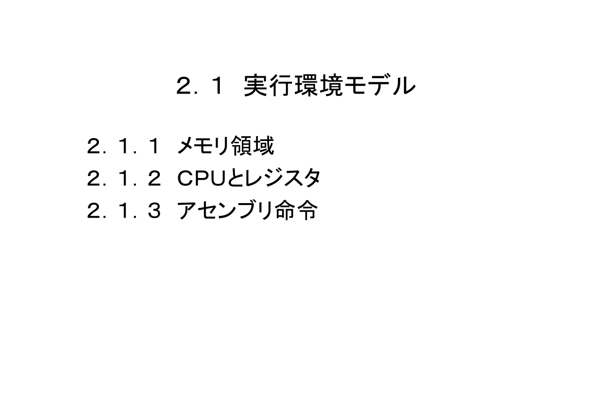

## 言語処理系（２）_p004
<!-- source: 言語処理系（２）.pdf page 4 -->

２．１．１メモリ領域
• ８０４８６
• アドレス空間：３２ビット
• バイト単位でアクセス可能
– 番地（アドレス）
ＯＳ領域
コード領域
大域データ領域
ヒープ
スタック
下位番地0x00000000
上位番地0xffffffff

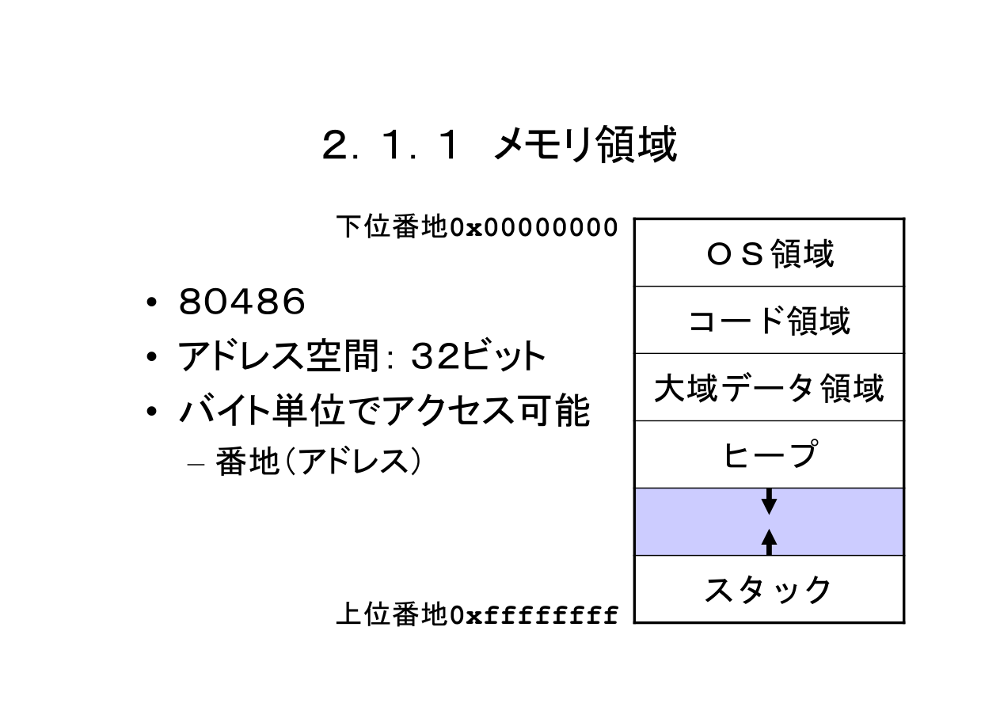

## 言語処理系（２）_p005
<!-- source: 言語処理系（２）.pdf page 5 -->

２．１．１メモリ領域
• ＯＳ領域（ＯＳ専用）
• ユーザ領域（プログラム実行用）
– コード領域（コード格納用）
– データ領域（データ格納用）
• 大域データ領域（大域変数用）
• ヒープ（動的生成変数用）
• スタック（局所変数，関数フレーム用）

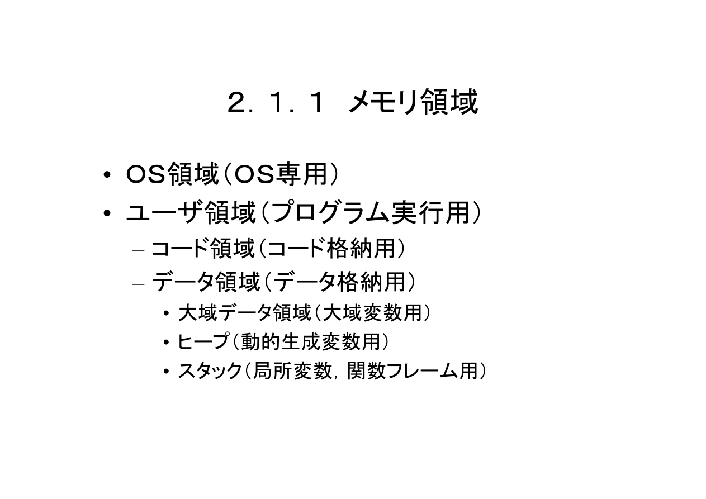

## 言語処理系（２）_p006
<!-- source: 言語処理系（２）.pdf page 6 -->

２．１．２ＣＰＵとレジスタ
• ＣＰＵ：メモリ領域から命令をフェッチ，実行
• ＡＬＵ：ＣＰＵ内の算術論理演算装置
• レジスタ：ＣＰＵ内の高速な記憶装置
– 汎用レジスタ
– 条件フラグ
– 命令ポインタ

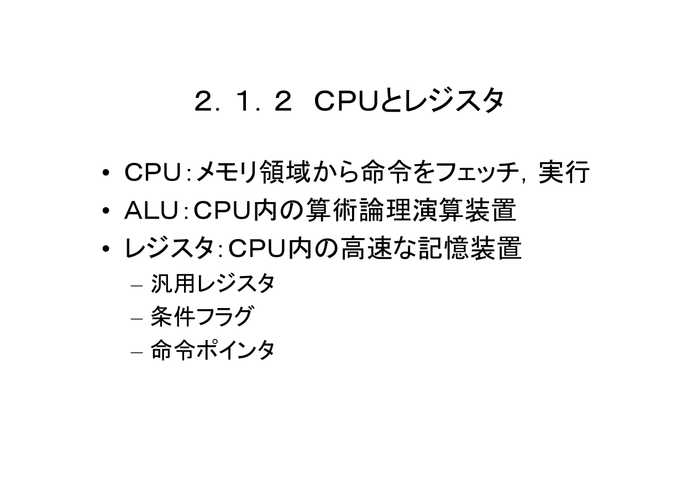

## 言語処理系（２）_p007
<!-- source: 言語処理系（２）.pdf page 7 -->

２．１．２ＣＰＵとレジスタ
• 汎用レジスタ：演算命令のオペランドとして使
用（３２ビット長）
– eax, ebx, ecx, edx, esi, edi
– ebp: ベースポインタ，esp: スタックポインタ
• 条件フラグ：演算結果で変化（１ビット長）
– Z: ゼロフラグ，S: 符号フラグ，など
• 命令ポインタ：ＣＰＵが次に実行すべき命令が
格納されている番地を保持（３２ビット長）
– eip

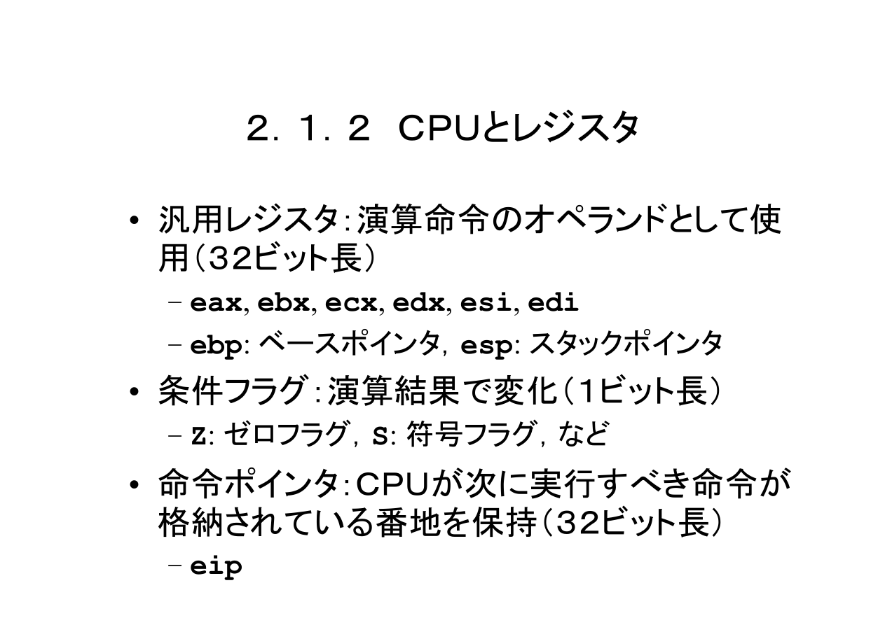

## 言語処理系（２）_p008
<!-- source: 言語処理系（２）.pdf page 8 -->

２．１．３アセンブリ命令
• アセンブリコード
– ラベル
• ラベル：
– アセンブリ命令
• 命令名第1オペランド，…，第nオペランド
– 併記可能
• ラベル：命令名第1オペランド，…，第nオペランド

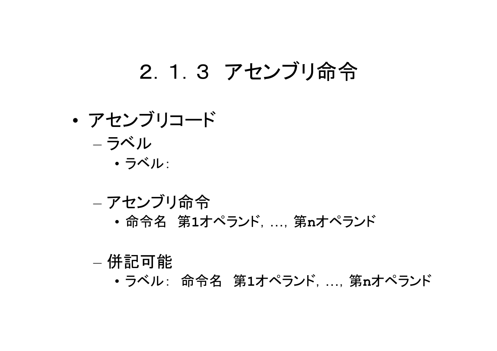

## 言語処理系（２）_p009
<!-- source: 言語処理系（２）.pdf page 9 -->

２．１．３アセンブリ命令
• オペランド
– 最大3個（n 3）
– 汎用レジスタ，メモリ番地，整数定数に制限

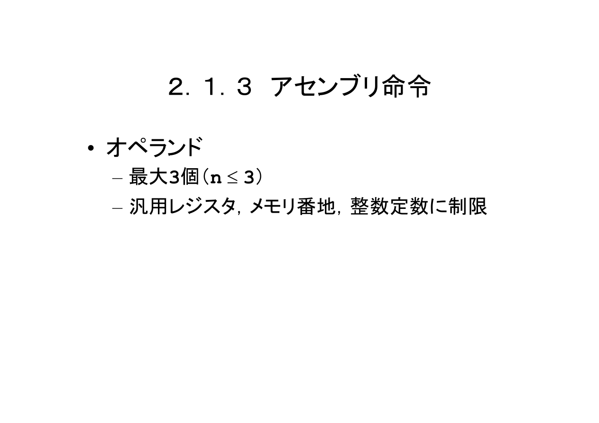

## 言語処理系（２）_p010
<!-- source: 言語処理系（２）.pdf page 10 -->

２．１．３アセンブリ命令
• メモリ番地
– ラベル
– 汎用レジスタ＋相対番地
• 例：4[ebp], -8[ebp] ebp
-8[ebp]
4[ebp]

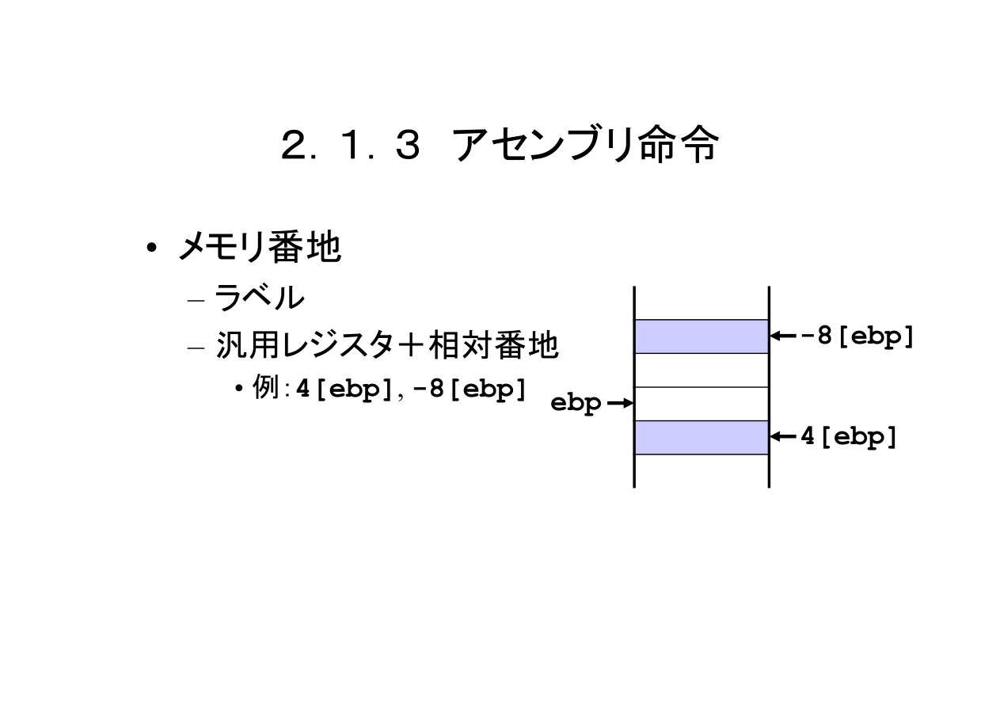

## 言語処理系（２）_p011
<!-- source: 言語処理系（２）.pdf page 11 -->

２．１．３アセンブリ命令
• 整数以外の定数
– コード領域や大域データ領域に保持
– プログラムのロード時に値を設定
– メモリ番地（ラベル）で参照

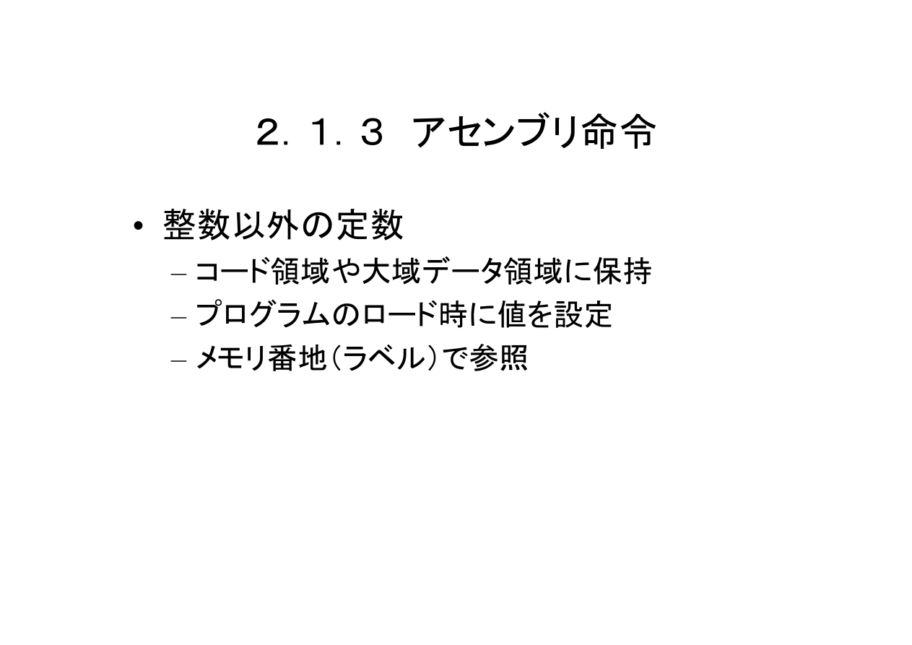

## 言語処理系（２）_p012
<!-- source: 言語処理系（２）.pdf page 12 -->

２．１．３アセンブリ命令
• 命令の種類
– 算術命令
– 移動命令
– 比較命令
– ジャンプ命令
– スタック操作命令
– 関数呼出し命令とリターン命令

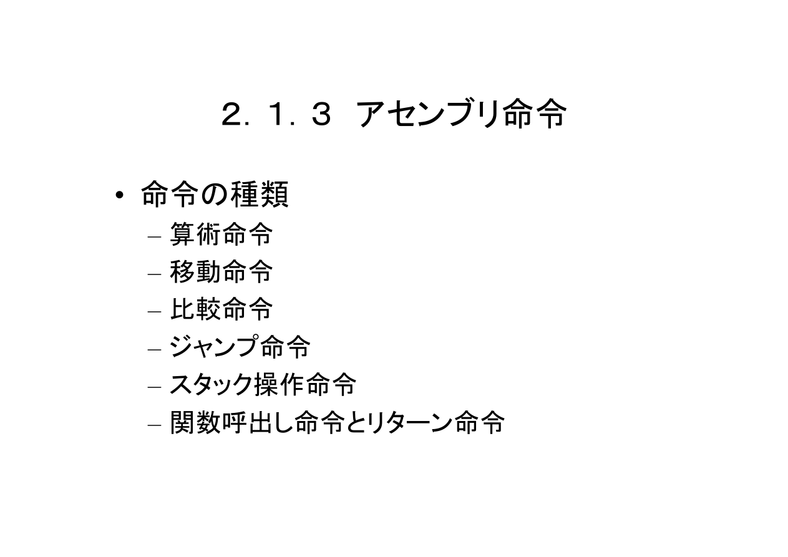

## 言語処理系（２）_p013
<!-- source: 言語処理系（２）.pdf page 13 -->

２．１．３アセンブリ命令
• 算術命令
– 2項算術命令
•2オペランドに対し演算を実行⇒結果を第1に格納
• 第1オペランドは，汎用レジスタまたはメモリ番地
• 第2オペランドは，定数，汎用レジスタ，メモリ番地
• いずれをもメモリ番地とすることは不可
•add, sub, imulなど
– 単項算術命令
• オペランドは，汎用レジスタまたはメモリ番地
•neg, dec, incなど

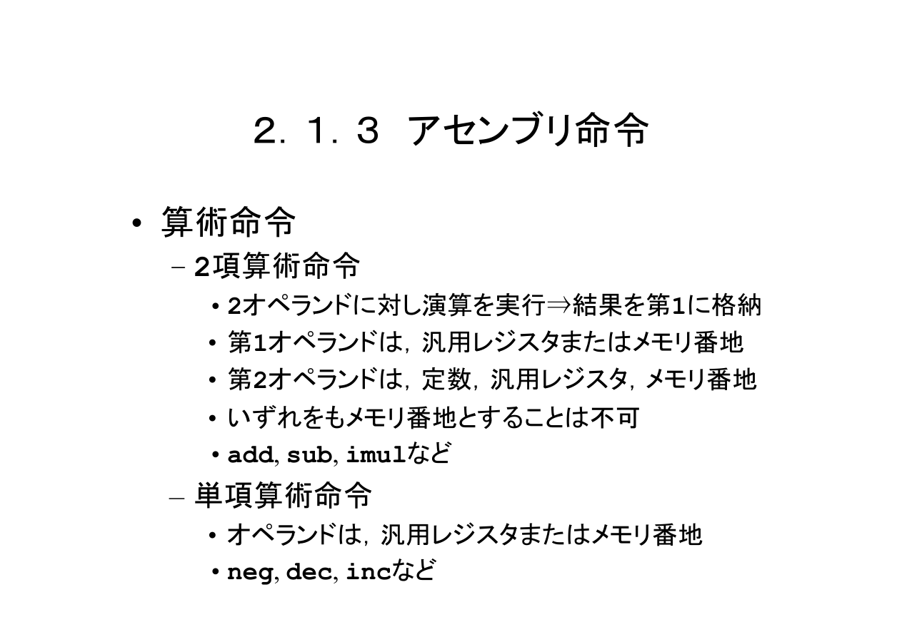

## 言語処理系（２）_p014
<!-- source: 言語処理系（２）.pdf page 14 -->

２．１．３アセンブリ命令
• 算術命令
– 例
add  eax, ebx
; eaxにebxの値を加算
sub  esp, 4    ; espから4を減算
imul ebx, _x   ; ebxに大域変数xの値を乗算
neg eax        ; eaxの値を符号反転

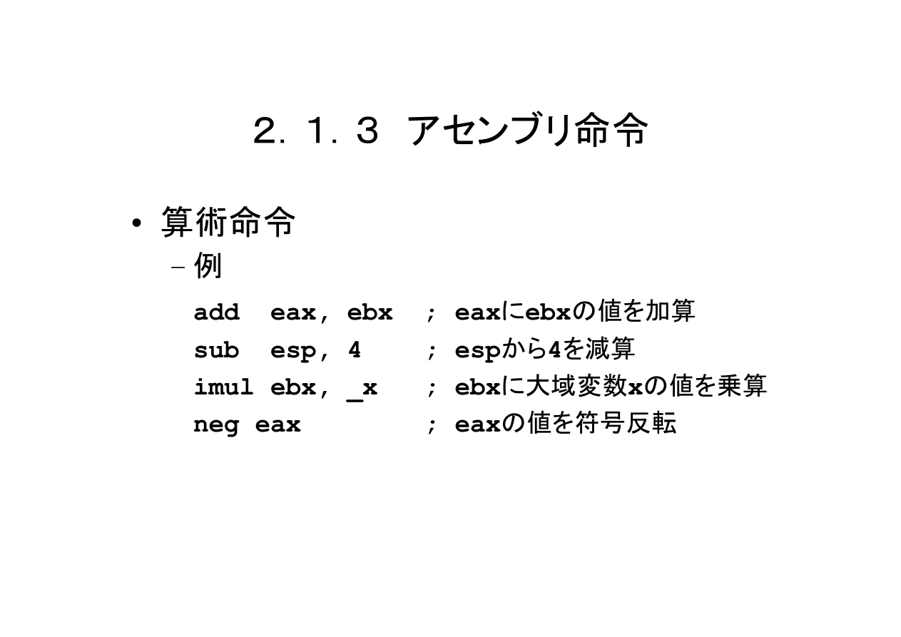

## 言語処理系（２）_p015
<!-- source: 言語処理系（２）.pdf page 15 -->

２．１．３アセンブリ命令
• 移動命令
– 2オペランドに対し，第2を第1に格納
– 第1は，汎用レジスタまたはメモリ番地
– 第2は，定数，汎用レジスタ，メモリ番地
– いずれをもメモリ番地とすることは不可
– mov
– 例
mov  eax, 4      ; eaxに整数4を格納
mov  ebp, esp    ; ebpにespの値を格納

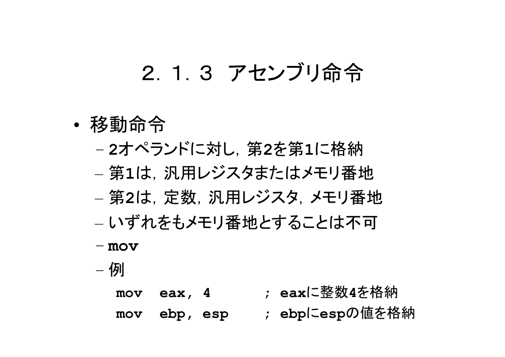

## 言語処理系（２）_p016
<!-- source: 言語処理系（２）.pdf page 16 -->

２．１．３アセンブリ命令
• 比較命令
– 2オペランドに対し，第2を第1と比較（減算）
– 第1は，汎用レジスタまたはメモリ番地
– 第2は，定数，汎用レジスタ，メモリ番地
– いずれをもメモリ番地とすることは不可
– cmp
– 第1>第2⇒Zフラグ：0，Ｓフラグ：0
– 第1=第2⇒Zフラグ：1，Ｓフラグ：0
– 第1<第2⇒Zフラグ：0，Ｓフラグ：1

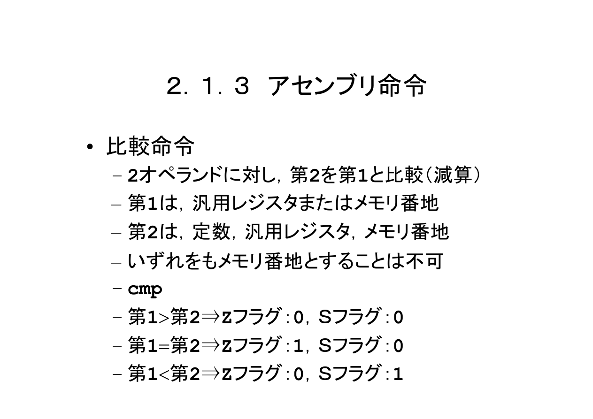

## 言語処理系（２）_p017
<!-- source: 言語処理系（２）.pdf page 17 -->

２．１．３アセンブリ命令
• ジャンプ命令
– 無条件ジャンプ
•jmp ラベル
– 条件付ジャンプ
•jc ラベル
命令
条件
Z
S
jg
x>y
0 and 0
greater
jge
xy
0
greater or equal
je
x=y
1
equal
jne
xy
0
not equal
jl
x<y
1
less
jle
xy
1 or 1
less or equal
分岐時はeipにラベルの番地を格納

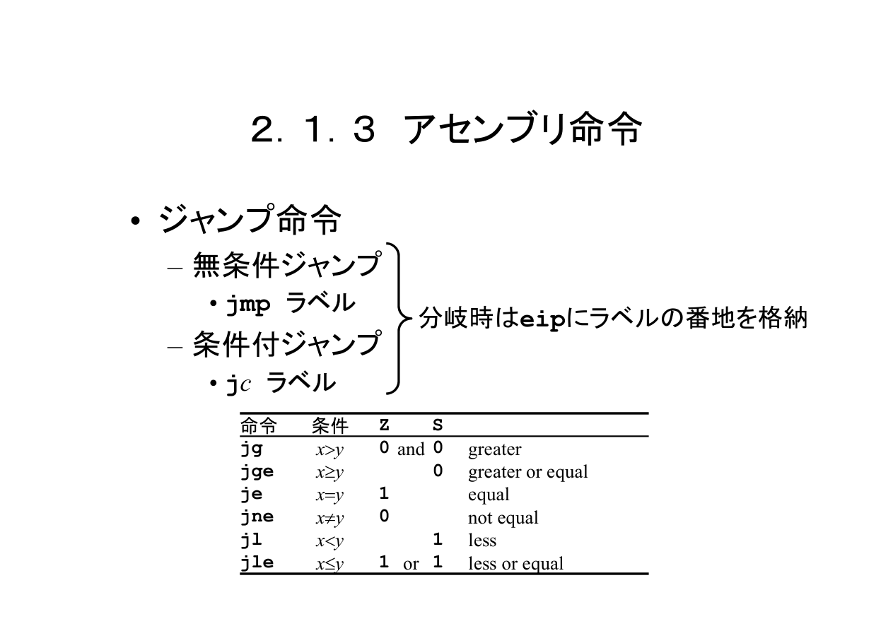

## 言語処理系（２）_p018
<!-- source: 言語処理系（２）.pdf page 18 -->

２．１．３アセンブリ命令
• スタック操作命令
– push命令
• オペランドの値をスタックの先頭に積む
•espの値が4減少
• オペランドは，汎用レジスタ，メモリ番地，定数
– pop命令
• スタックの先頭の値をオペランドに格納
•espの値が4増加
• オペランドは，汎用レジスタ，メモリ番地

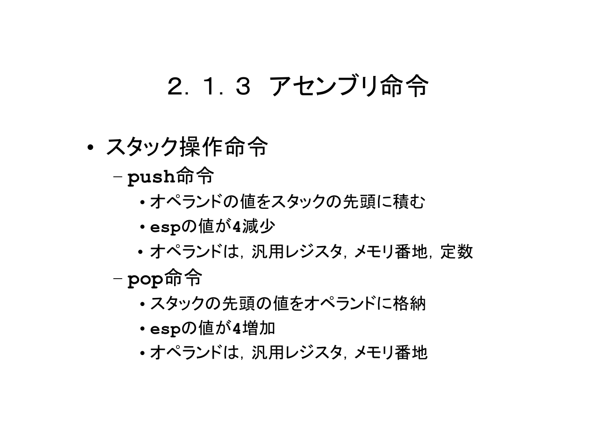

## 言語処理系（２）_p019
<!-- source: 言語処理系（２）.pdf page 19 -->

２．１．３アセンブリ命令
• スタック操作命令
– 例
push eax
pop  ebx
eax
10
ebx
10
10
5
0xffffffff
esp
eip
0

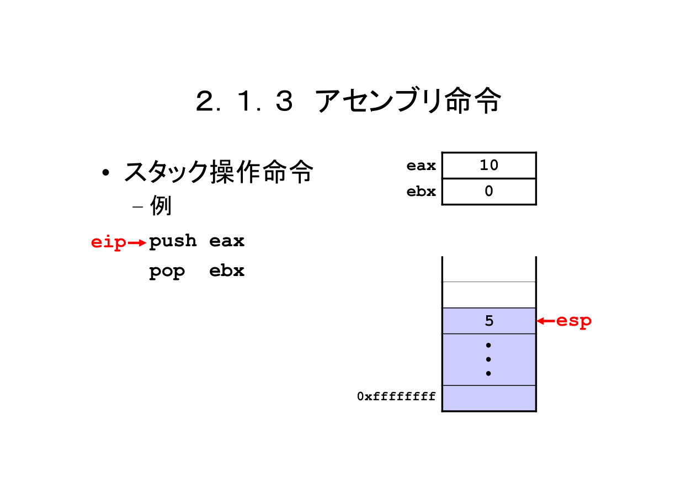

## 言語処理系（２）_p020
<!-- source: 言語処理系（２）.pdf page 20 -->

２．１．３アセンブリ命令
• 関数呼出し命令とリターン命令
– call命令
•eipの値をスタックの先頭に積む
• オペランド（ラベル）で指定された番地をeipに格納
– ret命令
• スタックの先頭から戻り番地をpopし，eipに格納

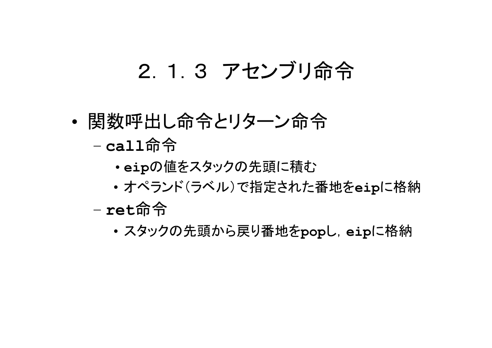

## 言語処理系（２）_p021
<!-- source: 言語処理系（２）.pdf page 21 -->

２．１．３アセンブリ命令
• call命令とret命令
– 例
call L
L:
ret
5
0xffffffff
esp
eip

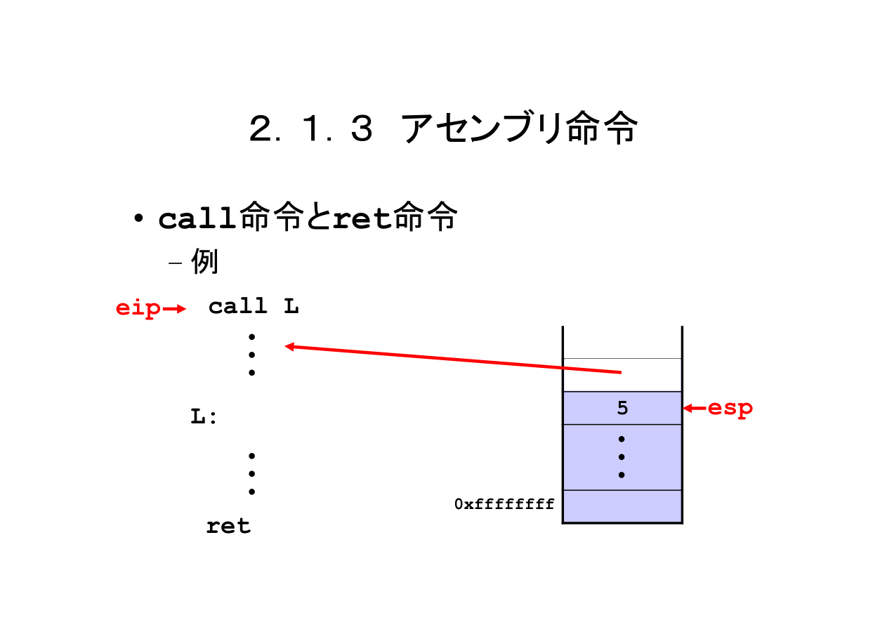

## 言語処理系（２）_p022
<!-- source: 言語処理系（２）.pdf page 22 -->

２．２関数呼出し
２．２．１プログラム例
２．２．２関数フレーム
２．２．３実行例

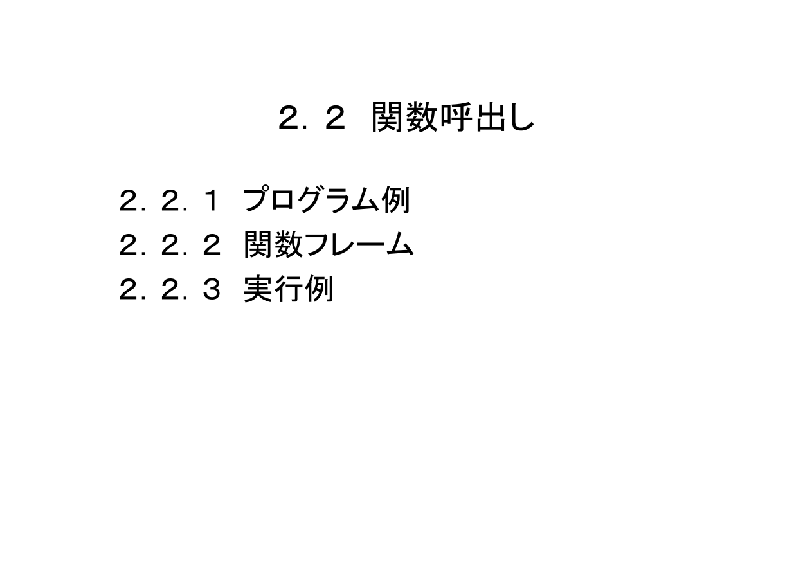

## 言語処理系（２）_p023
<!-- source: 言語処理系（２）.pdf page 23 -->

２．２．１プログラム例
int foo(int x){
int y = x*x;
return y+2;
}
_foo: push ebp
mov  ebp, esp
sub  esp, 4
mov  eax, 8[ebp]
imul eax, 8[ebp]
mov  -4[ebp], eax
mov  eax, -4[ebp]
add  eax, 2
mov  esp, ebp
pop  ebp
ret

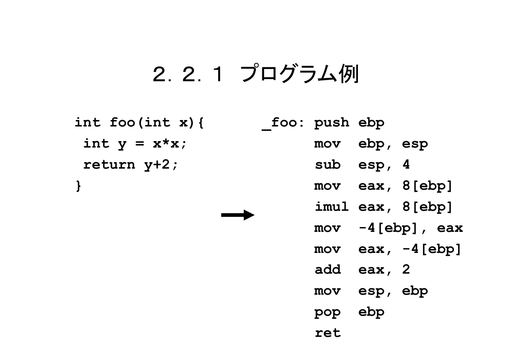

## 言語処理系（２）_p024
<!-- source: 言語処理系（２）.pdf page 24 -->

２．２．１プログラム例
...
...foo(5)...
...
...
push 5
call _foo
add  esp, 4
...

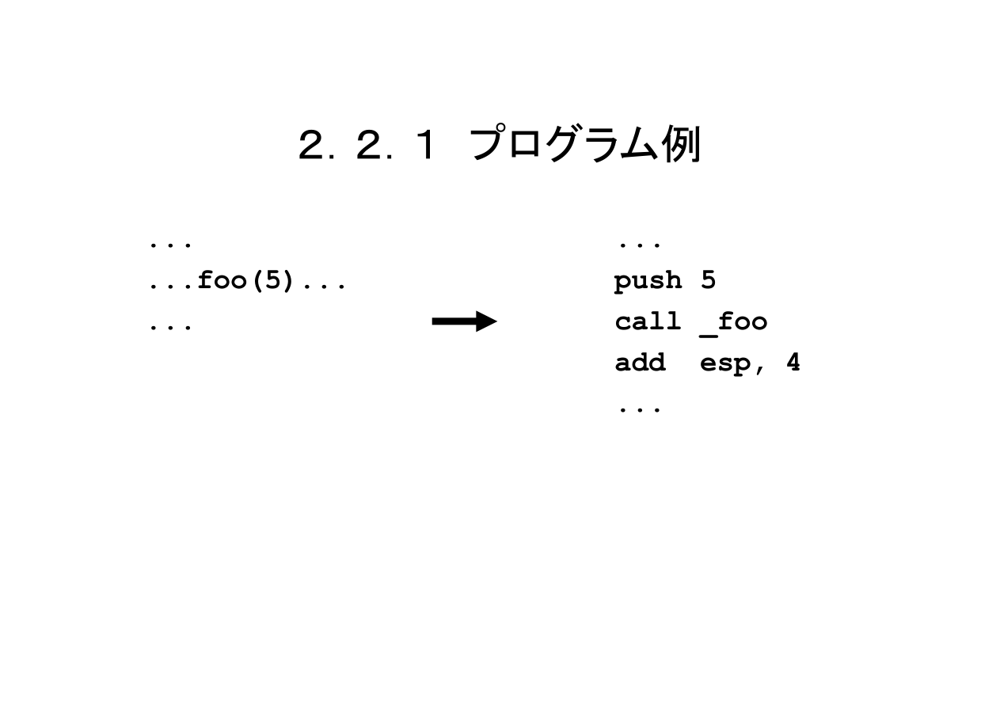

## 言語処理系（２）_p025
<!-- source: 言語処理系（２）.pdf page 25 -->

eax
25
旧ebp
戻り番地
5
5
25
２．２．１プログラム例
_foo: push ebp
mov  ebp, esp
sub  esp, 4
mov  eax, 8[ebp]
imul eax, 8[ebp]
mov  -4[ebp], eax
mov  eax, -4[ebp]
add  eax, 2
mov  esp, ebp
pop  ebp
ret
ebp
esp
27
push ebp
mov  ebp, esp
sub  esp, 4
mov  eax, 8[ebp]
imul eax, 8[ebp]
mov  -4[ebp], eax
mov  eax, -4[ebp]
add  eax, 2
mov  esp, ebp
pop  ebp
ret

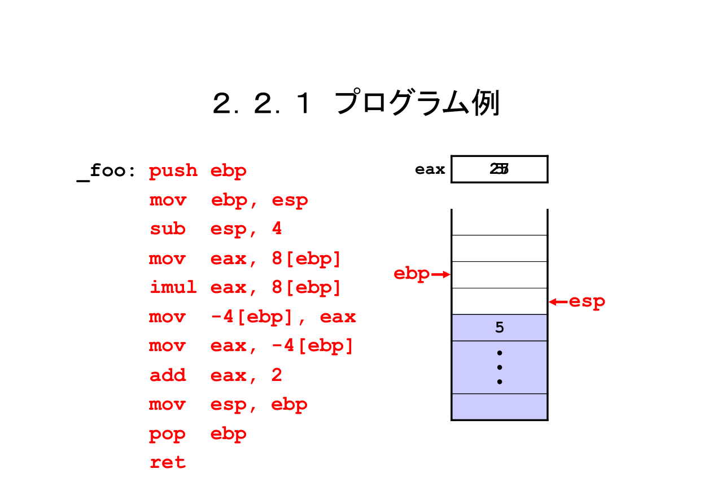

## 言語処理系（２）_p026
<!-- source: 言語処理系（２）.pdf page 26 -->

２．２．２関数フレーム
• ある関数f のためのアセンブリコード
_ f:  push ebp
mov  ebp, esp
sub  esp, Nlocal
本体の実行
Lret : mov esp, ebp
pop ebp
ret

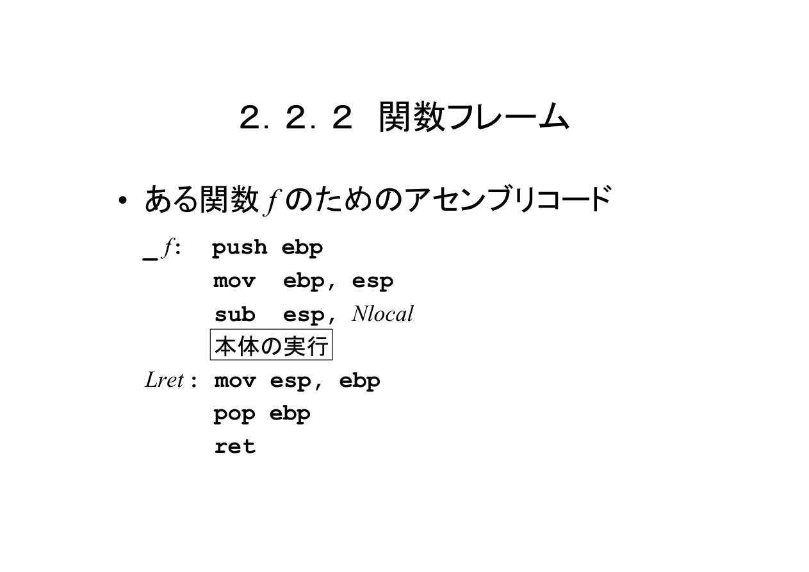

## 言語処理系（２）_p027
<!-- source: 言語処理系（２）.pdf page 27 -->

２．２．２関数フレーム
• 関数呼出しf(e1, e2, ..., en) のためのア
センブリコード
enを計算し，結果をスタックに積む
en-1を計算し，結果をスタックに積む
...
e1を計算し，結果をスタックに積む
call _ f
add  esp, n × 4

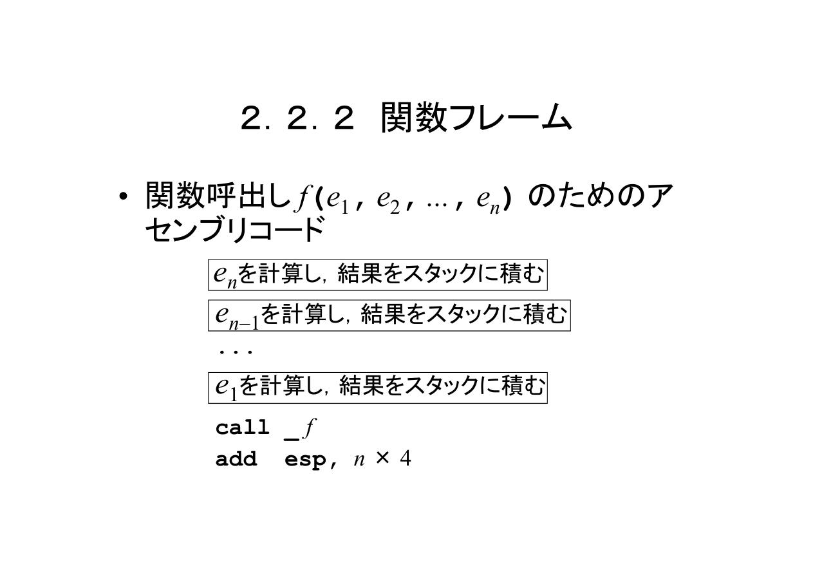

## 言語処理系（２）_p028
<!-- source: 言語処理系（２）.pdf page 28 -->

２．２．２関数フレーム
• f(1, g(2,3)+2, 4)
push 4
g(2,3)+2を計算し，
結果をスタックに積む
push 1
call _ f
add  esp, 12
push 3
push 2
call _g
add  esp, 8
add  eax, 2
push eax

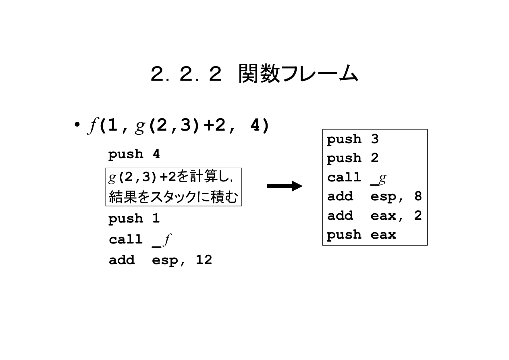

## 言語処理系（２）_p029
<!-- source: 言語処理系（２）.pdf page 29 -->

２．２．３実行例
int fact(int n)
{
if (n == 0) return 1;
else return n * fact(n-1);
}

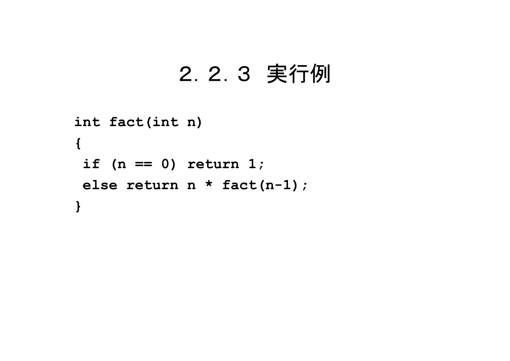

## 言語処理系（２）_p030
<!-- source: 言語処理系（２）.pdf page 30 -->

２．２．３実行例
_fact: push ebp
mov ebp, esp
cmp  8[ebp], 0   ; n == 0
jne  L2
mov  eax, 1      ; 戻り値1
jmp  L1
L2:    mov  eax, 8[ebp] ; n-1
sub  eax, 1      ;
push eax
call _fact       ; 再帰呼出し
add  esp, 4
imul eax, 8[ebp] ; (n-1)! * n
L1:    pop  ebp
ret

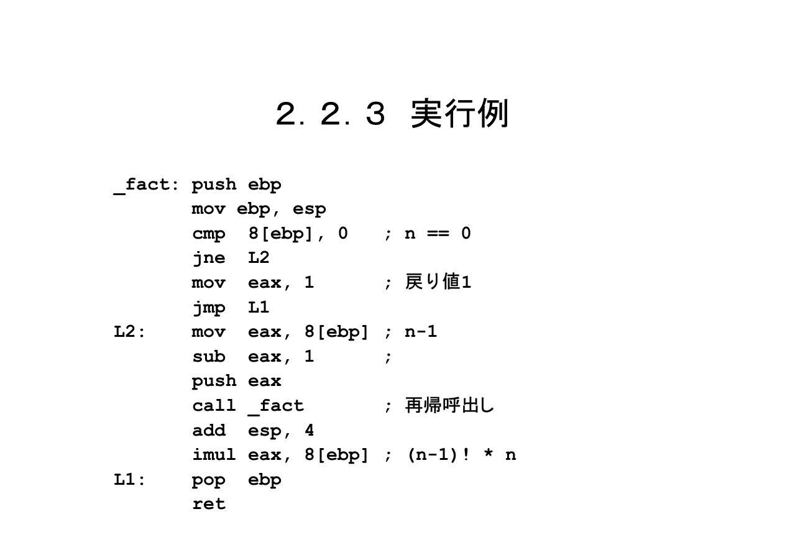

## 言語処理系（２）_p031
<!-- source: 言語処理系（２）.pdf page 31 -->

, ebp
, ebp
２．２．３実行例
_fact: push ebp
mov ebp, esp
cmp  8[ebp], 0
jne  L2
mov  eax, 1
jmp  L1
L2:    mov  eax, 8[ebp]
sub  eax, 1
push eax
call _fact
add  esp, 4
imul eax, 8[ebp]
L1:    pop  ebp
ret
戻り番地１
0
戻り番地１
1
戻り番地０
2
esp
ebp
, ebp
ebp
ebp
戻り番地１

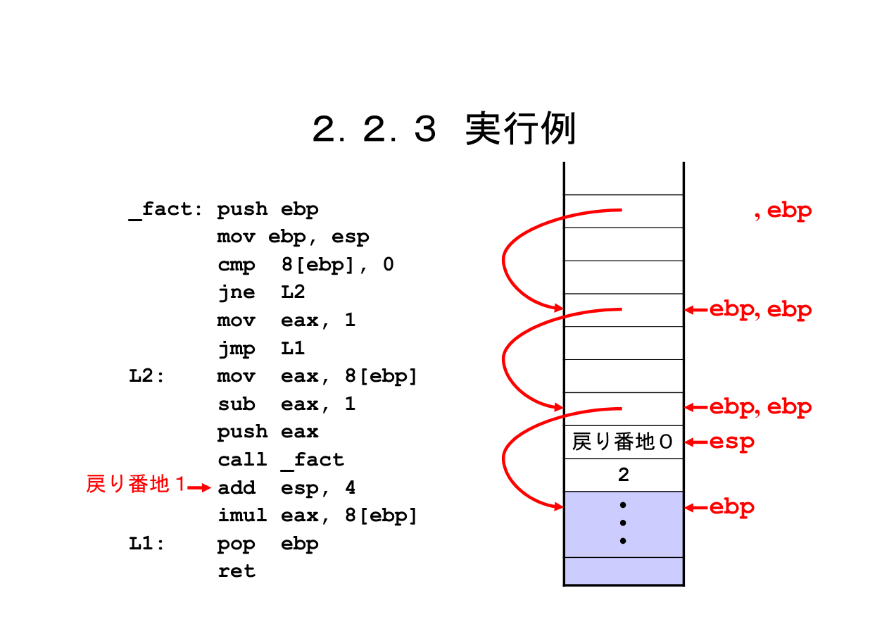

## 言語処理系（２）_p032
<!-- source: 言語処理系（２）.pdf page 32 -->

２．３局所変数の割当て
２．３．１局所変数とスコープ規則
２．３．２一時変数の割当て
２．３．３保存レジスタ

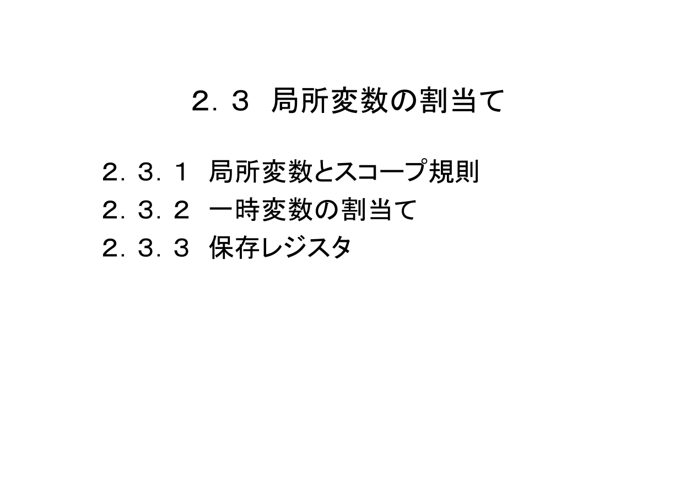

## 言語処理系（２）_p033
<!-- source: 言語処理系（２）.pdf page 33 -->

２．３．１局所変数とスコープ規則
• 関数呼出しの引数
– 第１引数：8[ebp]，第２引数：12[ebp]，…
• 局所変数
– 関数ごとに位置を決定
– 領域を小さく抑える
– スコープの重ならない局所変数を重ねて割当て

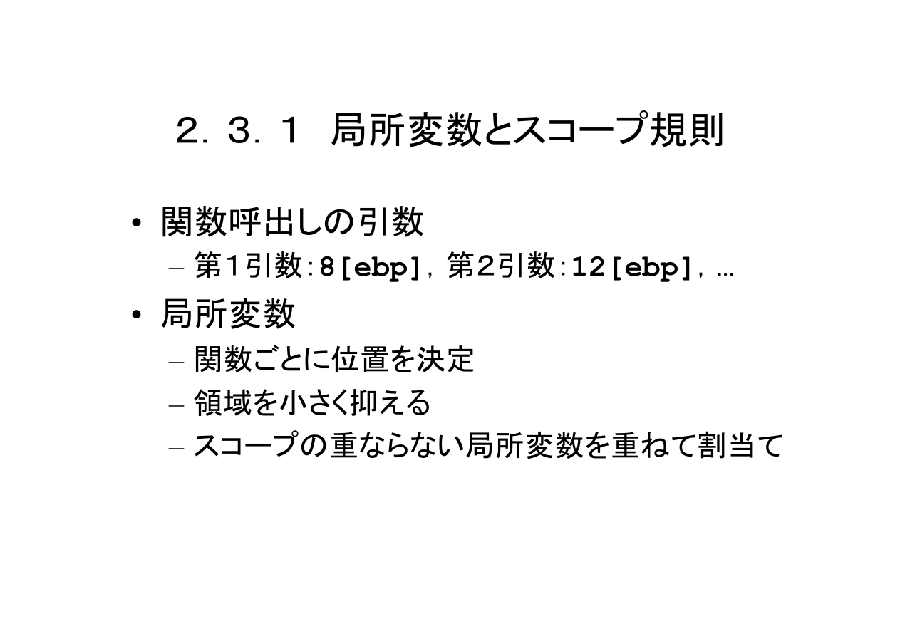

## 言語処理系（２）_p034
<!-- source: 言語処理系（２）.pdf page 34 -->

２．３．１局所変数とスコープ規則
xのスコープ
yのスコープ
zのスコープ
wのスコープ
スコープ無視
スコープ考慮
w
z
z, w
y
y
x
x

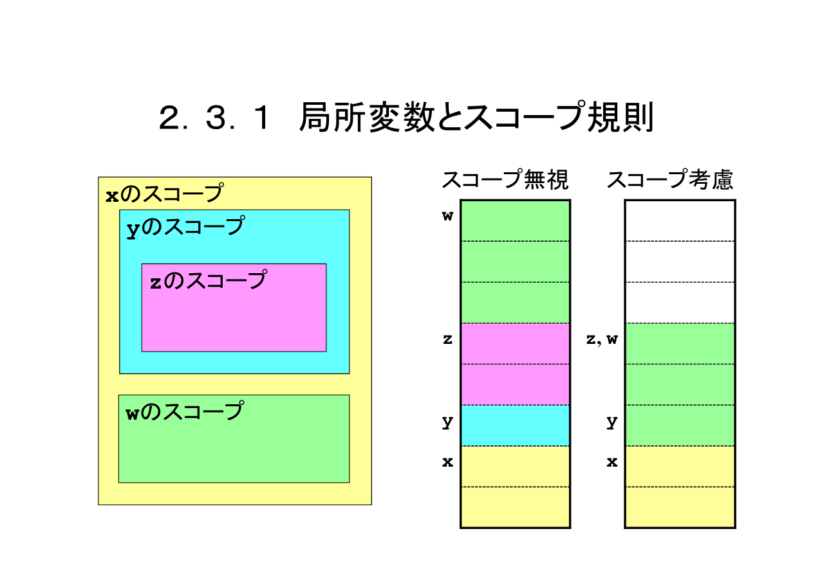

## 言語処理系（２）_p035
<!-- source: 言語処理系（２）.pdf page 35 -->

２．３．２一時変数の割当て
• 一時変数
– レジスタの値を退避
– スコープなし
– 変数のスコープをまたぐ割当てと解放はない
⇒通常の変数と同様に処理可能

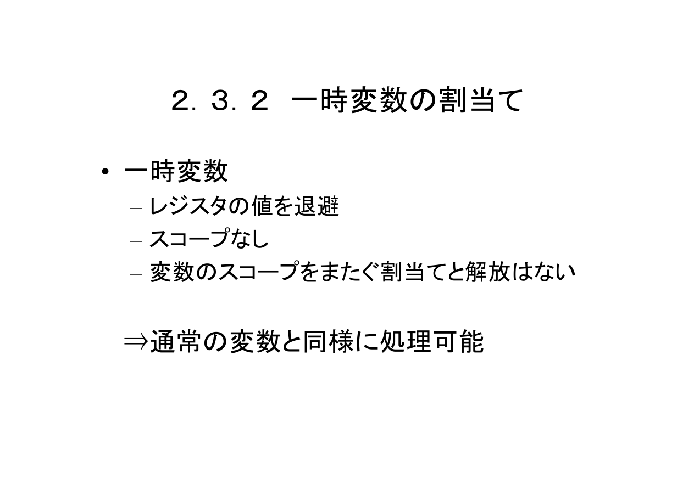

## 言語処理系（２）_p036
<!-- source: 言語処理系（２）.pdf page 36 -->

２．３．３レジスタ退避
• 関数呼出し時のレジスタ退避
– 関数側退避(callee-saved)レジスタ
• 呼出し側が使用の可能性を持つレジスタ
• 関数側が実行開始前にスタックに退避
• 呼出し側で使用していないかも知れない
– 呼出し側退避(caller-saved)レジスタ
• 呼出し側が使用中のレジスタ
• 呼出し側で関数呼出し前にスタックに退避
• 関数側で使用しないかも知れない
•eaxレジスタは呼出し側退避

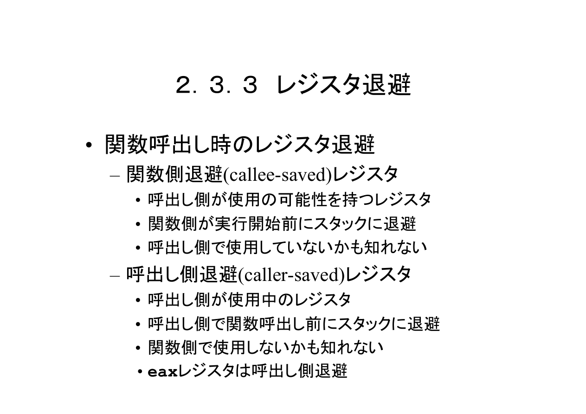

## 言語処理系（２）_p037
<!-- source: 言語処理系（２）.pdf page 37 -->

要約
• ８０４８６に基づく実行環境モデル（メモリ，Ｃ
ＰＵとレジスタ，アセンブリ命令）
• 関数呼出しと関数フレーム
• 局所変数，一時変数，レジスタ退避

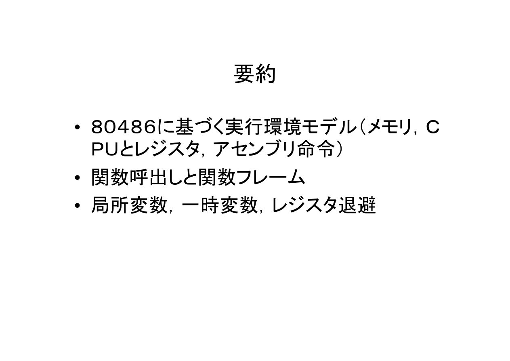
