# 言語処理系202601

<!-- source: 言語処理系202601.pdf -->

## 言語処理系202601_p001
<!-- source: 言語処理系202601.pdf page 1 -->

言語処理系
前半第1回ガイダンス
山井成良（前半担当）
nyamai@cc.tuat.ac.jp
注意事項
授業で提供される動画や資料など，あるいは授業の様子を録画，
録音，撮影したものを，SNSやWebサーバなどで共有あるいは公開
すると，情報倫理に反することとして本学の懲戒等の対象になり
得るばかりか，著作物の権利侵害など民事的・刑事的な罰則等の
対象になる可能性があるので，絶対に行わないでください．
Google classroom クラスコード： 「yhdztf4w」

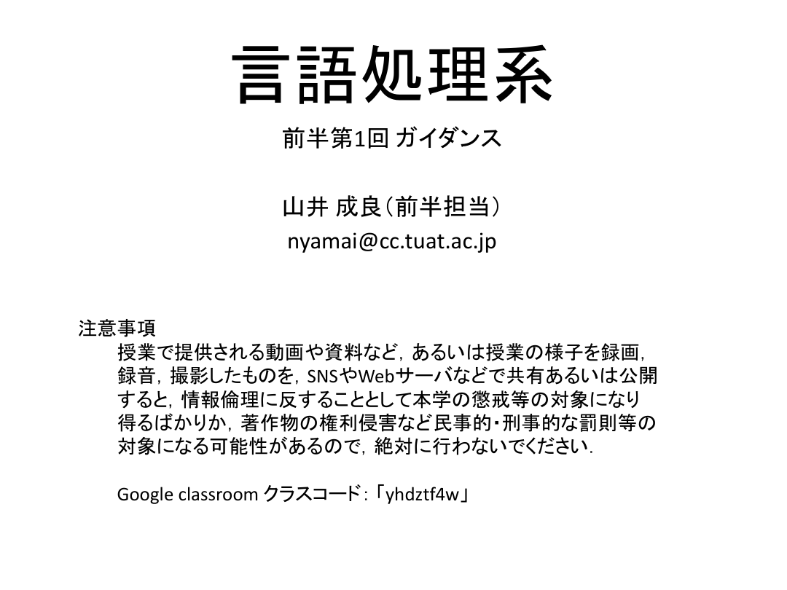

## 言語処理系202601_p002
<!-- source: 言語処理系202601.pdf page 2 -->

シラバス（予定）
•
前半（担当：山井）
•
第１回（4/14）
ガイダンス
•
第２回（4/21）
形式言語理論
•
第３回（4/28）
正規表現と字句解析
•
第４回（5/12）
構文解析の基礎
•
第５回（5/19）
下向き構文解析
•
第６回（5/26）
上向き構文解析
•
第７回（6/02）
字句解析・構文解析プログラム
•
後半（担当：金子）
•
第８回（6/09）
コンパイラ再訪
•
第９回（6/16）
コード生成の環境モデル
•
第10回（6/23）
文のコード生成
•
第11回（6/30）
算術式のコード生成
•
第12回（7/07）
最適化
•
第13回（7/14）
ソフトウェアウォーターマーキング
•
定期試験・その他
•
第14回（7/21）
予備日
•
第15回（7/28）
試験（前半・後半合同）
言語処理系（担当：山井）再配布厳禁
2
2026/4/14

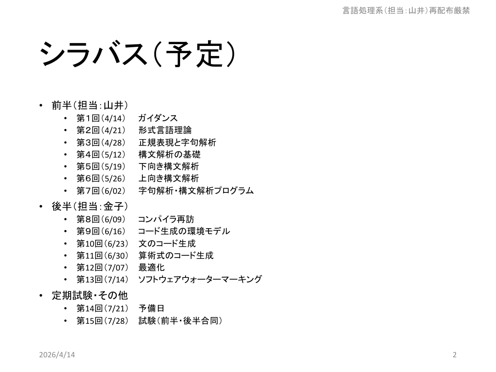

## 言語処理系202601_p003
<!-- source: 言語処理系202601.pdf page 3 -->

評価方法
• 中間試験と期末試験
• 中間試験は行わず，期末試験で前半と後半の試験を実施
• 毎回のレポート（少なくとも前半）
• 出席確認を兼ねる
• 昨年度の成績分布
• S：
12
• A：
18
• B：
12
• C：
4
• D：
8
• E：
5
2026/4/14
言語処理系（担当：山井）再配布厳禁
3

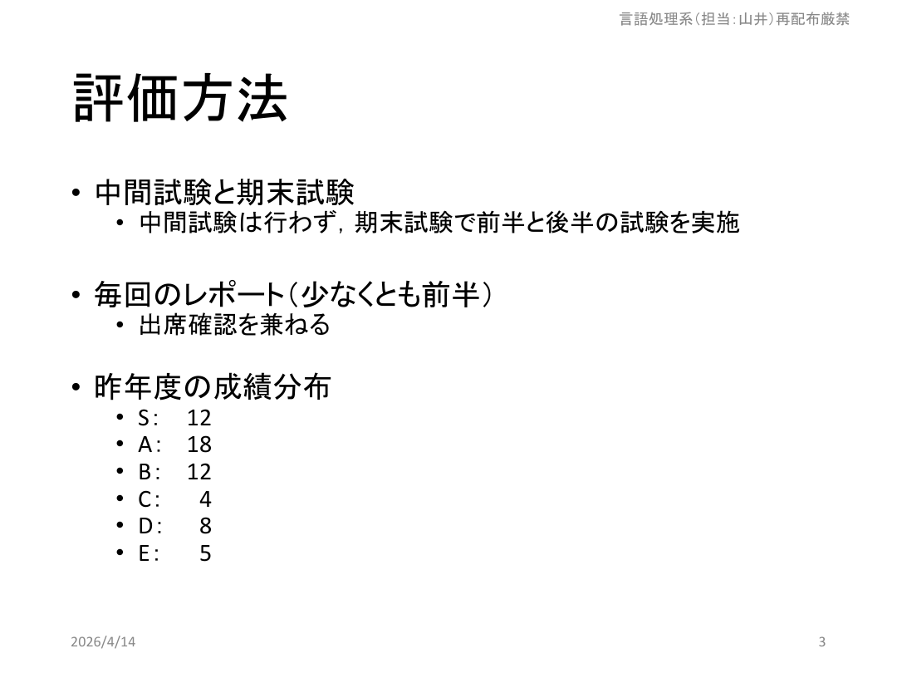

## 言語処理系202601_p004
<!-- source: 言語処理系202601.pdf page 4 -->

言語とは
• 自然言語と人工言語
• 自然言語の例：
• 日本語，英語，フランス語，etc.
• 結構曖昧
• 「Time flies like an arrow」は少なくとも6種類に解釈可能
• 人工言語の例：
• エスペラント語（国際補助語），クリンゴン語（芸術言語），etc.
• C, Java, Ruby, Python（プログラミング言語）, etc.
• Verilog（ハードウェア記述言語）, SQL（データベース言語）, etc.
• 形式言語
• 「生成文法」により定義された「記号列」の「集合」
• 計算機モデル（オートマトン）と密接な関係
言語処理系（担当：山井）再配布厳禁
4
2026/4/14

## 言語処理系202601_p005
<!-- source: 言語処理系202601.pdf page 5 -->

Time flies like an arrow
• 単語の意味
• Time： 名詞（時間），形容詞（時の），動詞（時間を測る）
• Flies： 動詞（飛ぶ）の三単現，名詞（蝿）の複数形
• Like： 動詞（好む），前置詞（のような），他
• 文の意味
1.
時間は矢のように飛ぶ（光陰矢の如し）
2.
矢のような蝿を時間測定せよ
3.
蝿を矢のように時間測定せよ
4.
時蝿は矢を好む
5.
矢のような時蝿
6.
Time（雑誌）は矢のように飛ぶ
言語処理系（担当：山井）再配布厳禁
5
2026/4/14

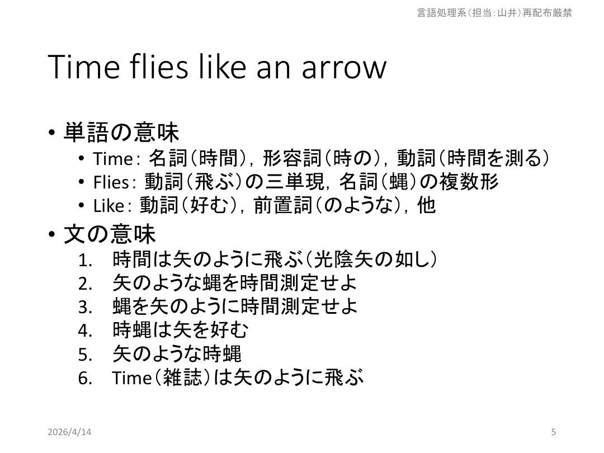

## 言語処理系202601_p006
<!-- source: 言語処理系202601.pdf page 6 -->

言語とは
• 自然言語と人工言語
• 自然言語の例：
• 日本語，英語，フランス語，etc.
• 結構曖昧
• 「Time flies like an arrow」は少なくとも6種類に解釈可能
• 人工言語の例：
• エスペラント語（国際補助語），クリンゴン語（芸術言語），etc.
• C, Java, Ruby, Python（プログラミング言語）, etc.
• Verilog（ハードウェア記述言語）, SQL（データベース言語）, etc.
• 形式言語
• 「生成文法」により定義された「記号列」の「集合」
• 計算機モデル（オートマトン）と密接な関係
言語処理系（担当：山井）再配布厳禁
6
2026/4/14

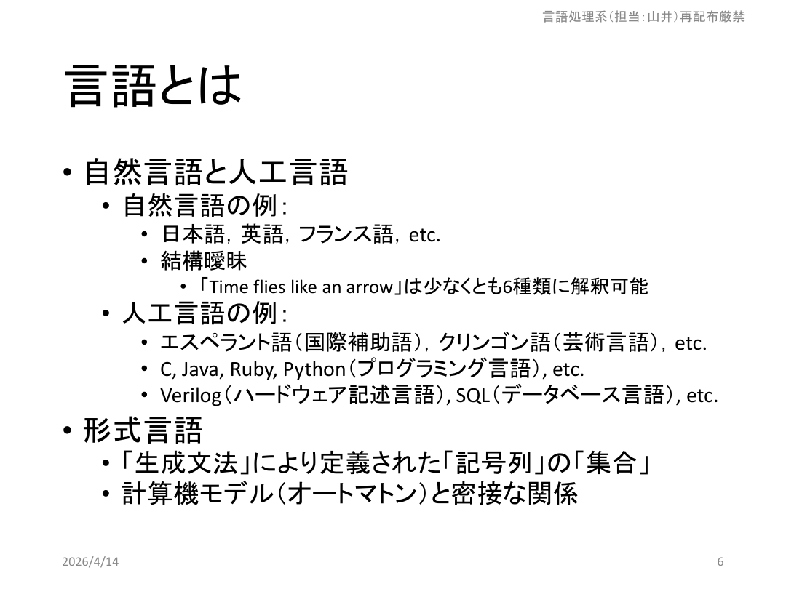

## 言語処理系202601_p007
<!-- source: 言語処理系202601.pdf page 7 -->

言語処理系（１）
• 定義
• 「高水準言語」で記述されたプログラムを実行するため
のソフトウエア
• 高水準（高級）言語
• 記述の抽象度が高いプログラミング言語
• ハードウェアの違いを意識する必要なし
⇔低水準（低級）言語
• ハードウェアに依存したプログラミング言語
• 機械語，アセンブリ言語など
※ 中間言語(高水準言語と低水準言語の中間)あり
言語処理系（担当：山井）再配布厳禁
7
2026/4/14

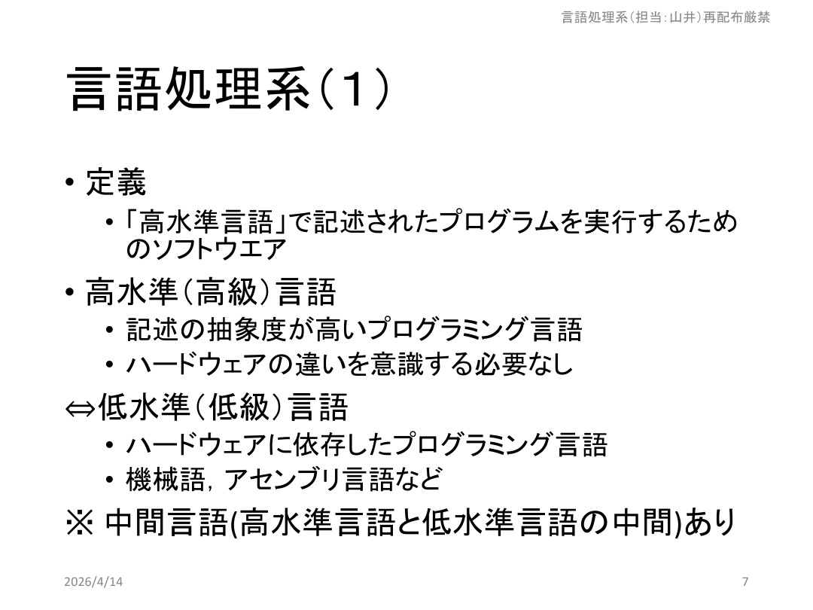

## 言語処理系202601_p008
<!-- source: 言語処理系202601.pdf page 8 -->

言語処理系（２）
• T図式（Tombstone diagram）
• 言語処理系の役割を図式化したもの
• 4種類の構成要素
• 計算機（machine）
• プログラム
• 言語Lで書かれ，機能fを持つものを右図で表す
• 翻訳系（translator）
• 言語S（原始言語）を言語T（目的言語）に変換するもの
• 言語Lで書かれているとき，これを右図で表す
• 通訳系（interpreter）
• 言語Lで書かれたプログラムを「そのまま」実行するもの
• 計算機M上で動作するとき，これを右図で表す
L
S  →  T
M
L
f
L
M
言語処理系（担当：山井）再配布厳禁
8
2026/4/14

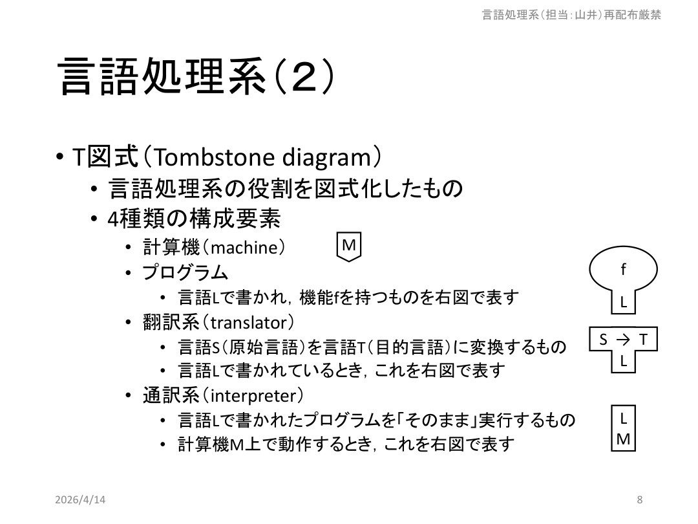

## 言語処理系202601_p009
<!-- source: 言語処理系202601.pdf page 9 -->

言語処理系（３）
• インタプリタ
• 言語Lで書かれたプログラムを「そのまま」実行するもの
• 例： シェル（sh, bash等），Ruby，Python，JavaScript
• Rubyで書かれたsortプログラムを
x86アーキテクチャで実行する場合のT図式
M
x86
Ruby
x86
Ruby
sort
Ruby
インタプリタ
一致が必要
一致が必要
言語処理系（担当：山井）再配布厳禁
9
2026/4/14

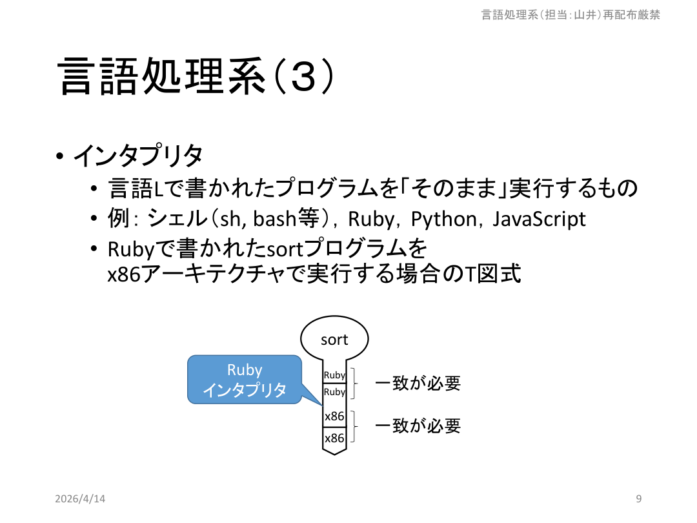

## 言語処理系202601_p010
<!-- source: 言語処理系202601.pdf page 10 -->

言語処理系（４）
• コンパイラ（compiler）
• 高水準言語を低水準言語に変換する翻訳系の一種
• アセンブラ（assembler）
• アセンブリ言語を機械語に変換する翻訳系の一種
M
x86
C
sort
x86
C    →  x86 x86
sort
x86
sort
M
x86
x86用
Cコンパイラ
M
x86
asm
sort
x86
asm →  x86 x86
sort
x86
sort
M
x86
x86用
アセンブラ
言語処理系（担当：山井）再配布厳禁
10
2026/4/14

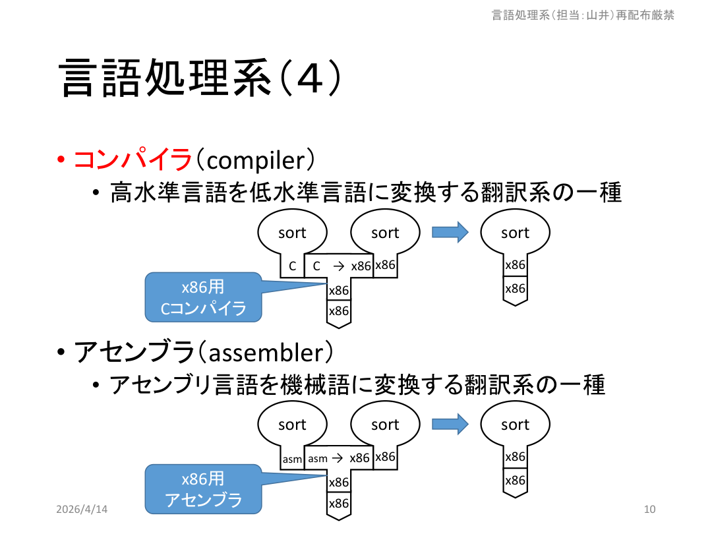

## 言語処理系202601_p011
<!-- source: 言語処理系202601.pdf page 11 -->

言語処理系（５）
• コンパイラとインタプリタの比較
• 一部の言語処理系では両者を組合せ
• JBC（Java Byte Code）
• 中間言語の一種
比較項目
コンパイラ
インタプリタ
実行方法
低水準言語へ変換した
プログラムをOSが直接実行
インタプリタがプログラムを
読み込んで実行
実行速度
高速
低速
処理系の移植
移植先の計算機に依存
比較的容易
開発効率
非効率的（対話性に乏しい）
効率的（対話性に富む）
M
x86
Java
sort
x86
Java →  JBC JBC
sort
M
x86
JBC
x86
JBC
sort
Java仮想マシン
（java）
Javaコンパイラ
（javac）
言語処理系（担当：山井）再配布厳禁
11
2026/4/14

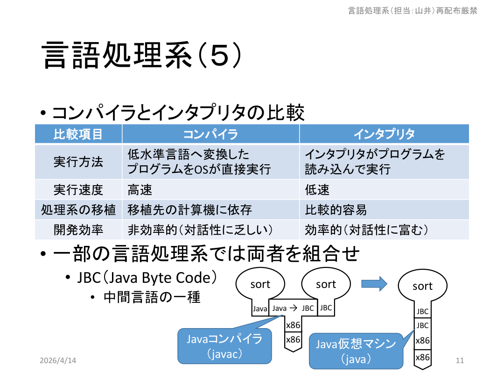

## 言語処理系202601_p012
<!-- source: 言語処理系202601.pdf page 12 -->

言語処理系（６）
• ブートストラップ技法（bootstrapping）
• 高水準言語LのコンパイラをL自身で記述する技法
• C言語の場合の例
• 計算機M1用のCコンパイラ
• 鶏と卵の関係
• 最初は（多少）苦労が必要
• 移植が容易
• 計算機M2用のCコンパイラ
• M1用コンパイラを用いて作成
※ 名前の由来（諸説あり）
• ほら吹き男爵（ミュンヒハウゼン男爵）が底なし沼から
ブートストラップを自身で引っ張って脱出した話から
C
C   →   M1
C
C   →   M2
C
C   →   M2
M2
C   →   M2
M1
C   →   M2
M1
C   →   M1
クロスコンパイラ
言語処理系（担当：山井）再配布厳禁
12
2026/4/14

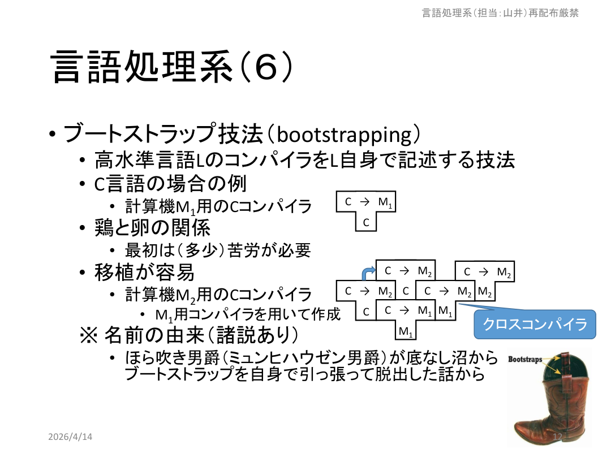

## 言語処理系202601_p013
<!-- source: 言語処理系202601.pdf page 13 -->

コンパイラの概要（１）
• コンパイルを含む一般的な処理の流れ
• GNU Cコンパイラは全ての処理を
gccで実行可能
• gcc –E：プリプロセッサの結果を出力
• gcc –S: アセンブリプログラムを出力
• gcc –c: 再配置可能機械語プログラム
を出力
• gcc obj.o –lm:再配置可能機械語
プログラムobj.oとライブラリlibm.a
から実行形式プログラムを作成
ソース（原始）プログラム
プリプロセッサ
展開後ソースプログラム
コンパイラ
目的アセンブリプログラム
アセンブラ
再配置可能機械語プログラム
ローダ/リンカ
実行形式プログラム
他の再配置可能機械語プログラム
（ライブラリなど）
言語処理系（担当：山井）再配布厳禁
13
2026/4/14

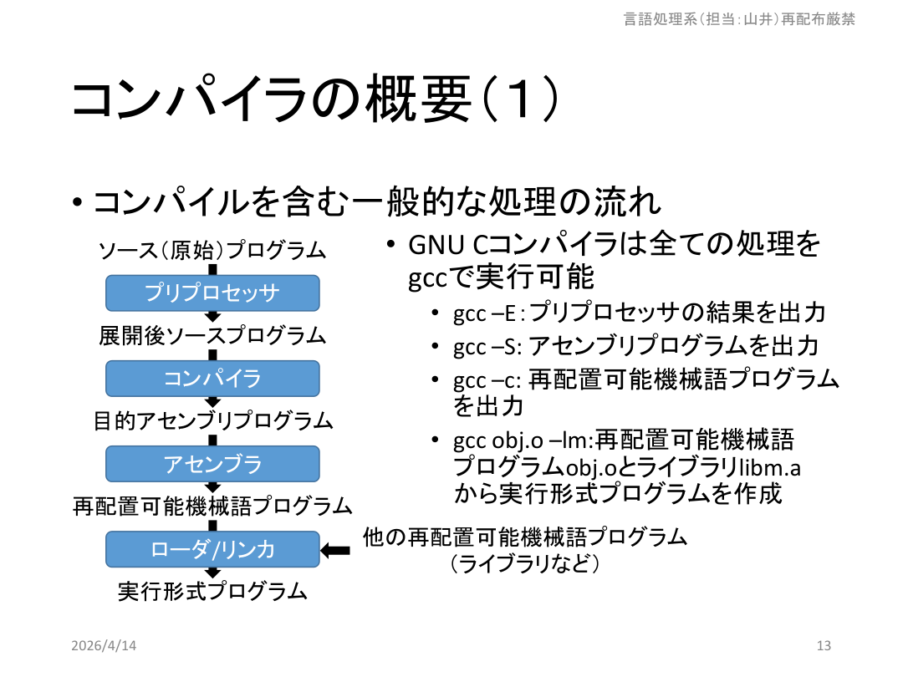

## 言語処理系202601_p014
<!-- source: 言語処理系202601.pdf page 14 -->

コンパイラの概要（２）
• コンパイラ内部の処理過程
原始プログラム
字句解析
構文解析
意味解析
中間コード生成
コード最適化
目的コード生成
目的プログラム
シンボル表管理
エラー処理
山井
金子
言語処理系（担当：山井）再配布厳禁
14
2026/4/14

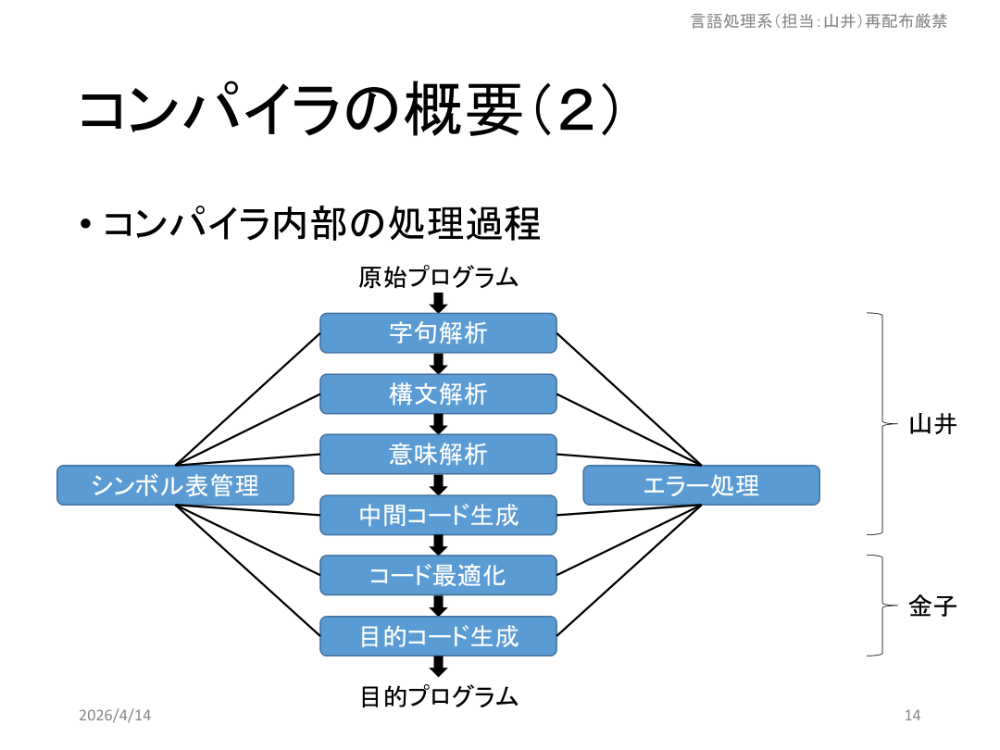

## 言語処理系202601_p015
<!-- source: 言語処理系202601.pdf page 15 -->

コンパイラの概要（３）
• 字句解析（lexical analysis）
• プログラムを単語（終端記号，トークン）に分割
• 例：
• 入力「h = h0 – g / 2 * t * t ;  /* 落下t秒後の位置 */」
• 解析結果
識別子（h）
'='
識別子（h0）
'–'
識別子（g）
'/'
整数（2）
'*'
識別子（t）
'*'
識別子（t）
'; '
※ 空白やコメントは無視する
• 字句解析器（lexical analyzer, scanner）
• 字句解析を行うプログラムを指す
言語処理系（担当：山井）再配布厳禁
15
2026/4/14

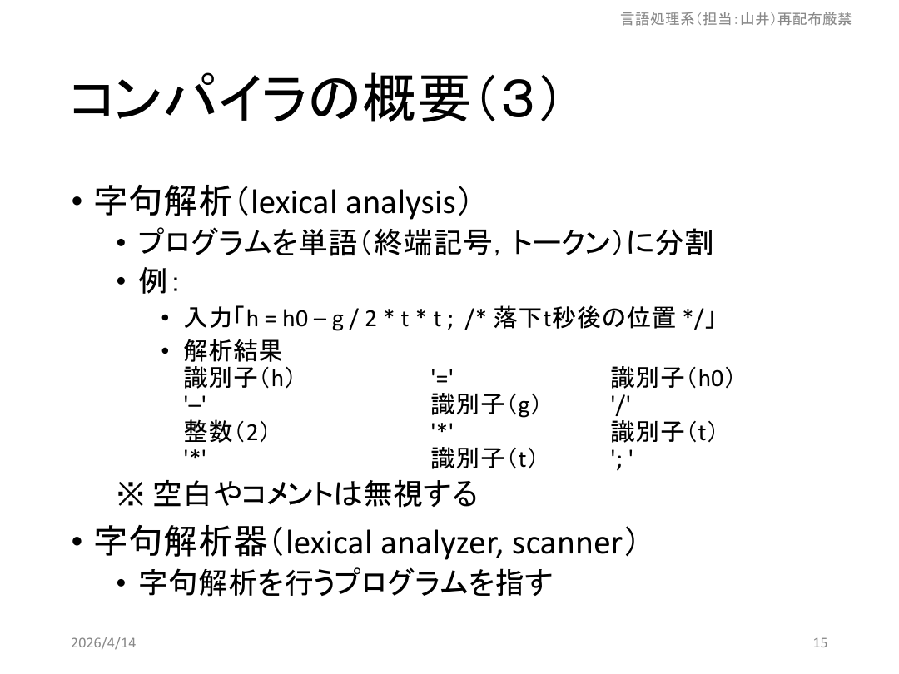

## 言語処理系202601_p016
<!-- source: 言語処理系202601.pdf page 16 -->

コンパイラの概要（４）
• 構文解析（syntactic analysis, parsing）
• 構文規則（文法）に基づいて入力文の構造を決定
• 例：入力「h = h0 – g / 2 * t * t」に対する構文木
【注意】C言語の実際の文法とは多少異なる
式
識別子
h
式
式
項
項
=
–
項
因子
識別子
h0
*
因子
因子
識別子
g
識別子
t
項
*
因子
識別子
t
項
/
因子
整数
2
左辺値
言語処理系（担当：山井）再配布厳禁
16
2026/4/14

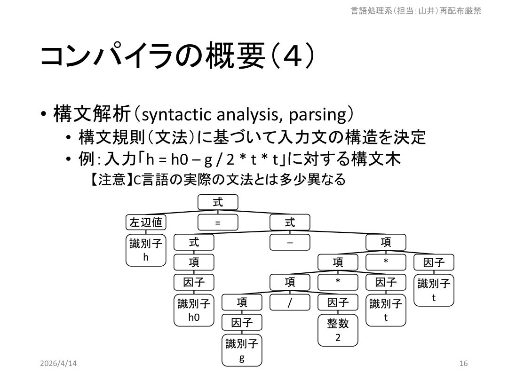

## 言語処理系202601_p017
<!-- source: 言語処理系202601.pdf page 17 -->

コンパイラの概要（５）
• 意味解析（semantic analysis）
• 変数の型，未定義，二重定義などの検査
• 数式の型の自動変換など
変数gはdouble型
double型の除算
double型への
キャストが必要
=
–
h0
*
*
t
/
t
g
(double)
h
2
言語処理系（担当：山井）再配布厳禁
17
2026/4/14

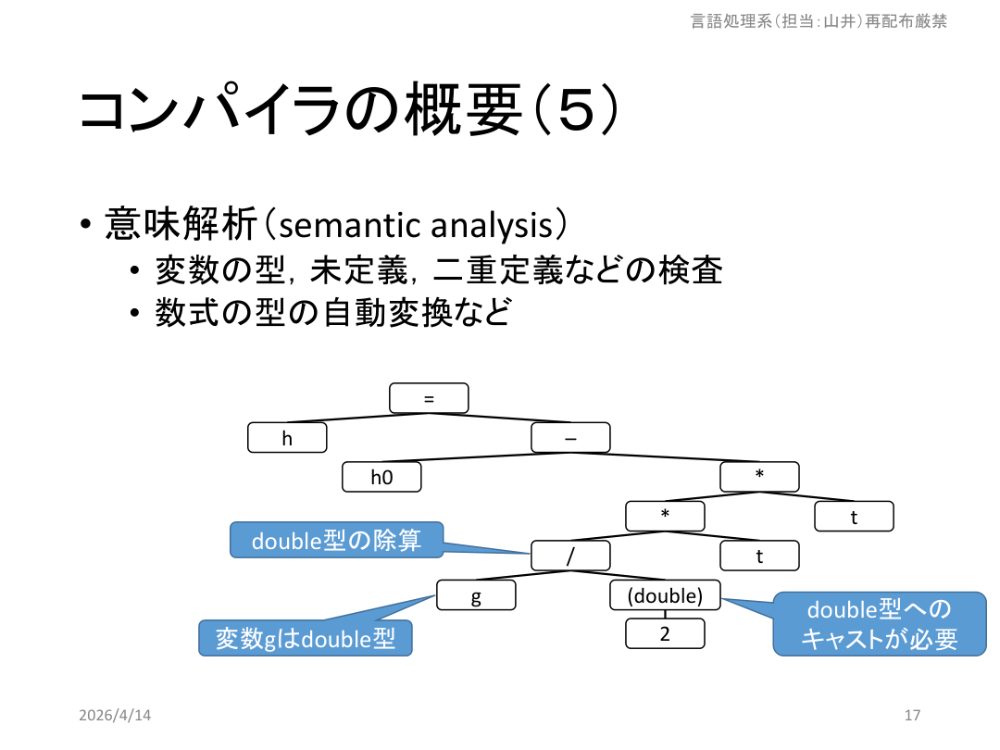

## 言語処理系202601_p018
<!-- source: 言語処理系202601.pdf page 18 -->

コンパイラの概要（６）
• 中間コード生成
• ハードウェアに依存しないコードを生成
• 4つ組（3番地コード(three address code) ）表現を多用
• （演算子，引数1，引数2，結果の格納先）
• 例：
(dbl, 2, nil, temp1)
// 'dbl' はdouble型への変換
// 'nil' は引数がないことを表現
(ddiv, g, temp1, temp2)
// 'ddiv' はdouble型の除算
(dmul, temp2, t, temp3)
// 'dmul' はdouble型の乗算
(dmul, temp3, t, temp4)
(dsub, h0, temp4, h)
// 'dsub' はdouble型の減算
言語処理系（担当：山井）再配布厳禁
18
2026/4/14

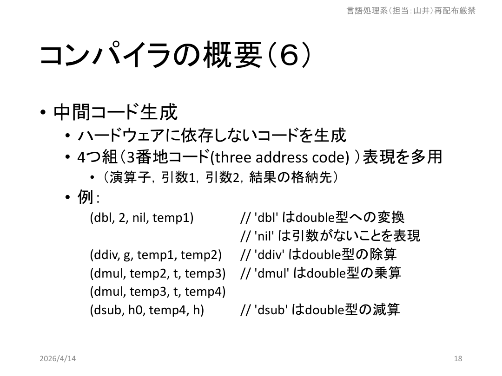

## 言語処理系202601_p019
<!-- source: 言語処理系202601.pdf page 19 -->

コンパイラの概要（７）
• コード最適化
• 中間コード（あるいは機械語）をより高速に，
メモリ使用量をより削減するように変更
• 例：
(dmul, g, 0.5, temp1)
(dmul, temp1, t, temp1)
(dmul, temp1, t, temp1)
(dsub, h0, temp1, h)
int型定数2をdoubleにキャストしてから割ったり，
double型定数2.0で割ったりするより，double型
定数0.5を掛けるほうが高速
変数temp1, temp2, temp3, temp4はいずれも
1回しか参照されないため，値を残す必要なし
→ temp1の上書きによりメモリ使用量削減
変数temp1, temp2, temp3, temp4はいずれも
1回しか参照されないため，値を残す必要なし
→ temp1の上書きによりメモリ使用量削減
言語処理系（担当：山井）再配布厳禁
19
2026/4/14

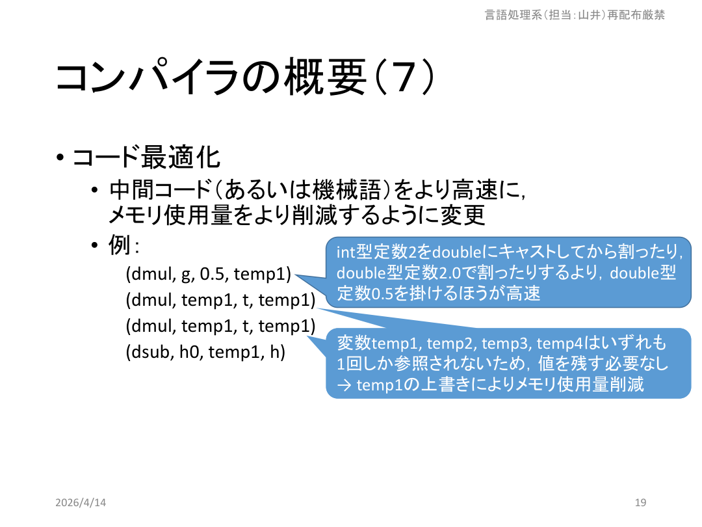

## 言語処理系202601_p020
<!-- source: 言語処理系202601.pdf page 20 -->

コンパイラの概要（８）
• 目的コード生成
• ハードウェアに依存した再配置可能コードを出力
• 例（x86-64アーキテクチャの場合）
movsd .LC2(%rip), %xmm0 ; 0.5をレジスタxmm0に格納
mulsd g(%rip), %xmm0
; 0.5*gをレジスタxmm0に格納
movsd t(%rip), %xmm1
; 変数tをレジスタxmm1に格納
mulsd %xmm1, %xmm0
; xmm0*xmm1をxmm0に格納
mulsd %xmm1, %xmm0
; xmm0*xmm1をxmm0に格納
movsd h0(%rip), %xmm2
; 変数h0をレジスタxmm2に格納
subsd %xmm0, %xmm2
; xmm0 – xmm2をxmm2に格納
movsd %xmm2, h(%rip)
; xmm2を変数hに格納
…
.LC2
.long   0
.long   1071644672
;  double型0.5の10進表記
ripは64ビットプログラムカウンタ
この表記で再配置可能の目的コードを生成
言語処理系（担当：山井）再配布厳禁
20
2026/4/14

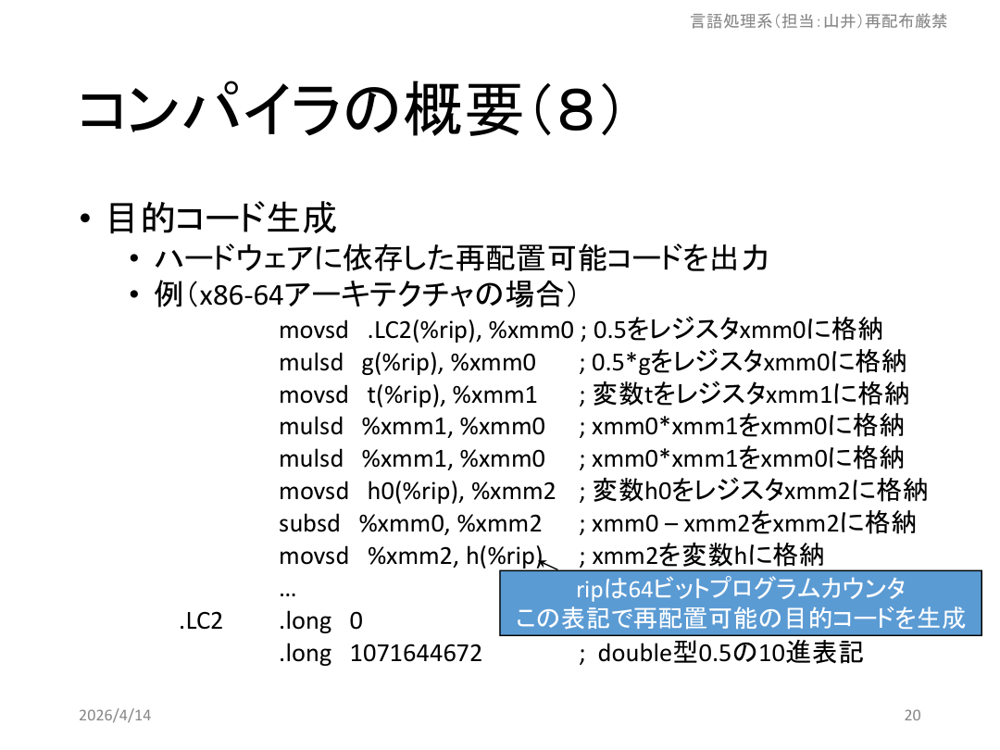

## 言語処理系202601_p021
<!-- source: 言語処理系202601.pdf page 21 -->

コンパイラの概要（９）
• シンボル表管理
• 識別子の名前とその属性（変数名・関数名，型）などの
情報を記録
• 処理系によっては予約語を含める場合も
• シンボル表の例
シンボル名
トークン
型
サイズ
番地
while
WHILE
予約語
-
-
for
FOR
予約語
-
-
main
ID
int(void)
-
0x100401080
count
ID
int
4
0x1004071c0
str
ID
char[]
256
0x1004071c8
言語処理系（担当：山井）再配布厳禁
21
2026/4/14

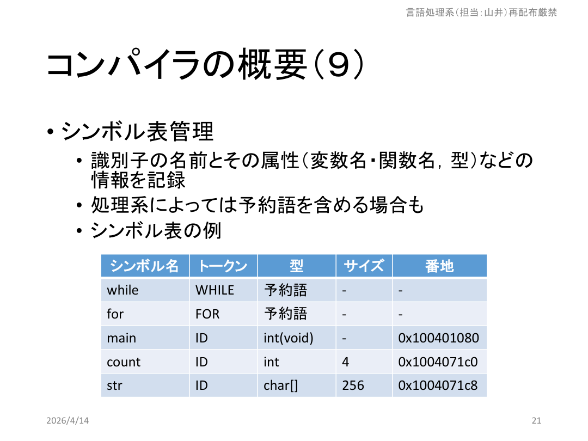

## 言語処理系202601_p022
<!-- source: 言語処理系202601.pdf page 22 -->

コンパイラの概要（１０）
• エラー処理
• 主に構文解析，意味解析の段階で発生
• 目的コード生成の際にも発生（リンクエラー）
• 字句解析の段階では稀
• C言語の場合，@，$などが文字列内以外で使われるとエラー
• 最初のエラー発見時にストップするのは不親切
• できる限り処理を続け，他のエラーも発見すべき
• エラーである理由も適切に表示すべき
• 警告メッセージを表示して処理を継続する場合も
• あらゆるエラーを想定する必要があるため，結構困難
言語処理系（担当：山井）再配布厳禁
22
2026/4/14

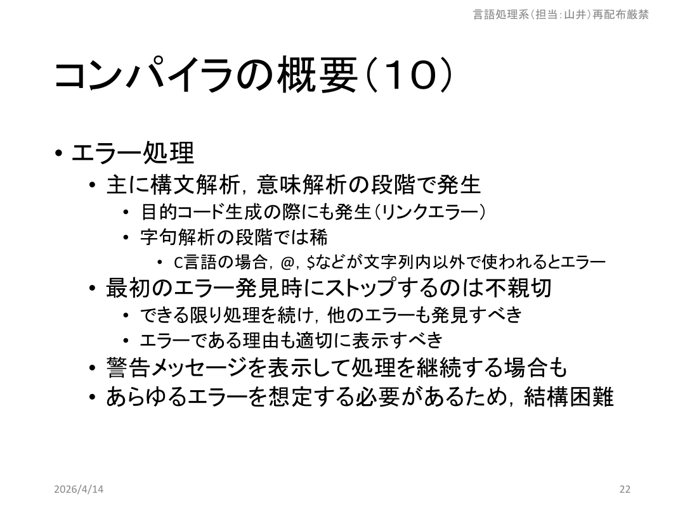

## 言語処理系202601_p023
<!-- source: 言語処理系202601.pdf page 23 -->

コンパイラ生成ツール（１）
• 言語の定義情報からコンパイラを自動生成する
プログラム（トランスレータ）
• 実際には完全な自動生成はまだ難しい
• コンパイラジェネレータ（compiler generator）とも
• 実用化されているのは2種類
• 字句解析器生成ツール
• レキシカルアナライザジェネレータ（lexical analyzer generator）
• 構文解析器生成ツール
• パーサジェネレータ（parser generator）
言語処理系（担当：山井）再配布厳禁
23
2026/4/14

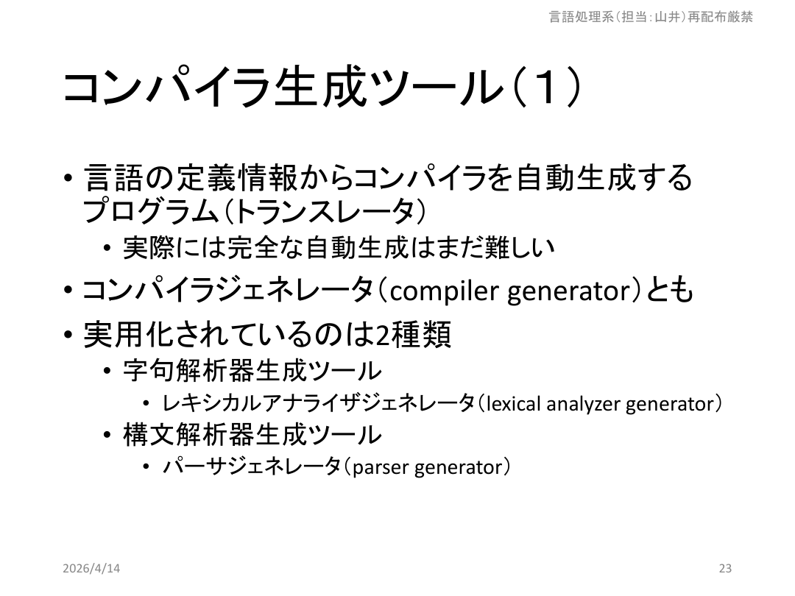

## 言語処理系202601_p024
<!-- source: 言語処理系202601.pdf page 24 -->

コンパイラ生成ツール（２）
• 字句解析器生成ツール
• lex（lexical analyzer generator）
• UNIX標準コマンド
• POSIX（Portable Operating System Interface）標準
• POSIX: OS互換性を担保するための規格
• flex（fast lexical analyzer generator）
• lexの機能拡張・無料・オープンソフトウェア版
言語処理系（担当：山井）再配布厳禁
24
2026/4/14

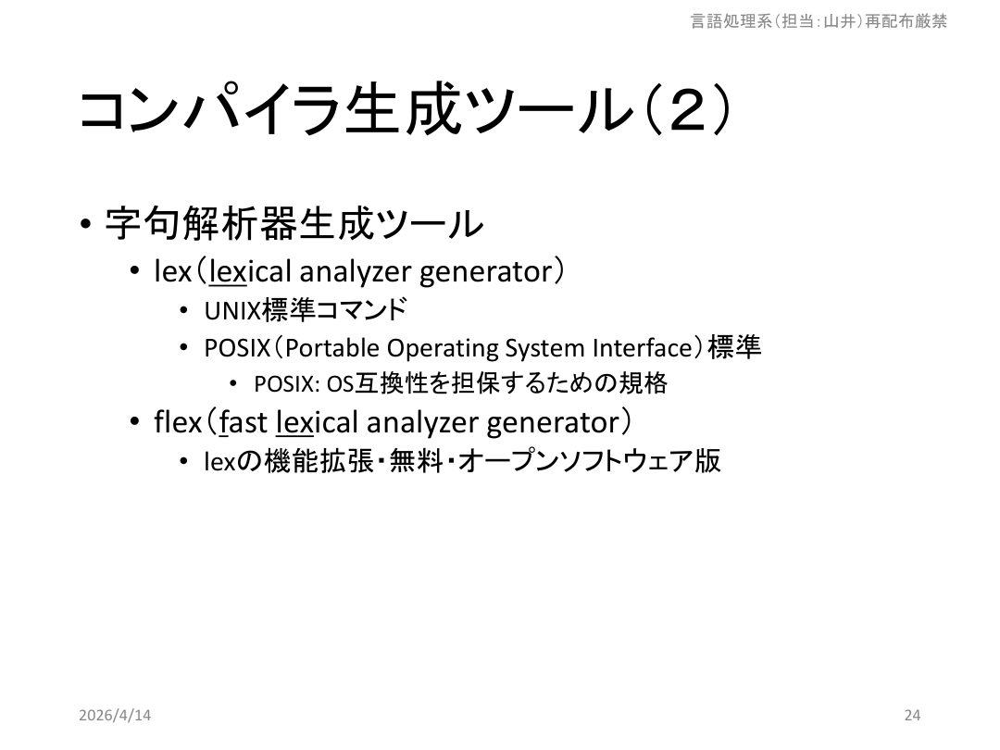

## 言語処理系202601_p025
<!-- source: 言語処理系202601.pdf page 25 -->

コンパイラ生成ツール（３）
• 構文解析器生成ツール
• yacc（yet another compiler compiler）
• UNIX標準コマンド
• POSIX標準
• bison
• yaccが動物のヤク（yak）に似ていることから命名
• yaccの機能拡張・無料・オープンソフトウェア版
言語処理系（担当：山井）再配布厳禁
25
2026/4/14

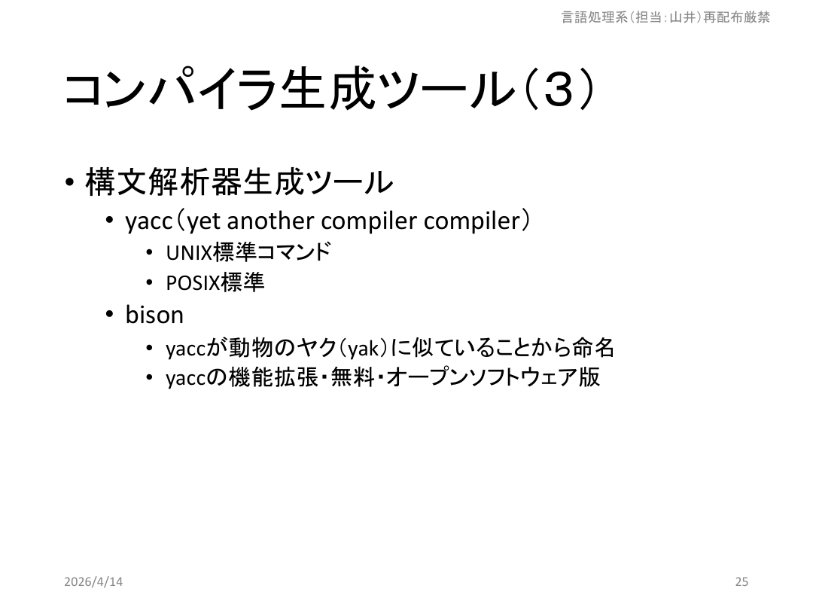

## 言語処理系202601_p026
<!-- source: 言語処理系202601.pdf page 26 -->

本日の課題
• 次のプログラムのアセンブリプログラムを求めよ
#include <stdio.h>
int main(void){
printf("hello, world¥n");
  return 0;
}
• 期限： 4/27（月） 23:59
• Google Classroomで提出
2026/4/14
言語処理系（担当：山井）再配布厳禁
26

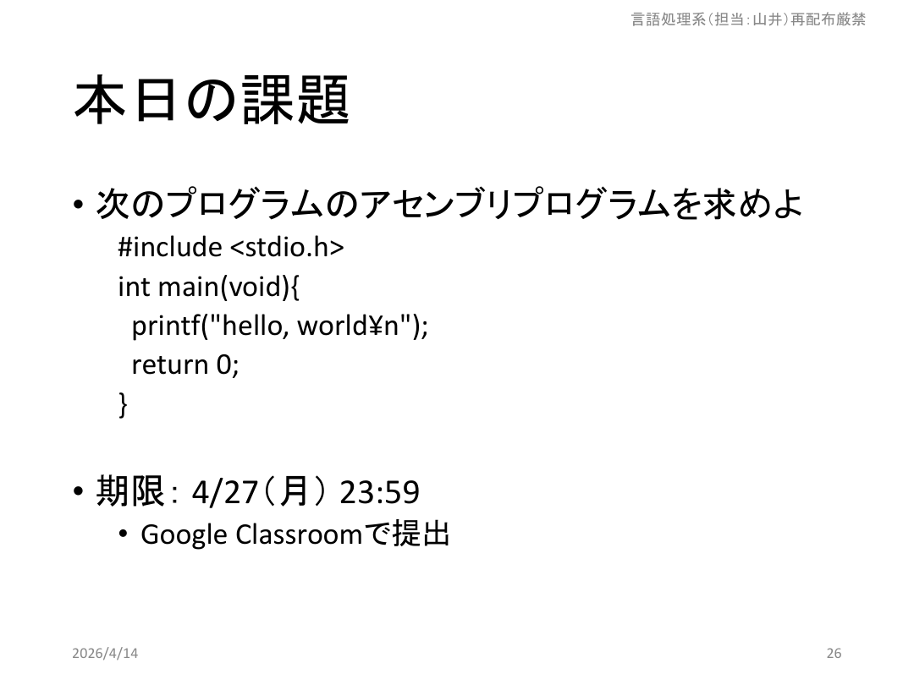
