# 言語処理系202602

<!-- source: 言語処理系202602.pdf -->

## 言語処理系202602_p001
<!-- source: 言語処理系202602.pdf page 1 -->

言語処理系
前半第2回形式言語理論
山井成良（前半担当）
nyamai@cc.tuat.ac.jp
注意事項
授業で提供される動画や資料など，あるいは授業の様子を録画，
録音，撮影したものを，SNSやWebサーバなどで共有あるいは公開
すると，情報倫理に反することとして本学の懲戒等の対象になり
得るばかりか，著作物の権利侵害など民事的・刑事的な罰則等の
対象になる可能性があるので，絶対に行わないでください．

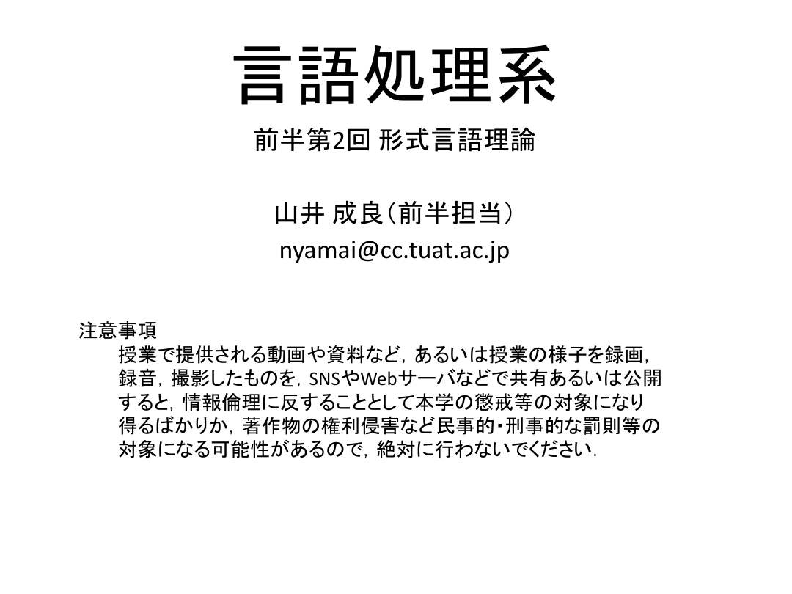

## 言語処理系202602_p002
<!-- source: 言語処理系202602.pdf page 2 -->

形式言語理論（１）
• 形式言語（formal language）
• 形式文法により定義された言語
• 計算機モデル（オートマトン）と密接な関係
• 形式文法（句構造文法）
• 𝐺𝐺= 𝑁𝑁, 𝛴𝛴, 𝑆𝑆, 𝑃𝑃で定義
• 𝑁𝑁： 非終端記号の有限集合（𝑁𝑁∩𝛴𝛴= 𝜑𝜑）
• 非終端記号（Nonterminal Symbol）： 記号列に置換できる記号
• 𝛴𝛴： アルファベット（終端記号の有限集合）
• 終端記号（Terminal Symbol）： 文を構成する記号
• 𝑆𝑆： 開始記号（𝑆𝑆∈𝑁𝑁）
• 𝑃𝑃： 生成規則の有限集合
• 生成規則： 𝛼𝛼→𝛽𝛽𝛼𝛼∈𝑁𝑁∪𝛴𝛴∗𝐴𝐴𝑁𝑁∪𝛴𝛴∗, 𝐴𝐴∈𝑁𝑁, 𝛽𝛽∈𝑁𝑁∪𝛴𝛴∗
※ 「
∗」はクリーネ閉包（0個以上の連接）を表す演算子（クリーネスター）
2026/4/21
言語処理系（担当：山井）再配布厳禁
2

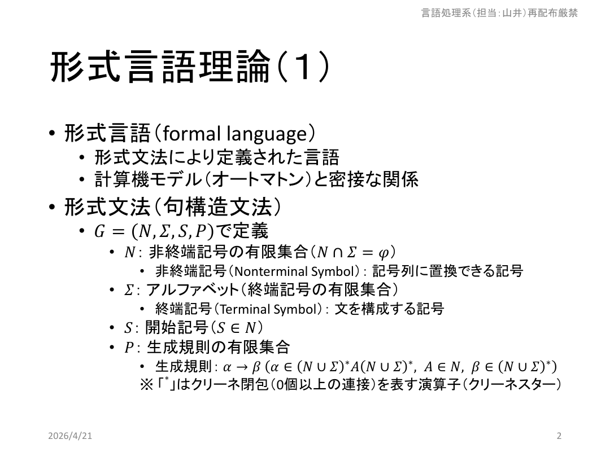

## 言語処理系202602_p003
<!-- source: 言語処理系202602.pdf page 3 -->

形式言語理論（２）
• 形式文法の例
• 𝐺𝐺= 𝑁𝑁, 𝛴𝛴, 𝑆𝑆, 𝑃𝑃
• 𝑁𝑁= 𝑆𝑆, 𝐵𝐵
• 𝛴𝛴= 𝑎𝑎, 𝑏𝑏, 𝑐𝑐
• 𝑃𝑃= {𝑆𝑆→𝜀𝜀, 𝑆𝑆→𝑎𝑎𝑎𝑎𝑎𝑎, 𝑆𝑆→𝑎𝑎𝑎𝑎𝑎𝑎𝑎𝑎, 𝐵𝐵𝐵𝐵→𝑎𝑎𝑎𝑎, 𝐵𝐵𝐵𝐵→𝑏𝑏𝑏𝑏}
※ 𝜀𝜀 は空文字列
• 文法𝐺𝐺により生成される文の例
• 𝑆𝑆⇒പ𝜀𝜀
• 𝑆𝑆⇒𝑎𝑎𝑎𝑎𝑎𝑎
• 𝑆𝑆⇒𝑎𝑎𝑎𝑎𝑆𝑆𝑐𝑐⇒𝑎𝑎𝐵𝐵𝑎𝑎𝑏𝑏𝑏𝑏𝑐𝑐⇒𝑎𝑎𝑎𝑎𝐵𝐵𝑏𝑏𝑐𝑐𝑐𝑐⇒𝑎𝑎𝑎𝑎𝑏𝑏𝑏𝑏𝑐𝑐𝑐𝑐(= 𝑎𝑎2𝑏𝑏2𝑐𝑐2)
• 𝑆𝑆⇒𝑎𝑎𝑎𝑎𝑆𝑆𝑐𝑐⇒𝑎𝑎𝑎𝑎𝑎𝑎𝑎𝑎𝑆𝑆𝑐𝑐𝑐𝑐⇒𝑎𝑎𝑎𝑎𝑎𝑎𝐵𝐵𝑎𝑎𝑏𝑏𝑏𝑏𝑐𝑐𝑐𝑐⇒𝑎𝑎𝐵𝐵𝑎𝑎𝑎𝑎𝐵𝐵𝑏𝑏𝑐𝑐𝑐𝑐𝑐𝑐⇒
𝑎𝑎𝐵𝐵𝐵𝐵𝑎𝑎𝑏𝑏𝑏𝑏𝑐𝑐𝑐𝑐𝑐𝑐⇒𝑎𝑎𝑎𝑎𝐵𝐵𝑎𝑎𝑏𝑏𝑏𝑏𝑏𝑏𝑏𝑏𝑏𝑏⇒𝑎𝑎𝑎𝑎𝑎𝑎𝐵𝐵𝑏𝑏𝑏𝑏𝑏𝑏𝑏𝑏𝑏𝑏⇒𝑎𝑎𝑎𝑎𝑎𝑎𝑏𝑏𝑏𝑏𝑏𝑏𝑏𝑏𝑏𝑏𝑏𝑏= 𝑎𝑎3𝑏𝑏3𝑐𝑐3
※ 赤文字は置換え対象の記号列，下線は置換え後の記号列を表す
2026/4/21
言語処理系（担当：山井）再配布厳禁
3
1ステップでの導出

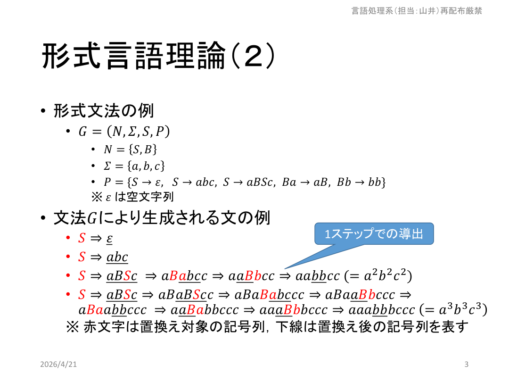

## 言語処理系202602_p004
<!-- source: 言語処理系202602.pdf page 4 -->

形式言語理論（３）
• 導出（derivation）
• 𝛼𝛼1 ⇒𝛼𝛼2 ⇒⋯⇒𝛼𝛼𝑛𝑛𝑛𝑛≥0 のとき，
𝛼𝛼1 ⇒
∗𝛼𝛼𝑛𝑛 （0ステップ以上での導出）
• 𝛼𝛼1 ⇒𝛼𝛼2 ⇒⋯⇒𝛼𝛼𝑛𝑛𝑛𝑛≥1 のとき，
𝛼𝛼1 ⇒
+ 𝛼𝛼𝑛𝑛 （1ステップ以上での導出）
• 文法𝐺𝐺により生成される言語𝐿𝐿(𝐺𝐺)の定義
• 𝐿𝐿𝐺𝐺= 𝜔𝜔𝜔𝜔∈𝛴𝛴∗, 𝑆𝑆⇒
∗𝜔𝜔
• 開始記号から導出可能な終端記号列の集合
• 例：前頁の文法𝐺𝐺により生成される言語𝐿𝐿(𝐺𝐺)
• 𝐿𝐿𝐺𝐺= 𝑎𝑎𝑛𝑛𝑏𝑏𝑛𝑛𝑐𝑐𝑛𝑛𝑛𝑛≥0
2026/4/21
言語処理系（担当：山井）再配布厳禁
4

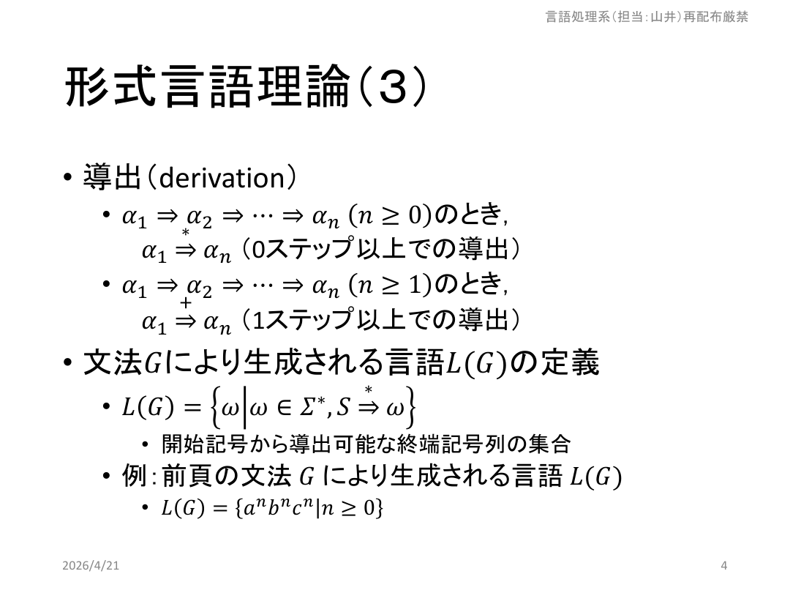

## 言語処理系202602_p005
<!-- source: 言語処理系202602.pdf page 5 -->

形式言語理論（４）
• チョムスキー階層
• 形式文法の制限による言語クラスの包含関係
• 1956年にNoam Chomskyが発表
• 𝐴𝐴, 𝐵𝐵∈𝑁𝑁, 𝑎𝑎∈Σ, 𝛼𝛼, 𝛽𝛽∈𝑁𝑁∪Σ ∗, 𝛾𝛾∈𝑁𝑁∪Σ +
• Type 0 ⊋Type 1 ⊋Type 2 ⊋Type 3が成立
2026/4/21
言語処理系（担当：山井）再配布厳禁
5
階層
言語クラス
文法
生成規則
オートマトン
Type 0
帰納的可算言語
句構造文法
𝛼𝛼→𝛽𝛽（制限なし）
チューリングマシン
Type 1
文脈依存言語
文脈依存文法
𝛼𝛼𝛼𝛼𝛼𝛼→𝛼𝛼𝛼𝛼𝛼𝛼
線形有界オートマトン
Type 2
文脈自由言語
文脈自由文法
𝐴𝐴→𝛼𝛼
プッシュダウンオートマトン
Type 3
正規言語
正規文法
𝐴𝐴→𝑎𝑎
または
𝐴𝐴→𝑎𝑎𝑎𝑎
有限オートマトン

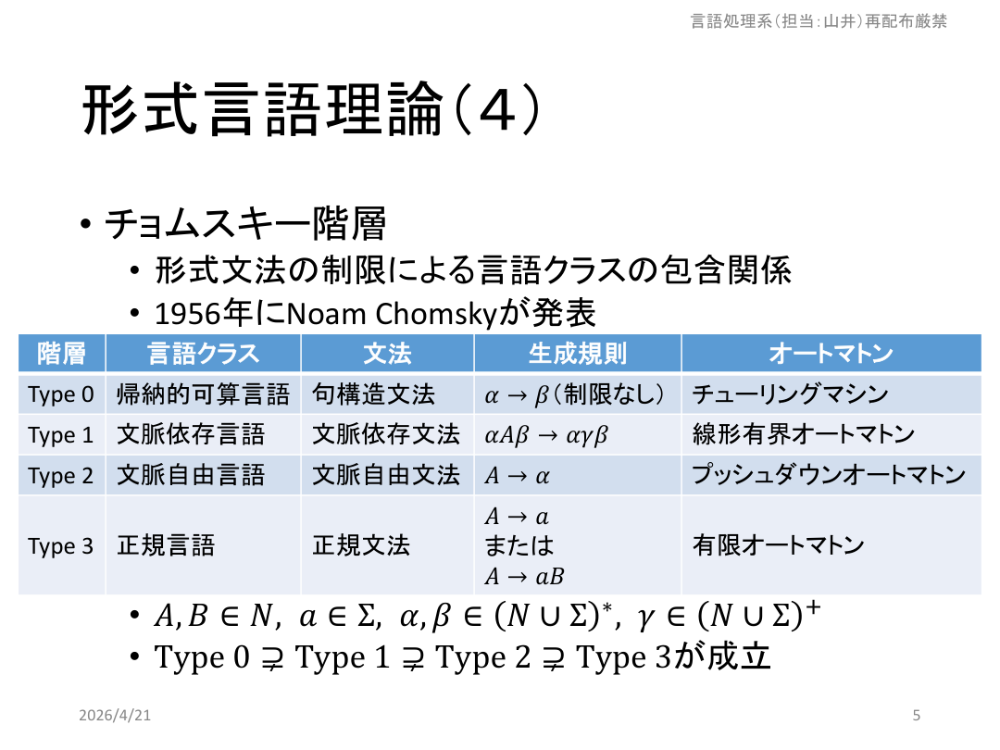

## 言語処理系202602_p006
<!-- source: 言語処理系202602.pdf page 6 -->

チューリングマシン（１）
• 計算機を単純化・理想化した仮想機械
• イギリスの数学者Alan Turingが1936年に発表
• 基本的な構造
• 有限制御部
• 状態の有限集合
• 初期状態と受理状態あり
• 入力テープ
• 左端のみ存在
• 長さ無限大
• 初期状態で入力を格納
• テープヘッド
• 入力テープの読み書きに使用
• 左右に1つ移動可
2026/4/21
言語処理系（担当：山井）再配布厳禁
6
$
a0
a1
a2
a3
a4
B
B
B
B
B
…
有限
制御部
入力
空白記号
終端マーカ
（ない場合も）

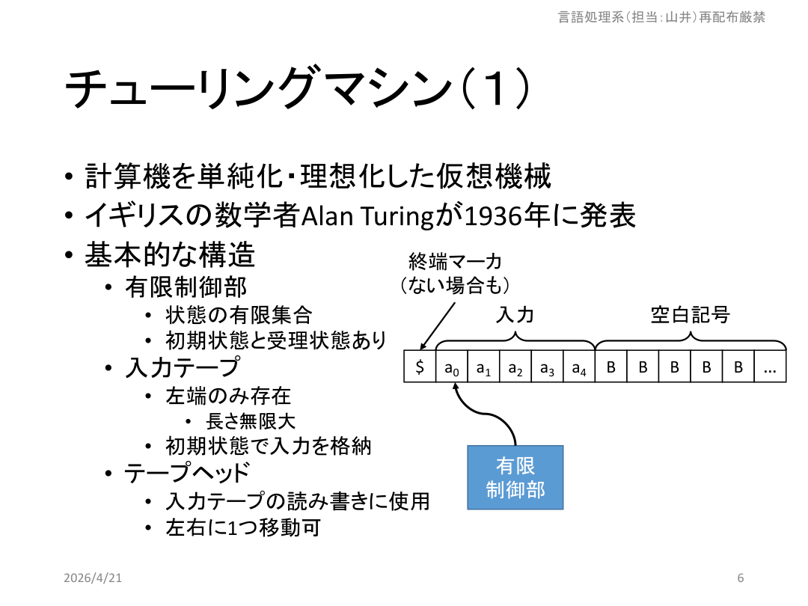

## 言語処理系202602_p007
<!-- source: 言語処理系202602.pdf page 7 -->

チューリングマシン（２）
• 形式的定義
• 𝑀𝑀= (𝑄𝑄, 𝛴𝛴, 𝛤𝛤, 𝛿𝛿, 𝑞𝑞0, 𝐵𝐵, 𝐹𝐹)の7つ組で定義
• 𝑄𝑄: 状態の有限集合
• 𝛴𝛴: 入力記号の集合（入力アルファベット）
• 𝛤𝛤: テープ記号の集合（テープアルファベット）（𝛴𝛴⊂𝛤𝛤）
• 𝛿𝛿: 遷移関数（𝑄𝑄× 𝛤𝛤→𝑄𝑄× 𝛤𝛤× {𝐿𝐿, 𝑅𝑅} ）
• 入力：（現在の状態，テープヘッド位置の記号）
• 出力：（次の状態，書換え後の記号，テープヘッドの移動方向）
• 𝑞𝑞0: 初期状態（𝑞𝑞0 ∈𝑄𝑄）
• 𝐵𝐵: 空白記号（𝐵𝐵∈𝛤𝛤−𝛴𝛴）
• 𝐹𝐹: 受理状態（𝐹𝐹⊆𝑄𝑄）
• 𝛿𝛿(𝑞𝑞, 𝑋𝑋)が未定義であればTM 𝑀𝑀は停止
• そのとき𝑞𝑞∈𝐹𝐹なら受理，そうでなければ不受理
2026/4/21
言語処理系（担当：山井）再配布厳禁
7
直積
写像

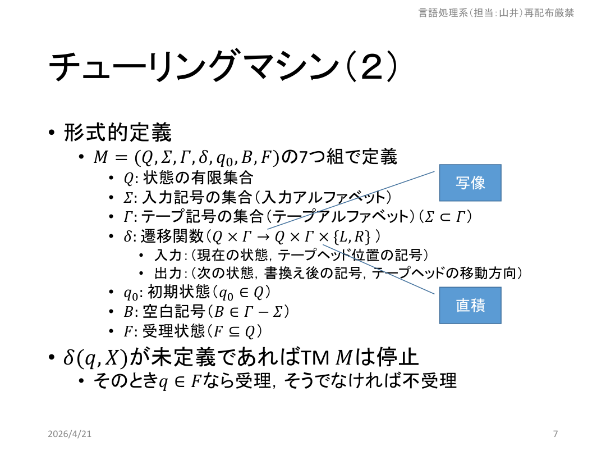

## 言語処理系202602_p008
<!-- source: 言語処理系202602.pdf page 8 -->

チューリングマシン（３）
• 例：𝐿𝐿= 𝑤𝑤𝑤𝑤𝑅𝑅𝑤𝑤∈0,1 ∗}を受理するTM 𝑀𝑀
※ 𝑤𝑤𝑅𝑅: 𝑤𝑤を反転させた文字列
• 𝑀𝑀= { 𝑞𝑞0, 𝑞𝑞1, … , 𝑞𝑞7 , 0,1 , 0,1, 𝐵𝐵, 𝛿𝛿, 𝑞𝑞0, 𝐵𝐵, 𝑞𝑞7 }
2026/4/21
言語処理系（担当：山井）再配布厳禁
8
状態
0
1
B
𝑞𝑞0
(𝑞𝑞1, 𝐵𝐵, 𝑅𝑅)
(𝑞𝑞4, 𝐵𝐵, 𝑅𝑅)
(𝑞𝑞7, 𝐵𝐵, 𝑅𝑅)
𝑞𝑞1
(𝑞𝑞1, 0, 𝑅𝑅)
(𝑞𝑞1, 1, 𝑅𝑅)
(𝑞𝑞2, 𝐵𝐵, 𝐿𝐿)
𝑞𝑞2
(𝑞𝑞3, 𝐵𝐵, 𝐿𝐿)
−
−
𝑞𝑞3
(𝑞𝑞3, 0, 𝐿𝐿)
(𝑞𝑞3, 1, 𝐿𝐿)
(𝑞𝑞0, 𝐵𝐵, 𝑅𝑅)
𝑞𝑞4
(𝑞𝑞4, 0, 𝑅𝑅)
(𝑞𝑞4, 1, 𝑅𝑅)
(𝑞𝑞5, 𝐵𝐵, 𝐿𝐿)
𝑞𝑞5
−
(𝑞𝑞6, 𝐵𝐵, 𝐿𝐿)
−
𝑞𝑞6
(𝑞𝑞6, 0, 𝐿𝐿)
(𝑞𝑞6, 1, 𝐿𝐿)
(𝑞𝑞0, 𝐵𝐵, 𝑅𝑅)
𝑞𝑞7
−
−
−

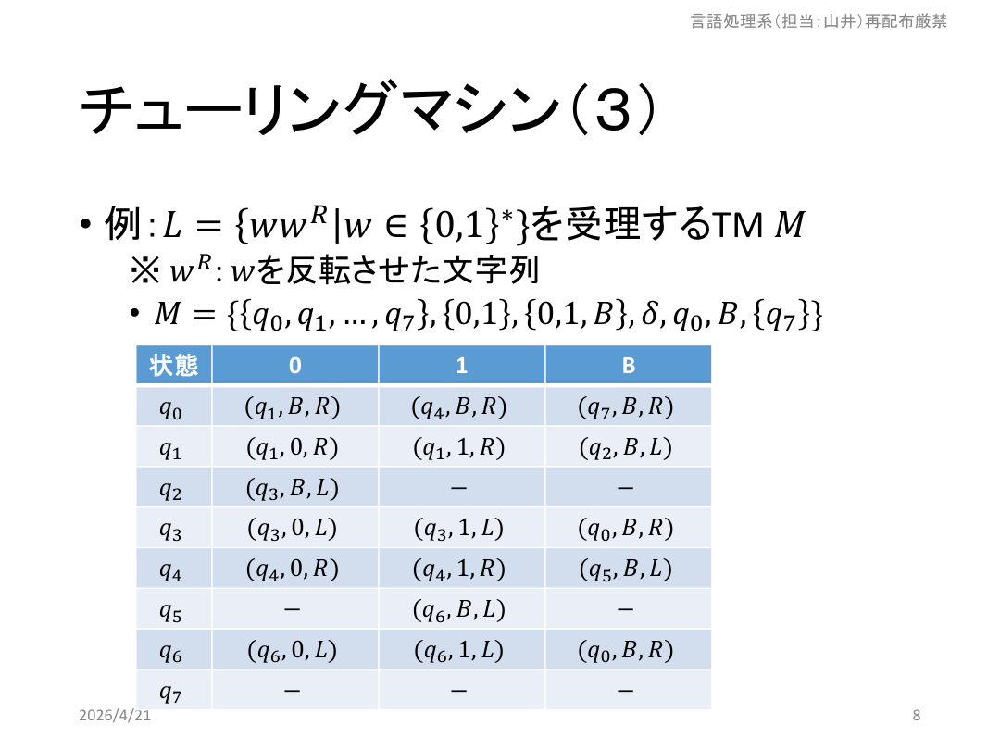

## 言語処理系202602_p009
<!-- source: 言語処理系202602.pdf page 9 -->

チューリングマシン（４）
• 様相（configuration）
• 時点表示（Instantaneous Description）とも呼ぶ
• 「𝑋𝑋1𝑋𝑋2 … 𝑋𝑋𝑖𝑖−1𝑞𝑞𝑋𝑋𝑖𝑖𝑋𝑋𝑖𝑖+1 … 𝑋𝑋𝑛𝑛」で表現
• 𝑋𝑋1𝑋𝑋2 … 𝑋𝑋𝑖𝑖−1: テープヘッドから左側のテープ記号列
• $を使う場合でも省略
• 𝑞𝑞: 現在の状態
• 𝑋𝑋𝑖𝑖: テープヘッド上の記号
• 𝑋𝑋𝑖𝑖+1 … 𝑋𝑋𝑛𝑛: テープヘッドから右側のテープ記号列
• 最も右にある非空白記号まで
• 様相𝐶𝐶1から様相𝐶𝐶2への導出
• 𝐶𝐶1 ⊢𝐶𝐶2（1ステップの場合）
• 𝐶𝐶1 ⊢
∗𝐶𝐶2（0ステップ以上の場合）
2026/4/21
言語処理系（担当：山井）再配布厳禁
9

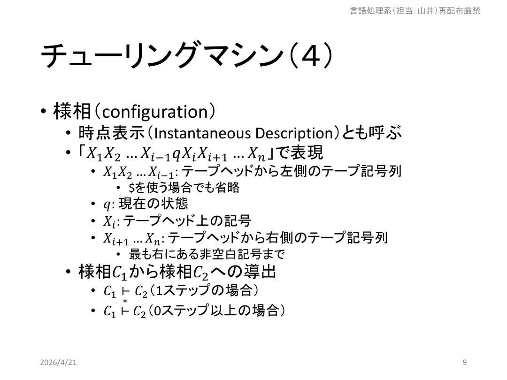

## 言語処理系202602_p010
<!-- source: 言語処理系202602.pdf page 10 -->

チューリングマシン（５）
• 動作例：前述のTM 𝑀𝑀に入力”1001”を与えた場合
の動作
𝑞𝑞01001 ⊢𝐵𝐵𝐵𝐵4001 ⊢𝐵𝐵0𝑞𝑞401
⊢𝐵𝐵00𝑞𝑞41 ⊢𝐵𝐵𝐵𝐵𝐵𝐵𝐵4 ⊢𝐵𝐵𝐵𝐵𝐵𝐵51
⊢𝐵𝐵𝐵𝐵𝐵60 ⊢𝐵𝐵𝐵𝐵600 ⊢𝑞𝑞6𝐵𝐵𝐵𝐵
⊢𝐵𝐵𝐵𝐵000 ⊢𝐵𝐵𝐵𝐵𝑞𝑞10 ⊢𝐵𝐵𝐵𝐵𝐵𝑞𝑞1
⊢𝐵𝐵𝐵𝐵𝑞𝑞20 ⊢𝐵𝐵𝐵𝐵3 ⊢𝐵𝐵𝐵𝐵𝑞𝑞0
⊢𝐵𝐵𝐵𝐵𝐵𝐵𝑞𝑞7（受理）
• 最初と最後の記号が同じ
⇒𝐵𝐵に置換
• 全部𝐵𝐵になれば受理
2026/4/21
言語処理系（担当：山井）再配布厳禁
10
状態
0
1
B
𝑞𝑞0
(𝑞𝑞1, 𝐵𝐵, 𝑅𝑅)
(𝑞𝑞4, 𝐵𝐵, 𝑅𝑅)
(𝑞𝑞7, 𝐵𝐵, 𝑅𝑅)
𝑞𝑞1
(𝑞𝑞1, 0, 𝑅𝑅)
(𝑞𝑞1, 1, 𝑅𝑅)
(𝑞𝑞2, 𝐵𝐵, 𝐿𝐿)
𝑞𝑞2
(𝑞𝑞3, 𝐵𝐵, 𝐿𝐿)
−
−
𝑞𝑞3
(𝑞𝑞3, 0, 𝐿𝐿)
(𝑞𝑞3, 1, 𝐿𝐿)
(𝑞𝑞0, 𝐵𝐵, 𝑅𝑅)
𝑞𝑞4
(𝑞𝑞4, 0, 𝑅𝑅)
(𝑞𝑞4, 1, 𝑅𝑅)
(𝑞𝑞5, 𝐵𝐵, 𝐿𝐿)
𝑞𝑞5
−
(𝑞𝑞6, 𝐵𝐵, 𝐿𝐿)
−
𝑞𝑞6
(𝑞𝑞6, 0, 𝐿𝐿)
(𝑞𝑞6, 1, 𝐿𝐿)
(𝑞𝑞0, 𝐵𝐵, 𝑅𝑅)
𝑞𝑞7
−
−
−

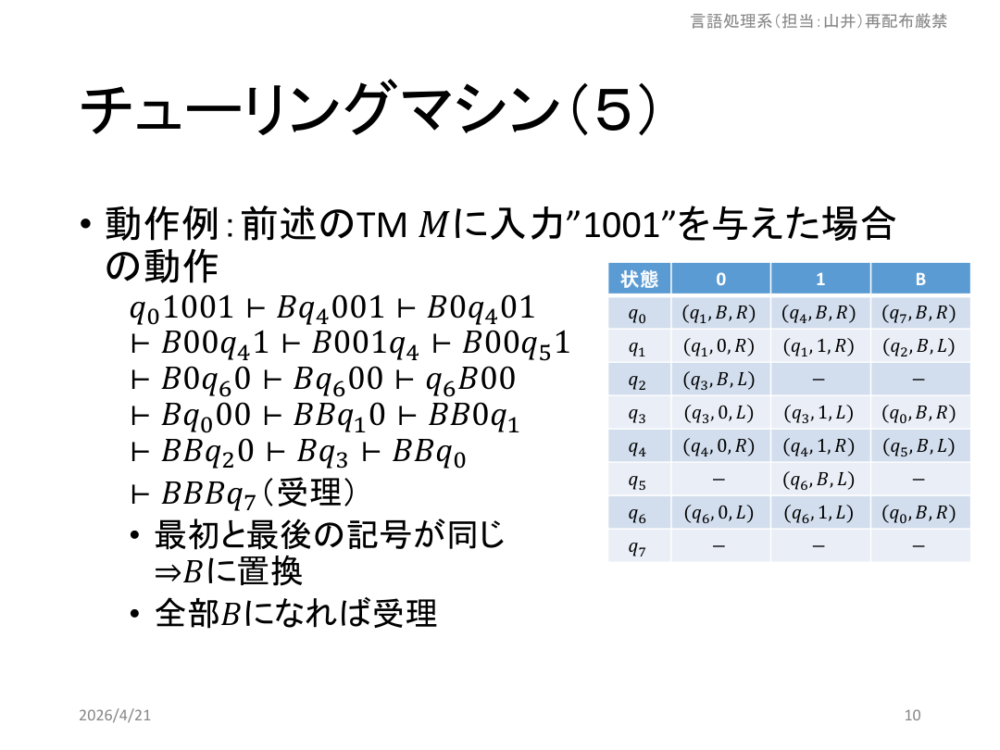

## 言語処理系202602_p011
<!-- source: 言語処理系202602.pdf page 11 -->

チューリングマシン（６）
• 動作例：前述のTM 𝑀𝑀に入力”101”を与えた場合の
動作
𝑞𝑞0101 ⊢𝐵𝐵𝐵𝐵401 ⊢𝐵𝐵0𝑞𝑞41
⊢𝐵𝐵𝐵𝐵𝐵𝐵4 ⊢𝐵𝐵𝐵𝐵𝐵51 ⊢𝐵𝐵𝐵𝐵60
⊢𝑞𝑞6𝐵𝐵𝐵⊢𝐵𝐵𝐵𝐵00 ⊢𝐵𝐵𝐵𝐵𝑞𝑞1
⊢𝐵𝐵𝑞𝑞2（不受理）
2026/4/21
言語処理系（担当：山井）再配布厳禁
11
状態
0
1
B
𝑞𝑞0
(𝑞𝑞1, 𝐵𝐵, 𝑅𝑅)
(𝑞𝑞4, 𝐵𝐵, 𝑅𝑅)
(𝑞𝑞7, 𝐵𝐵, 𝑅𝑅)
𝑞𝑞1
(𝑞𝑞1, 0, 𝑅𝑅)
(𝑞𝑞1, 1, 𝑅𝑅)
(𝑞𝑞2, 𝐵𝐵, 𝐿𝐿)
𝑞𝑞2
(𝑞𝑞3, 𝐵𝐵, 𝐿𝐿)
−
−
𝑞𝑞3
(𝑞𝑞3, 0, 𝐿𝐿)
(𝑞𝑞3, 1, 𝐿𝐿)
(𝑞𝑞0, 𝐵𝐵, 𝑅𝑅)
𝑞𝑞4
(𝑞𝑞4, 0, 𝑅𝑅)
(𝑞𝑞4, 1, 𝑅𝑅)
(𝑞𝑞5, 𝐵𝐵, 𝐿𝐿)
𝑞𝑞5
−
(𝑞𝑞6, 𝐵𝐵, 𝐿𝐿)
−
𝑞𝑞6
(𝑞𝑞6, 0, 𝐿𝐿)
(𝑞𝑞6, 1, 𝐿𝐿)
(𝑞𝑞0, 𝐵𝐵, 𝑅𝑅)
𝑞𝑞7
−
−
−

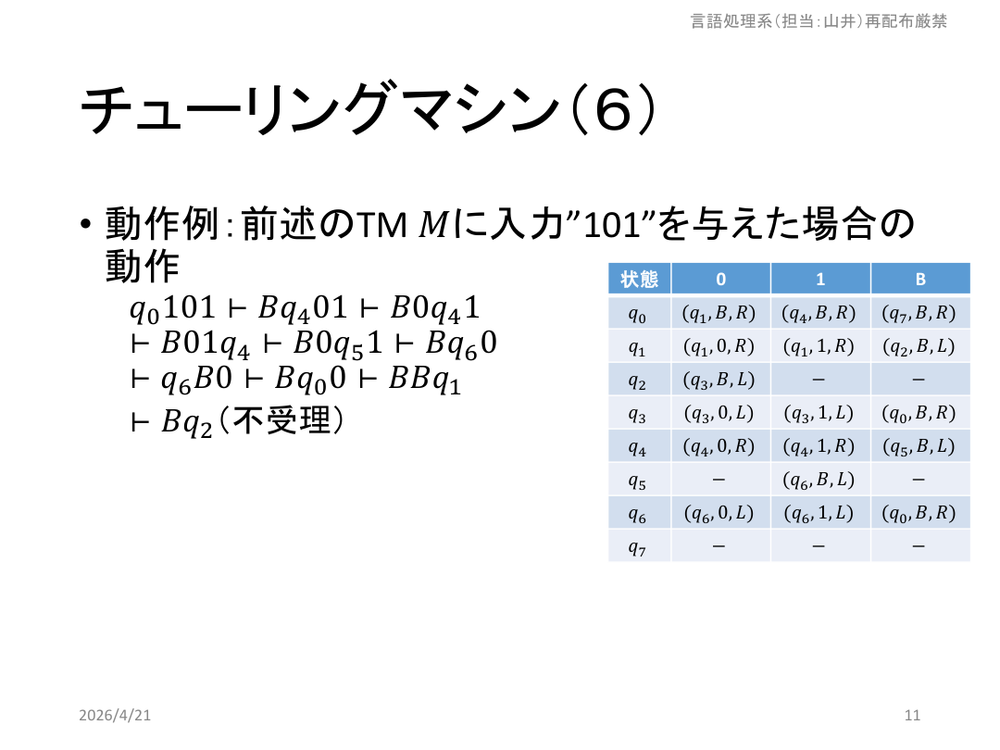

## 言語処理系202602_p012
<!-- source: 言語処理系202602.pdf page 12 -->

チューリングマシン（７）
• TMはフォン・ノイマン型計算機と同じ能力
• チューリング完全（Turing complete）
• 計算万能性（Computation-Universality）とも
• プログラミング言語はチューリング完全
• 意外なプログラム（例：sedコマンド）がチューリング完全
•
https://en.wikipedia.org/wiki/Sed
•
https://catonmat.net/proof-that-sed-is-turing-complete
• 文を受理するかどうかの観点で判断
• テープの使用量や計算時間（導出ステップ数）は不問
• 問題の複雑さを示す基準として利用
• チョムスキー階層
• NP完全（NP complete）⇒次回で詳しく説明
• チャーチ=チューリングのテーゼ
• 「どんな入力でも必ず停止するTMで計算できる関数」
＝「計算可能な関数（アルゴリズム）」
2026/4/21
言語処理系（担当：山井）再配布厳禁
12

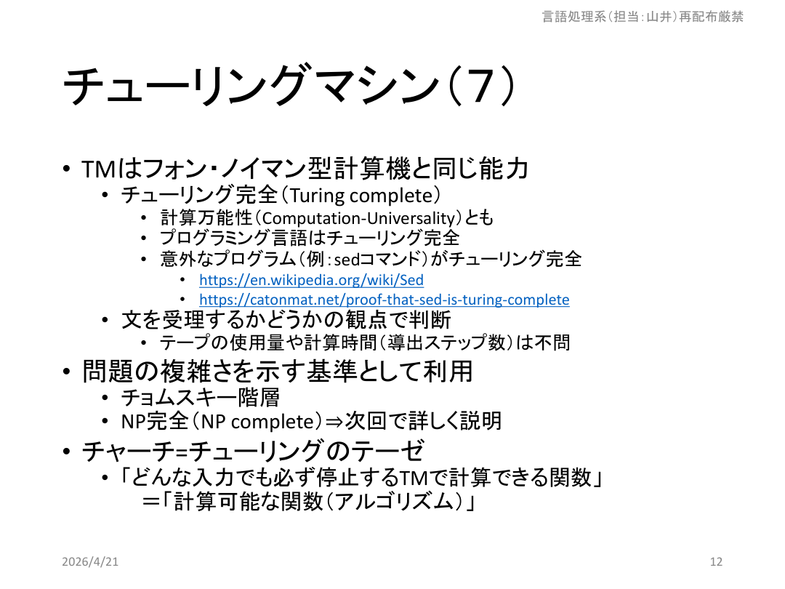

## 言語処理系202602_p013
<!-- source: 言語処理系202602.pdf page 13 -->

無限集合（１）
• いろいろな無限集合
• 自然数全体の集合（ℕ），整数全体の集合（ℤ），
有理数全体の集合（ℚ），実数全体の集合（ℝ），
・・・
• 有限集合の場合
• 集合𝑆𝑆の要素数を𝑆𝑆で表すとすると常に
𝐴𝐴⊂𝐵𝐵⇒𝐴𝐴< 𝐵𝐵 が成り立つ
• 無限集合の場合
• 集合𝑆𝑆に対して𝑆𝑆で「濃度（cardinality）」を表す
• 集合𝐴𝐴と集合𝐵𝐵との間に全単射（1対1対応）が存在
⇒𝐴𝐴= |𝐵𝐵| と定義する
• 𝐴𝐴⊂𝐵𝐵⇒𝐴𝐴< 𝐵𝐵 が成り立つとは限らない（次頁に例）
2026/4/21
言語処理系（担当：山井）再配布厳禁
13

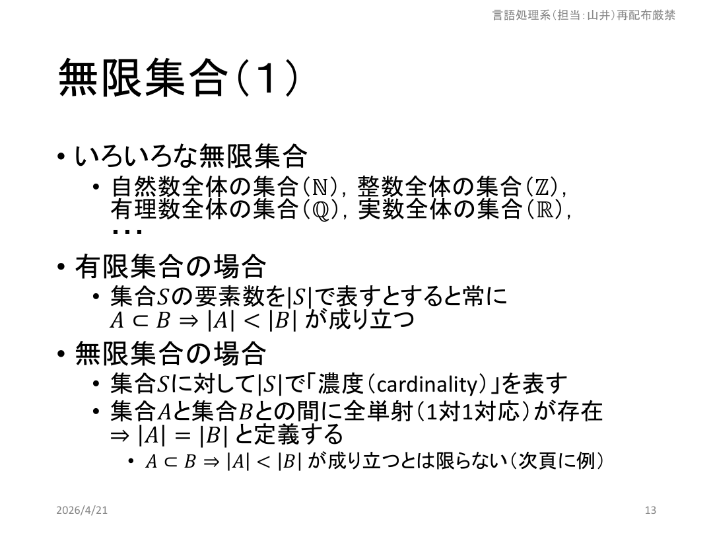

## 言語処理系202602_p014
<!-- source: 言語処理系202602.pdf page 14 -->

無限集合（２）
• 可算（無限）集合（countable set）
• 可付番（無限）集合とも
• 最小の無限集合
• 濃度をℵ0（アレフ・{ノート，ヌル，ゼロ}）と表す
• 自然数全体の集合ℕとの間で全単射が存在
【例】整数全体の集合ℤ
• 明らかに ℤ⊋ℕ
• 自然数全体の集合との間に全単射が存在
例： 1
0, 2
1, 3
−1, 4
2, 5
−2, …

⇒ℤ= |ℕ|
2026/4/21
言語処理系（担当：山井）再配布厳禁
14

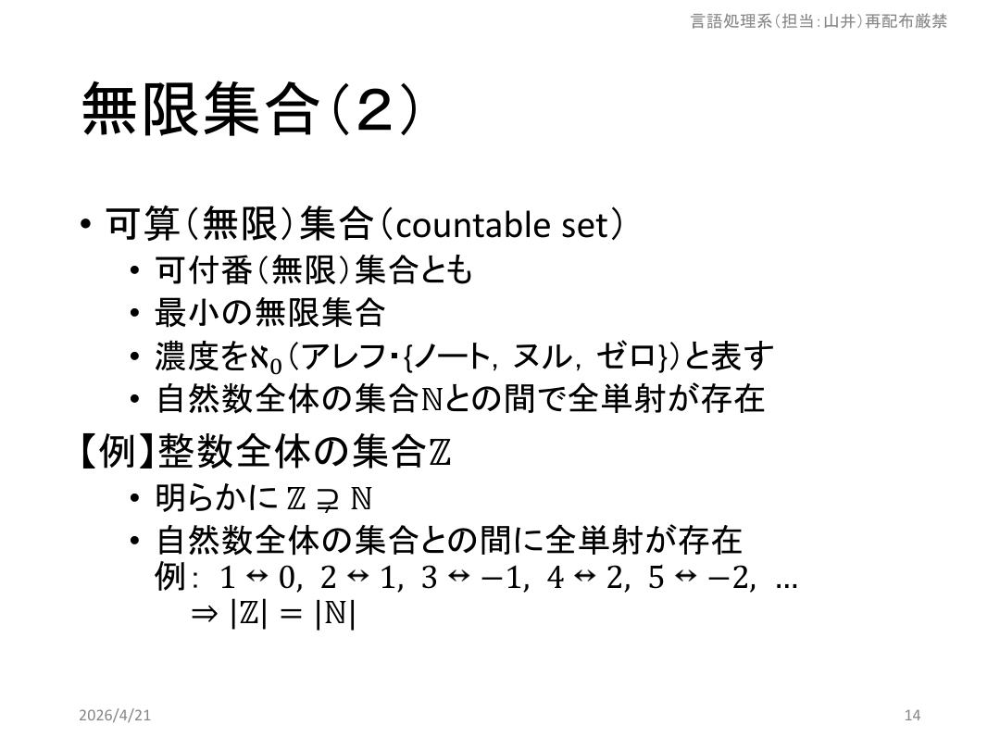

## 言語処理系202602_p015
<!-- source: 言語処理系202602.pdf page 15 -->

無限集合（３）
【例】有理数全体の集合ℚ
• 自然数全体の集合ℕとの
間に全単射が存在
（例：右図で赤の部分は
スキップ．0と負の数は
容易に追加可能）
⇒ℚ= |ℕ|
【参考】ヒルベルトの無限
ホテルのパラドックス
2026/4/21
言語処理系（担当：山井）再配布厳禁
15

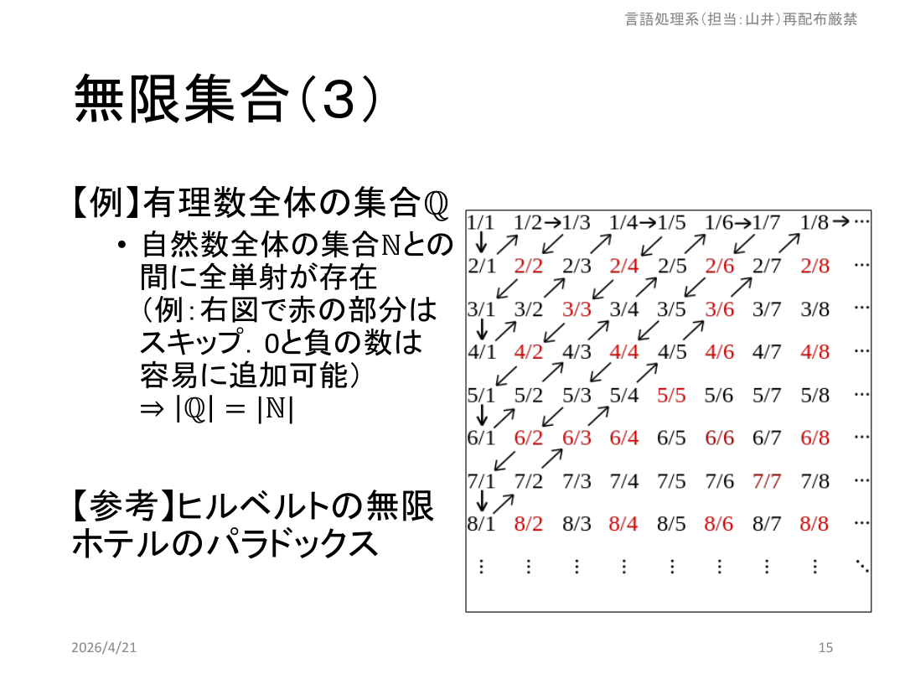

## 言語処理系202602_p016
<!-- source: 言語処理系202602.pdf page 16 -->

無限集合（４）
【例】 実数全体の集合ℝ
• 自然数全体の集合ℕとの間に
全単射は存在しない
【略証】
• 区間[0,1]の実数（⊂ℝ）を考える
• 𝑖𝑖番目の実数𝑟𝑟𝑖𝑖を2進数で
表したものを0. 𝑟𝑟𝑖𝑖𝑖𝑟𝑟𝑖𝑖2𝑟𝑟𝑖𝑖3 ⋯とする
• ここで実数𝑎𝑎= 0. 𝑎𝑎1𝑎𝑎2𝑎𝑎3 ⋯を考える
• 𝑟𝑟𝑗𝑗𝑗𝑗= 0なら𝑎𝑎𝑗𝑗= 1，𝑟𝑟𝑗𝑗𝑗𝑗= 1なら𝑎𝑎𝑗𝑗= 0となるように𝑎𝑎𝑗𝑗を決める
• 右上の表では𝑎𝑎= 0.0011 ⋯
• 実数𝑎𝑎は実数𝑟𝑟𝑖𝑖のいずれとも小数点以下𝑖𝑖桁目が不一致
⇒区間[0,1]の実数とℕとの間に全単射は存在しない
⇒ℝとℕとの間に全単射は存在しない
2026/4/21
言語処理系（担当：山井）再配布厳禁
16
実数∖桁
𝒓𝒓𝒊𝒊𝒊𝒊𝒓𝒓𝒊𝒊𝒊𝒊𝒓𝒓𝒊𝒊𝒊𝒊𝒓𝒓𝒊𝒊𝒊𝒊
⋯
𝑟𝑟1
1
0
1
0
⋯
𝑟𝑟2
0
1
1
1
⋯
𝑟𝑟3
1
0
0
1
⋯
𝑟𝑟4
0
0
1
0
⋯
⋮
⋮
⋮
⋮
⋮
⋱

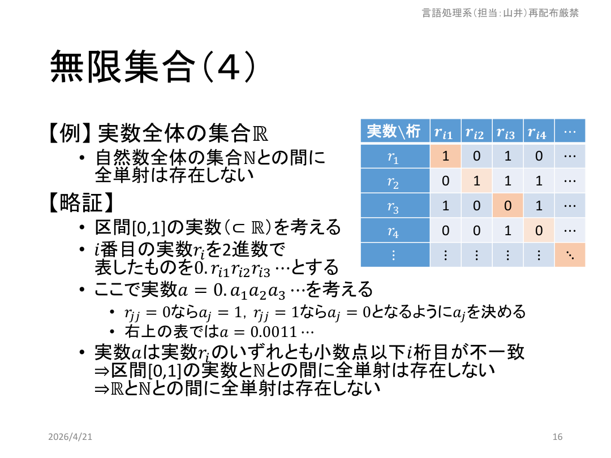

## 言語処理系202602_p017
<!-- source: 言語処理系202602.pdf page 17 -->

無限集合（５）
• 実数全体の集合ℝの濃度
• 「連続体濃度」といい，ℝ= ℵ と表す．
• ℵ0 < ℵ が成立
• カントール（Cantor）の定理
• 任意の集合𝐴𝐴に対して𝐴𝐴のすべての部分集合の集合
（𝐴𝐴の冪（べき）集合）𝒫𝒫𝐴𝐴を考えると𝐴𝐴< |𝒫𝒫𝐴𝐴| が成立
【証明】 ※「床屋のパラドックス」を参照
• 任意の集合 𝐴𝐴 について 𝐴𝐴 から 𝒫𝒫𝐴𝐴 への全射は存在しない
• そのような全射𝑓𝑓が存在すると仮定
• 部分集合 𝐵𝐵= 𝑥𝑥|𝑥𝑥∈𝐴𝐴, 𝑥𝑥∉𝑓𝑓(𝑥𝑥) ∈𝒫𝒫𝐴𝐴 を考える
• 仮定より全射𝑓𝑓が存在するので𝐵𝐵= 𝑓𝑓𝑥𝑥となる 𝑥𝑥∈𝐴𝐴 が存在
• 𝑥𝑥∈𝑓𝑓(𝑥𝑥)なら 𝑥𝑥∉𝐵𝐵 となり，𝐵𝐵= 𝑓𝑓𝑥𝑥 から言える 𝑥𝑥∉𝑓𝑓(𝑥𝑥) と矛盾
• 𝑥𝑥∉𝑓𝑓(𝑥𝑥)なら 𝑥𝑥∈𝐵𝐵 となり，𝐵𝐵= 𝑓𝑓𝑥𝑥 から言える 𝑥𝑥∈𝑓𝑓(𝑥𝑥) と矛盾
2026/4/21
言語処理系（担当：山井）再配布厳禁
17

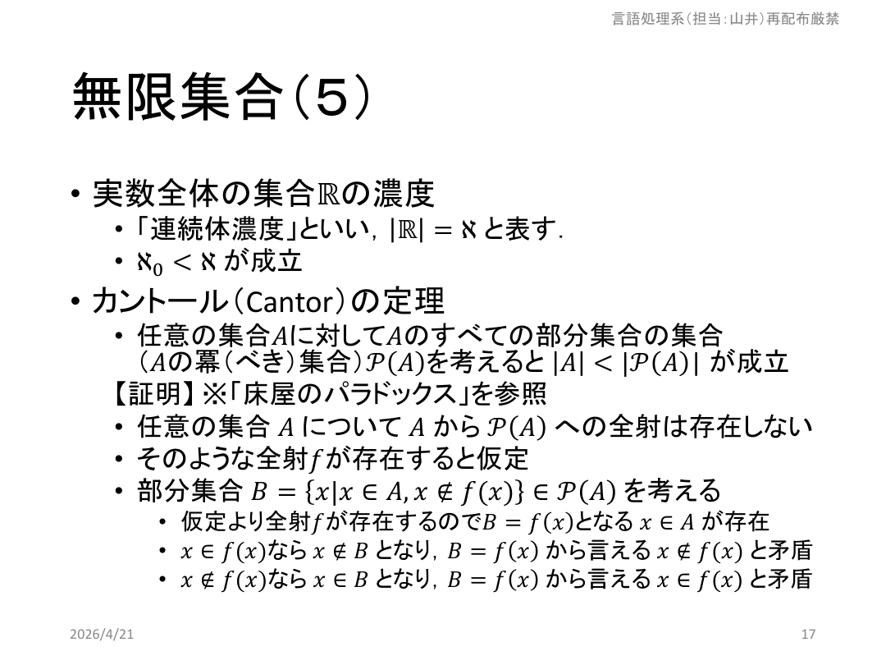

## 言語処理系202602_p018
<!-- source: 言語処理系202602.pdf page 18 -->

無限集合（６）
• Wikipediaの「カントールの定理」での具体例
• 自然数の集合ℕからその冪集合𝒫𝒫(ℕ)への全射𝑓𝑓が
存在すると仮定
• 𝑛𝑛は利己的⟺𝑛𝑛∈𝑓𝑓𝑛𝑛，𝑛𝑛は非利己的⟺𝑛𝑛∉𝑓𝑓(𝑛𝑛)
2026/4/21
言語処理系（担当：山井）再配布厳禁
18
全射（全単射） 𝑓𝑓
𝐷𝐷= 1, 3, 4, …
∈𝒫𝒫(ℕ)を考えると
写像𝑓𝑓は全射であるため，
𝑓𝑓𝑑𝑑= 𝐷𝐷となる𝑑𝑑が存在する．
•
𝑑𝑑が利己的なら𝑑𝑑∈𝑓𝑓𝑑𝑑= 𝐷𝐷
となるが𝑑𝑑∈𝐷𝐷より𝑑𝑑は非利己的
•
𝑑𝑑が非利己的なら𝑑𝑑∉𝑓𝑓𝑑𝑑= 𝐷𝐷
となるが𝑑𝑑∉𝐷𝐷より𝑑𝑑は利己的
⇒いずれも矛盾
⇒全射𝑓𝑓は存在しない
非利己的
非利己的
非利己的
利己的
全ての「非利己的な自然数」の集合
利己的
の定義

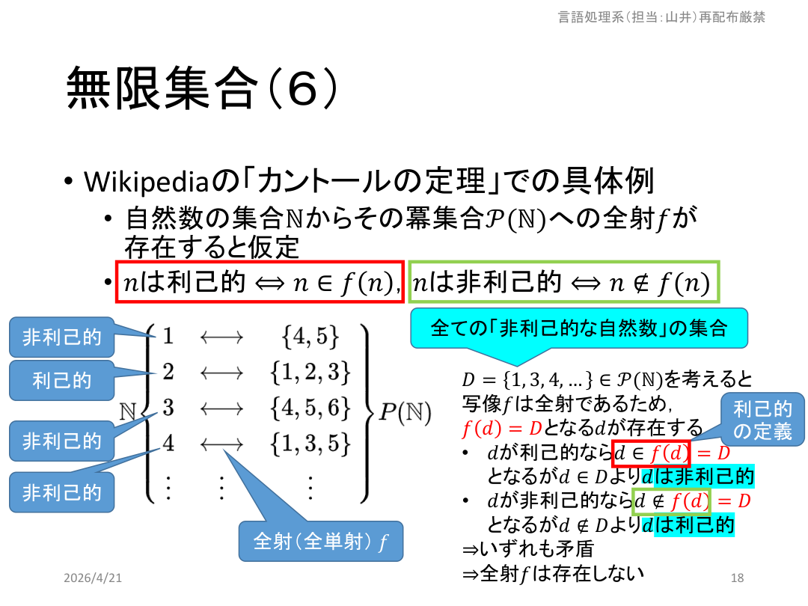

## 言語処理系202602_p019
<!-- source: 言語処理系202602.pdf page 19 -->

TMの停止性問題（１）
• 万能チューリングマシン（Universal TM, UTM）
• 任意のTM 𝑀𝑀と入力𝑤𝑤の組合せ𝑀𝑀, 𝑤𝑤が入力
• 「TM 𝑀𝑀が𝑤𝑤を受理」⟺「UTM 𝑈𝑈が𝑀𝑀, 𝑤𝑤を受理」
• 実質的にはTM 𝑀𝑀のエミュレータ
• TM 𝑀𝑀は何らかの符号化により表現
• 𝛿𝛿𝑞𝑞, 𝑋𝑋= (𝑞𝑞′, 𝑋𝑋′, 𝑅𝑅)の符号化の例： #𝑞𝑞𝑞𝑞𝑞𝑞′𝑋𝑋′𝑅𝑅#
• TMの数は自然数の集合と同じ濃度（可算集合，ℵ0）
• 言語の集合は実数の集合と同じ濃度（ℵ）
• 言語： 文字列の集合
例：「10進数表記での2桁の非負整数の集合」（有限集合）も
「10進数表記での全ての素数の集合」（無限集合）も言語の
1つ
2026/4/21
言語処理系（担当：山井）再配布厳禁
19

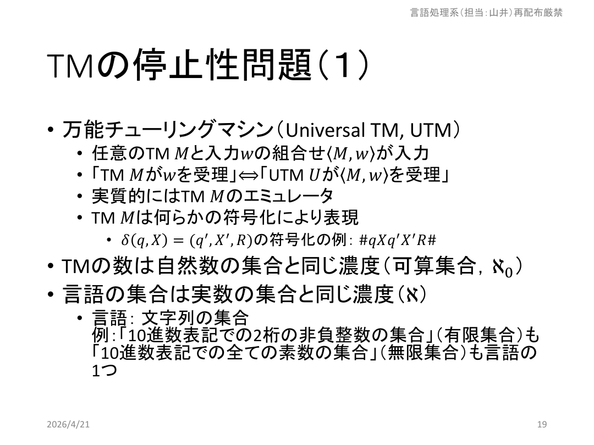

## 言語処理系202602_p020
<!-- source: 言語処理系202602.pdf page 20 -->

TMの停止性問題（２）
• どんなTMでも受理できない言語が存在
• 言語の集合のほうがTMの集合より濃度が濃いので自明
• 対角線論法でも証明可能
• 以下の表で各TMは「1」に対する文だけを受理
• 言語𝑤𝑤𝑖𝑖𝑤𝑤𝑖𝑖∉𝐿𝐿𝑇𝑇𝑀𝑀𝑖𝑖
（対角線要素が0の文の集合）を
受理するTMは存在しない⇒具体例を次に紹介
2026/4/21
言語処理系（担当：山井）再配布厳禁
20
TM ∖文
𝒘𝒘𝟏𝟏
𝒘𝒘𝟐𝟐
𝒘𝒘𝟑𝟑
𝒘𝒘𝟒𝟒
⋯
TM1
1
0
1
0
⋯
TM2
0
1
1
1
⋯
TM3
1
0
0
1
⋯
TM4
0
0
1
0
⋯
⋮
⋮
⋮
⋮
⋮
⋱

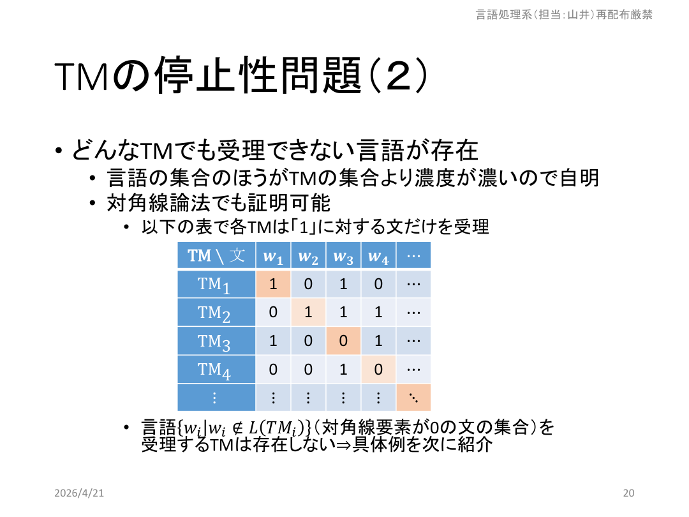

## 言語処理系202602_p021
<!-- source: 言語処理系202602.pdf page 21 -->

TMの停止性問題（３）
• 任意のTM 𝑀𝑀と入力𝑤𝑤が与えられた場合，「有限時間
で停止するか停止しないか」を判定するTMは
存在するか（停止性問題）⇒存在しない
• そのようなTM 𝐻𝐻(𝑀𝑀, 𝑤𝑤)が存在すると仮定・・・①
• 𝑀𝑀(𝑤𝑤)が停止する ⟺𝐻𝐻𝑀𝑀, 𝑤𝑤= YES（受理）
• 𝑀𝑀(𝑤𝑤)が停止しない⟺𝐻𝐻𝑀𝑀, 𝑤𝑤= NO（不受理）
• 次のような新しいTM 𝑀𝑀𝑀(𝐴𝐴)を構成
• 𝐻𝐻A, A = YES ⟺𝑀𝑀′(𝐴𝐴)が停止しない（無限ループ）
• 𝐻𝐻(𝑀𝑀, 𝑤𝑤)の受理状態で無限ループになるように修正（容易に可能）
• 𝐻𝐻A, A = NO ⟺𝑀𝑀′(𝐴𝐴)は停止
• 𝑀𝑀′(𝑀𝑀𝑀)の停止性を検討するといずれにせよ矛盾
• 𝑀𝑀′(𝑀𝑀′)が停止⇒𝐻𝐻𝑀𝑀𝑀, 𝑀𝑀𝑀= NO ⇒𝑀𝑀𝑀(𝑀𝑀𝑀)は停止せず⇒矛盾
• 𝑀𝑀′(𝑀𝑀′)が停止せず⇒𝐻𝐻𝑀𝑀′, 𝑀𝑀′ = YES ⇒𝑀𝑀′(𝑀𝑀′)は停止⇒矛盾
• 背理法により①の仮定が間違い⇒ 𝐻𝐻(𝑀𝑀, 𝑤𝑤)は存在しない
2026/4/21
言語処理系（担当：山井）再配布厳禁
21

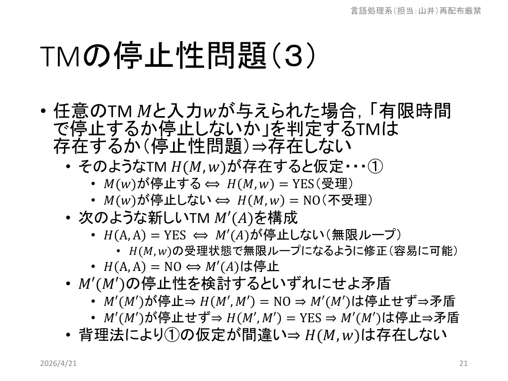

## 言語処理系202602_p022
<!-- source: 言語処理系202602.pdf page 22 -->

本日の課題
1. 「床屋のパラドックス」（スライドp.17）とはどのよう
なものか説明せよ．また，どの部分がカントール
の定理の証明と関係すると思うかを書け．
2. 言語の集合は実数の集合と同じ濃度（ℵ）である
（スライドp.19）ことを説明せよ．
※ ヒント： 言語の集合は文字列の集合の何に当たるか
• 期限： 5/11（月） 23:59
• Google Classroomで提出
2026/4/21
言語処理系（担当：山井）再配布厳禁
22

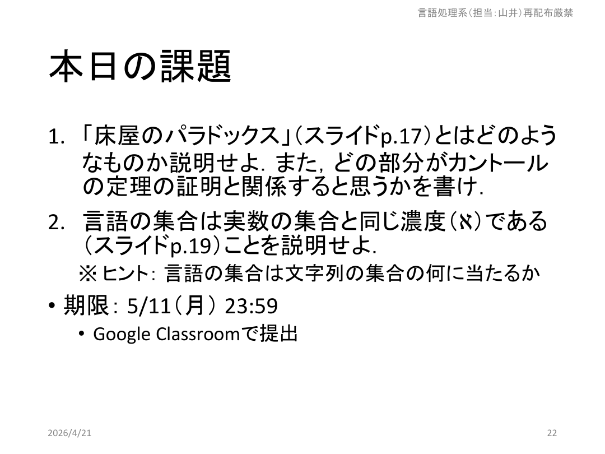
