# 言語処理系202603

<!-- source: 言語処理系202603.pdf -->

## 言語処理系202603_p001
<!-- source: 言語処理系202603.pdf page 1 -->

言語処理系
前半第3回形式言語理論（続き）
山井成良（前半担当）
nyamai@cc.tuat.ac.jp
注意事項
授業で提供される動画や資料など，あるいは授業の様子を録画，
録音，撮影したものを，SNSやWebサーバなどで共有あるいは公開
すると，情報倫理に反することとして本学の懲戒等の対象になり
得るばかりか，著作物の権利侵害など民事的・刑事的な罰則等の
対象になる可能性があるので，絶対に行わないでください．

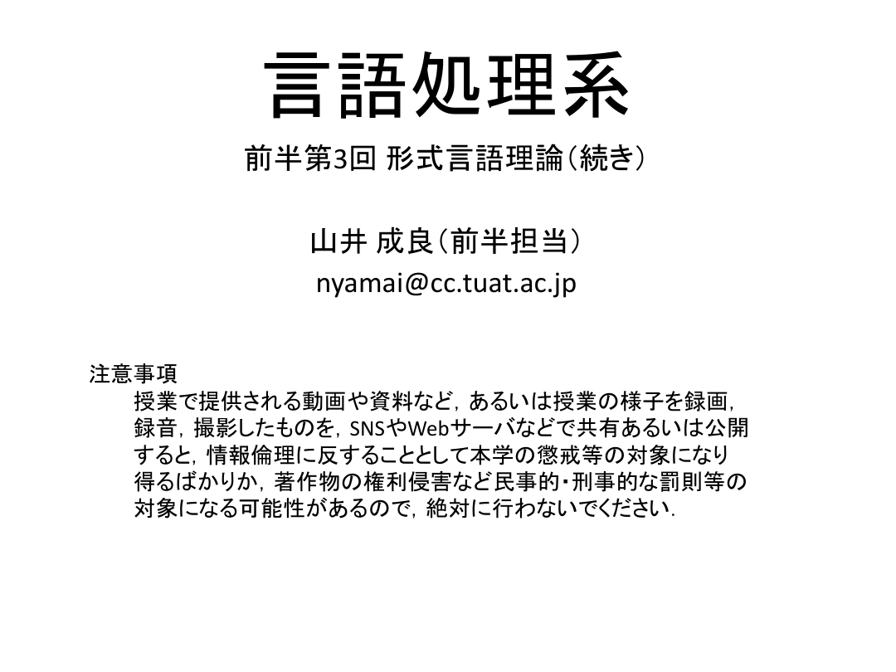

## 言語処理系202603_p002
<!-- source: 言語処理系202603.pdf page 2 -->

TMの停止性問題（３）
• 任意のTM 𝑀𝑀と入力𝑤𝑤が与えられた場合，「有限時間
で停止するか停止しないか」を判定するTMは
存在するか（停止性問題）⇒存在しない
• そのようなTM 𝐻𝐻(𝑀𝑀, 𝑤𝑤)が存在すると仮定・・・①
• 𝑀𝑀(𝑤𝑤)が停止する ⟺𝐻𝐻𝑀𝑀, 𝑤𝑤= YES（受理）
• 𝑀𝑀(𝑤𝑤)が停止しない⟺𝐻𝐻𝑀𝑀, 𝑤𝑤= NO（不受理）
• 次のような新しいTM 𝑀𝑀𝑀(𝐴𝐴)を構成
• 𝐻𝐻A, A = YES ⟺𝑀𝑀′(𝐴𝐴)が停止しない（無限ループ）
• 𝐻𝐻(𝑀𝑀, 𝑤𝑤)の受理状態で無限ループになるように修正（容易に可能）
• 𝐻𝐻A, A = NO ⟺𝑀𝑀′(𝐴𝐴)は停止
• 𝑀𝑀′(𝑀𝑀𝑀)の停止性を検討するといずれにせよ矛盾
• 𝑀𝑀′(𝑀𝑀′)が停止⇒𝐻𝐻𝑀𝑀𝑀, 𝑀𝑀𝑀= NO ⇒𝑀𝑀𝑀(𝑀𝑀𝑀)は停止せず⇒矛盾
• 𝑀𝑀′(𝑀𝑀′)が停止せず⇒𝐻𝐻𝑀𝑀′, 𝑀𝑀′ = YES ⇒𝑀𝑀′(𝑀𝑀′)は停止⇒矛盾
• 背理法により①の仮定が間違い⇒ 𝐻𝐻(𝑀𝑀, 𝑤𝑤)は存在しない
2026/4/28
言語処理系（担当：山井）再配布厳禁
2

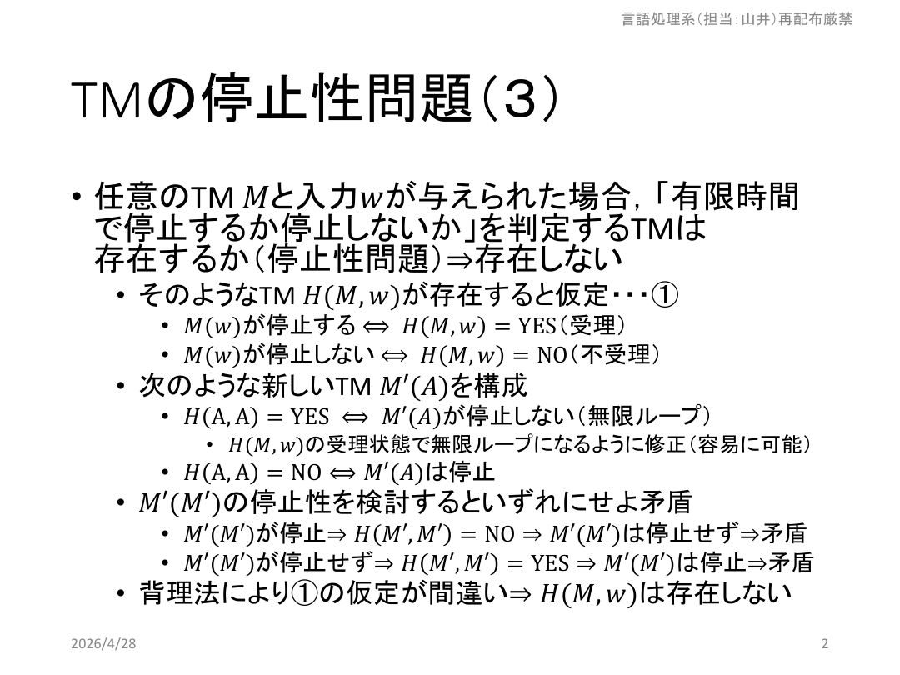

## 言語処理系202603_p003
<!-- source: 言語処理系202603.pdf page 3 -->

計算複雑性理論（１）
• 非決定性TM（Non-deterministic TM, NTM）
• 従来のTM（決定性TM，DTM）の遷移関数𝛿𝛿が多価関数
となっているTM
• 遷移関数𝛿𝛿∶(𝑄𝑄× 𝛤𝛤→𝒫𝒫𝑄𝑄× 𝛤𝛤× 𝐿𝐿, 𝑅𝑅
)
• 𝒫𝒫𝑆𝑆: 集合Sの冪集合（power set）
• 遷移関数の例
• 𝛿𝛿𝑞𝑞, 𝑋𝑋= { 𝑞𝑞′, 𝑋𝑋′, 𝑅𝑅, 𝑞𝑞′′, 𝑋𝑋′′, 𝐿𝐿}
• 動作
• 最も幸運な推測機（luckiest possible guesser）
• 選択可能な動作を並列的に全て選択すると考えてもよい
• 能力的にはDTMと同じ
• 並列的な動作をDTMで模倣
2026/4/28
言語処理系（担当：山井）再配布厳禁
3
𝑞𝑞
𝑞𝑞′
𝑞𝑞′′
𝑋𝑋→𝑋𝑋′, 𝑅𝑅
𝑋𝑋→𝑋𝑋′′, 𝐿𝐿

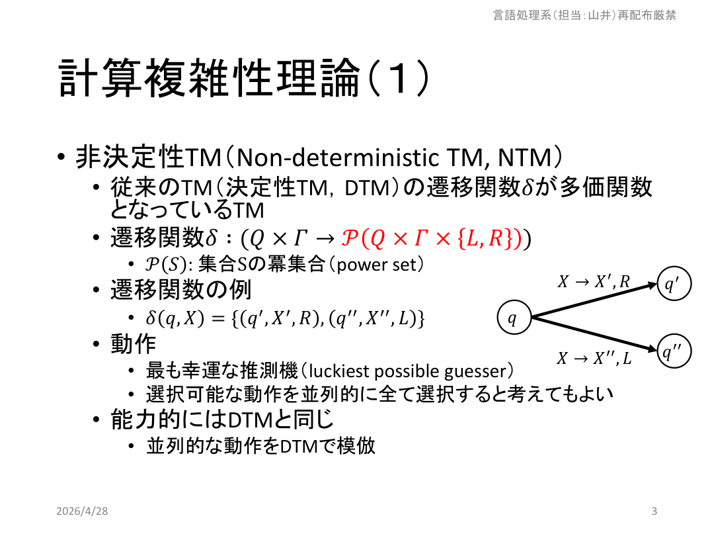

## 言語処理系202603_p004
<!-- source: 言語処理系202603.pdf page 4 -->

計算複雑性理論（２）
• 複雑性クラス
• ある制約条件を満たす計算問題の集合
• いずれも入力長 𝑛𝑛 に対するオーダーを対象とする
• 代表的な複雑性クラス
• クラス𝑃𝑃（polynomial time）
• DTMにより𝑛𝑛の多項式時間で解ける問題クラス
• クラス𝑁𝑁𝑁𝑁（non-deterministic polynomial time）
• NTMにより𝑛𝑛の多項式時間で解ける問題クラス
※ 「non-polynomial」ではない
2026/4/28
言語処理系（担当：山井）再配布厳禁
4

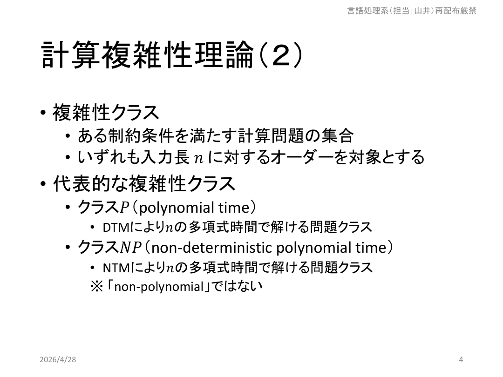

## 言語処理系202603_p005
<!-- source: 言語処理系202603.pdf page 5 -->

計算複雑性理論（３）
• クラス𝑃𝑃とクラス𝑁𝑁𝑁𝑁との関係
• 𝑃𝑃≠𝑁𝑁𝑁𝑁と予想されているが未解決
• クレイ数学研究所によるミレニアム懸賞問題の1つ
• 解決すれば賞金100万ドル
• 𝑁𝑁𝑁𝑁完全（𝑁𝑁𝑁𝑁-complete）
• クラス𝑁𝑁𝑁𝑁に属する問題のうち最も難しいもの
• 𝑁𝑁𝑁𝑁完全の問題のうち１つでもクラス𝑃𝑃に属することが
証明できれば𝑃𝑃= 𝑁𝑁𝑁𝑁と証明
• 𝑁𝑁𝑁𝑁困難（𝑁𝑁𝑁𝑁-hard）
• 𝑁𝑁𝑁𝑁完全の問題と同等かそれ以上に難しい問題
• クラス𝑁𝑁𝑁𝑁に属するかどうかは不問
2026/4/28
言語処理系（担当：山井）再配布厳禁
5

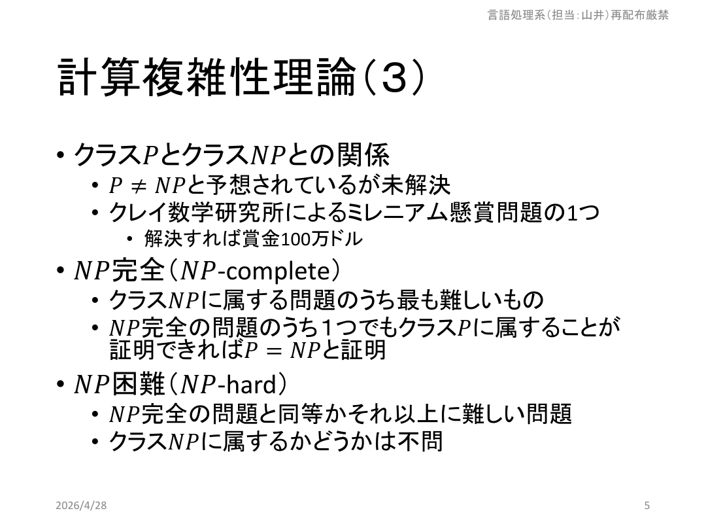

## 言語処理系202603_p006
<!-- source: 言語処理系202603.pdf page 6 -->

計算複雑性理論（４）
• 𝑁𝑁𝑁𝑁完全問題の例
• 充足可能性問題（Satisfiability problem, SAT）
• 与えられた命題論理式を真にできるかどうかを判定する問題
• 例題（Wikipedia「充足可能性問題」より）
•
𝑥𝑥1 ∨𝑥𝑥2 ∧𝑥𝑥1 ∨𝑥𝑥2 ∧𝑥𝑥1 ∨𝑥𝑥2 : 𝑥𝑥1 = 真, 𝑥𝑥2 = 偽が解⇒真
•
𝑥𝑥1 ∨𝑥𝑥2 ∧𝑥𝑥1 ∨𝑥𝑥2 ∧𝑥𝑥1 ∨𝑥𝑥2 ∧𝑥𝑥1 ∨𝑥𝑥2 : 解なし⇒ 偽
• 部分和問題（Subset sum problem）
• 与えられた𝑛𝑛個の整数の集合の部分集合で合計が
与えられた整数𝑁𝑁になるものがあるかどうかを判定する問題
• 例題（Wikipedia「部分和問題」より）
• {1,3,7,10,13}の部分和で合計が21: {1,7,13}が解⇒真
• {2,4,6,8,10}の部分和で合計が19: 解なし⇒偽
• 「テトリス」「ののぐらむ」「ぷよぷよ」なども𝑁𝑁𝑁𝑁完全
• https://paperzz.com/doc/5492833/np-完全なペンシルパズルの
一覧
2026/4/28
言語処理系（担当：山井）再配布厳禁
6

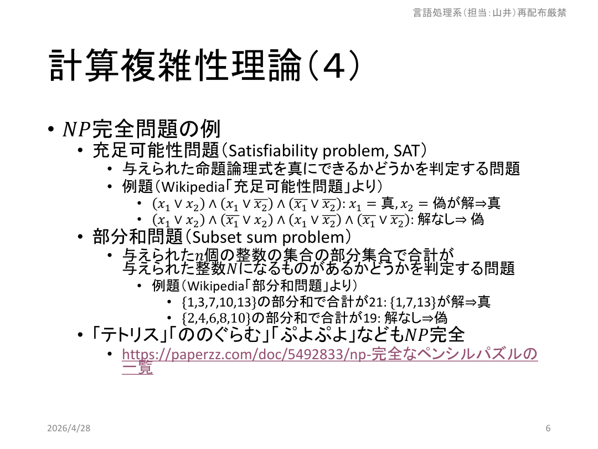

## 言語処理系202603_p007
<!-- source: 言語処理系202603.pdf page 7 -->

計算複雑性理論（５）
• 𝑁𝑁𝑁𝑁困難問題の例
• 巡回セールスマン問題（Traveling salesman problem）
• 入力：都市の集合と各2都市間の移動コスト（たとえば距離）
• 出力：各都市を1回ずつ訪問して出発地に戻る最小コスト経路
※ 出力が「コスト𝐿𝐿以下の巡回経路があるかどうか」（決定問題）
であれば𝑁𝑁𝑁𝑁完全
• ナップサック問題（Knapsack problem）
• 入力：容量𝐶𝐶のナップサック，𝑛𝑛種類の荷物（価値𝑝𝑝𝑖𝑖，容積𝑐𝑐𝑖𝑖）
• 出力：合計容積𝐶𝐶以下で合計価値を最大とする荷物の組合せ
 ※ 出力が「合計価値が𝑊𝑊以上となる組合せがあるかどうか」
（決定問題）であれば𝑁𝑁𝑁𝑁完全
2026/4/28
言語処理系（担当：山井）再配布厳禁
7

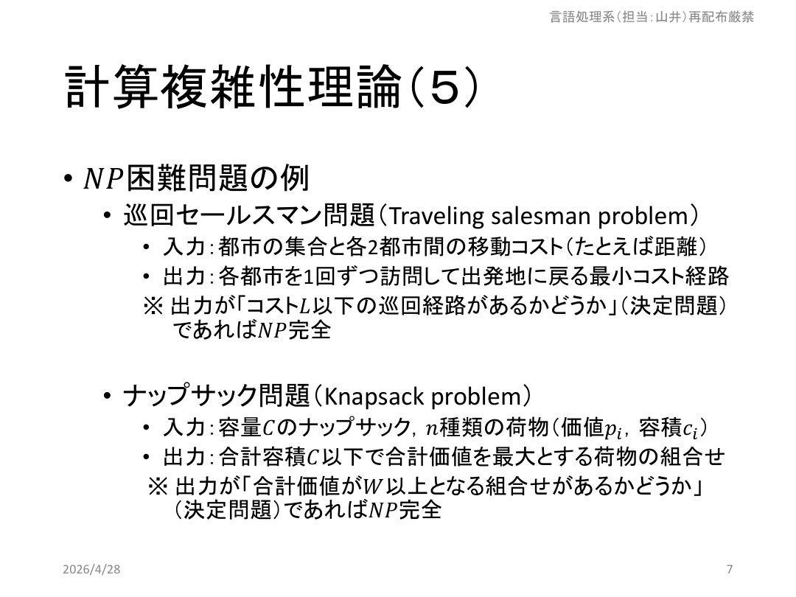

## 言語処理系202603_p008
<!-- source: 言語処理系202603.pdf page 8 -->

計算複雑性理論（６）
• NP完全とNP困難との関係
𝑃𝑃≠𝑁𝑁𝑁𝑁の場合
𝑃𝑃= 𝑁𝑁𝑁𝑁の場合
2026/4/28
言語処理系（担当：山井）再配布厳禁
8
NP
P
NP困難
NP完全
P=NP=NP完全
NP困難
計算複雑度

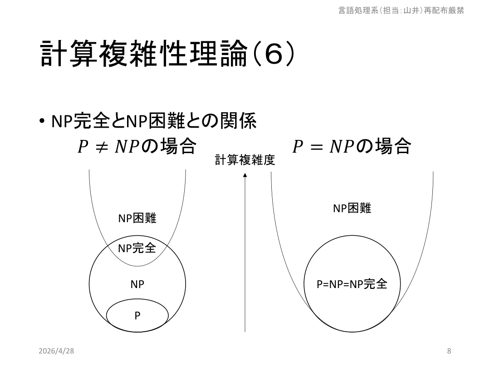

## 言語処理系202603_p009
<!-- source: 言語処理系202603.pdf page 9 -->

言語処理系
前半第3回 正規表現と字句解析
山井 成良（前半担当）

## 言語処理系202603_p010
<!-- source: 言語処理系202603.pdf page 10 -->

正規表現（１）
• パターンマッチングの際のパターンの記述に使用
• 様々な正規表現
• Basic Regular Expression（BRE）
*: 0回以上の繰り返し  [aiueo]: []内の任意の1文字
.: 任意の1文字
           [a-z]: []内の指定範囲内の任意の1文字
• Extended Regular Expression（ERE）
+: 1回以上の繰り返し
?: 0回か1回
|: 選択
• Perl Compatible Regular Expression（PCRE）
• さらに多くの演算子
• 一部は本来の正規表現を超える能力を持つ
2026/4/28
言語処理系（担当：山井）再配布厳禁
10

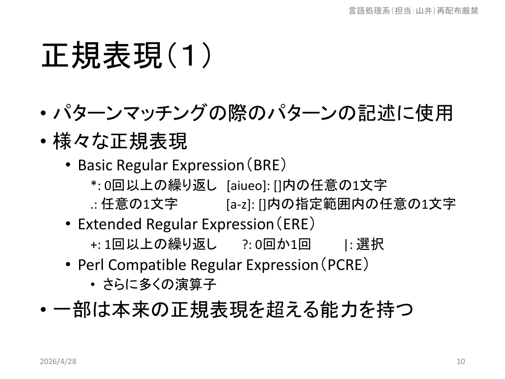

## 言語処理系202603_p011
<!-- source: 言語処理系202603.pdf page 11 -->

正規表現（２）
• EREの例
• C言語の識別子
• [_a-zA-Z][_0-9a-zA-Z]*
• C言語の整数定数（long long型を除く）
• ([1-9][0-9]*|0[0-7]*|0[Xx][0-9A-Fa-f]+)([Uu][Ll]?|[Ll][Uu]?)?
• Uとu: 符号なし定数
• Lとl:   long型定数
※ 負の整数は「－」を単項算術演算子として処理
※ 有効なメールアドレスを表す正規表現は大変（RFC5322）
○!#$%&'*+-/=?^_`.{|}~@example.com
○"Abc@def"@example.com
○"Fred¥ Bloggs"@example.com
× Abc.@example.com
× Abc..123@example.com
2026/4/28
言語処理系（担当：山井）再配布厳禁
11

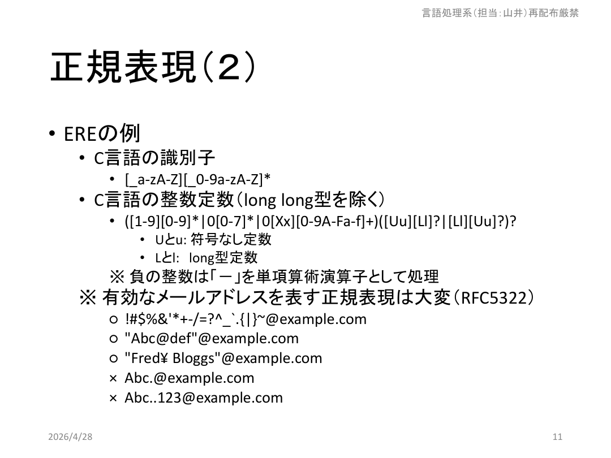

## 言語処理系202603_p012
<!-- source: 言語処理系202603.pdf page 12 -->

正規表現（３）
• 本来の定義
• ∅は正規表現で，空集合を表す．
• 𝜀𝜀は正規表現で，空文字列だけの集合{𝜀𝜀}を表す．
• 𝑎𝑎∈𝛴𝛴に対して𝑎𝑎は正規表現で集合{𝑎𝑎}を表す．
• 𝑟𝑟と𝑠𝑠がそれぞれ言語𝑅𝑅と𝑆𝑆を表す正規表現のとき
𝑟𝑟+ 𝑠𝑠, 𝑟𝑟⋅𝑠𝑠, (𝑟𝑟∗)は全て正規表現で，それぞれ集合
𝑅𝑅∪𝑆𝑆, 𝑅𝑅ȉ 𝑆𝑆, 𝑅𝑅∗を表す．
• 𝑅𝑅⋅𝑆𝑆= {𝑥𝑥𝑥𝑥|𝑥𝑥∈𝑅𝑅, 𝑦𝑦∈𝑆𝑆}で「連接」を表す
• 𝑅𝑅∗= ⋃𝑖𝑖=0
∞𝑅𝑅𝑖𝑖で「Kleene閉包（あるいは単に閉包）」を表す
※ 演算子の優先順位は∗,⋅, +の順に高く，括弧は省略可
※ 演算子⋅は省略可
2026/4/28
言語処理系（担当：山井）再配布厳禁
12

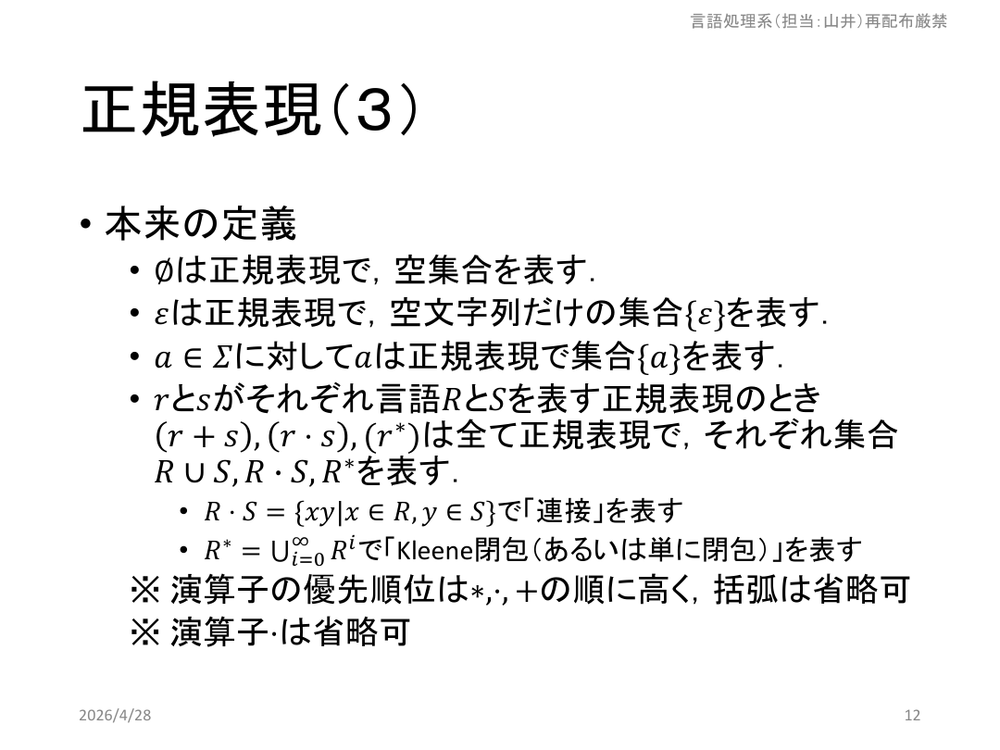

## 言語処理系202603_p013
<!-- source: 言語処理系202603.pdf page 13 -->

正規表現（４）
• 例
• 「同じ文字が連続しない0, 1の文字列」の正規表現
• 0 10 ∗1 + 𝜀𝜀+ 1 01 ∗(0 + 𝜀𝜀)
※ 空文字列を含む場合は (0 + 𝜀𝜀) 10 ∗1 + 𝜀𝜀 と簡略可能
• 「0を偶数個含む0, 1の文字列」の正規表現
• 0 1∗01∗0 ∗1∗01∗+ 1(1∗01∗0)∗1∗
※ 0を含まない文字列は含まれるが，空文字列は含まれない
     空文字列を含む場合は 1∗(01∗01∗)∗ と簡略可能
• 「正の3の倍数の2進表記の文字列」の正規表現
• 1 10∗1 + 01∗0 ∗10∗
• 11000101110102 = 633010
2026/4/28
言語処理系（担当：山井）再配布厳禁
13

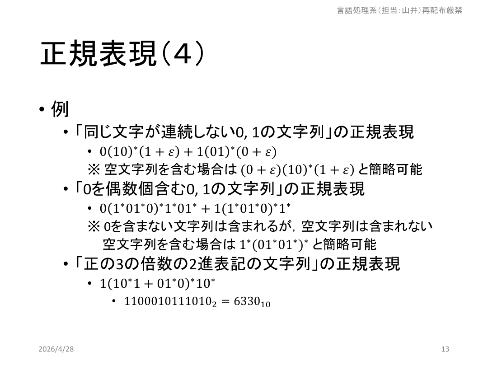

## 言語処理系202603_p014
<!-- source: 言語処理系202603.pdf page 14 -->

正規表現（５）
• 正規表現と字句解析との関係
• 多くの場合，トークンは正規表現で定義可能
• 例： C言語の識別子は[_A-Za-z][_A-Za-z0-9]*
• 英字（アンダースコアを含む大小文字）から始まる英数字列
• 正規表現で定義可能だが簡単ではないもの
• 例： C言語のコメント「/* ・・・ */」
• 「/¥*.*¥*/」は不可（longest matchのため）
• 「/* コメント1 */ a=1; /* コメント2 */」全体がコメント
• 「 ・・・ 」に相当する，“*/” 以外の文字列
• 「([^*]|¥*+[^*/])*¥**」で定義可能だが直観的でない
• PCREでは「/¥*.*?¥*/ 」で表現可能（*?: lazy matchingでの0回以上）
• 正規表現だけでは困難なもの
• 古いFORTRAN（基本的には空白文字は無意味）
• DO␣10␣I = 1,5    →   Iを1～5に変化させて文番号10まで繰返し
• DO␣10␣I = 1.5    →   「DO10I」という実数型変数に1.5を代入
2026/4/28
言語処理系（担当：山井）再配布厳禁
14
直後の特殊文字を
エスケープ
補集合の
文字クラス

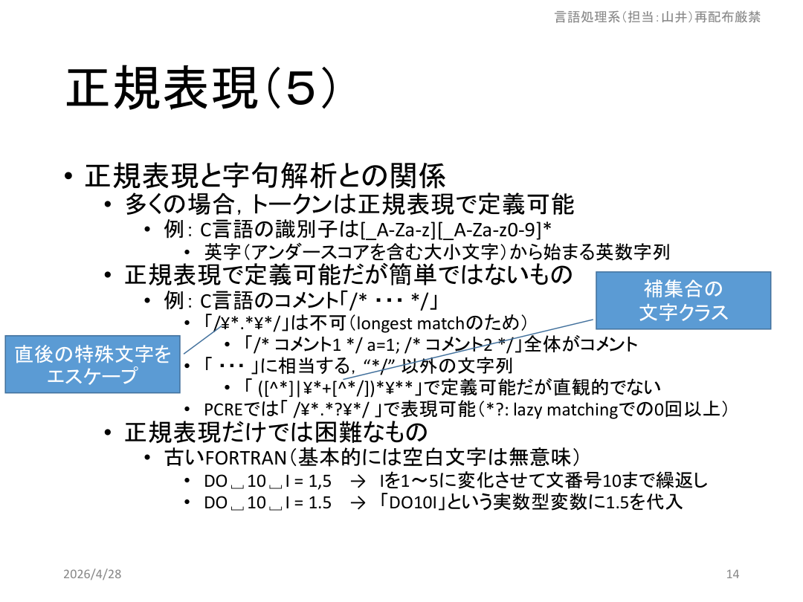

## 言語処理系202603_p015
<!-- source: 言語処理系202603.pdf page 15 -->

有限オートマトン（１）
• FA（Finite Automaton），FSM（Finite State Machine）とも
• 直観的な定義
• 有限数の状態を持ち，入力により状態が遷移する機械
• 入力を全て処理し終えたときに
特定の状態になっていれば受理
• 遷移先の状態が未定義なら受理しない
• 形式的な定義
• 𝑀𝑀= (𝑄𝑄, 𝛴𝛴, 𝛿𝛿, 𝑞𝑞0, 𝐹𝐹) の5つ組で定義
• 𝑄𝑄: 状態の有限集合
• 𝛴𝛴: 入力記号の集合（入力アルファベット）
• 𝛿𝛿: 遷移関数（𝑄𝑄× 𝛴𝛴→𝑄𝑄）
•
入力：（現在の状態，次の入力記号）
•
出力：次の状態
• 𝑞𝑞0: 初期状態（𝑞𝑞0 ∈𝑄𝑄）
• 𝐹𝐹: 受理状態（𝐹𝐹⊆𝑄𝑄）
2026/4/28
言語処理系（担当：山井）再配布厳禁
15
q0
開始
1
q1
0
0
1
状態
0
1
𝑞𝑞0
𝑞𝑞1
𝑞𝑞0
𝑞𝑞1
𝑞𝑞1
𝑞𝑞0

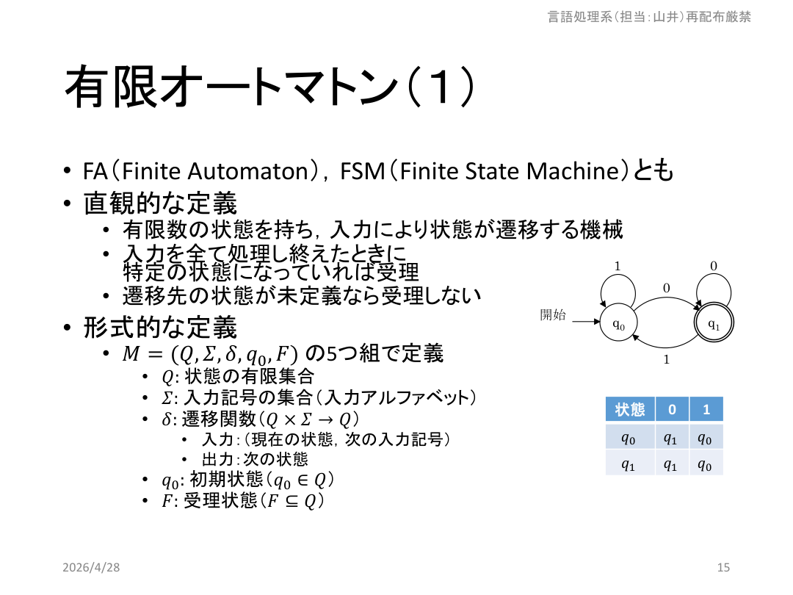

## 言語処理系202603_p016
<!-- source: 言語処理系202603.pdf page 16 -->

有限オートマトン（２）
• 非決定性FA（Non-deterministic FA, NFA）
• 従来のFA（決定性FA，DFA）の遷移関数𝛿𝛿が多価関数と
なっているFA
• 入力なしでの遷移（𝜀𝜀-動作）も可能（𝜀𝜀-NFA）
• 遷移関数𝛿𝛿∶(𝑄𝑄× {𝛴𝛴∪𝜀𝜀} →𝒫𝒫𝑄𝑄)
• 𝒫𝒫𝑆𝑆: 集合Sの冪集合（power set）
• 遷移関数の例
• 𝛿𝛿𝑞𝑞, 𝑋𝑋= {𝑞𝑞′, 𝑞𝑞′′}
• 動作
• 最も幸運な推測機（luckiest possible guesser）
• 選択可能な動作を並列的に全て選択すると考えてもよい
• 能力的にはDFAと同じ
• DFAに変換可能
2026/4/28
言語処理系（担当：山井）再配布厳禁
16

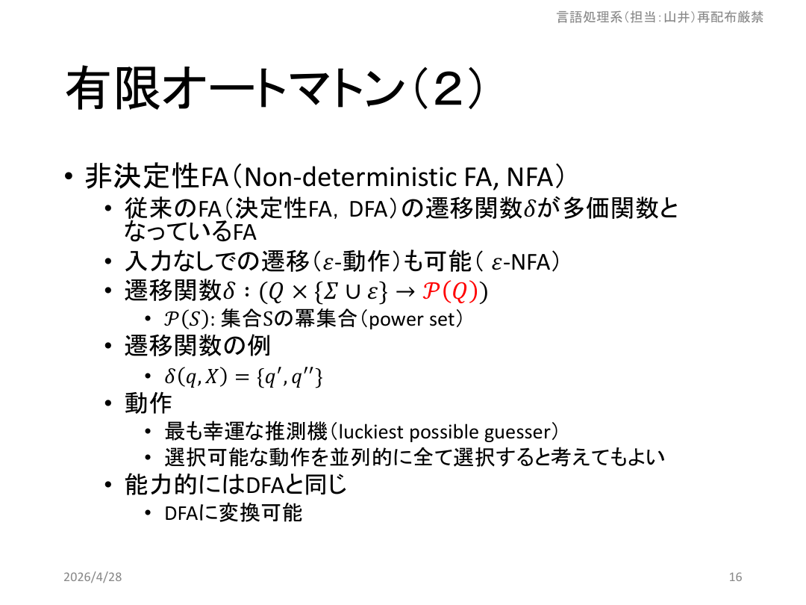

## 言語処理系202603_p017
<!-- source: 言語処理系202603.pdf page 17 -->

有限オートマトン（３）
• 𝜀𝜀-動作つきNFAから𝜀𝜀-動作なしNFAへの変換
• 元の遷移関数𝛿𝛿を新しい遷移関数̂𝛿𝛿に拡張
• ̂𝛿𝛿𝑞𝑞, 𝑎𝑎= {𝑞𝑞′|𝑞𝑞′は𝑞𝑞から𝜀𝜀∗𝑎𝑎𝜀𝜀∗で遷移可能な状態} とする
• 元の受理状態𝐹𝐹を新しい受理状態෠𝐹𝐹に拡張
• 初期状態𝑞𝑞0から𝜀𝜀-動作だけで受理状態に遷移可能なら
෠𝐹𝐹= 𝐹𝐹∪𝑞𝑞0，そうでなければ ෠𝐹𝐹= 𝐹𝐹
• 例
2026/4/28
言語処理系（担当：山井）再配布厳禁
17
q0
開始
0
1
𝜀𝜀
𝜀𝜀
q1
q2
2
開始
0
1
0,1
1,2
q1
q2
2
q0
0,1,2

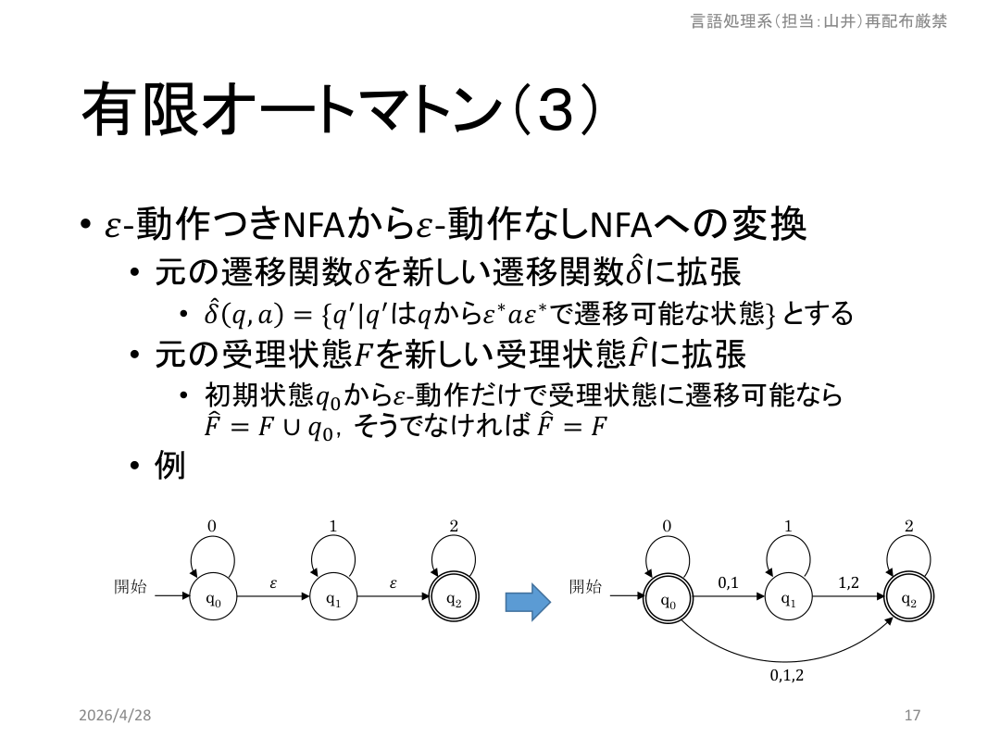

## 言語処理系202603_p018
<!-- source: 言語処理系202603.pdf page 18 -->

有限オートマトン（４）
• 𝜀𝜀-動作なしNFAからDFAへの変換
• NFAの状態の集合𝑄𝑄を𝒫𝒫𝑄𝑄に拡張
• 例: 𝑄𝑄𝑁𝑁𝑁𝑁𝑁𝑁= {𝑞𝑞0, 𝑞𝑞1}なら𝑄𝑄𝐷𝐷𝐷𝐷𝐷𝐷= {[], 𝑞𝑞0 , 𝑞𝑞1 , 𝑞𝑞0, 𝑞𝑞1 }
• DFAの状態[𝑝𝑝1, 𝑝𝑝2, … ]に対して新しい遷移関数̂𝛿𝛿を定義
̂𝛿𝛿[𝑝𝑝1, 𝑝𝑝2, … ], 𝑎𝑎= ራ
𝑖𝑖
𝛿𝛿(𝑝𝑝𝑖𝑖, 𝑎𝑎)
• DFAの状態[𝑝𝑝1, 𝑝𝑝2, … ]は∃𝑝𝑝𝑖𝑖∈𝐹𝐹なら受理状態
• 例（前頁右図のNFAを変換）
2026/4/28
言語処理系（担当：山井）再配布厳禁
18
開始
0
1
1
2
2
2
012
2
0
0
12
1
2
実際は不使用

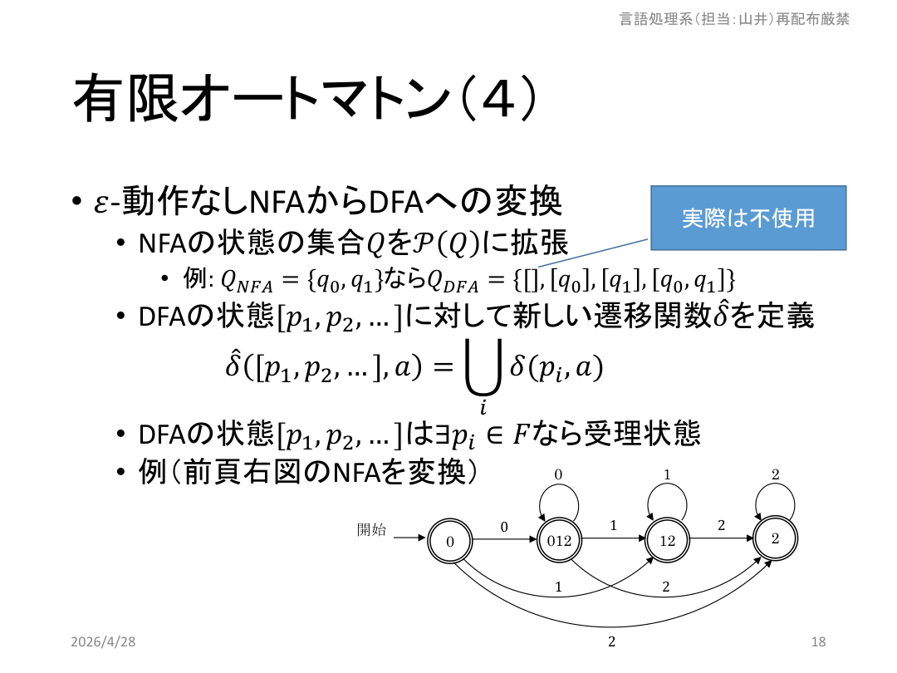

## 言語処理系202603_p019
<!-- source: 言語処理系202603.pdf page 19 -->

有限オートマトン（５）
• DFAの状態数最小化
• 同値（equivalent）の状態をまとめることで実現
• 状態𝑝𝑝, 𝑞𝑞が同値（𝑝𝑝≡𝑞𝑞）
⟺∀𝑥𝑥∈𝛴𝛴∗について𝛿𝛿(𝑝𝑝, 𝑥𝑥)と𝛿𝛿(𝑞𝑞, 𝑥𝑥)がともに受理状態か
ともに受理状態でない
• 本質的には1種類
• 最小化アルゴリズムは省略
•
𝛴𝛴= 𝑘𝑘, 𝑄𝑄= 𝑛𝑛とすると，時間計算量は𝑂𝑂𝑘𝑘𝑛𝑛2
• 例（前頁のDFAを変換）
2026/4/28
言語処理系（担当：山井）再配布厳禁
19
開始
0
1
1
2
2
2
012
2
12

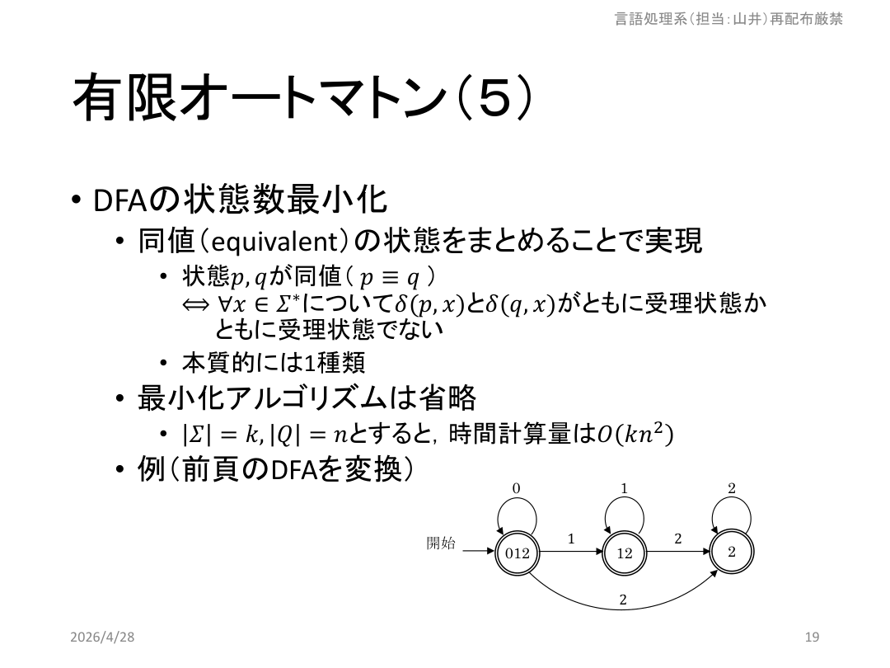

## 言語処理系202603_p020
<!-- source: 言語処理系202603.pdf page 20 -->

有限オートマトン（６）
• 正規表現𝑟𝑟から𝜀𝜀-NFAへの変換
• 𝑟𝑟= ∅
• 𝑟𝑟= 𝜀𝜀
• 𝑟𝑟= 𝑎𝑎
2026/4/28
言語処理系（担当：山井）再配布厳禁
20
q0
開始
qS
q0
開始
qS
𝜀𝜀
q0
開始
qS
𝑎𝑎

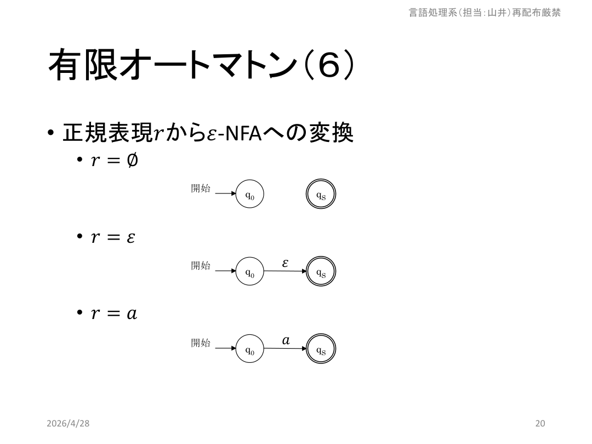

## 言語処理系202603_p021
<!-- source: 言語処理系202603.pdf page 21 -->

有限オートマトン（７）
• 正規表現𝑟𝑟から𝜀𝜀-NFAへの変換
• 𝑟𝑟= 𝑟𝑟1 + 𝑟𝑟2
• 𝑟𝑟= 𝑟𝑟1𝑟𝑟2
• 𝑟𝑟= 𝑟𝑟1
∗
2026/4/28
言語処理系（担当：山井）再配布厳禁
21
q0
開始
qS
q1
𝑓𝑓1
𝑟𝑟1
q2
𝑓𝑓2
𝑟𝑟2
𝜀𝜀
𝜀𝜀
𝜀𝜀
𝜀𝜀
開始
𝜀𝜀
q2
𝑓𝑓2
𝑟𝑟2
q1
𝑓𝑓1
𝑟𝑟1
q0
開始
qS
𝜀𝜀
q1
𝑓𝑓1
𝑟𝑟1
𝜀𝜀
𝜀𝜀
𝜀𝜀

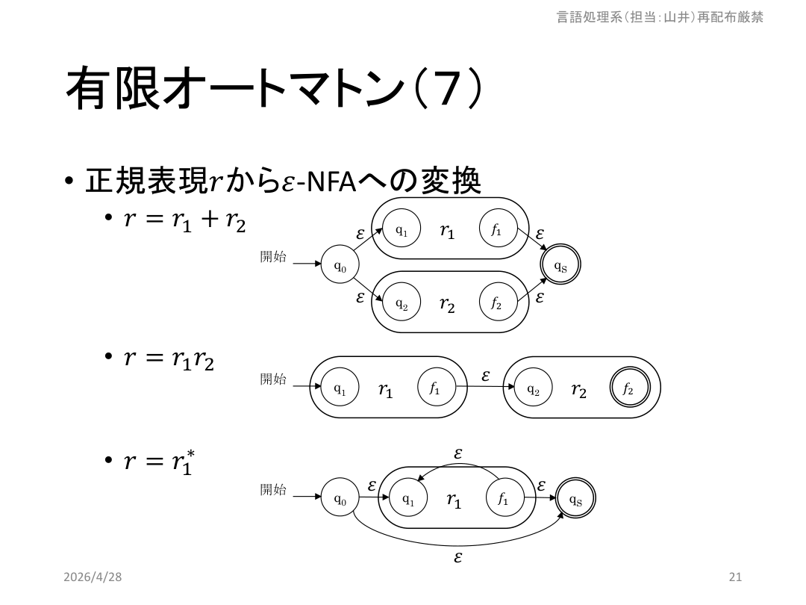

## 言語処理系202603_p022
<!-- source: 言語処理系202603.pdf page 22 -->

字句解析器（１）
• DFAから字句解析プログラムを作成可能
• 1文字を読み込んで次の状態を決定（p.18のDFAに対応）
enum stateset {Q012, Q12, Q2};
enum stateset state=Q012;
…
while ((ch=次の文字) != '¥0'){
/* 「次の文字」は fgetc()などが該当 */
switch(state){
case Q012: switch(ch) {
                '0': state=Q012; break; '1': state=Q12; break; '2': state=Q2; break;
                default: 1文字戻してこれまでの文字列をreturn;
/* 「1文字戻し」はungetc()などが該当 */
}
case Q12:  switch(ch) {
'1': state=Q12; break; '2': state=Q2; break;
                 default: 1文字戻してこれまでの文字列をreturn;
}
…
2026/4/28
言語処理系（担当：山井）再配布厳禁
22
初期状態
現在の状態
次の状態
次の状態
次の状態

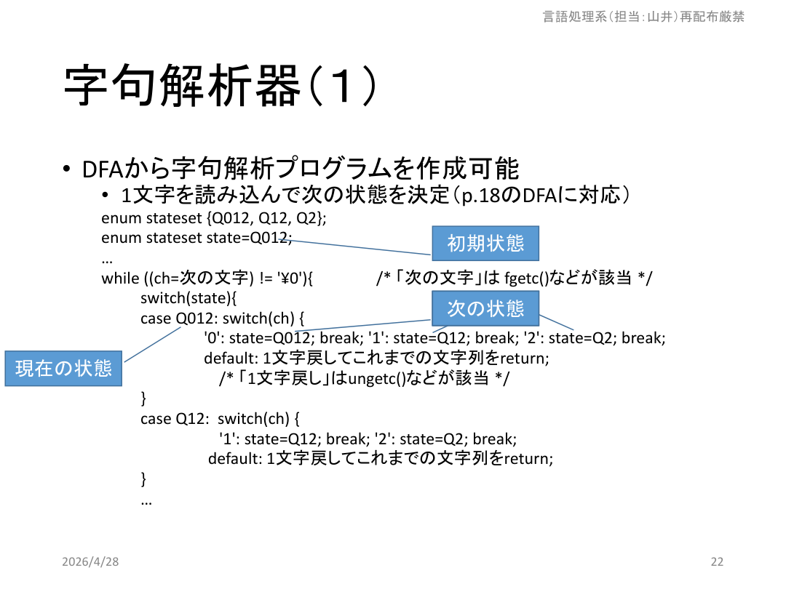

## 言語処理系202603_p023
<!-- source: 言語処理系202603.pdf page 23 -->

字句解析器（２）
• 状態を明示的に扱わない方法も可能
• この方が簡単で高速だが経験が必要
• p.18のDFAの処理の流れを直接コーディング
while ((ch=次の文字) != '¥0'){
/* Q012 */
while (ch=='0') ch=次の文字;
/* Q12 */
while (ch=='1') ch=次の文字;
/* Q2 */
while (ch=='2') ch=次の文字;
/* 受理 */
1文字戻してこれまでの文字列をreturn;
}
/* EOF の場合のみ到達 */
2026/4/28
言語処理系（担当：山井）再配布厳禁
23

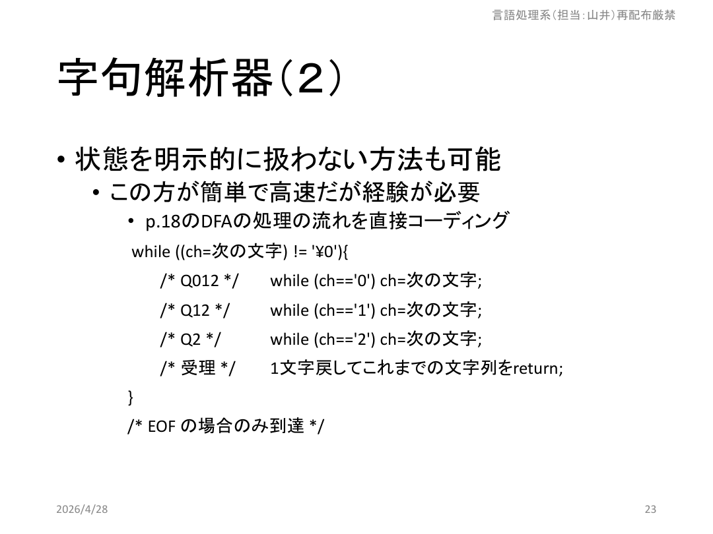

## 言語処理系202603_p024
<!-- source: 言語処理系202603.pdf page 24 -->

字句解析器（３）
• lexを用いた字句解析
• 仕様書ファイルの構成
定義部
%%
ルール部
%%
サブルーチン部
• 定義部
• lexのオプションやC言語の宣言関係のコードを記載
• ルール部
• 「正規表現（ERE）  アクション（Cプログラム）」を列挙
• サブルーチン部
• 主にルール部で使用する関数を記述
2026/4/28
言語処理系（担当：山井）再配布厳禁
24

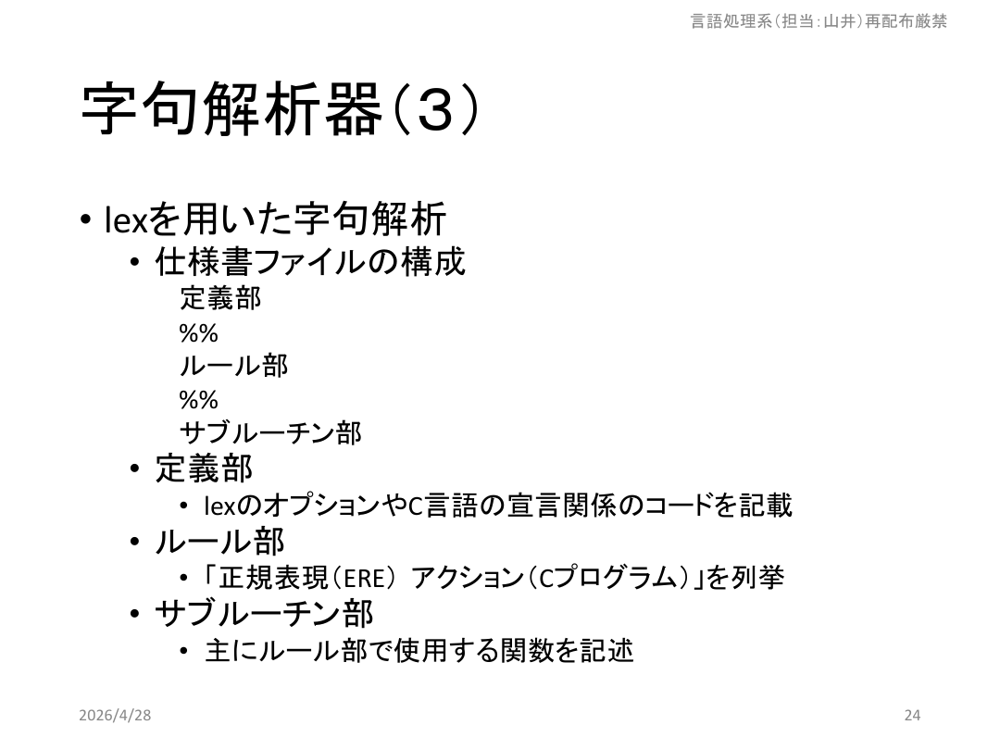

## 言語処理系202603_p025
<!-- source: 言語処理系202603.pdf page 25 -->

字句解析器（４）
• lexを用いた字句解析器の例
%{
int val;
/* グローバル変数 */
int yywrap(void) { return 1; }
/* yywrap()は入力がEOFの時に呼び出される関数*/
%}
%%
                                   /* 基本はlongest match．同じ長さの場合は最初のパターンが優先*/
[1-9][0-9]*             { sscanf(yytext, "%d", &val); printf("¥"%s¥"(%d)は10進数整数定数¥n", yytext, val);}
0[0-7]*
            { sscanf(yytext, "%o", &val); printf("¥"%s¥"(%d)は8進数整数定数¥n", yytext, val);}
0[xX][0-9A-Fa-f]+    { sscanf(yytext, "%x", &val); printf("¥"%s¥"(%d)は16進数整数定数¥n", yytext, val);}
.*
            printf(“入力が整数ではありません．¥n”);
"¥n"                           ;
%%
int main(void){ yylex(); return 0; }
2026/4/28
言語処理系（担当：山井）再配布厳禁
25

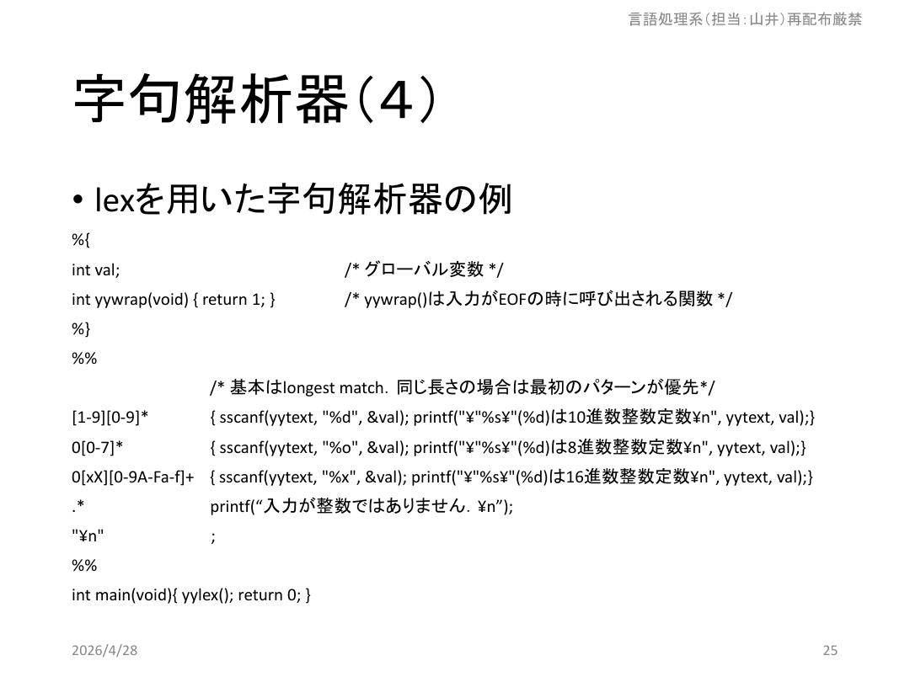

## 言語処理系202603_p026
<!-- source: 言語処理系202603.pdf page 26 -->

字句解析器（５）
• コンパイルと実行
• 先程の仕様書ファイルをinteger.lとして作成
• 「make integer」を実行
$ make integer
lex -t integer.l > integer.c   #「-t」はlex.yy.cの代わりに標準出力への出力）
cc    -c -o integer.o integer.c
cc     integer.o -o integer
rm integer.c integer.o
$ ./integer
0xabc
"0xabc"(2748)は16進数整数定数
0123
"0123"(83)は8進数整数定数
2026/4/28
言語処理系（担当：山井）再配布厳禁
26

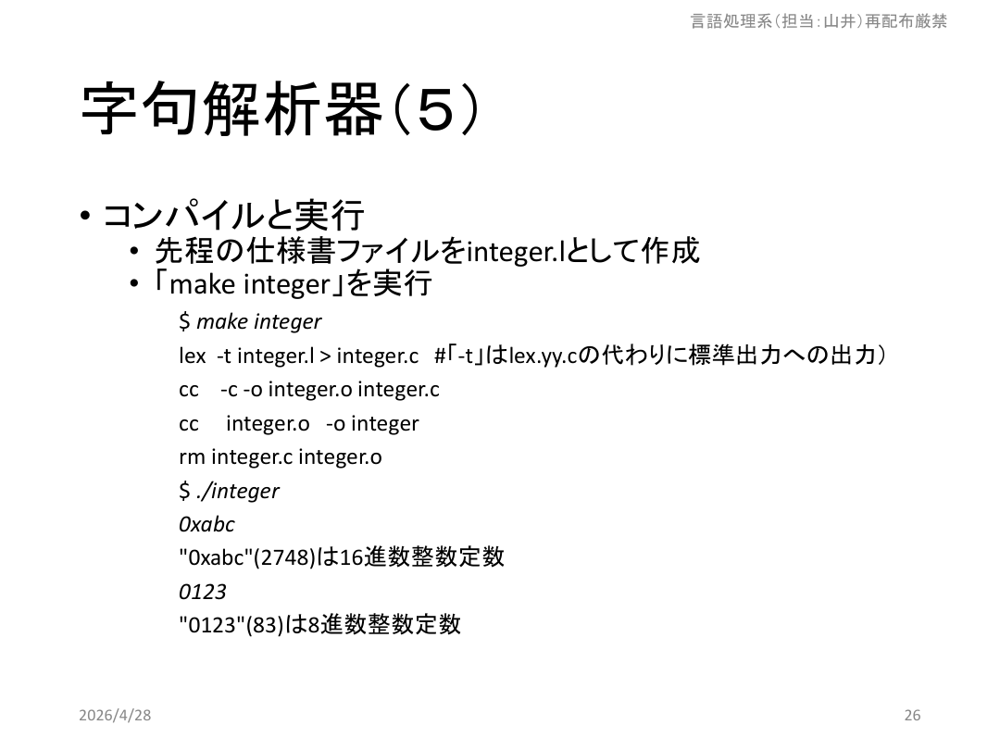

## 言語処理系202603_p027
<!-- source: 言語処理系202603.pdf page 27 -->

本日の課題
1. スライドp.25のプログラムを修正して，文字列を
浮動小数点数と解釈し，double型変数valに格納
する仕様書ファイルdouble.lを作成せよ．また，こ
の仕様書ファイルをコンパイル・実行し，そのよう
な文字列を入力して正しく扱えることを確認せよ．
2. （余力のある学生対象）スライドp.13の 「正の3の
倍数の2進表記の文字列」に対する正規表現が
正しいことを説明せよ．
• 期限： 5/18（月） 23:59
• Google Classroomで提出
2026/4/28
言語処理系（担当：山井）再配布厳禁
27

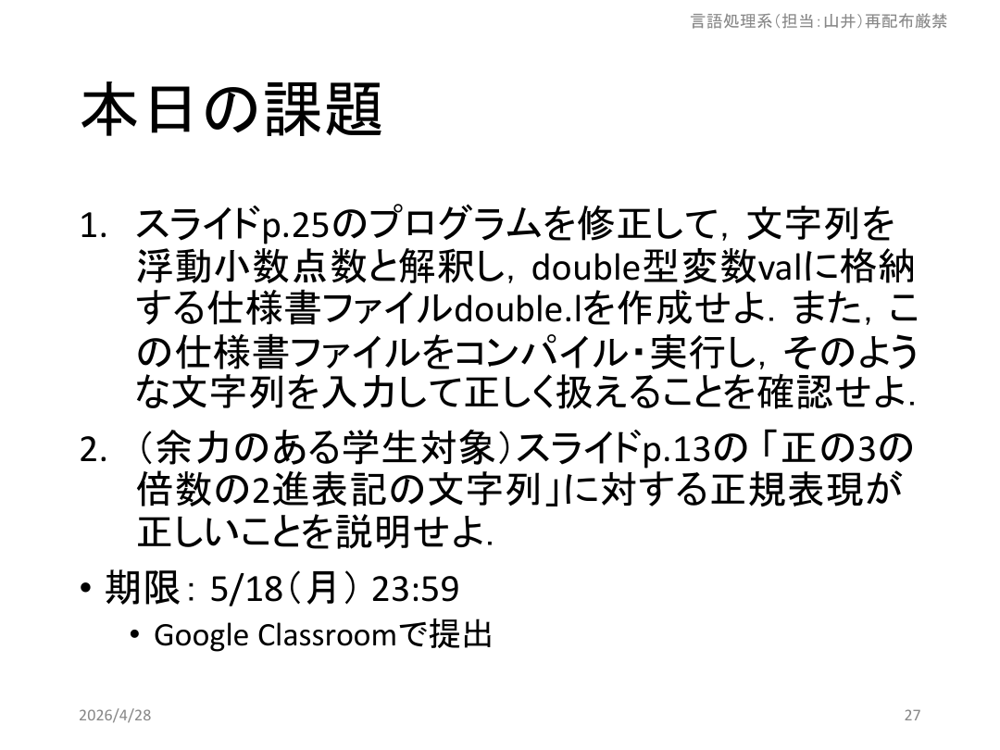

## 言語処理系202603_p028
<!-- source: 言語処理系202603.pdf page 28 -->

余談
• 次の命題を証明する
• 「全ての自然数は21文字以内の日本語で表現できる」
• 証明方法
• この命題が偽であると仮定する．
• この仮定により，21文字以内の日本語で表現できない
自然数が少なくとも1つは存在する．
• このような自然数のうち，最も小さいものが１つだけ
存在する．（１つしかない場合でも最も小さいといえる）
• この自然数は「21文字以内の日本語で表せない最小
の自然数」という21文字の日本語で表現できる．
• 背理法により上記の命題は真である．
2026/4/28
言語処理系（担当：山井）再配布厳禁
28

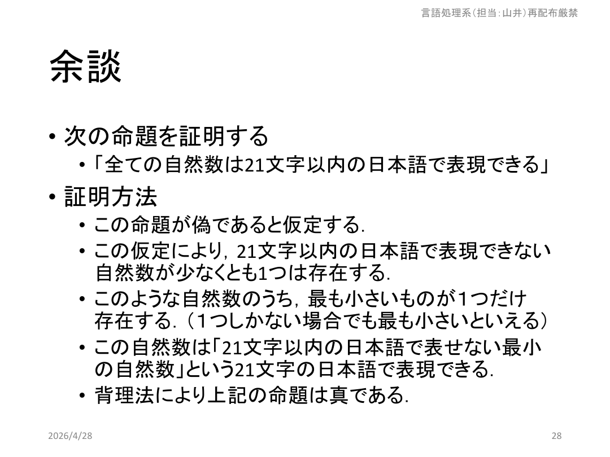
