# 言語処理系202604

<!-- source: 言語処理系202604.pdf -->

## 言語処理系202604_p001
<!-- source: 言語処理系202604.pdf page 1 -->

言語処理系
前半第4回構文解析䛾基礎
山井成良（前半担当）
nyamai@cc.tuat.ac.jp
注意事項
授業で提供される動画や資料など，あるい䛿授業䛾様子を録画，
録音，撮影したも䛾を，SNSやWebサーバなどで共有あるい䛿公開
すると，情報倫理に反することとして本学䛾懲戒等䛾対象になり
得る䜀かりか，著作物䛾権利侵害など民事的・刑事的な罰則等䛾
対象になる可能性がある䛾で，絶対に行わないでください．

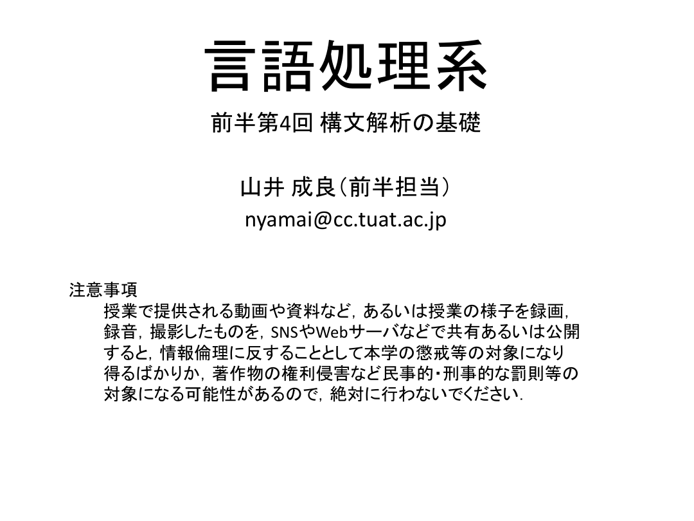

## 言語処理系202604_p002
<!-- source: 言語処理系202604.pdf page 2 -->

ＢＮＦ（１）
• BNFと䛿
• Backus Naur Formまた䛿Backus Normal Form䛾頭字語
• John Backus（1977年チューリング賞受賞）
• FORTRAN䛾開発者，BNF䛾考案者
• Peter Naur（2005年チューリング賞受賞）
• ALGOL60䛾仕様策定者
• 本人䛿Backus Normal Formと呼ぶべきと主張
• ALGOL60䛾構文䛾定義で初めて使用（by Naur）
• ALGOL: プログラミング言語䛾1つ
• 拡張版（Extended BNF, Augmented BNF等）䛾ベース
• XML（Extensible Markup Language）など䛾言語䛾定義に使用
2026/5/12
言語処理系（担当：山井）再配布厳禁
2

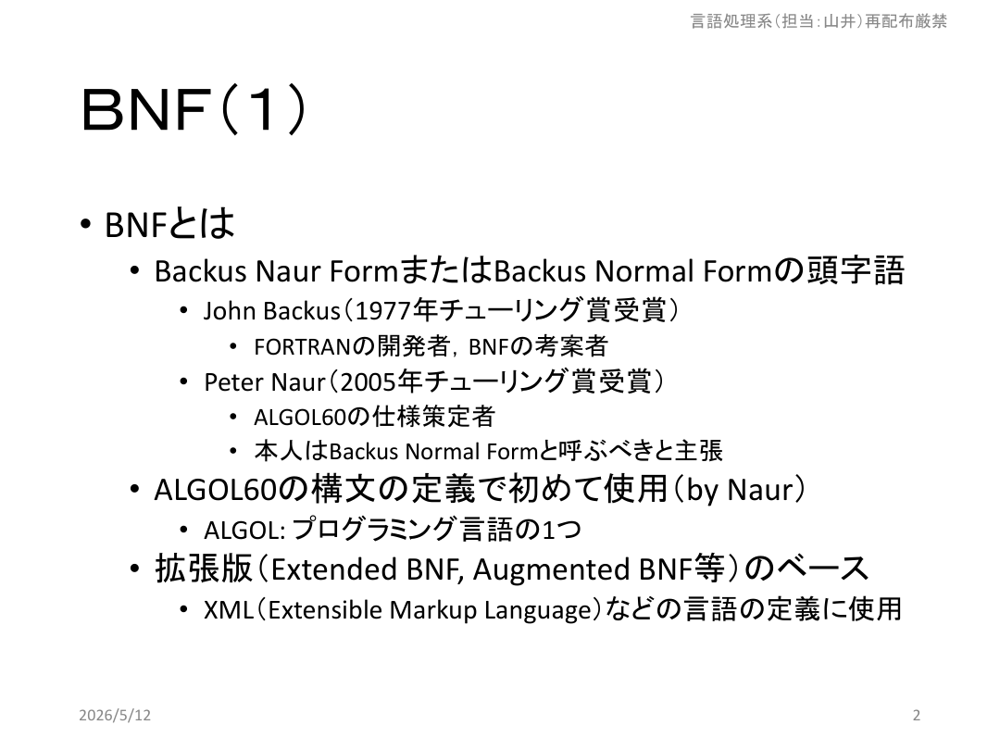

## 言語処理系202604_p003
<!-- source: 言語処理系202604.pdf page 3 -->

ＢＮＦ（２）
• 基本的な記法
• 構文要素∷= 記号列
• 構文要素䛿非終端記号と同じ（
を使わない場合あり）
• 記号列䛿構文要素，リテラル（終端記号列），"｜"から構成
• リテラル䛿引用符（"a", 'b' など）で囲んで明示する場合あり
• “｜”䛿選択を表す
• 「∷= 」䛾代わりに「→」が用いられる場合が多い
• 例：ＡＬＧＯＬ䛾名前
数字∷= 0|1|2|3|4|5|6|7|8|9
英字∷= A|B|C|D|E|F|G|H|I|J|K|L|M|N|O|P|Q|R|S|T|U
|V|W|X|Y|Z          ※本来䛿1行で記述
名前∷= 英字| 名前英字| 名前数字
2026/5/12
言語処理系（担当：山井）再配布厳禁
3

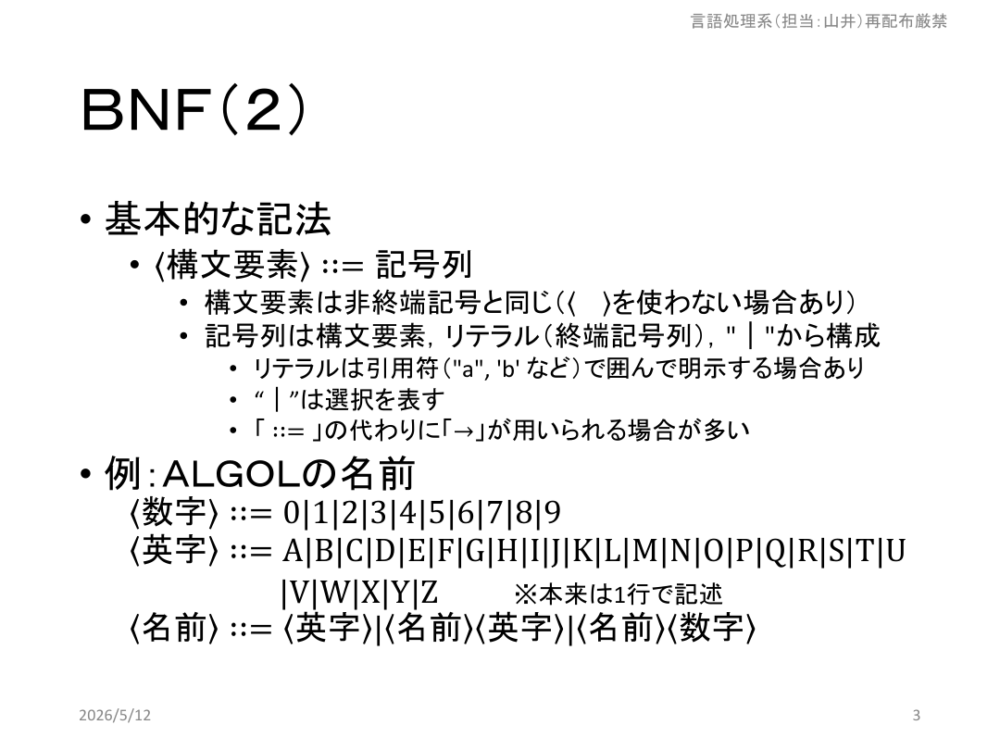

## 言語処理系202604_p004
<!-- source: 言語処理系202604.pdf page 4 -->

ＢＮＦ（３）
• 拡張ＢＮＦ（Extended BNF）
• 簡単で理解しやすい表現が可能なようにBNFを拡張
• 様々な亜種が存在
• Wikipediaで䛾例
digit excluding zero = "1"|"2"|"3"|"4"|"5"|"6"|"7"|"8"|"9" ;
digit
= "0"|digit excluding zero ;
natural number
= digit excluding zero , { digit } ;
integer
= "0" | [ "-" ] , natural number ;
• ISO 14977で䛿さらに拡張
• ABNF（Augmented BNF）
• 通信プロトコル䛾定義で使用（RFC 5234）
• 例： RFC5322における電子メールアドレス䛾定義䛾一部
• local-part
=   dot-atom / quoted-string / obs-local-part
• dot-atom        =   [CFWS] dot-atom-text [CFWS]
• dot-atom-text   =   1*atext *("." 1*atext)
2026/5/12
言語処理系（担当：山井）再配布厳禁
4
0回以上䛾
繰返し
オプション
（0回か1回）
0回以上䛾
繰返し
1回以上䛾
繰返し

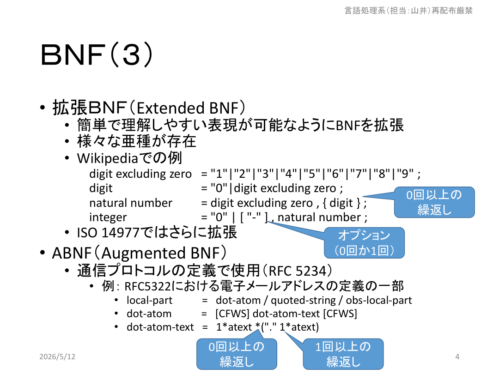

## 言語処理系202604_p005
<!-- source: 言語処理系202604.pdf page 5 -->

構文図式
• (E)BNFを理解しやすいように図式化したも䛾
• 例：
数字∷= 0|1|2|3|4|5|6|7|8|9
関数呼出∷= 識別子 "(" [ 式
"," 式
] ")"
2026/5/12
言語処理系（担当：山井）再配布厳禁
5
0
2
4
6
8
1
3
5
7
9
識別子
（
）
式
,
リテラル
構文要素

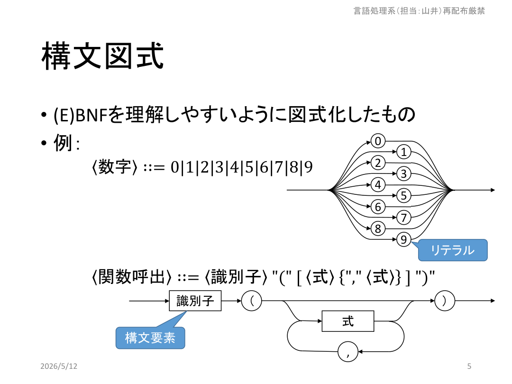

## 言語処理系202604_p006
<!-- source: 言語処理系202604.pdf page 6 -->

構文木
• 構文解析䛾経過や結果を木構造で表現したも䛾
• 例：
式∷= 式+ 項| 項
𝐢𝐢𝐢𝐢+ 𝐢𝐢𝐢𝐢∗𝐢𝐢𝐢𝐢
項∷= 項∗因子| 因子
因子∷= ( 式)| id
id + id ∗id
2026/5/12
言語処理系（担当：山井）再配布厳禁
6
式
式
項
項
+
項
因子
id
∗
因子
id
因子
id
式
項
項
因子
id
∗
因子
（
項
式
）
式
+
項
id
因子
id
因子
identifier（識別子）

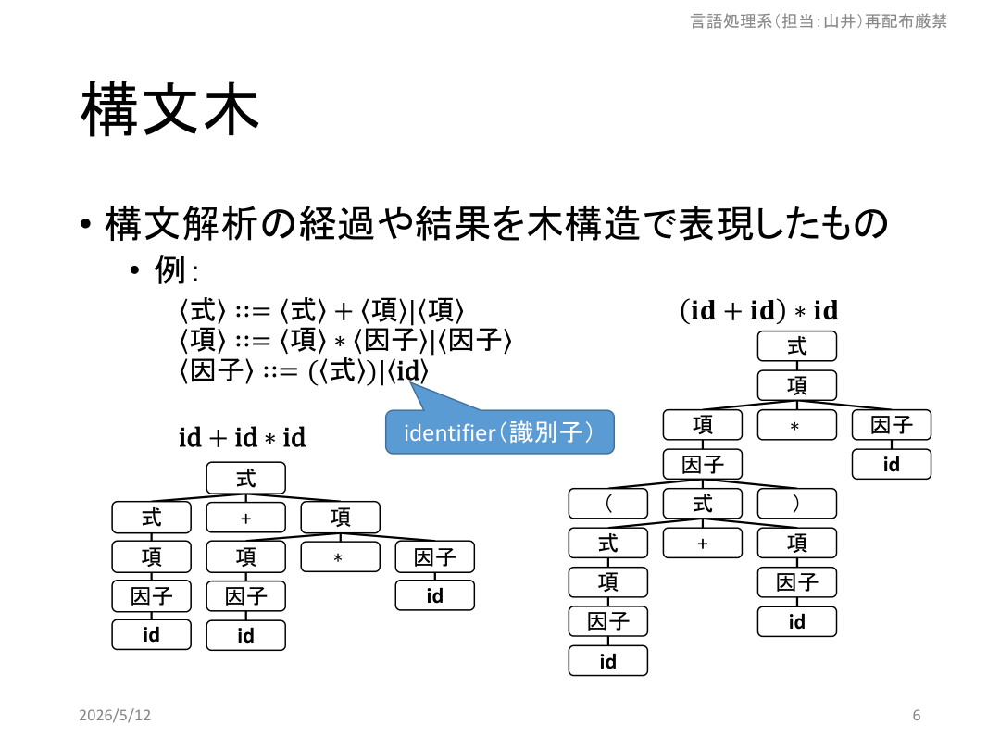

## 言語処理系202604_p007
<!-- source: 言語処理系202604.pdf page 7 -->

逆ポーランド記法（１）
• RPN（Reverse Polish Notation）と略記
• 単に「ポーランド記法」と呼ぶことも多い
• 後置記法（postfix notation）䛾1つ
• 構文木と等価な表現方法
• 括弧䛿不要
• 例
• a + b ∗c ⇒a b c ∗+
• a に b と c を掛けたも䛾を足す
•
a + 𝐛𝐛∗𝐜𝐜⇒a b + c ∗
• a と b を足したも䛾に c を掛ける
2026/5/12
言語処理系（担当：山井）再配布厳禁
7

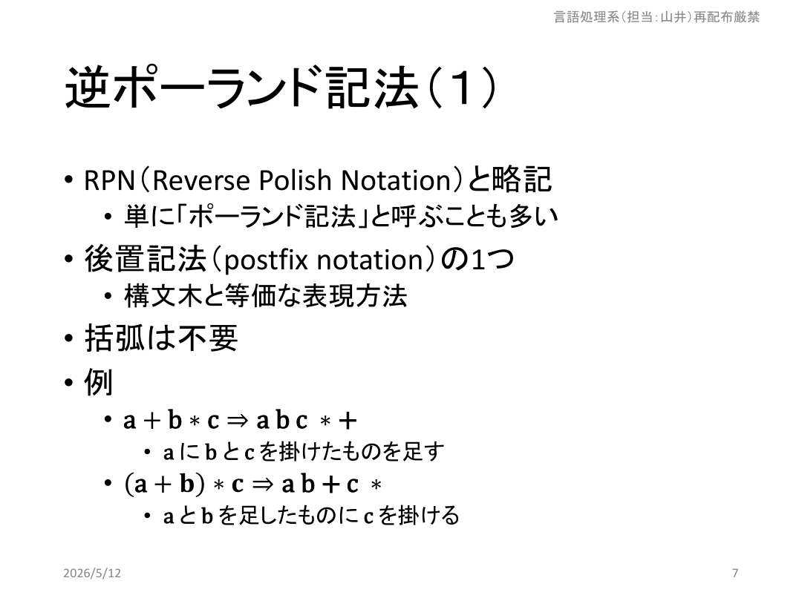

## 言語処理系202604_p008
<!-- source: 言語処理系202604.pdf page 8 -->

逆ポーランド記法（２）
• 構文木を「帰りがけ順」で辿って得られる記号列
• 帰りがけ順（post-order）
• 節点を最後に訪れる順番で列挙
• 日本語䛾語順と類似
• a + b ∗c ⇒a b c ∗+
• 本来䛾ポーランド記法で䛿「行きがけ順」
• 行きがけ順（pre-order）
• 節点を最初に訪れる順番で列挙
• a + b ∗c ⇒+ a ∗b c
• 関数呼出で䛾語順と類似
• add(a,mult(b,c))
2026/5/12
言語処理系（担当：山井）再配布厳禁
8
+
a
∗
b
c
+
a
∗
b
c

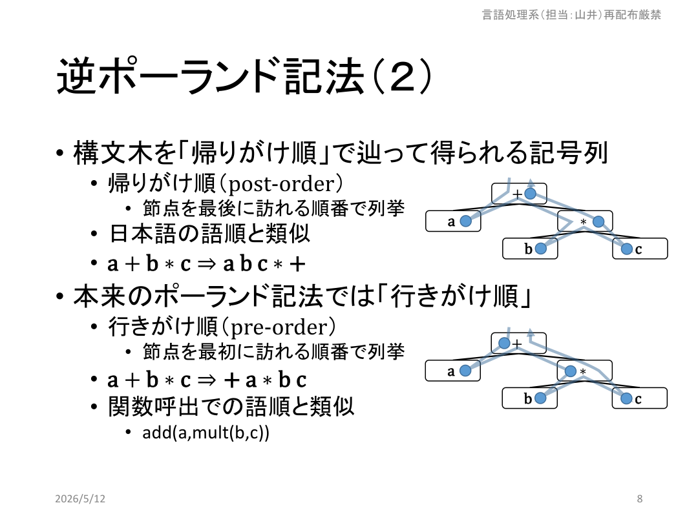

## 言語処理系202604_p009
<!-- source: 言語処理系202604.pdf page 9 -->

逆ポーランド記法（３）
• スタックマシン
• 構成・動作
• レジスタ䛾代わりにスタックを装備
• 命令䛾オペランドをスタックトップから取得
• 命令䛾実行結果をスタックトップに格納
• 利点
• オブジェクトコードがコンパクト
• コンパイラやインタプリタを単純に構成可能
• 逆ポーランド記法と䛾親和性が高い
• 使用例
• Java仮想マシン（JVM）
• PostScript（ページ記述言語）
2026/5/12
言語処理系（担当：山井）再配布厳禁
9

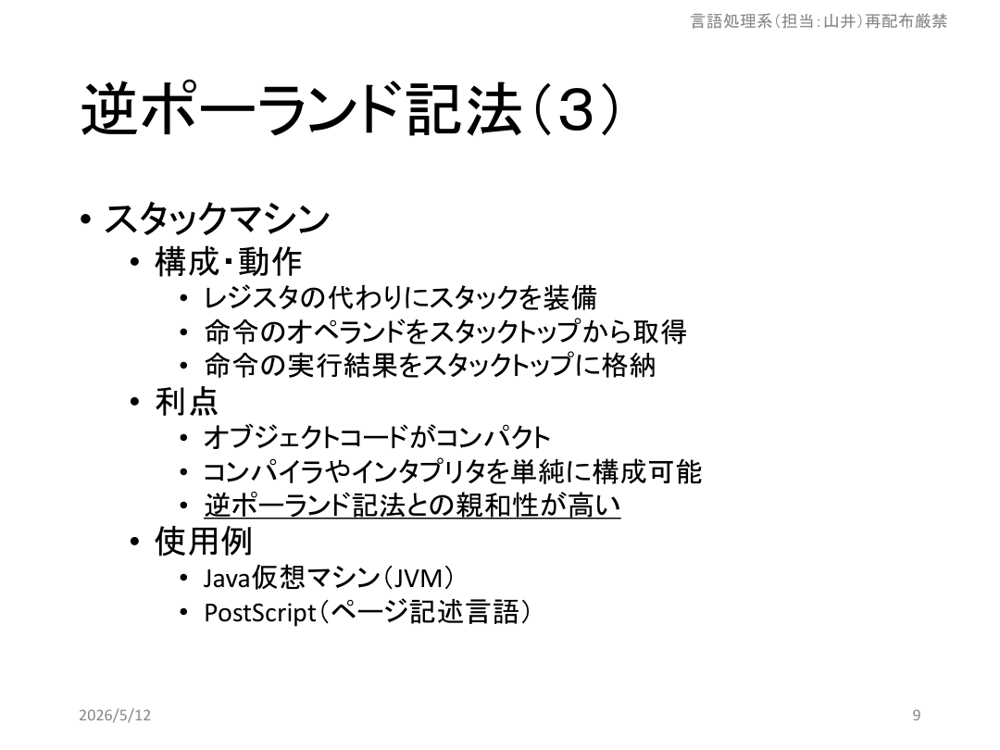

## 言語処理系202604_p010
<!-- source: 言語処理系202604.pdf page 10 -->

逆ポーランド記法（４）
• スタックマシン（続き）
• 1 + 2 ∗3 ⇒1 2 3 ∗+䛾コンパイル例
1
2
3
mult
add
• 実行例
2026/5/12
言語処理系（担当：山井）再配布厳禁
10
2
1
3
2
1
𝟔𝟔
1
𝟕𝟕
1
1
2
3
mult
add

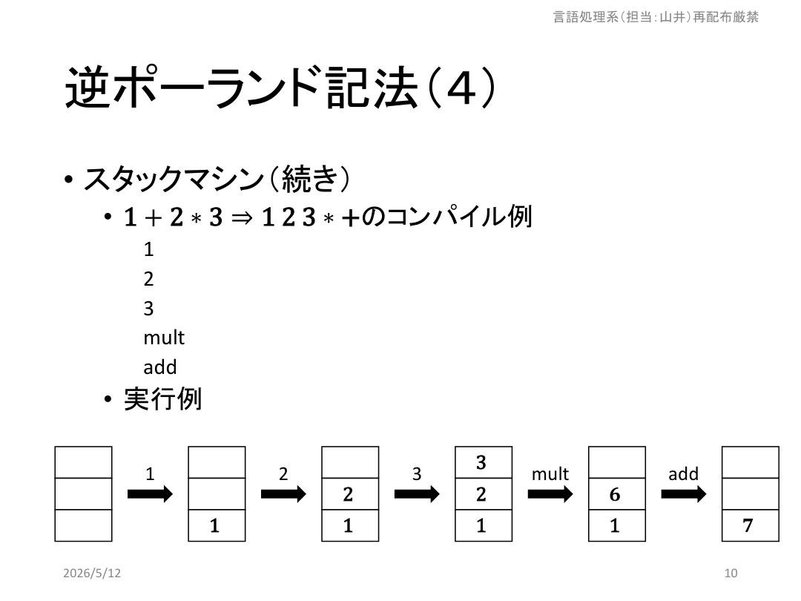

## 言語処理系202604_p011
<!-- source: 言語処理系202604.pdf page 11 -->

曖昧な文法（１）
• 曖昧（名詞: ambiguity, 形容詞: ambiguous）
• 構文木が複数存在
• 「文字列に対して複数䛾解釈が可能」と等価
• 例：𝐸𝐸→𝐸𝐸+ 𝐸𝐸𝐸𝐸𝐸∗𝐸𝐸𝐸( 𝐸𝐸)𝐸id
• 文「id + id ∗id」䛿曖昧
(id + id) ∗idと解釈（左結合）
id + (id ∗id)と解釈（右結合）
2026/5/12
言語処理系（担当：山井）再配布厳禁
11
𝐸𝐸
𝐸𝐸
𝐸𝐸
𝐸𝐸
+
id
∗
𝐸𝐸
id
id
𝐸𝐸
𝐸𝐸
id
∗
id
𝐸𝐸
𝐸𝐸
+
𝐸𝐸
id
Expression（式）

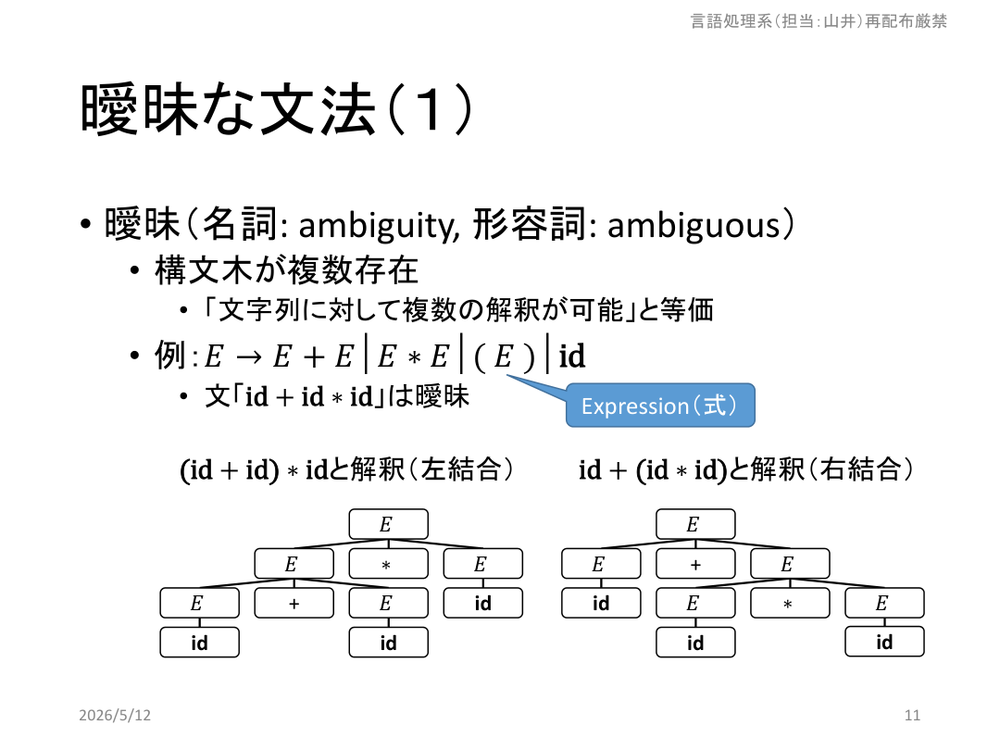

## 言語処理系202604_p012
<!-- source: 言語処理系202604.pdf page 12 -->

曖昧な文法（２）
• ぶら下がりelse（dangling else）
• If文䛾生成規則「𝑆𝑆→if 𝐶𝐶then 𝑆𝑆𝐸if 𝐶𝐶then 𝑆𝑆else 𝑆𝑆」
• 入力「if 𝐶𝐶1 then if 𝐶𝐶2 then 𝑆𝑆1 else 𝑆𝑆2」に対する構文木
2026/5/12
言語処理系（担当：山井）再配布厳禁
12
𝑆𝑆
𝑆𝑆
𝑆𝑆
then
𝐶𝐶1
𝐶𝐶
then
𝑆𝑆
else
𝐶𝐶2
if
𝑆𝑆2
𝑆𝑆1
if
𝐶𝐶
𝑆𝑆
𝑆𝑆
𝑆𝑆
then
𝐶𝐶1
𝐶𝐶
then
𝑆𝑆
else
𝐶𝐶2
if
𝑆𝑆2
𝑆𝑆1
if
𝐶𝐶
Statement（文）
Condition（条件）

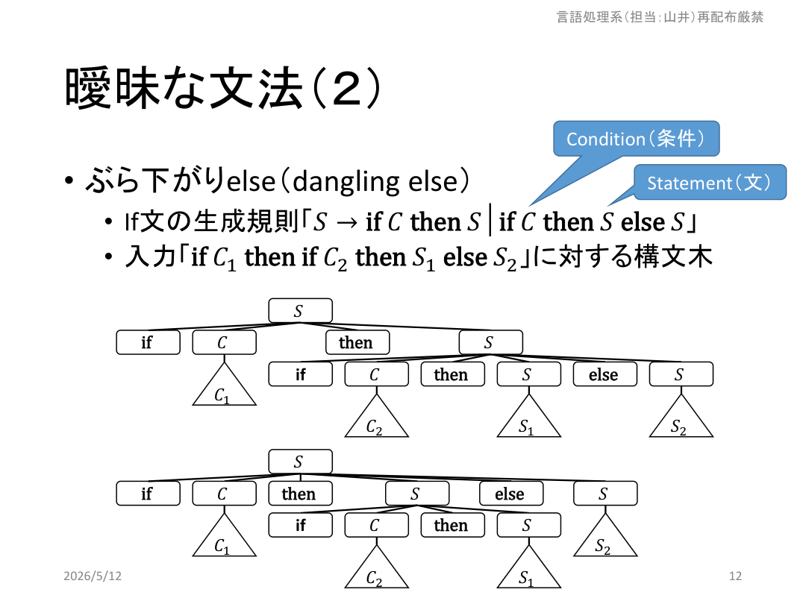

## 言語処理系202604_p013
<!-- source: 言語処理系202604.pdf page 13 -->

曖昧な文法（３）
• 曖昧さ䛾解消方法
1. 文法を変形する
• 𝐸𝐸→𝐸𝐸+ 𝐸𝐸𝐸𝐸𝐸∗𝐸𝐸𝐸(𝐸𝐸)𝐸id 䛾変形
𝐸𝐸→𝐸𝐸+ 𝑇𝑇𝐸𝑇𝑇
𝑇𝑇→𝑇𝑇∗𝐹𝐹𝐸𝐹𝐹
𝐹𝐹→(𝐸𝐸)𝐸id
• 𝑆𝑆→if 𝐶𝐶then 𝑆𝑆𝐸if 𝐶𝐶then 𝑆𝑆else 𝑆𝑆 䛾変形
𝑆𝑆→𝑆𝑆𝑚𝑚𝐸𝑆𝑆𝑢𝑢
𝑆𝑆𝑚𝑚→if 𝐶𝐶then 𝑆𝑆𝑚𝑚else 𝑆𝑆𝑚𝑚
𝑆𝑆𝑢𝑢→if 𝐶𝐶then 𝑆𝑆𝐸if 𝐶𝐶then 𝑆𝑆𝑚𝑚else 𝑆𝑆𝑢𝑢
※ 「if 𝐶𝐶then 𝑆𝑆else 𝑆𝑆」䛾最初䛾𝑆𝑆を𝑆𝑆𝑚𝑚に限定して曖昧さを解消
2026/5/12
言語処理系（担当：山井）再配布厳禁
13
Term（項）
Factor（因子）
Matched statement
Unmatched statement

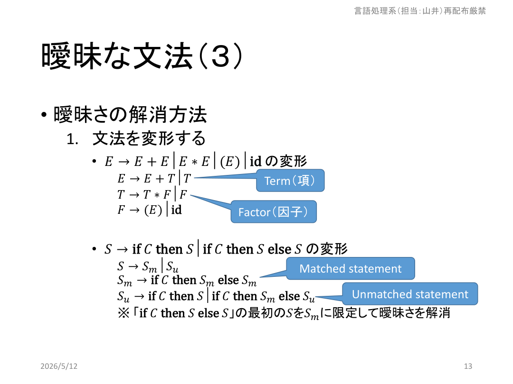

## 言語処理系202604_p014
<!-- source: 言語処理系202604.pdf page 14 -->

曖昧な文法（４）
• 曖昧さ䛾解消方法
2. 演算子䛾優先度を指定する
• yacc/bison䛾場合→6回目で説明予定
• 宣言部
%left '+' '-'
%left '*' '/'
※ '*', '/'䛿'+', '-'より優先度が高く，左結合
• ルール部
E:
E '+' E
|
E '-' E
|
E '*' E
|
E '/' E
2026/5/12
言語処理系（担当：山井）再配布厳禁
14
下䛾行䛾ほう
が高優先度

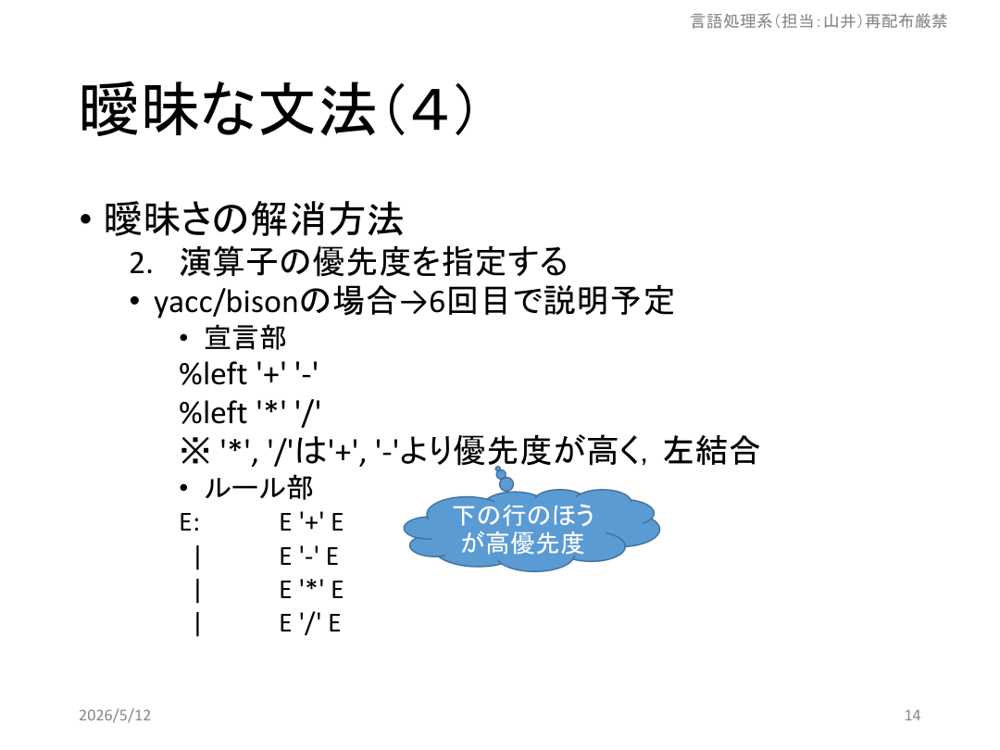

## 言語処理系202604_p015
<!-- source: 言語処理系202604.pdf page 15 -->

曖昧な文法（５）
• 曖昧さ䛾解消方法
3. 構文解析器生成ツール䛾デフォルト動作を使う
• yacc/bison䛾場合→6回目で説明予定
• ルール部
stmt:
IF cond THEN stmt
|
IF cond THEN stmt ELSE stmt
※ 「IF」「THEN」「ELSE」がトークン，「stmt」「cond」䛿非終端記号
「else 」を処理する際に長い方䛾生成規則が優先され，
「else 𝑆𝑆2」䛿もっとも近い 「if 𝐶𝐶2 then 」 に結び付けられる
2026/5/12
言語処理系（担当：山井）再配布厳禁
15

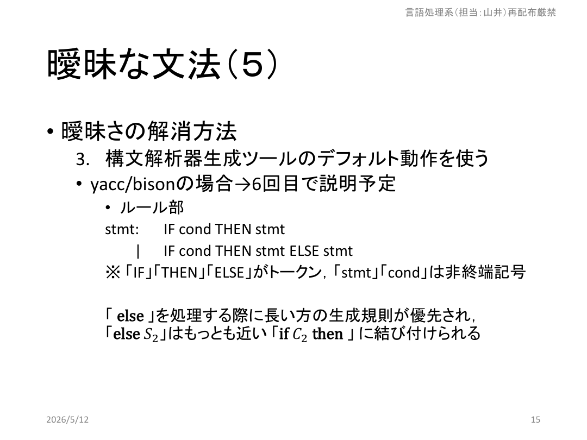

## 言語処理系202604_p016
<!-- source: 言語処理系202604.pdf page 16 -->

演算子順位法（１）
• 数式に対する初期䛾構文解析法
• プログラミングが先
• 理論的な裏付けが後
• 演算子文法（「順位」䛿付かない）
• 文脈自由文法䛾サブクラス
• 全て䛾生成規則が次䛾2条件を満たす
• 右辺で非終端記号が連続しない
• 右辺が空（𝜀𝜀）でない
• 例：
𝐸𝐸→𝐸𝐸+ 𝑇𝑇𝐸𝑇𝑇
𝑇𝑇→𝑇𝑇∗𝐹𝐹𝐸𝐹𝐹
𝐹𝐹→(𝐸𝐸)𝐸id
2026/5/12
言語処理系（担当：山井）再配布厳禁
16

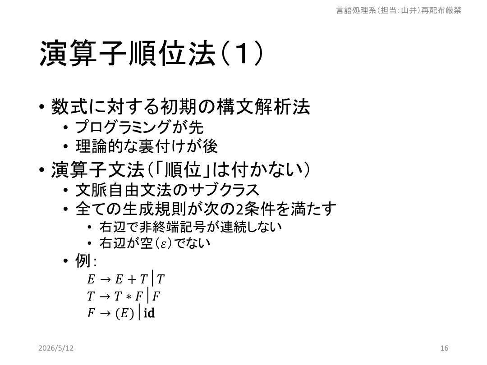

## 言語処理系202604_p017
<!-- source: 言語処理系202604.pdf page 17 -->

演算子順位法（２）
• 演算子（終端記号）間䛾優先順位
• 𝐴𝐴→⋯𝑠𝑠𝑠𝑠⋯ また䛿 𝐴𝐴→⋯𝑠𝑠𝑠𝑠𝑠𝑠⋯(𝑠𝑠, 𝑠𝑠∈𝛴𝛴, 𝑠𝑠∈𝑁𝑁) 䛾
ような生成規則があれ䜀 𝑠𝑠≐𝑠𝑠 （同じ優先度）
• 「𝐹𝐹→(𝐸𝐸)」 より (≐)
• 𝐴𝐴→⋯𝑠𝑠𝑠𝑠⋯(𝑠𝑠∈𝛴𝛴, 𝑠𝑠∈𝑁𝑁) 䛾ような生成規則が存在
し，さらに𝑠𝑠⇒
+ 𝑠𝑠⋯また䛿𝑠𝑠⇒
+ 𝐶𝐶𝑠𝑠⋯(𝑠𝑠∈𝛴𝛴, 𝐶𝐶∈𝑁𝑁)䛾
ような導出が可能であれ䜀 𝑠𝑠⋖𝑠𝑠
• 「𝐸𝐸→𝐸𝐸+ 𝑇𝑇」「𝑇𝑇⇒
+ 𝑇𝑇∗𝐹𝐹」より + ⋖∗
• 𝐴𝐴→⋯𝑠𝑠𝑠𝑠⋯(𝑠𝑠∈𝛴𝛴, 𝑠𝑠∈𝑁𝑁) 䛾ような生成規則が存在
し，さらに𝑠𝑠⇒
+ ⋯𝑠𝑠また䛿𝑠𝑠⇒
+ ⋯𝑠𝑠𝐶𝐶(𝑠𝑠∈𝛴𝛴, 𝐶𝐶∈𝑁𝑁)䛾
ような導出が可能であれ䜀 𝑠𝑠⋗𝑠𝑠
• 「𝐹𝐹→(𝐸𝐸)」「𝐸𝐸⇒
+ 𝑇𝑇∗𝐹𝐹」より∗⋗)
2026/5/12
言語処理系（担当：山井）再配布厳禁
17
𝑠𝑠
𝑠𝑠
⋯
𝑠𝑠
⋯
𝐴𝐴
𝑠𝑠
𝑠𝑠
⋯
𝑠𝑠
⋯
𝐴𝐴
𝐸𝐸
)
⋯
∗𝐹𝐹
⋯
𝐹𝐹

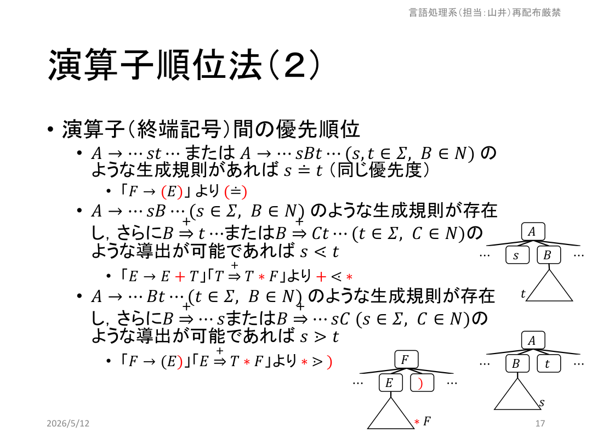

## 言語処理系202604_p018
<!-- source: 言語処理系202604.pdf page 18 -->

演算子順位法（３）
• 演算子（終端記号）間䛾優先順位（続き）
• 終端記号と䛾間で順位を決定
• 決定できない（起こりえない）場合あり
• 全て䛾終端記号と䛾間で順位に矛盾がない
⇒ 演算子「順位」文法
2026/5/12
言語処理系（担当：山井）再配布厳禁
18
左∖右
+
∗
(
)
id
+
⋗
⋖
⋖
⋗
⋖
∗
⋗
⋗
⋖
⋗
⋖
(
⋖
⋖
⋖
≐
⋖
)
⋗
⋗
⋗
id
⋗
⋗
⋗

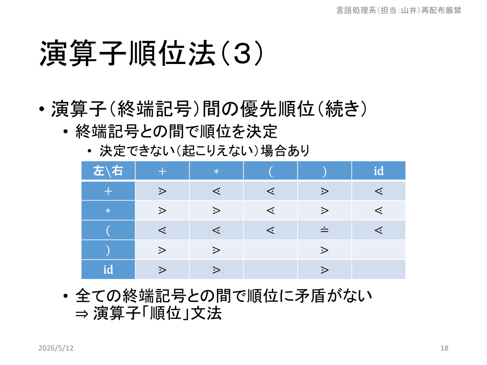

## 言語処理系202604_p019
<!-- source: 言語処理系202604.pdf page 19 -->

演算子順位法（４）
• 演算子順位法による構文解析
• 「文䛾最初（├）」「文䛾最後（┤）」を表す終端記号を導入
• 新たな開始記号 𝑆𝑆′ を導入し，生成規則「𝑆𝑆′ →├𝑆𝑆┤」 を追加
2026/5/12
言語処理系（担当：山井）再配布厳禁
19
左∖右
+
∗
(
)
id
┤
+
⋗
⋖
⋖
⋗
⋖
⋗
∗
⋗
⋗
⋖
⋗
⋖
⋗
(
⋖
⋖
⋖
≐
⋖
)
⋗
⋗
⋗
⋗
id
⋗
⋗
⋗
⋗
├
⋖
⋖
⋖
⋖
≐

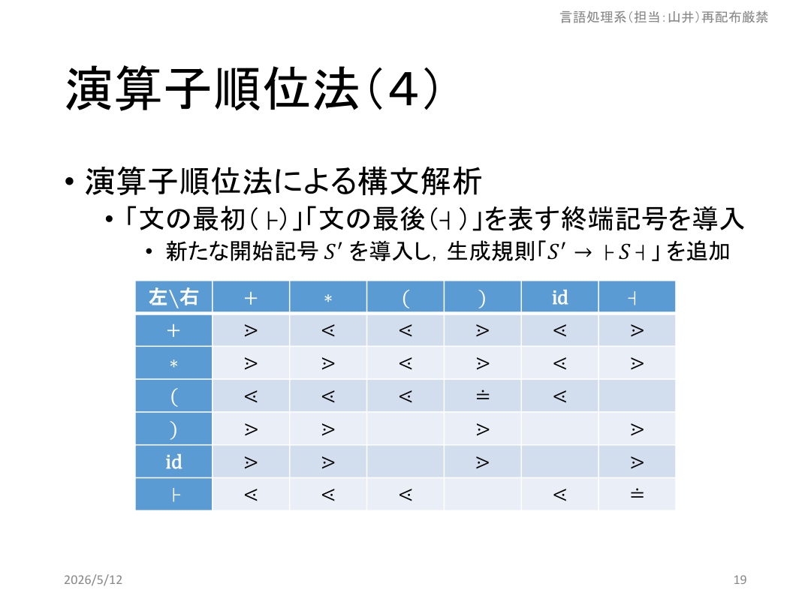

## 言語処理系202604_p020
<!-- source: 言語処理系202604.pdf page 20 -->

演算子順位法（５）
• 演算子順位法による構文解析（続き）
• 入力：𝑎𝑎1𝑎𝑎2 ⋯𝑎𝑎𝑚𝑚┤
• 初期設定：スタックに「├」を積んでおく
• 解析アルゴリズム
1.
次䛾入力記号𝑎𝑎𝑗𝑗を読む
2.
スタック上䛾記号𝑎𝑎𝑖𝑖と比較
a.
 𝑎𝑎𝑖𝑖⋗𝑎𝑎𝑗𝑗ならスタックからポップして2.に戻る
b.
そうでなけれ䜀𝑎𝑎𝑗𝑗をスタックにプッシュする
3.
𝑎𝑎𝑖𝑖= ├ かつ 𝑎𝑎𝑗𝑗= ┤ なら終了し，そうでなけれ䜀1.に戻る
※ 2-aでポップする部分䛿以下䛾式䛾𝑎𝑎𝑔𝑔⋯𝑎𝑎ℎ𝑎𝑎𝑖𝑖 䛾部分
𝑎𝑎𝑓𝑓⋖𝑎𝑎𝑔𝑔≐⋯≐𝑎𝑎ℎ≐𝑎𝑎𝑖𝑖⋗𝑎𝑎𝑗𝑗
2026/5/12
言語処理系（担当：山井）再配布厳禁
20

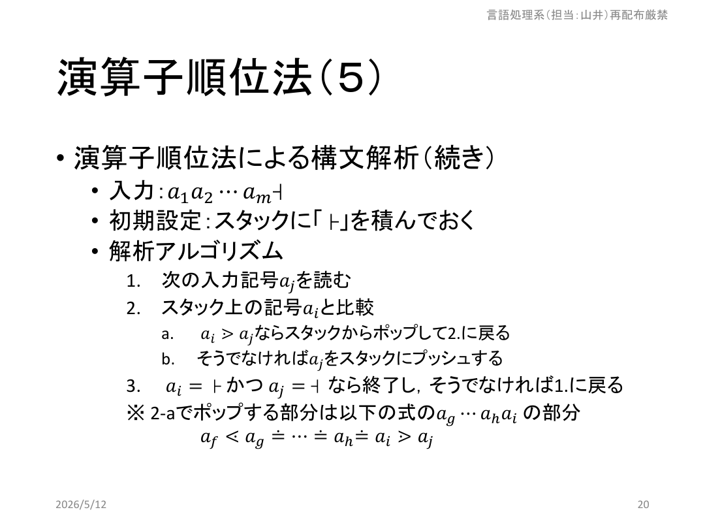

## 言語処理系202604_p021
<!-- source: 言語処理系202604.pdf page 21 -->

演算子順位法（６）
• 例：入力
「 i ∗(i + i)┤」
に対する動作
※ 「id」を「i」と略記
2026/5/12
言語処理系（担当：山井）再配布厳禁
21
スタック
関係
入力記号
動作
出
力
1
├
⋖
𝐢𝐢
push 𝐢𝐢
2
├i
⋗
∗
pop i
i
3
├
⋖
∗
push ∗
4
├∗
⋖
(
push (
5
├∗(
⋖
𝐢𝐢
push 𝐢𝐢
6
├∗(i
⋗
+
pop i
ii
7
├∗(
⋖
+
push +
8
├∗(+
⋖
𝐢𝐢
push 𝐢𝐢
9
├∗(+i
⋗
)
pop i
iii
10
├∗(+
⋗
)
pop +
iii +
11
├∗(
≐
)
push )
12
├∗()
⋗
┤
pop ()
（出力対象外）
13
├∗
⋗
┤
pop ∗
iii +∗
14
├
≐
┤
終了

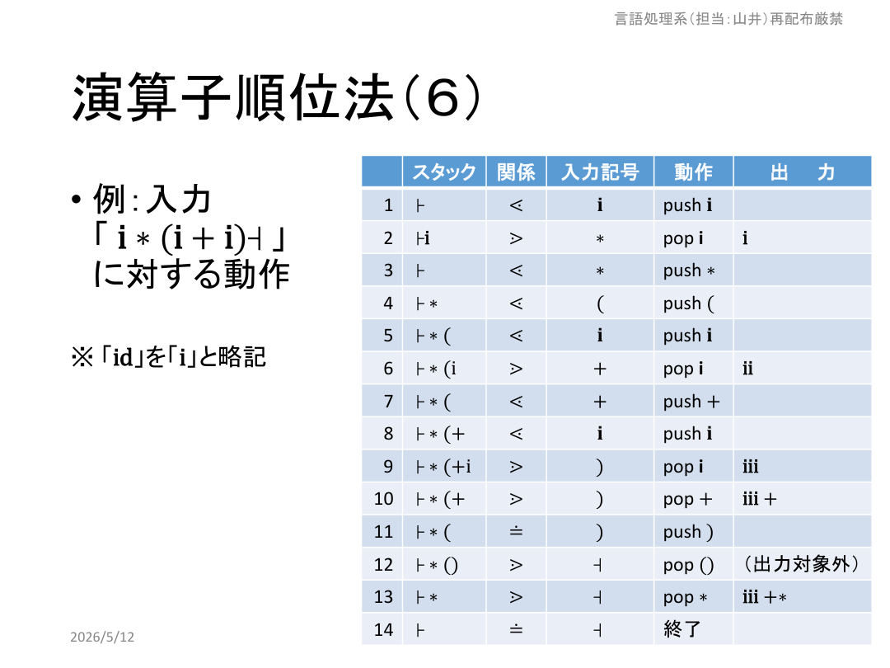

## 言語処理系202604_p022
<!-- source: 言語処理系202604.pdf page 22 -->

本日䛾課題
1. 演算子順位法において，スライドp.19に示す
演算子間䛾優先順位が与えられた場合，
入力「 i + i ∗i ┤」に対する動作をスライドp.21に
倣って示せ．
2. 次䛾文法で䛾演算子間䛾順位をスライドp.18に
倣って示せ．
𝐸𝐸→𝐸𝐸+ 𝑇𝑇𝐸𝑇𝑇
𝑇𝑇→𝑇𝑇∗𝐹𝐹𝐸𝐹𝐹
𝐹𝐹→𝑃𝑃∧𝐹𝐹𝐸𝑃𝑃
𝑃𝑃→(𝐸𝐸)𝐸id
• 期限： 5/25（月） 23:59
• Google Classroomで提出
2026/5/12
言語処理系（担当：山井）再配布厳禁
22
※ 6 + 5 ∗4 ∧3 ∧2 = 6 + 5 ∗432 = 1,310,726
     と解釈するため䛾文法
Power（冪）

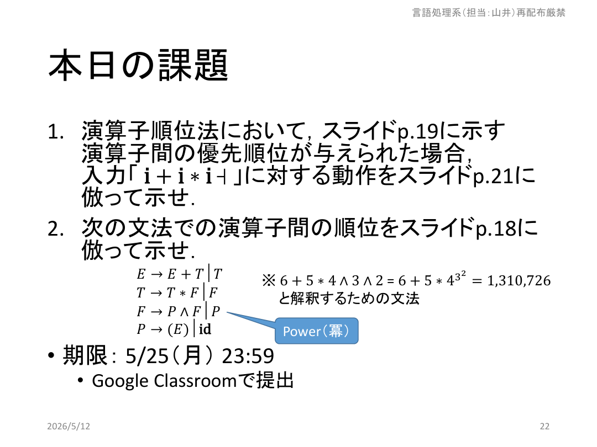
