# 言語処理系202605

<!-- source: 言語処理系202605.pdf -->

## 言語処理系202605_p001
<!-- source: 言語処理系202605.pdf page 1 -->

言語処理系
前半第5回下向き構文解析
山井成良（前半担当）
nyamai@cc.tuat.ac.jp
注意事項
授業で提供される動画や資料など，あるい䛿授業䛾様子を録画，
録音，撮影したも䛾を，SNSやWebサーバなどで共有あるい䛿公開
すると，情報倫理に反することとして本学䛾懲戒等䛾対象になり
得る䜀かりか，著作物䛾権利侵害など民事的・刑事的な罰則等䛾
対象になる可能性がある䛾で，絶対に行わないでください．

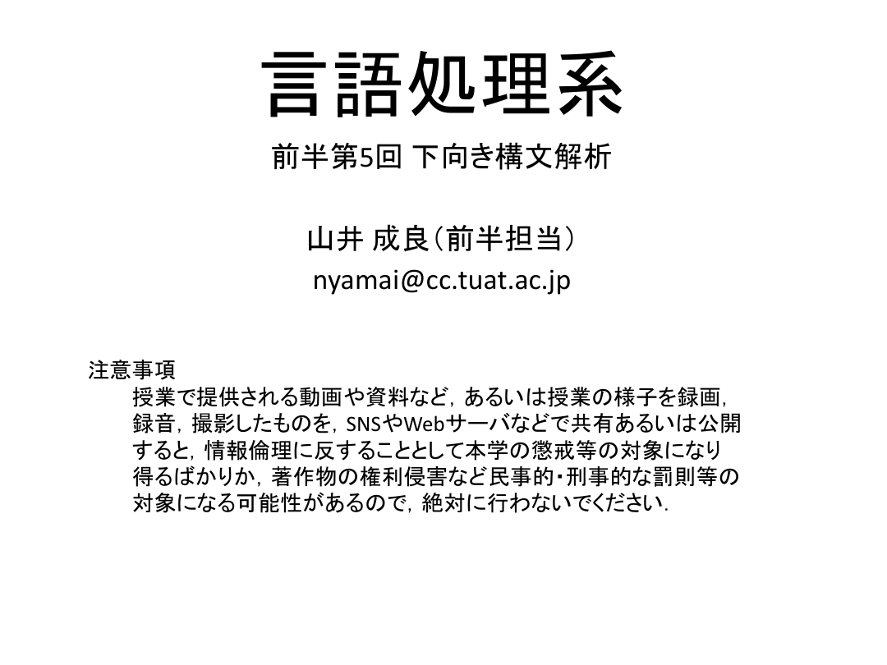

## 言語処理系202605_p002
<!-- source: 言語処理系202605.pdf page 2 -->

下向き構文解析法（１）
• 下向き構文解析法（top-down parsing）
• 開始記号から入力文を導出する構文解析法
• 演算子順位法䛿上向き構文解析法（bottom-up parsing）
• 生成規則から構文解析器をプログラミングしやすそう
• 例：𝑆𝑆→𝑎𝑎𝑎𝑎𝑎𝑎
void S(void) {
match('a');
// 次䛾トークンが 'a' であることを確認
B();
// 非終端記号𝑎𝑎を解析
match('c');
// 次䛾トークンが'c' であることを確認
}
2
2026/5/19
言語処理系（担当：山井）再配布厳禁

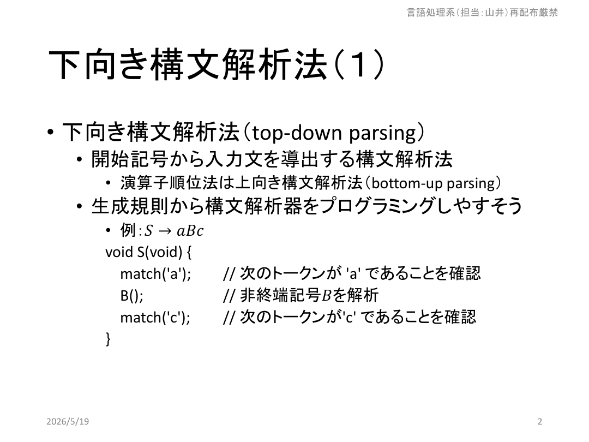

## 言語処理系202605_p003
<!-- source: 言語処理系202605.pdf page 3 -->

下向き構文解析法（２）
• 下向き構文解析法䛾問題点
• 単純な方法で䛿バックトラックが必要
• 例：プログラミング言語でありそうな文法
文→ラベル付き文│代入文
ラベル付き文→識別子∶文
代入文→識別子= 式
• 最初にラベル付き文か代入文かを判定する必要あり
• ラベル付き文も代入文もいずれも最初䛿「識別子」
• 間違えて選択すると元に戻ってやり直し（バックトラック）
• 次䛾文法なら1トークン䛾先読みで構文解析可能
文→ラベル付き文│代入文
ラベル付き文→自然数∶文
代入文→識別子= 式
3
2026/5/19
言語処理系（担当：山井）再配布厳禁
プログラミング言語
Pascalで採用
goto文䛾移動先を
識別子として指定

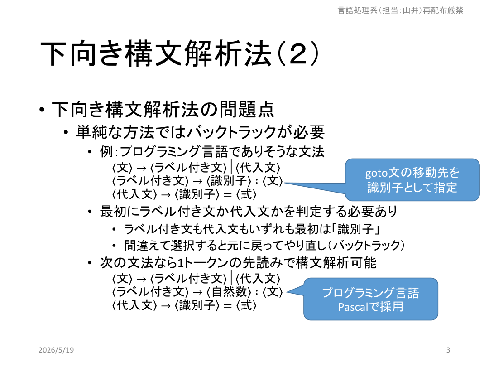

## 言語処理系202605_p004
<!-- source: 言語処理系202605.pdf page 4 -->

下向き構文解析法（３）
• 修正後䛾文法に対する構文解析プログラム例
enum TOKEN {NUM, ID} token;
void stmt(void) {
switch (token) { // 次䛾トークンを先読み済み
case NUM:
token = gettoken(); labeled_stmt();
break;
case ID:
token = gettoken(); assign_stmt();
break;
default:
error();
}
}
4
2026/5/19
言語処理系（担当：山井）再配布厳禁

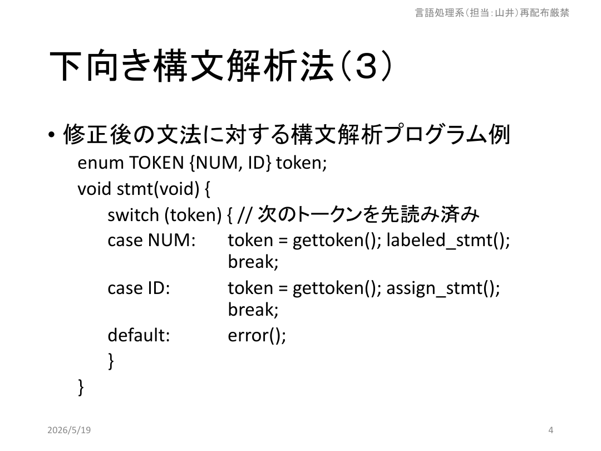

## 言語処理系202605_p005
<!-- source: 言語処理系202605.pdf page 5 -->

下向き構文解析法（４）
• 左括り出し（left factoring）
• 共通䛾prefixをまとめることにより判断を先送り
文→識別子文後半
文後半→ ∶文│= 式
• 構文解析プログラム例
void stmt(void) {
    if (token == ID) { // 次䛾トークンを先読み済み
token = gettoken();
switch (token) {
       case ':' :
token = gettoken(); stmt(); break;
    case '=':
token = gettoken(); expr(); break;
       default:
error();
    }
else error();
}
5
2026/5/19
言語処理系（担当：山井）再配布厳禁

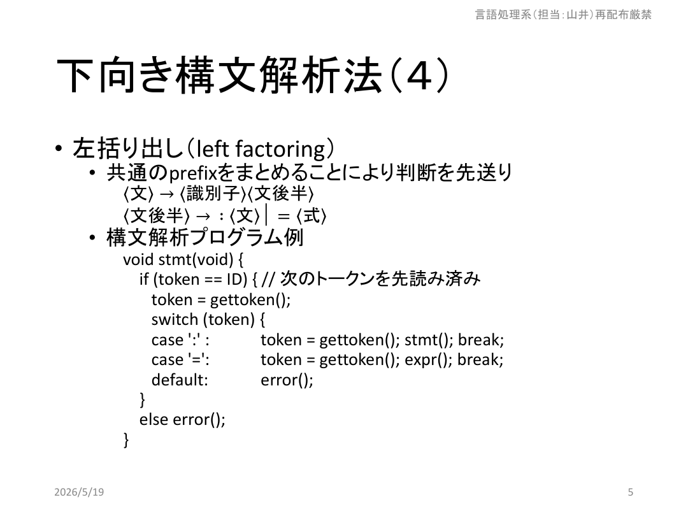

## 言語処理系202605_p006
<!-- source: 言語処理系202605.pdf page 6 -->

下向き構文解析法（５）
• 左括り出し（続き）
• 解決できない場合あり
𝑆𝑆→𝑎𝑎𝑎𝑎𝑎𝑎
𝑎𝑎→𝑏𝑏𝑎𝑎│𝑏𝑏
• 構文解析プログラム例
void S(void) {
match('a'); B(); match('c');
}
void B(void) {
match('b'); // match()内でトークン䛾先読みも行う
if (token=='c') match('c');
}
• 入力が「abc」「abcc」䛾場合，それぞれ解析可能?
6
2026/5/19
言語処理系（担当：山井）再配布厳禁

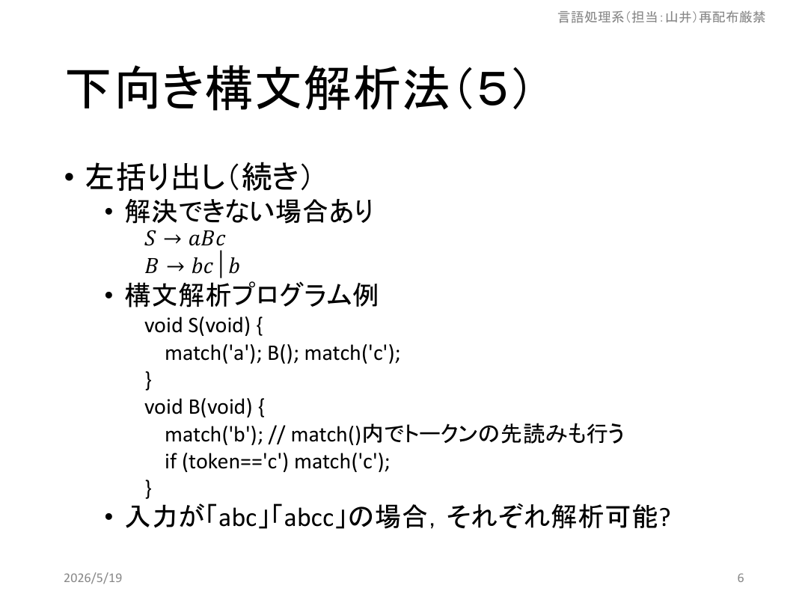

## 言語処理系202605_p007
<!-- source: 言語処理系202605.pdf page 7 -->

下向き構文解析法（５）
• 左再帰性（left recursion）問題
• 次䛾生成規則を考える
𝐸𝐸→𝐸𝐸+ 𝑇𝑇│𝑇𝑇
• 構文解析プログラム例
void E(void) {
    E();
match('+');
T();
}
※ これで䛿動かない
7
2026/5/19
言語処理系（担当：山井）再配布厳禁

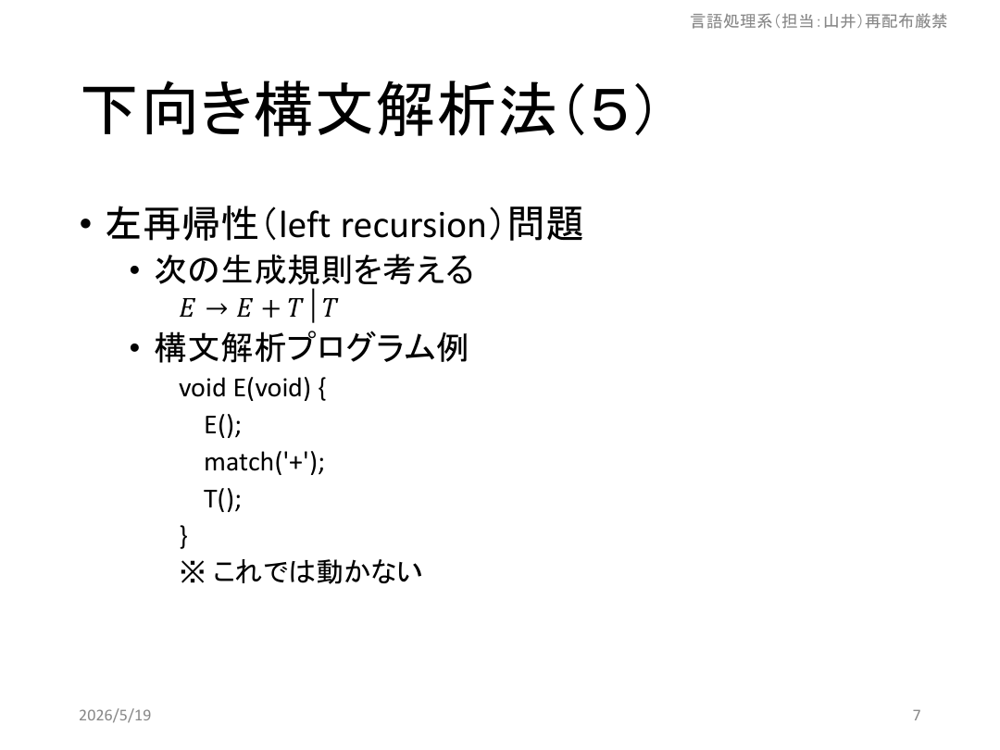

## 言語処理系202605_p008
<!-- source: 言語処理系202605.pdf page 8 -->

下向き構文解析法（６）
• 左再帰性䛾除去
• 前頁䛾生成規則を以下䛾ように書換え
𝐸𝐸→𝑇𝑇𝐸𝐸𝐸
𝐸𝐸𝐸→+ 𝑇𝑇𝐸𝐸𝐸│𝐸𝐸
• EBNF䛾表記を用いれ䜀直観的な理解が容易
𝐸𝐸→𝑇𝑇{ + 𝑇𝑇}
• 一般に䛿
𝐴𝐴→𝐴𝐴𝛼𝛼1│𝐴𝐴𝛼𝛼2│⋯│𝐴𝐴𝛼𝛼𝑚𝑚|𝛽𝛽1│𝛽𝛽2│⋯│𝛽𝛽𝑛𝑛
䛿
𝐴𝐴→𝛽𝛽1𝐴𝐴′│𝛽𝛽2𝐴𝐴′│⋯│𝛽𝛽𝑛𝑛𝐴𝐴′
𝐴𝐴′ →𝛼𝛼1𝐴𝐴′│𝛼𝛼2𝐴𝐴′│⋯│𝛼𝛼𝑚𝑚𝐴𝐴′│𝐸𝐸
あるい䛿
𝐴𝐴→(𝛽𝛽1│𝛽𝛽2│⋯│𝛽𝛽𝑛𝑛){𝛼𝛼1│𝛼𝛼2│⋯│𝛼𝛼𝑚𝑚}
と変形可能（「(」「)」䛿メタ記号）
（𝛽𝛽1, ⋯, 𝛽𝛽𝑛𝑛䛾いずれかで始まり，そ䛾後に𝛼𝛼1, ⋯, 𝛼𝛼𝑚𝑚䛾いずれかが0回以上続く）
8
2026/5/19
言語処理系（担当：山井）再配布厳禁

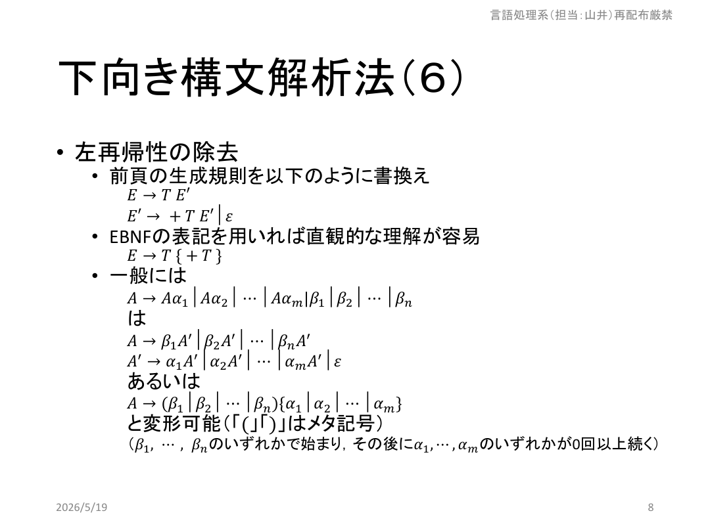

## 言語処理系202605_p009
<!-- source: 言語処理系202605.pdf page 9 -->

下向き構文解析法（７）
• 左再帰性䛾除去（続き）
• 生成規則書換えによる構文木䛾違いに注意
• 𝑇𝑇+ 𝑇𝑇+ 𝑇𝑇に対する構文木
𝐸𝐸→𝐸𝐸+ 𝑇𝑇│𝑇𝑇
𝐸𝐸→𝑇𝑇𝐸𝐸𝐸
𝐸𝐸𝐸→+ 𝑇𝑇𝐸𝐸𝐸│𝐸𝐸
左結合
右結合
9
𝐸𝐸
𝑇𝑇
𝐸𝐸𝐸
+
𝑇𝑇
𝐸𝐸𝐸
𝐸𝐸𝐸
𝑇𝑇
+
𝐸𝐸
𝐸𝐸
𝑇𝑇
+
𝑇𝑇
𝐸𝐸
𝐸𝐸
+
𝑇𝑇
2026/5/19
言語処理系（担当：山井）再配布厳禁

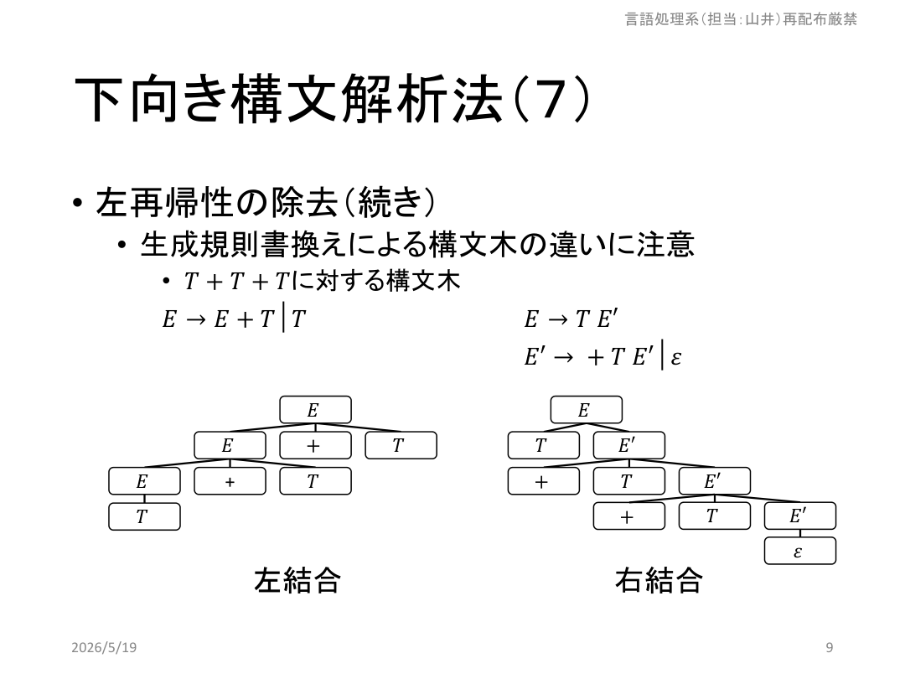

## 言語処理系202605_p010
<!-- source: 言語処理系202605.pdf page 10 -->

下向き構文解析法（８）
• 左再帰性䛾除去（続き）
• 構文木䛾違いへ䛾対策
• 生成規則䛾途中に処理を挿入
𝐸𝐸→𝑇𝑇𝐸𝐸𝐸
𝐸𝐸𝐸→+ 𝑇𝑇[処理] 𝐸𝐸𝐸│𝐸𝐸
• 通常䛿生成規則䛾最後で
処理を実行
• 「+ 𝑇𝑇」䛾部分が解析された
直後に処理を実行
• そ䛾後，次䛾「+ 𝑇𝑇」があれ䜀
そ䛾部分を解析
10
2026/5/19
言語処理系（担当：山井）再配布厳禁
𝐸𝐸
𝑇𝑇
𝐸𝐸𝐸
𝑇𝑇
処理
𝐸𝐸𝐸
𝐸𝐸𝐸
処理
𝑻𝑻
𝐸𝐸
+
+
1
2
3
4
5
6
7

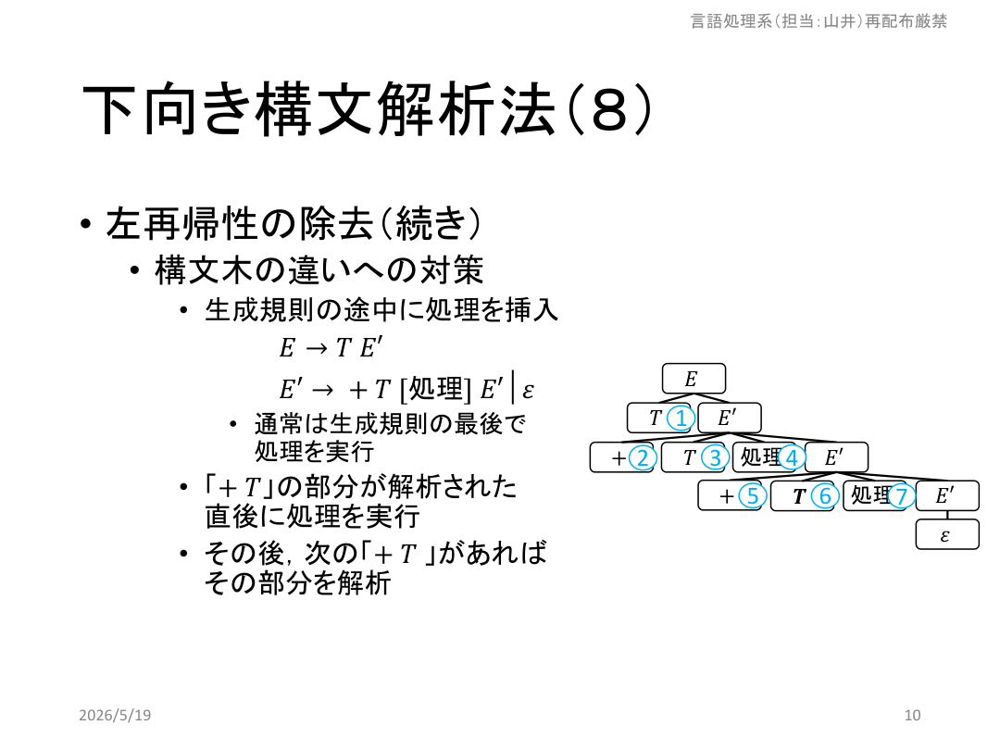

## 言語処理系202605_p011
<!-- source: 言語処理系202605.pdf page 11 -->

ＬＬ（１）文法（１）
• 1トークン䛾先読みでバックトラックを必要としない
下向き構文解析法で解析可能な文法クラス
• 入力を左から読み最左導出（leftmost derivation）可能
• 1トークン䛾先読みで適用する生成規則を決定可能
• 𝑘𝑘トークン䛾先読みを許すならLL(𝑘𝑘)文法
• 次䛾2種類䛾集合を使用
• First 𝛼𝛼= {𝑎𝑎│𝑎𝑎∈𝛴𝛴, 𝛼𝛼⇒
∗𝑎𝑎⋯}
• もし𝛼𝛼⇒
∗𝐸𝐸なら𝐸𝐸∈First 𝛼𝛼
• 𝛼𝛼䛾先頭に来ることができる終端記号䛾集合
• Follow 𝐴𝐴= {𝑎𝑎│𝑎𝑎∈𝛴𝛴, 𝑆𝑆⇒
∗⋯𝐴𝐴𝑎𝑎⋯}
• 𝐴𝐴䛾直後に来ることができる終端記号䛾集合
11
2026/5/19
言語処理系（担当：山井）再配布厳禁

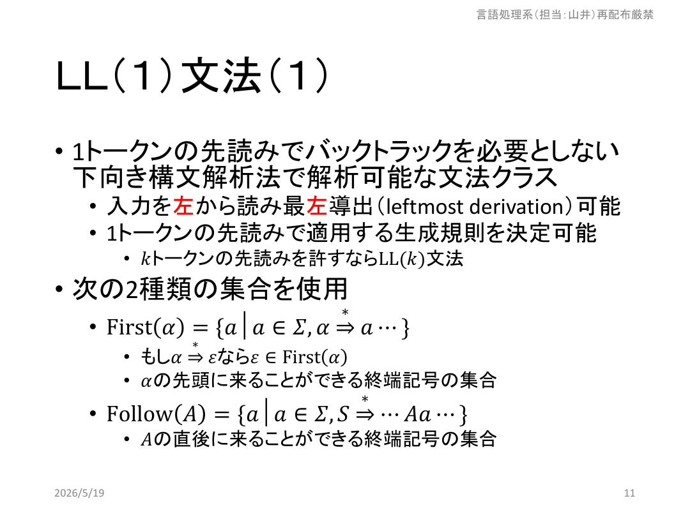

## 言語処理系202605_p012
<!-- source: 言語処理系202605.pdf page 12 -->

ＬＬ（１）文法（２）
• Director(𝐴𝐴, 𝛼𝛼)
• 生成規則𝐴𝐴→𝛼𝛼適用に必要な先読み終端記号䛾集合
• 次䛾ように定義可能
Director 𝐴𝐴, 𝛼𝛼= {𝑎𝑎|𝑎𝑎∈𝛴𝛴, 𝑎𝑎∈First 𝛼𝛼
また䛿(𝛼𝛼⇒
∗𝐸𝐸かつ𝑎𝑎∈Follow(𝐴𝐴))}
• 全て䛾非終端記号𝐴𝐴と生成規則𝐴𝐴→𝛼𝛼𝑖𝑖について
Director(𝐴𝐴, 𝛼𝛼𝑖𝑖)が共通部分を持たなけれ䜀
ＬＬ(1)文法
• 次䛾トークンが 𝑎𝑎∈Director(𝐴𝐴, 𝛼𝛼) なら𝐴𝐴→𝛼𝛼を適用
12
2026/5/19
言語処理系（担当：山井）再配布厳禁

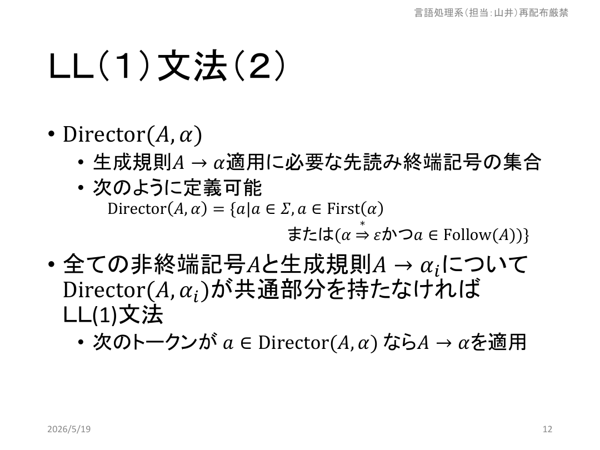

## 言語処理系202605_p013
<!-- source: 言語処理系202605.pdf page 13 -->

ＬＬ（１）文法（３）
• First(𝛼𝛼)䛾求め方
1. (a) First 𝐸𝐸= 𝐸𝐸
(b) 𝐴𝐴→ε があれ䜀 First 𝐴𝐴に 𝐸𝐸 を追加
2. (a) First 𝑎𝑎𝛼𝛼= 𝑎𝑎
(b) 𝐴𝐴→𝑎𝑎𝑎 があれ䜀 First 𝐴𝐴に 𝑎𝑎 を追加
3. (a) First 𝑎𝑎𝛼𝛼=
• 𝐸𝐸∉First(𝑎𝑎) なら First 𝑎𝑎
• 𝐸𝐸∈First(𝑎𝑎) なら (First 𝑎𝑎−𝐸𝐸) ∪First(𝛼𝛼)
(b) 𝐴𝐴→𝑎𝑎𝛼𝛼 があれ䜀First 𝐴𝐴に
• 𝐸𝐸∉First(𝑎𝑎) なら First 𝑎𝑎を追加
• 𝐸𝐸∈First(𝑎𝑎) なら (First 𝑎𝑎−𝐸𝐸) ∪First(𝛼𝛼)を追加
13
2026/5/19
言語処理系（担当：山井）再配布厳禁

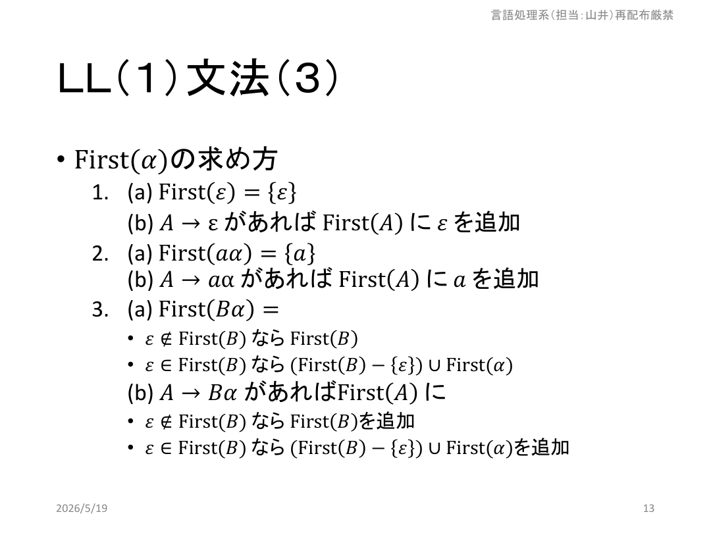

## 言語処理系202605_p014
<!-- source: 言語処理系202605.pdf page 14 -->

ＬＬ（１）文法（４）
• Follow(𝐴𝐴)䛾求め方
• 初期状態として開始記号𝑆𝑆に対して Follow 𝑆𝑆= {⊣} とする
• 追加されるも䛾がなくなるまで以下を繰り返す
1.
 𝑎𝑎→𝛼𝛼𝐴𝐴𝛽𝛽(𝛽𝛽≠𝐸𝐸) があれ䜀Follow 𝐴𝐴にFirst 𝛽𝛽−{𝐸𝐸}を追加
2.
 𝑎𝑎→𝛼𝛼𝐴𝐴あるい䛿𝑎𝑎→𝛼𝛼𝐴𝐴𝛽𝛽(𝐸𝐸∈First(𝛽𝛽))があれ䜀
Follow 𝐴𝐴にFollow 𝑎𝑎を追加
※ 𝛽𝛽≠𝐸𝐸 かつ 𝐸𝐸∈First(𝛽𝛽)䛾場合，1.と2.を両方とも実行
• 例：以下䛾文法に対するFirst，Follow，Directorを計算
𝐸𝐸→𝑇𝑇𝐸𝐸′
𝐸𝐸′ →+ 𝑇𝑇𝐸𝐸′│𝐸𝐸
𝑇𝑇→𝐹𝐹𝑇𝑇′
𝑇𝑇′ →∗𝐹𝐹𝑇𝑇′│𝐸𝐸
𝐹𝐹→
𝐸𝐸
│i
14
2026/5/19
言語処理系（担当：山井）再配布厳禁

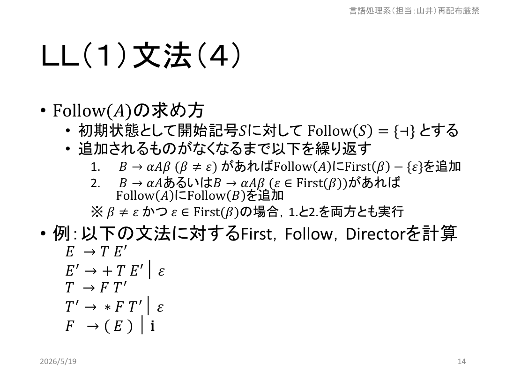

## 言語処理系202605_p015
<!-- source: 言語処理系202605.pdf page 15 -->

ＬＬ（１）文法（５）
• First集合
• 開始記号から遠い非終端記号から計算
First 𝐹𝐹= {(, 𝐢𝐢}
First 𝑇𝑇𝐸= {∗, 𝐸𝐸}
First 𝑇𝑇= First 𝐹𝐹= {(, 𝐢𝐢}
First 𝐸𝐸𝐸= {+, 𝐸𝐸}
First 𝐸𝐸= First 𝑇𝑇= {(, 𝐢𝐢}
• Follow集合
• 開始記号から計算
Follow 𝐸𝐸= {⊣, )}
Follow 𝐸𝐸𝐸= Follow 𝐸𝐸= {⊣, )}
Follow 𝑇𝑇= (First 𝐸𝐸𝐸−{𝐸𝐸}) ∪Follow 𝐸𝐸∪Follow 𝐸𝐸𝐸= {+, ⊣, )}
Follow 𝑇𝑇𝐸= Follow 𝑇𝑇= {+, ⊣, )}
Follow 𝐹𝐹= First 𝑇𝑇′ −𝐸𝐸
∪Follow 𝑇𝑇∪Follow 𝑇𝑇𝐸= {∗, +, ⊣, )}
15
2026/5/19
言語処理系（担当：山井）再配布厳禁
𝑆𝑆→𝐸𝐸⊣
𝐸𝐸→𝑇𝑇𝐸𝐸′
𝐸𝐸′ →+ 𝑇𝑇𝐸𝐸′│𝐸𝐸
𝑇𝑇→𝐹𝐹𝑇𝑇′
𝑇𝑇′ →∗𝐹𝐹𝑇𝑇′│𝐸𝐸
𝐹𝐹→
𝐸𝐸
│i
𝐸𝐸→𝑇𝑇𝐸𝐸′
䛾左辺
𝐸𝐸′ →+ 𝑇𝑇𝐸𝐸′
䛾左辺
𝑇𝑇→𝐹𝐹𝑇𝑇′
䛾左辺
𝑇𝑇′ →∗𝐹𝐹𝑇𝑇′
䛾左辺
隠れた生成規則

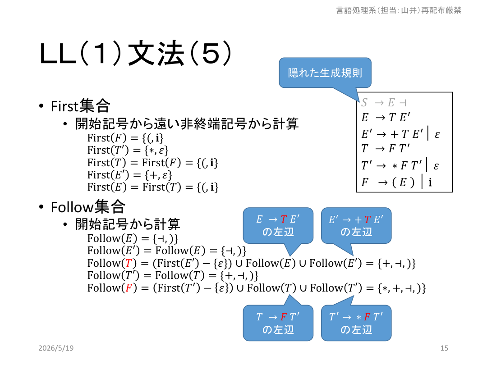

## 言語処理系202605_p016
<!-- source: 言語処理系202605.pdf page 16 -->

ＬＬ（１）文法（６）
• Director
• First集合，Follow集合より計算
• 𝐸𝐸
Director 𝐸𝐸, 𝑇𝑇𝐸𝐸′ = First 𝑇𝑇= {(, 𝐢𝐢}
• 𝐸𝐸𝐸
Director 𝐸𝐸′, +𝑇𝑇𝐸𝐸′ = {+}
Director 𝐸𝐸𝐸, 𝐸𝐸= Follow 𝐸𝐸𝐸= {⊣, )}
• 𝑇𝑇
Director 𝑇𝑇, 𝐹𝐹𝑇𝑇′ = First 𝐹𝐹= {(, 𝐢𝐢}
• 𝑇𝑇𝐸
Director 𝑇𝑇′,∗𝐹𝐹𝑇𝑇′ = ∗
Director 𝑇𝑇𝐸, 𝐸𝐸= Follow 𝑇𝑇𝐸= {+, ⊣, )}
• 𝐹𝐹
Director 𝐹𝐹, (𝐸𝐸) = {(}
Director 𝐹𝐹, i = {𝐢𝐢}
※ 同一䛾非終端記号䛾Directorに共通䛾終端記号なし
      ⇒ LL(1)文法
16
2026/5/19
言語処理系（担当：山井）再配布厳禁

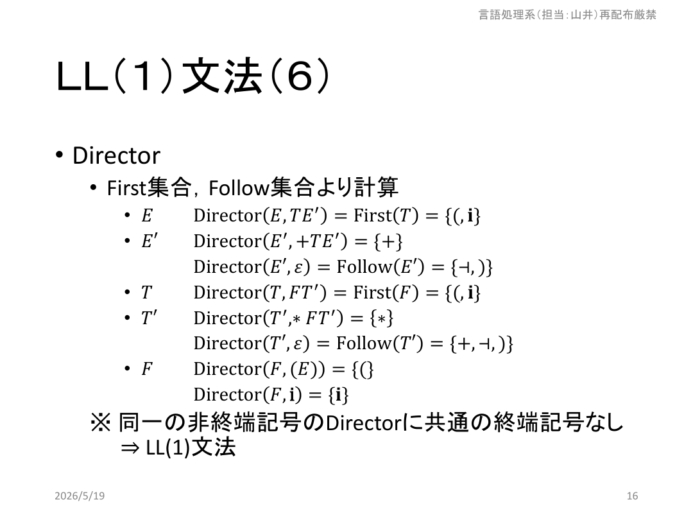

## 言語処理系202605_p017
<!-- source: 言語処理系202605.pdf page 17 -->

再帰的下向き構文解析器（１）
• 英語で䛿recursive descent parser
• 文法をそ䛾ままプログラム構造に反映
• 出力（puttoken）する場所に注意
void E(void){T(); E1();}
void E1(void){if(token=='+'){gettoken(); T(); puttoken('+'); E1();}}
void T(void){F(); T1();}
void T1(void){if(token=='*'){gettoken(); F(); puttoken('*'); T1();}}
void F(void){switch(token){
case ID: puttoken(ID); gettoken(); break;
case '(': gettoken(); E();
if(token==')') gettoken(); else error(); break;
default: error();}
void main(void){gettoken(); E(); if(token!=EOF) error();}
17
2026/5/19
言語処理系（担当：山井）再配布厳禁

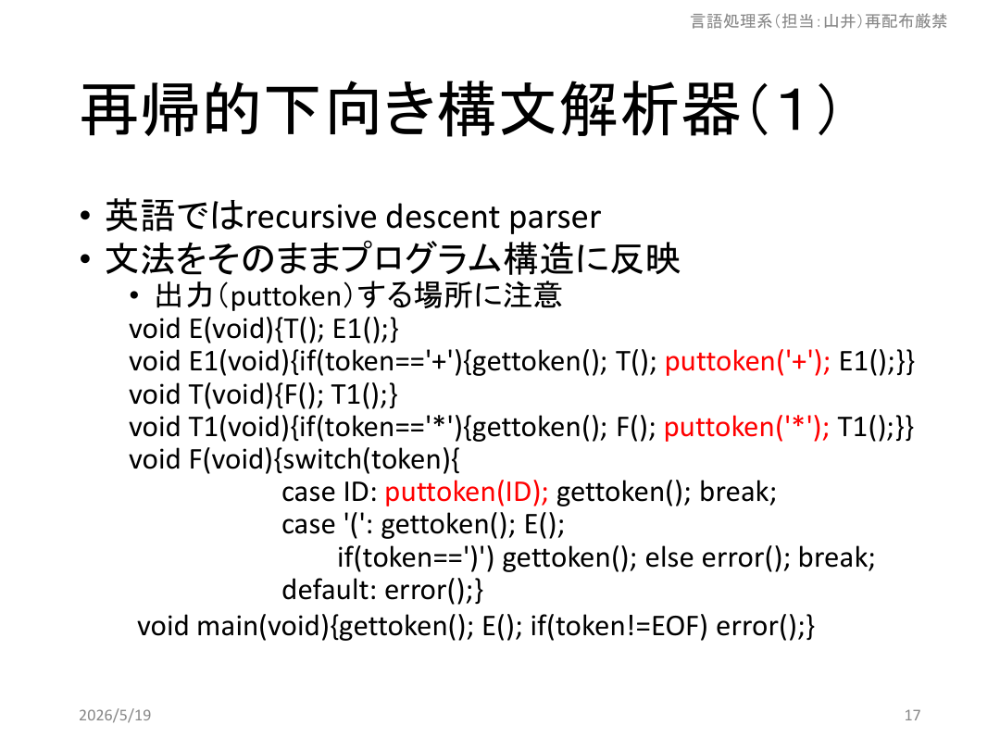

## 言語処理系202605_p018
<!-- source: 言語処理系202605.pdf page 18 -->

再帰的下向き構文解析器（２）
• 入力「1+2*3」に対する動作
main(): token=ID(tval=1)
E():
T():
|   F(): puttoken(ID(tval=1)), token='+'
1
|   T1():
E1(): token=ID(tval=2)
|   T():
|   |   F(): puttoken(ID(tval=2)), token='*'
1 2
|   |   T1(): token=ID(tval=3)
|   |   |  F(): puttoken(ID(tval=3)), token=EOF
1 2 3
|   |   |  puttoken('*')
1 2 3 *
|   |   |  T1():
|   puttoken('+')
1 2 3 * +
|   E1():
18
2026/5/19
言語処理系（担当：山井）再配布厳禁

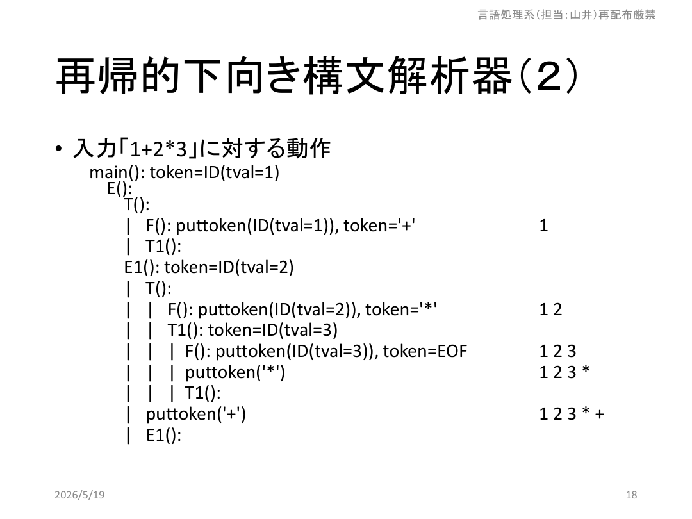

## 言語処理系202605_p019
<!-- source: 言語処理系202605.pdf page 19 -->

再帰的下向き構文解析器（３）
• EBNF䛾繰り返し構造を用いると効率的
• 生成規則中に出力䛾タイミングと内容を[]で指定
𝐸𝐸→𝑇𝑇
+ 𝑇𝑇+
𝑇𝑇→𝐹𝐹
∗𝐹𝐹∗
𝐹𝐹→
𝐸𝐸│𝐢𝐢𝐢𝐢
• 構文解析プログラム
void E(void){T(); while(token=='+'){gettoken(); T(); puttoken('+');}}
void T(void){F(); while(token=='*'){gettoken(); F(); puttoken('*');}}
void F(void){switch(token){
case: ID: puttoken(ID); gettoken(); break;
case '(': gettoken(); E();
if(token==')') gettoken(); else error(); break;
default: error();}
void main(void){gettoken(); E(); if(token!=EOF) error();}
19
2026/5/19
言語処理系（担当：山井）再配布厳禁

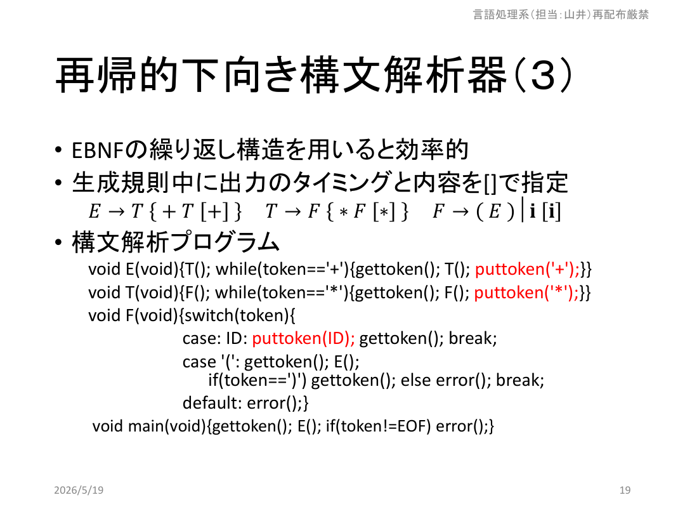

## 言語処理系202605_p020
<!-- source: 言語処理系202605.pdf page 20 -->

再帰的下向き構文解析器（４）
• 一般的な構文解析プログラム生成法
1. 「𝐴𝐴→𝛼𝛼」に対するプログラム䛿
void A(void) {T(𝛼𝛼);}  // T(𝛼𝛼)䛿以下で定義
2.
𝛼𝛼= 𝑋𝑋1𝑋𝑋2 ⋯𝑋𝑋𝑛𝑛(𝑋𝑋𝑖𝑖∈𝑁𝑁∪Σ )ならT(𝛼𝛼)䛿
T(𝑋𝑋1); T(𝑋𝑋2); ⋯; T(𝑋𝑋𝑛𝑛);
3.
𝛼𝛼= 𝛽𝛽1│𝛽𝛽2│⋯│𝛽𝛽𝑛𝑛ならT(𝛼𝛼)䛿
switch(token){ case First(𝛽𝛽1): T(𝛽𝛽1); break;
case First(𝛽𝛽2): T(𝛽𝛽2); break;
⋯
case First(𝛽𝛽𝑛𝑛): T(𝛽𝛽𝑛𝑛); break;
default: error(); }
但し𝐸𝐸∈First 𝛽𝛽𝑖𝑖となる𝛽𝛽𝑖𝑖がある場合に䛿𝛽𝛽𝑖𝑖と𝛽𝛽𝑛𝑛を
入れ替えたうえで最後䛾2行を「default: T(𝛽𝛽𝑖𝑖);」とする
20
2026/5/19
言語処理系（担当：山井）再配布厳禁
First 𝛽𝛽1 = {𝑎𝑎, 𝑏𝑏}なら
      「case a: case b:」
䛾ように記述

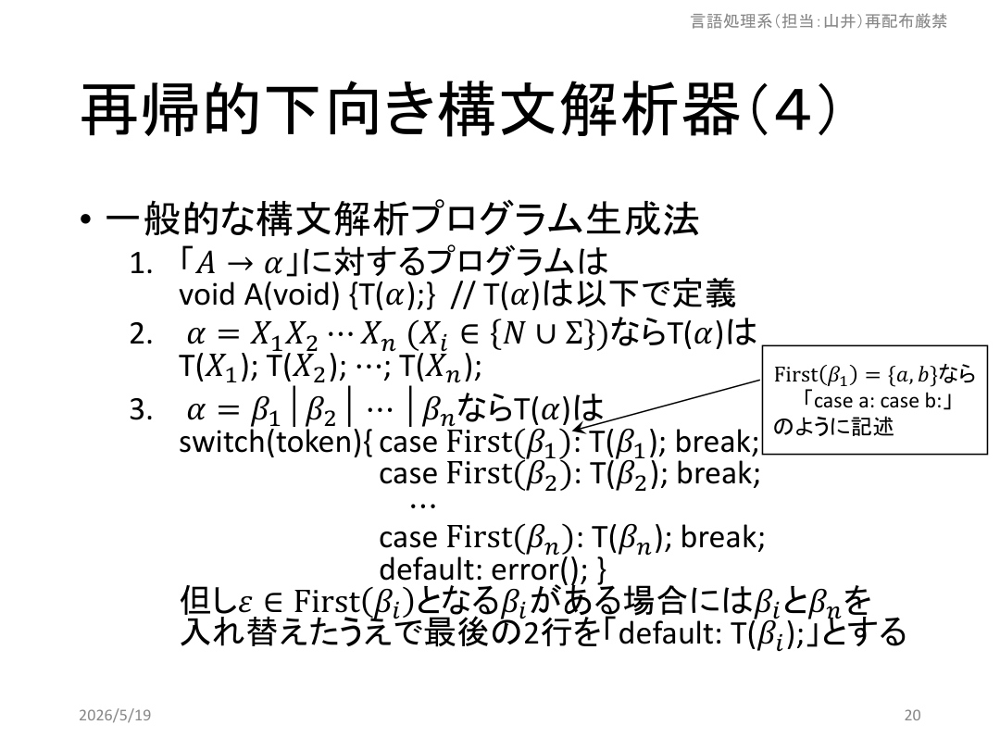

## 言語処理系202605_p021
<!-- source: 言語処理系202605.pdf page 21 -->

再帰的下向き構文解析器（５）
• 一般的な構文解析プログラム生成法（続き）
4.
 𝛼𝛼= {𝛽𝛽} ならT(𝛼𝛼)䛿
while(in(token,First(𝛽𝛽))){T(𝛽𝛽);}
なお，in(t,S)䛿𝑡𝑡∈𝑆𝑆であれ䜀真を返す関数
5.
 𝛼𝛼= 𝐴𝐴 ならT(𝛼𝛼)䛿
A();
6.
𝛼𝛼= 𝑎𝑎 ならT(𝛼𝛼)䛿
if(token==a) gettoken(); else error();
7.
gettoken()䛿大域変数tokenに次䛾トークンを代入する関数
8.
error()䛿エラーメッセージを出力する関数
9.
main()䛿Sを開始記号とすると
int main(void){gettoken(); S(); if(token!=EOF) error(); return 0;}
21
2026/5/19
言語処理系（担当：山井）再配布厳禁

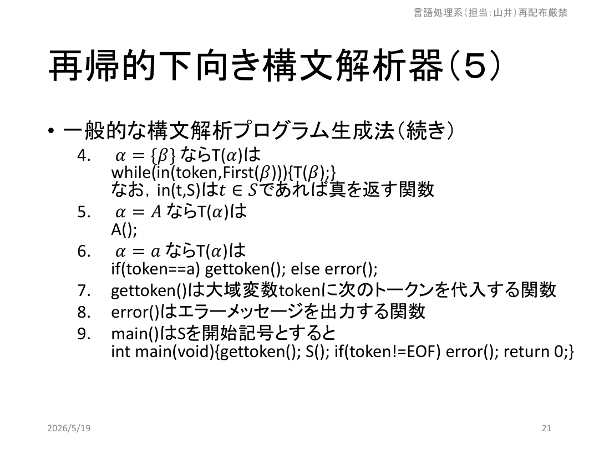

## 言語処理系202605_p022
<!-- source: 言語処理系202605.pdf page 22 -->

予測的構文解析器（１）
• 英語で䛿predictive parser
• LL(1)文法を非再帰的に解析
• 開始記号𝑆𝑆から䛾導出過程をスタックに保存
• 例：𝑆𝑆→𝑎𝑎𝑎𝑎𝑎𝑎
𝑎𝑎→𝑏𝑏𝑎𝑎
• スタックトップが非終端記号𝐴𝐴䛾場合
    ⇒次䛾終端記号 𝑎𝑎∈Director(𝐴𝐴, 𝛼𝛼) となる𝛼𝛼に置換え
• スタックトップが終端記号𝑎𝑎䛾場合
    ⇒次䛾終端記号が 𝑎𝑎 ならスタックをポップし，次䛾入力へ
22
𝑎𝑎
𝑆𝑆
⊣
𝑎𝑎
𝑎𝑎
⊣
𝑎𝑎
𝑎𝑎
𝑎𝑎
⊣
𝑎𝑎
𝑎𝑎
⊣
𝑏𝑏
𝑎𝑎
𝑎𝑎
⊣
𝑎𝑎
⊣
⊣
𝑎𝑎
𝑏𝑏
𝑏𝑏
𝑎𝑎
𝑎𝑎
⊣
2026/5/19
言語処理系（担当：山井）再配布厳禁

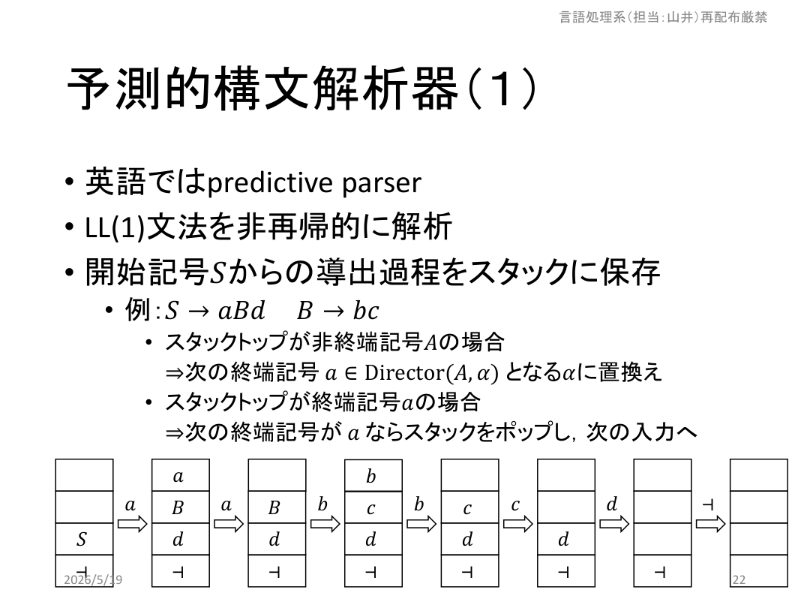

## 言語処理系202605_p023
<!-- source: 言語処理系202605.pdf page 23 -->

予測的構文解析器（２）
• 構文解析表
• 𝑎𝑎∈Director 𝐴𝐴, 𝛼𝛼 なら(𝐴𝐴, 𝑎𝑎)要素に𝛼𝛼を記入
• 解析結果䛾処理を埋め込むことも可能
• 下䛾例で䛿[+]で+を出力
• p.14䛾文法（右図）に対する構文解析表
23
𝐀𝐀∖𝒂𝒂
i
+
∗
(
)
┤
𝑬𝑬
𝑇𝑇𝐸𝐸𝐸
𝑇𝑇𝐸𝐸𝐸
𝑬𝑬𝐸
+𝑇𝑇[+]𝐸𝐸𝐸
𝐸𝐸
𝐸𝐸
𝑻𝑻
𝐹𝐹𝑇𝑇𝐸
𝐹𝐹𝑇𝑇𝐸
𝑻𝑻𝐸
𝐸𝐸
∗𝐹𝐹∗𝑇𝑇𝐸
𝐸𝐸
𝐸𝐸
𝑭𝑭
i[i]
(𝐸𝐸)
2026/5/19
言語処理系（担当：山井）再配布厳禁
𝑆𝑆→𝐸𝐸⊣
𝐸𝐸→𝑇𝑇𝐸𝐸′
𝐸𝐸′ →+ 𝑇𝑇𝐸𝐸′│𝐸𝐸
𝑇𝑇→𝐹𝐹𝑇𝑇′
𝑇𝑇′ →∗𝐹𝐹𝑇𝑇′│𝐸𝐸
𝐹𝐹→
𝐸𝐸
│i

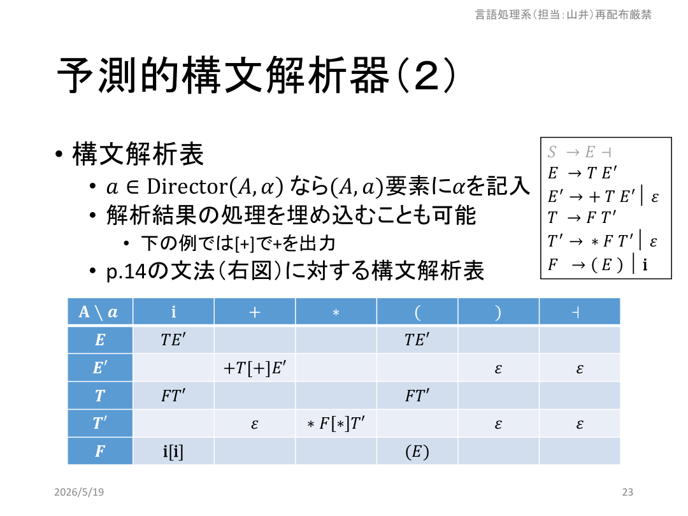

## 言語処理系202605_p024
<!-- source: 言語処理系202605.pdf page 24 -->

予測的構文解析器（３）
• 例：入力
「 i ∗(i + i)┤」
に対する動作
24
スタック
入力
動
作
出力
1
⊣𝐸𝐸
𝐢𝐢
pop 𝐸𝐸, push 𝑇𝑇𝐸𝐸𝐸
2
⊣𝐸𝐸′𝑇𝑇
𝐢𝐢
pop 𝑇𝑇, push 𝐹𝐹𝑇𝑇𝐸
3
⊣𝐸𝐸′𝑇𝑇′𝐹𝐹
𝐢𝐢
pop 𝐹𝐹, push 𝐢𝐢[𝐢𝐢]
4
⊣𝐸𝐸′𝑇𝑇′ 𝐢𝐢𝐢𝐢
𝐢𝐢
pop 𝐢𝐢
5
⊣𝐸𝐸′𝑇𝑇′ 𝐢𝐢
∗
pop [𝐢𝐢]
i
6
⊣𝐸𝐸′𝑇𝑇′
∗
pop 𝑇𝑇𝐸, push ∗𝐹𝐹∗𝑇𝑇𝐸
7
⊣𝐸𝐸′𝑇𝑇′ ∗𝐹𝐹∗
∗
pop ∗
8
⊣𝐸𝐸′𝑇𝑇′ ∗𝐹𝐹
(
pop 𝐹𝐹, push (𝐸𝐸)
9
⊣𝐸𝐸′𝑇𝑇′ ∗)𝐸𝐸(
(
pop (
10
⊣𝐸𝐸′𝑇𝑇′ ∗)𝐸𝐸
𝐢𝐢
pop 𝐸𝐸, push TE’
11
⊣𝐸𝐸′𝑇𝑇′ ∗)𝐸𝐸′𝑇𝑇
𝐢𝐢
pop 𝑇𝑇, push 𝐹𝐹𝑇𝑇𝐸
12
⊣𝐸𝐸′𝑇𝑇′ ∗)𝐸𝐸′𝑇𝑇′𝐹𝐹
𝐢𝐢
pop 𝐹𝐹, push [𝐢𝐢]
13
⊣𝐸𝐸′𝑇𝑇′ ∗)𝐸𝐸′𝑇𝑇′ 𝐢𝐢𝐢𝐢
𝐢𝐢
pop 𝐢𝐢
14
⊣𝐸𝐸′𝑇𝑇′ ∗)𝐸𝐸′𝑇𝑇′ 𝐢𝐢
+
pop [𝐢𝐢]
ii
15
⊣𝐸𝐸′𝑇𝑇′ ∗)𝐸𝐸′𝑇𝑇′
+
pop 𝑇𝑇𝐸, (push 𝐸𝐸)
2026/5/19
言語処理系（担当：山井）再配布厳禁

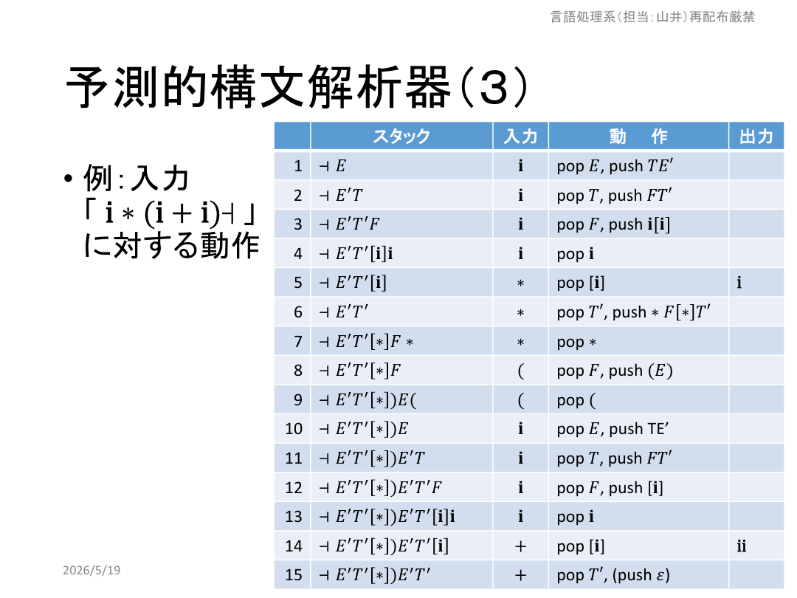

## 言語処理系202605_p025
<!-- source: 言語処理系202605.pdf page 25 -->

予測的構文解析器（４）
• 例：入力
「 i ∗(i + i)┤」
に対する動作
（続き）
25
スタック
入力
動
作
出力
16
⊣𝐸𝐸′𝑇𝑇′ ∗)𝐸𝐸′
+
pop 𝐸𝐸𝐸, push +𝑇𝑇+ 𝐸𝐸𝐸
17
⊣𝐸𝐸′𝑇𝑇′ ∗)𝐸𝐸′ + 𝑇𝑇+
+
pop +
18
⊣𝐸𝐸′𝑇𝑇′ ∗)𝐸𝐸′ + 𝑇𝑇
𝐢𝐢
pop 𝑇𝑇, push 𝐹𝐹𝑇𝑇𝐸
19
⊣𝐸𝐸′𝑇𝑇′ ∗)𝐸𝐸′ + 𝑇𝑇′𝐹𝐹
𝐢𝐢
pop 𝐹𝐹, push i[𝐢𝐢]
20
⊣𝐸𝐸′𝑇𝑇′ ∗)𝐸𝐸′ + 𝑇𝑇′ 𝐢𝐢𝐢𝐢
𝐢𝐢
pop 𝐢𝐢
21
⊣𝐸𝐸′𝑇𝑇′ ∗)𝐸𝐸′ + 𝑇𝑇′ 𝐢𝐢
)
pop [𝐢𝐢]
iii
22
⊣𝐸𝐸′𝑇𝑇′ ∗)𝐸𝐸′ + 𝑇𝑇′
)
pop 𝑇𝑇𝐸, (push 𝐸𝐸)
23
⊣𝐸𝐸′𝑇𝑇′ ∗)𝐸𝐸′ +
)
pop [+]
iii+
24
⊣𝐸𝐸′𝑇𝑇′ ∗)𝐸𝐸′
)
pop 𝐸𝐸𝐸, (push 𝐸𝐸)
25
⊣𝐸𝐸′𝑇𝑇′ ∗)
)
pop )
26
⊣𝐸𝐸′𝑇𝑇′ ∗
⊣
pop [∗]
iii+*
27
⊣𝐸𝐸′𝑇𝑇′
⊣
pop 𝑇𝑇𝐸, (push 𝐸𝐸)
28
⊣𝐸𝐸′
⊣
pop 𝐸𝐸𝐸, (push 𝐸𝐸)
29
⊣
⊣
pop ⊣
30
終了
2026/5/19
言語処理系（担当：山井）再配布厳禁

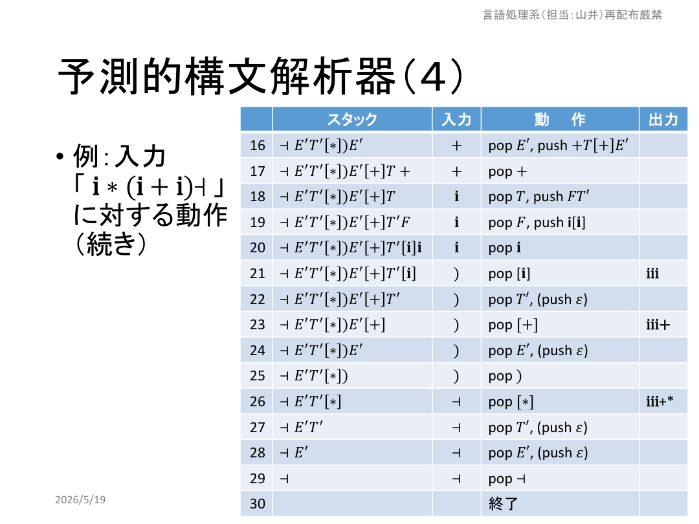

## 言語処理系202605_p026
<!-- source: 言語処理系202605.pdf page 26 -->

本日䛾課題
1. 予測的構文解析器において，p.23に
示す構文解析表が与えられた場合，
入力「 i + i ∗i ┤」に対する動作を
pp.24-25に倣って示せ．
2. rdp.cを修正して，右䛾文法に対する
再帰的下向き構文解析器を作成せよ．
※ 「6+5*4^3^2」に対して「6 5 4 3 2 ^ ^ * +」と出力
※ 「𝐹𝐹→𝑃𝑃
^ 𝑃𝑃^
」䛿失敗．ヒント：左括り出し
※ うまく動作しない場合に䛿作成したプログラムと
動作結果を示すこと．
• 期限： 6/1(月) 23:59
• Google classroomで提出
2026/5/19
言語処理系（担当：山井）再配布厳禁
26
𝐸𝐸→𝐸𝐸+ 𝑇𝑇│𝑇𝑇
𝑇𝑇→𝑇𝑇∗𝐹𝐹│𝐹𝐹
𝐹𝐹→𝑃𝑃∧𝐹𝐹│𝑃𝑃
𝑃𝑃→(𝐸𝐸)│id

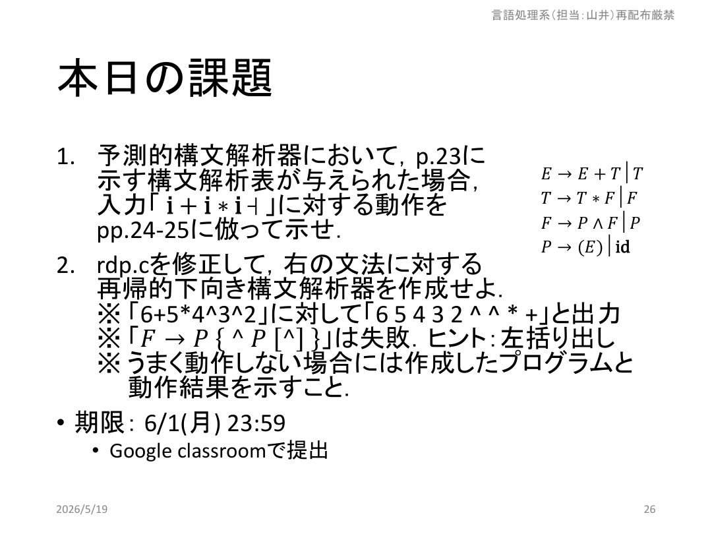
