# 言語処理系202606

<!-- source: 言語処理系202606.pdf -->

## 言語処理系202606_p001
<!-- source: 言語処理系202606.pdf page 1 -->

言語処理系
前半第6回上向き構文解析
山井成良（前半担当）
nyamai@cc.tuat.ac.jp
注意事項
授業で提供される動画や資料など，あるいは授業の様子を録画，
録音，撮影したものを，SNSやWebサーバなどで共有あるいは公開
すると，情報倫理に反することとして本学の懲戒等の対象になり
得るばかりか，著作物の権利侵害など民事的・刑事的な罰則等の
対象になる可能性があるので，絶対に行わないでください．

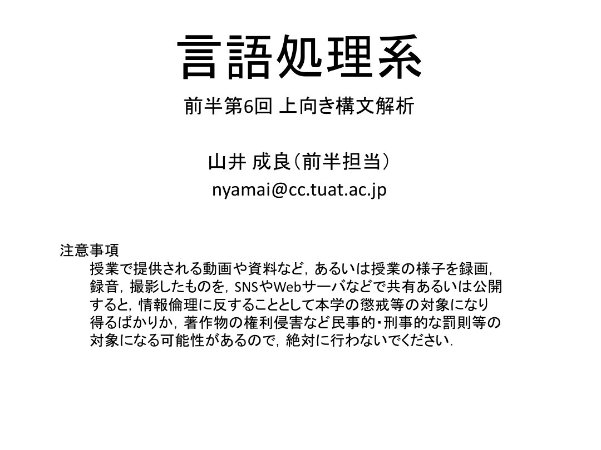

## 言語処理系202606_p002
<!-- source: 言語処理系202606.pdf page 2 -->

来週の予定
• 前半全体の質疑応答
• 質問があれば前日までにメールで事前連絡を
• 当日に質問しても構いません
• 但し，説明資料を準備できない場合があります
• これまでの課題の解説
• 第6回の課題は締切前なので対象外
2026/5/26
言語処理系（担当：山井）再配布厳禁
2

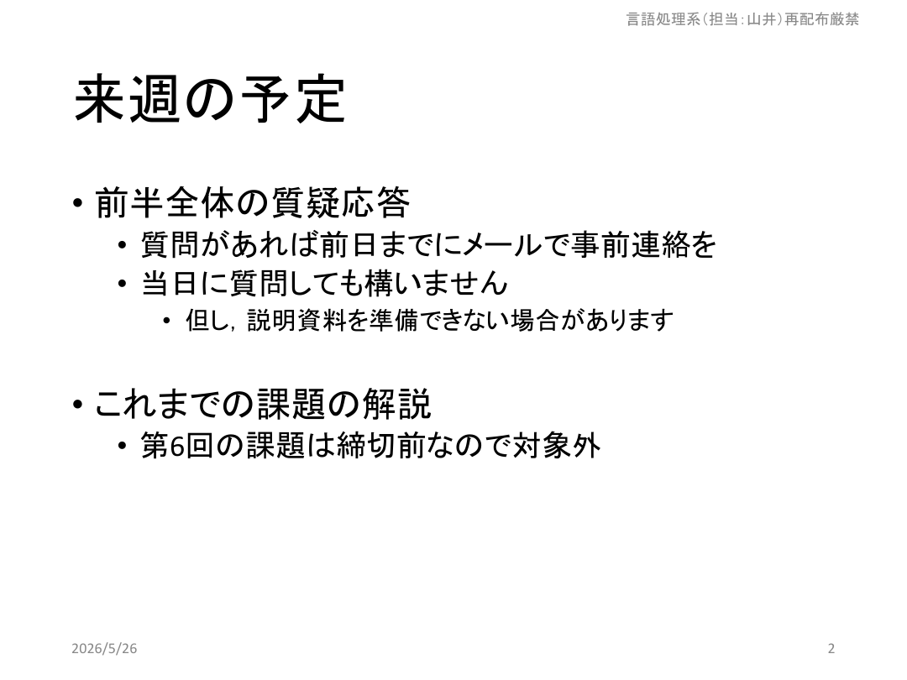

## 言語処理系202606_p003
<!-- source: 言語処理系202606.pdf page 3 -->

上向き構文解析法（１）
• 上向き構文解析法（bottom-up parsing）
• 移動還元構文解析法（shift-reduce parsing）とも
• 代表例：演算子順位法，LR(1)構文解析法
• スタックを使用
• 移動（Shift）: スタックに終端記号をプッシュ
• 還元（Reduce）: 𝐴𝐴→𝛼𝛼 によりスタックトップの 𝛼𝛼 を 𝐴𝐴へ置換
• 今回はLR(1)構文解析法を解説
• 演算子順位法は第4回で解説
3
2026/5/26
言語処理系（担当：山井）再配布厳禁

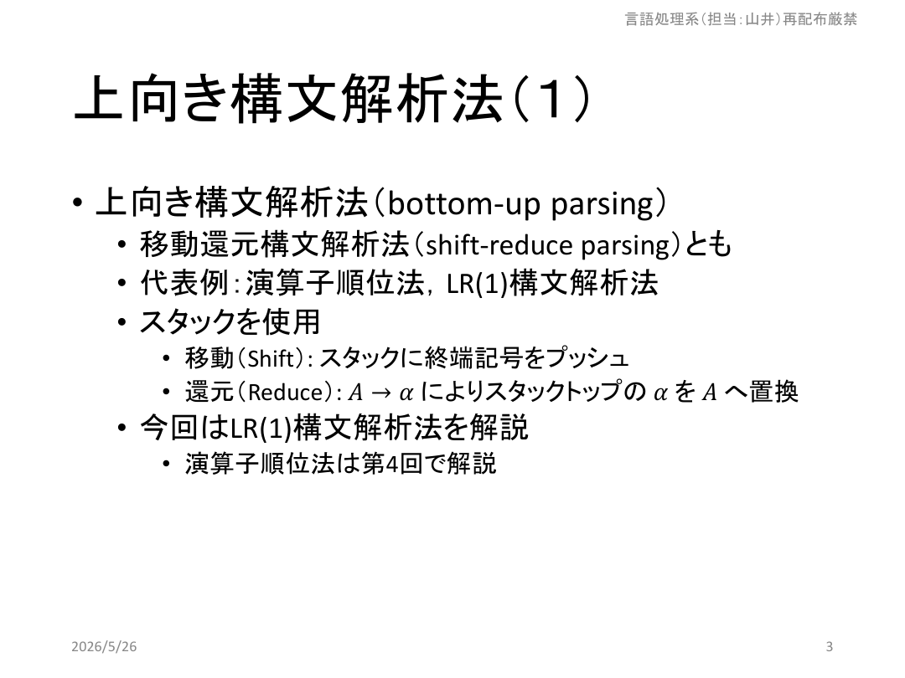

## 言語処理系202606_p004
<!-- source: 言語処理系202606.pdf page 4 -->

上向き構文解析法（２）
• 最右導出（rightmost derivation）
• 導出において最も右の非終端記号を置き換えること
• 例：文法 {𝑆𝑆→𝑎𝑎𝑎𝑎𝑎𝑎𝑎𝑎, 𝐴𝐴→𝐴𝐴𝐴𝐴𝐴𝐴𝐴𝐴𝐴, 𝐵𝐵→𝑑𝑑}の最右導出
𝑆𝑆𝑟𝑟𝑚𝑚𝑎𝑎𝑎𝑎𝐵𝐵𝑒𝑒𝑟𝑟𝑚𝑚𝑎𝑎𝐴𝐴𝑑𝑑𝑒𝑒𝑟𝑟𝑚𝑚𝑎𝑎𝐴𝐴𝑏𝑏𝑏𝑏𝑑𝑑𝑑𝑑𝑟𝑟𝑚𝑚𝑎𝑎𝑏𝑏𝑏𝑏𝑏𝑏𝑏𝑏𝑏𝑏
※ 𝑆𝑆から最右導出で得られる（終端，非終端）記号列を
      右文形式（right-sentential form）と呼ぶ
• ハンドル（handle）
• 右文形式において直前の最右導出により置き換えた
部分（と置換えに用いた生成規則）
• 還元（名詞：reduction，動詞：reduce）
• ハンドルを非終端記号に置き換えること
• 例： ハンドル部分に下線，還元された非終端記号を赤字
𝑎𝑎𝑏𝑏𝑏𝑏𝑏𝑏𝑏𝑏𝑏𝑏𝑟𝑟𝑚𝑚𝑎𝑎𝐴𝐴𝑏𝑏𝑏𝑏𝑑𝑑𝑑𝑑𝑟𝑟𝑚𝑚𝑎𝑎𝐴𝐴𝑑𝑑𝑒𝑒𝑟𝑟𝑚𝑚𝑎𝑎𝑎𝑎𝐵𝐵𝑒𝑒𝑟𝑟𝑚𝑚𝑆𝑆
4
2026/5/26
言語処理系（担当：山井）再配布厳禁

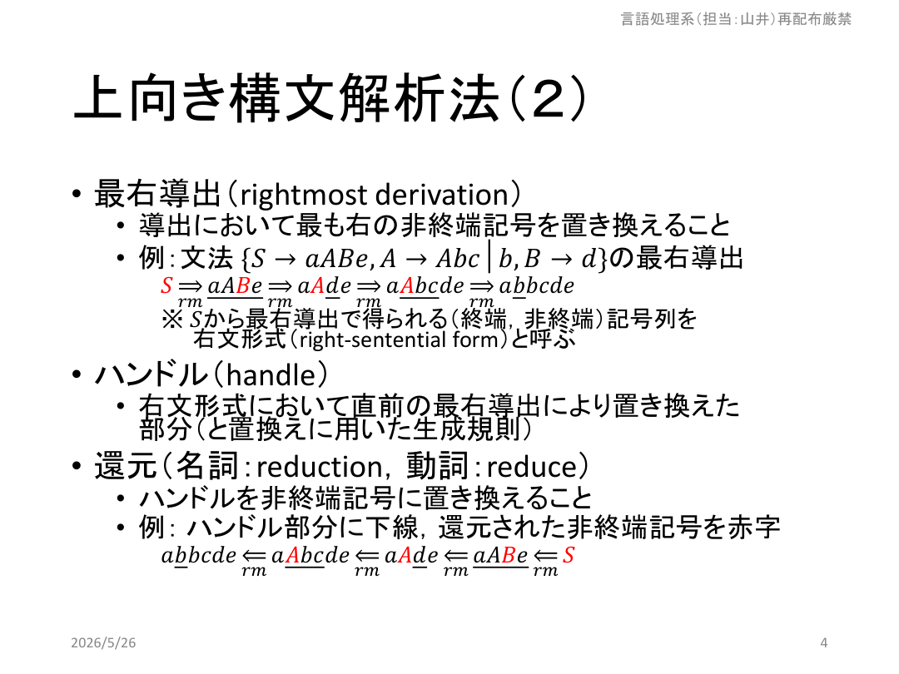

## 言語処理系202606_p005
<!-- source: 言語処理系202606.pdf page 5 -->

上向き構文解析法（３）
• 解析動作例
• スタックを使用
• スタック内の記号列と
入力文字を連結すると
右文形式
• 動作はshift, reduce,
accept, errorの4種類
• shift, reduceはどのよう
に判断?
• 演算子順位法では
演算子間の関係で決定
5
スタック
入力
動作
⊢
𝑎𝑎𝑎𝑎𝑎𝑎𝑎𝑎𝑎𝑎𝑎𝑎⊣
shift
⊢𝑎𝑎
𝑏𝑏𝑏𝑏𝑏𝑏𝑏𝑏𝑏𝑏⊣
shift
⊢𝑎𝑎𝑎𝑎
𝑏𝑏𝑏𝑏𝑏𝑏𝑏𝑏⊣reduce by 𝐴𝐴→𝑏𝑏
⊢𝑎𝑎𝑎𝑎
𝑏𝑏𝑏𝑏𝑏𝑏𝑏𝑏⊣shift
⊢𝑎𝑎𝑎𝑎𝑎𝑎
𝑐𝑐𝑐𝑐𝑐𝑐⊣shift
⊢𝑎𝑎𝑎𝑎𝑎𝑎𝑎𝑎
𝑑𝑑𝑑𝑑⊣
reduce by 𝐴𝐴→𝐴𝐴𝐴𝐴𝐴𝐴
⊢𝑎𝑎𝑎𝑎
𝑑𝑑𝑑𝑑⊣
shift
⊢𝑎𝑎𝑎𝑎𝑎𝑎
𝑒𝑒⊣
reduce by 𝐵𝐵→𝑑𝑑
⊢𝑎𝑎𝑎𝑎𝑎𝑎
𝑒𝑒⊣shift
⊢𝑎𝑎𝑎𝑎𝑎𝑎𝑎𝑎
⊣reduce by S →𝑎𝑎𝑎𝑎𝑎𝑎𝑎𝑎
⊢𝑆𝑆
⊣accept
2026/5/26
言語処理系（担当：山井）再配布厳禁

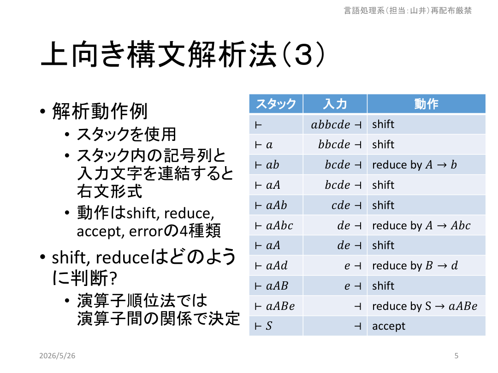

## 言語処理系202606_p006
<!-- source: 言語処理系202606.pdf page 6 -->

ＬＲ（１）構文解析法（１）
• 入力を左（Left）から読み最右（Rightmost）導出を実行
• 1トークンの先読みで動作（移動・還元）を決定
• 𝑘𝑘トークンの先読みを許すならLR(𝑘𝑘)構文解析法
• 構文解析の途中の状態を考察
例： 𝐴𝐴→𝑋𝑋⋅𝑌𝑌𝑌𝑌
※ 生成規則𝐴𝐴→𝑋𝑋𝑋𝑋𝑋𝑋の解析中において 𝑋𝑋 を解析した直後の状態
• 生成規則 𝐴𝐴→𝑋𝑋𝑋𝑋𝑋𝑋 の解析中の状態（LR(0)項）は4通り
• 𝐴𝐴→⋅𝑋𝑋𝑋𝑋𝑋𝑋
• 𝐴𝐴→𝑋𝑋⋅𝑌𝑌𝑌𝑌
• 𝐴𝐴→𝑋𝑋𝑋𝑋⋅𝑍𝑍
• 𝐴𝐴→𝑋𝑋𝑌𝑌𝑌𝑌⋅#
※ 最後の状態はハンドル𝑋𝑋𝑋𝑋𝑋𝑋を 𝐴𝐴 に還元可能なことを「#」で明示
6
2026/5/26
言語処理系（担当：山井）再配布厳禁

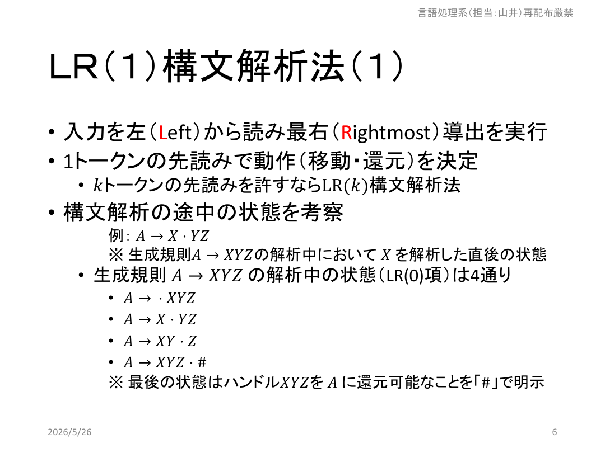

## 言語処理系202606_p007
<!-- source: 言語処理系202606.pdf page 7 -->

ＬＲ（１）構文解析法（２）
• LR(0)項の集合（item set）の閉包
• LR(0)項 𝐴𝐴→𝛼𝛼⋅𝐵𝐵𝐵𝐵 は生成規則 𝐵𝐵→𝛾𝛾 に対して
𝐵𝐵→⋅𝛾𝛾 というLR(0)項を含むとも考えられる
• LR(0)項の集合 𝐼𝐼 の閉包（closure(𝐼𝐼)）の定義
1. closure 𝐼𝐼≔𝐼𝐼
2.
𝐴𝐴→𝛼𝛼⋅𝐵𝐵𝐵𝐵∈closure(𝐼𝐼) に対して生成規則 𝐵𝐵→𝛾𝛾が
あれば𝐵𝐵→⋅𝛾𝛾 をclosure 𝐼𝐼に追加
3. 上記2.を新たに追加するものがなくなるまで繰り返し
※ これがLR(1)構文解析法の「状態」に相当
7
2026/5/26
言語処理系（担当：山井）再配布厳禁

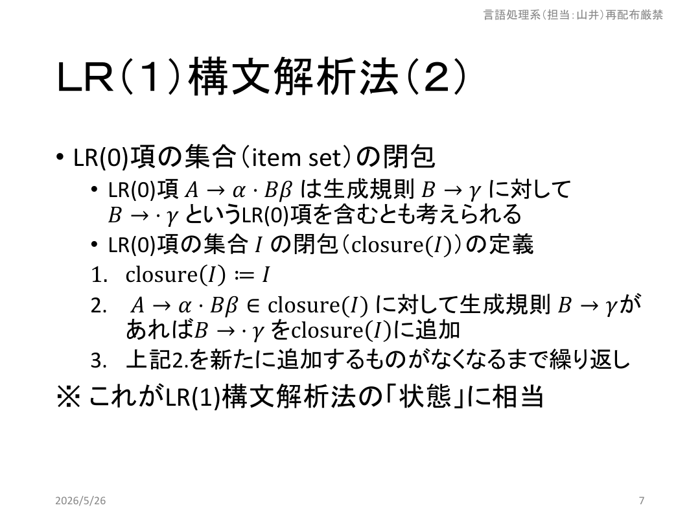

## 言語処理系202606_p008
<!-- source: 言語処理系202606.pdf page 8 -->

ＬＲ（１）構文解析法（３）
• 閉包の算出例： 以下の文法
𝐸𝐸→𝐸𝐸+ 𝑇𝑇 │ 𝑇𝑇
𝑇𝑇→𝑇𝑇∗𝐹𝐹 │ 𝐹𝐹
𝐹𝐹→ 𝐸𝐸 │ 𝐢𝐢
におけるclosure( 𝐸𝐸→𝐸𝐸+ ⋅𝑇𝑇)は
𝐸𝐸→𝐸𝐸+ ⋅𝑇𝑇
𝑇𝑇→⋅𝑇𝑇∗𝐹𝐹
𝑇𝑇→⋅𝐹𝐹
𝐹𝐹→⋅ 𝐸𝐸
𝐹𝐹→⋅𝐢𝐢
8
2026/5/26
言語処理系（担当：山井）再配布厳禁

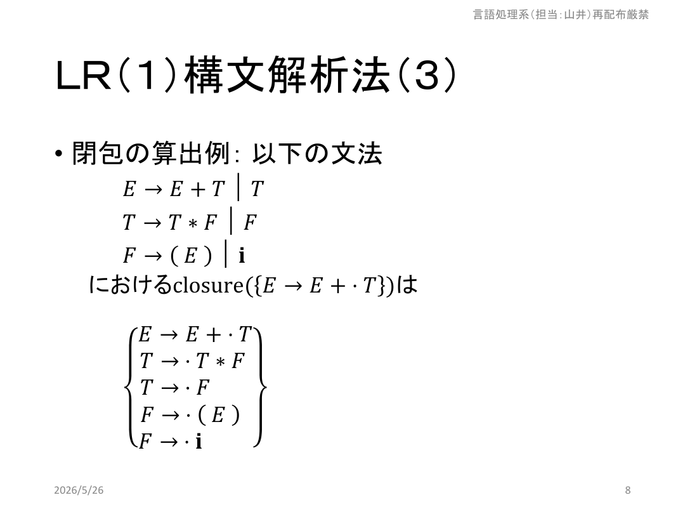

## 言語処理系202606_p009
<!-- source: 言語処理系202606.pdf page 9 -->

ＬＲ（１）構文解析法（４）
• 状態遷移
• 𝐴𝐴→𝛼𝛼⋅𝑋𝑋𝑋𝑋から記号 𝑋𝑋により𝐴𝐴→𝛼𝛼𝛼𝛼⋅𝛽𝛽に遷移
• 実際にはそれぞれの閉包
• LR(0)項の集合𝐼𝐼から記号𝑋𝑋による遷移先GOTO(𝐼𝐼, 𝑋𝑋)は
GOTO 𝐼𝐼, 𝑋𝑋= closure
𝐴𝐴→𝛼𝛼𝛼𝛼⋅𝛽𝛽𝐴𝐴→𝛼𝛼⋅𝑋𝑋𝑋𝑋∈𝐼𝐼
と定義
• 例：𝐼𝐼= {𝑇𝑇→𝑇𝑇⋅∗𝐹𝐹} に対する GOTO(𝐼𝐼,∗) は
GOTO 𝐼𝐼,∗=
𝑇𝑇→𝑇𝑇∗⋅𝐹𝐹
𝐹𝐹→⋅
𝐸𝐸
𝐹𝐹→⋅𝐢𝐢
• 全ての状態の求め方
1.
初期状態として𝐶𝐶≔closure
𝑆𝑆′ →⋅𝑆𝑆⊣
2.
任意の𝐼𝐼∈𝐶𝐶と𝑋𝑋∈{𝛴𝛴∪𝑁𝑁}に対してGOTO(𝐼𝐼, 𝑋𝑋)を𝐶𝐶に追加
3.
上記2.を新たな集合が追加されなくなるまで繰り返し
9
2026/5/26
言語処理系（担当：山井）再配布厳禁

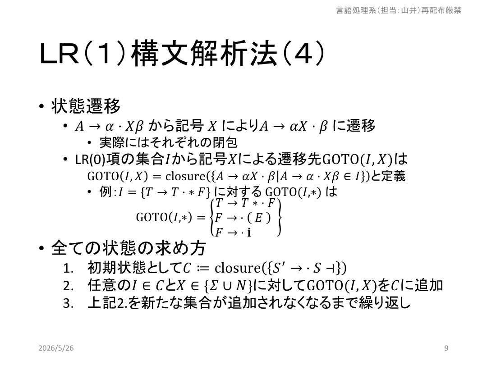

## 言語処理系202606_p010
<!-- source: 言語処理系202606.pdf page 10 -->

ＬＲ（１）構文解析法（５）
𝐼𝐼0: （初期状態）
𝐸𝐸′ →⋅𝐸𝐸⊣
𝐸𝐸→⋅𝐸𝐸+ 𝑇𝑇
𝐸𝐸→⋅𝑇𝑇
𝑇𝑇→⋅𝑇𝑇∗𝐹𝐹
𝑇𝑇→⋅𝐹𝐹
𝐹𝐹→⋅(𝐸𝐸)
𝐹𝐹→⋅𝐢𝐢
𝐼𝐼1: （GOTO(𝐼𝐼0, 𝐸𝐸)）
𝐸𝐸′ →𝐸𝐸⋅⊣
𝐸𝐸→𝐸𝐸⋅+ 𝑇𝑇
𝐼𝐼5: （GOTO(𝐼𝐼0, 𝐢𝐢)他）
𝐹𝐹→𝐢𝐢⋅#
𝐼𝐼6: （GOTO(𝐼𝐼1, ′+′)他）
𝐸𝐸→𝐸𝐸+ ⋅𝑇𝑇
𝑇𝑇→⋅𝑇𝑇∗𝐹𝐹
𝑇𝑇→⋅𝐹𝐹
𝐹𝐹→⋅(𝐸𝐸)
𝐹𝐹→⋅𝐢𝐢
𝐼𝐼7: （GOTO(𝐼𝐼2, ′ ∗′)他）
𝑇𝑇→𝑇𝑇∗⋅𝐹𝐹
𝐹𝐹→⋅(𝐸𝐸)
𝐹𝐹→⋅𝐢𝐢
10
• 例：{𝐸𝐸→𝐸𝐸+ 𝑇𝑇𝑇𝑇𝑇, 𝑇𝑇→𝑇𝑇∗𝐹𝐹𝐹𝐹𝐹, 𝐹𝐹→𝐸𝐸│𝐢𝐢}の場合
𝐼𝐼2: （GOTO(𝐼𝐼0, 𝑇𝑇)他）
𝐸𝐸→𝑇𝑇⋅#
𝑇𝑇→𝑇𝑇⋅∗𝐹𝐹
𝐼𝐼3: （GOTO(𝐼𝐼0, 𝐹𝐹)他）
𝑇𝑇→𝐹𝐹⋅#
𝐼𝐼4: （GOTO(𝐼𝐼0, ′(′)他）
𝐹𝐹→( ⋅𝐸𝐸)
𝐸𝐸→⋅𝐸𝐸+ 𝑇𝑇
𝐸𝐸→⋅𝑇𝑇
𝑇𝑇→⋅𝑇𝑇∗𝐹𝐹
𝑇𝑇→⋅𝐹𝐹
𝐹𝐹→⋅(𝐸𝐸)
𝐹𝐹→⋅𝐢𝐢
𝐼𝐼8: （GOTO(𝐼𝐼4, 𝐸𝐸)）
𝐹𝐹→(𝐸𝐸⋅)
𝐸𝐸→𝐸𝐸⋅+ 𝑇𝑇
𝐼𝐼9: （GOTO(𝐼𝐼6, 𝑇𝑇)）
𝐸𝐸→𝐸𝐸+ 𝑇𝑇⋅#
𝑇𝑇→𝑇𝑇⋅∗𝐹𝐹
𝐼𝐼10: （GOTO(𝐼𝐼7, 𝐹𝐹)）
𝑇𝑇→𝑇𝑇∗𝐹𝐹⋅#
𝐼𝐼11: （GOTO(𝐼𝐼8, ′)′)）
𝐹𝐹→𝐸𝐸⋅#
𝐼𝐼12: （GOTO(𝐼𝐼1, ⊣)）
𝐸𝐸′ →𝐸𝐸⊣⋅#
2026/5/26
言語処理系（担当：山井）再配布厳禁

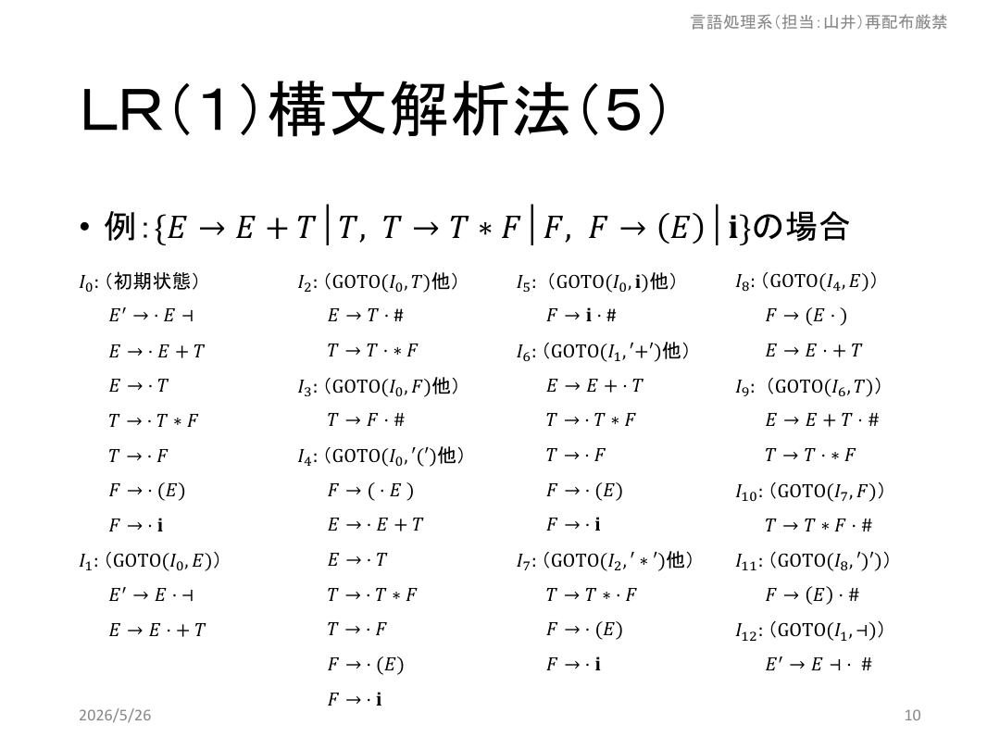

## 言語処理系202606_p011
<!-- source: 言語処理系202606.pdf page 11 -->

ＬＲ（１）構文解析法（６）
• 状態遷移図
11
2026/5/26
言語処理系（担当：山井）再配布厳禁
0
12
1
2
3
4
5
6
7
8
9
10
11
𝐸𝐸
𝑇𝑇
𝐹𝐹
(
𝐢𝐢
⊣
+
∗
#
(
𝐢𝐢
𝐸𝐸
#
𝐹𝐹
(
𝐢𝐢
𝑇𝑇
𝐹𝐹
(
𝐢𝐢
+
𝑇𝑇
)
#
#
#
#
#
∗
𝐹𝐹

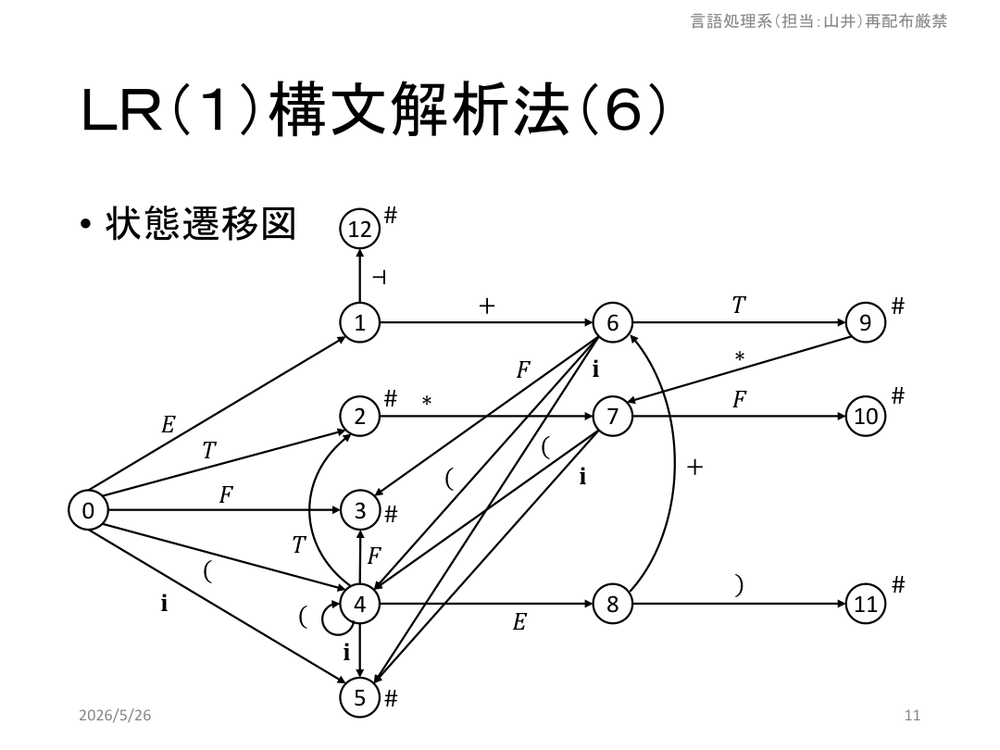

## 言語処理系202606_p012
<!-- source: 言語処理系202606.pdf page 12 -->

ＬＲ（１）構文解析法（７）
• 状態𝐼𝐼2に注目
𝐼𝐼2: 𝐸𝐸→𝑇𝑇⋅#
𝑇𝑇→𝑇𝑇⋅∗𝐹𝐹
• 次のトークンが「*」のとき，移動するか還元するか不明
• 「不都合な状態」と呼ぶ
• 不都合な状態の解決方法で細分化
• SLR(1): Simple LR(1)
• 次のトークンがFollow(𝐸𝐸)に含まれているときに限り還元
• 正規（Canonical）LR(1): 単にLR(1)と呼ぶことが多い
• 先読み記号を追加したLR(1)項を使用
• LALR(1): LookAhead LR(1)
• LR(1)項を一部合併して簡略化
※ 能力はSLR 1 ⊊LALR 1 ⊊LR 1
※ yacc/bisonはLALR(1)
12
2026/5/26
言語処理系（担当：山井）再配布厳禁

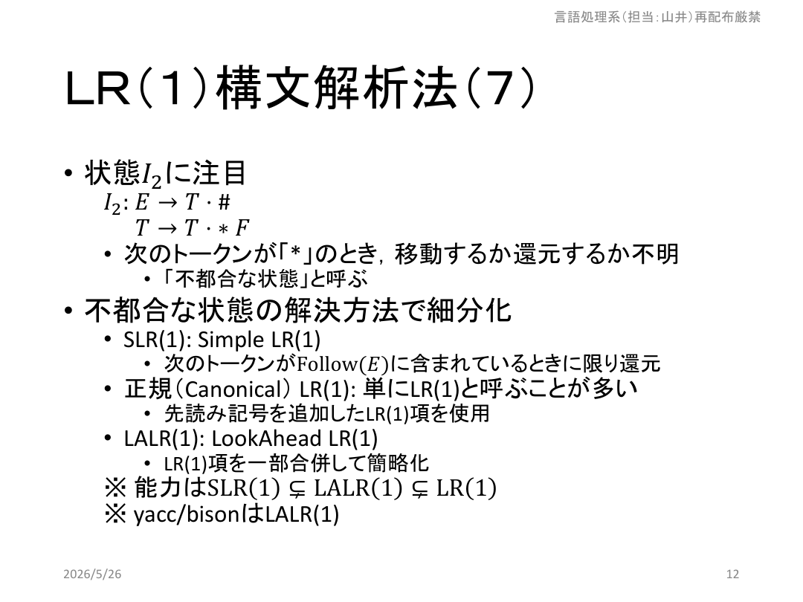

## 言語処理系202606_p013
<!-- source: 言語処理系202606.pdf page 13 -->

ＬＲ（１）構文解析法（８）
• SLR(1)の動作表
• s𝑖𝑖: shift
入力と状態𝑖𝑖を
スタックにpush
• r𝑗𝑗: reduce
𝑗𝑗番目の生成
規則で還元
• acc: accept
• 空白: エラー
13
状態
action
goto
𝐢𝐢
+
∗
(
)
⊣
𝐸𝐸
𝑇𝑇
𝐹𝐹
0
s5
s4
1
2
3
1
s6
acc
2
r2
s7
r2
r2
3
r4
r4
r4
r4
4
s5
s4
8
2
3
5
r6
r6
r6
r6
6
s5
s4
9
3
7
s5
s4
10
8
s6
s11
9
r1
s7
r1
r1
10
r3
r3
r3
r3
11
r5
r5
r5
r5
2026/5/26
言語処理系（担当：山井）再配布厳禁

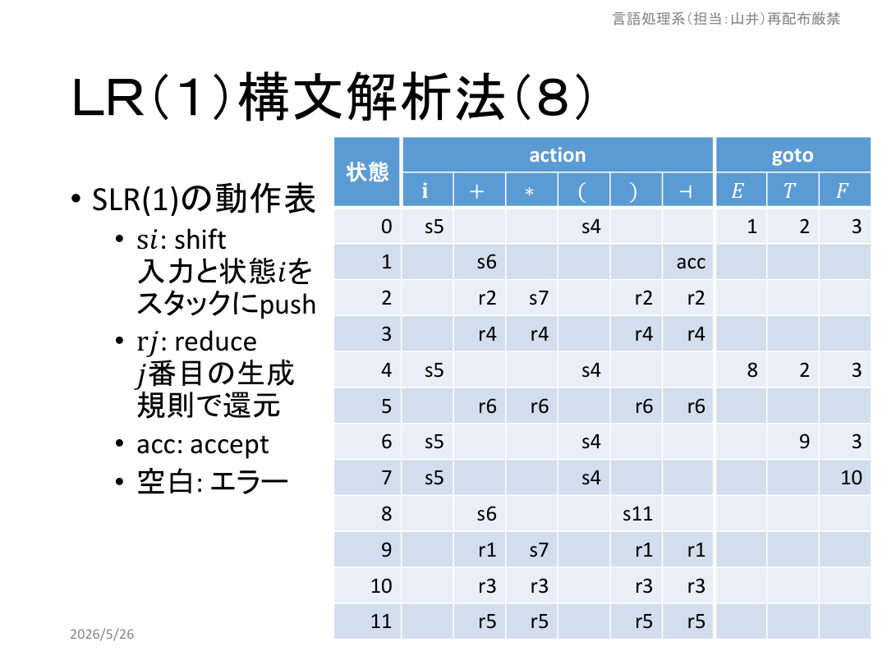

## 言語処理系202606_p014
<!-- source: 言語処理系202606.pdf page 14 -->

ＬＲ（１）構文解析法（９）
• LR構文解析器の様相（configuration）
𝑠𝑠0𝑋𝑋1𝑠𝑠1𝑋𝑋2𝑠𝑠2 ⋯𝑋𝑋𝑚𝑚𝑠𝑠𝑚𝑚, 𝑎𝑎𝑖𝑖𝑎𝑎𝑖𝑖+1 ⋯𝑎𝑎𝑛𝑛⊣
• 前半はスタックの内容，後半は未処理の入力記号
• 𝑠𝑠𝑘𝑘: 状態𝑘𝑘，𝑋𝑋𝑘𝑘: 終端/非終端記号，𝑎𝑎𝑘𝑘: 終端記号
• LR構文解析器の動作
1.
action 𝑠𝑠𝑚𝑚, 𝑎𝑎𝑖𝑖= shift 𝑠𝑠の場合，𝑎𝑎𝑖𝑖と𝑠𝑠をスタックに積んで
𝑠𝑠0𝑋𝑋1𝑠𝑠1𝑋𝑋2𝑠𝑠2 ⋯𝑋𝑋𝑚𝑚𝑠𝑠𝑚𝑚𝑎𝑎𝑖𝑖𝑠𝑠, 𝑎𝑎𝑖𝑖+1 ⋯𝑎𝑎𝑛𝑛⊣とする
2.
action 𝑠𝑠𝑚𝑚, 𝑎𝑎𝑖𝑖= reduce 𝐴𝐴→𝛽𝛽の場合，スタックから 2|𝛽𝛽|
（|𝛽𝛽|は𝛽𝛽の長さ）の記号を降ろし，𝐴𝐴と𝑠𝑠= goto 𝑠𝑠𝑚𝑚−|𝛽𝛽|, 𝐴𝐴を
スタックに積んで
𝑠𝑠0𝑋𝑋1𝑠𝑠1𝑋𝑋2𝑠𝑠2 ⋯𝑋𝑋𝑚𝑚−|𝛽𝛽|𝑠𝑠𝑚𝑚−|𝛽𝛽|𝐴𝐴𝑠𝑠, 𝑎𝑎𝑖𝑖𝑎𝑎𝑖𝑖+1 ⋯𝑎𝑎𝑛𝑛⊣とする
3.
action 𝑠𝑠𝑚𝑚, 𝑎𝑎𝑖𝑖= acceptの場合，終了する
4.
action 𝑠𝑠𝑚𝑚, 𝑎𝑎𝑖𝑖= errorの場合，エラー処理を行う
14
2026/5/26
言語処理系（担当：山井）再配布厳禁

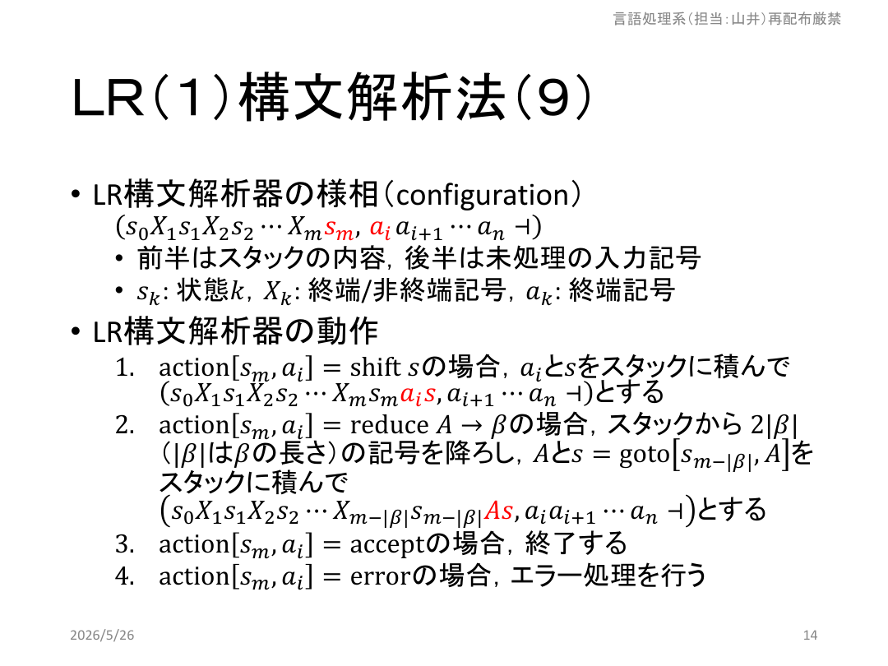

## 言語処理系202606_p015
<!-- source: 言語処理系202606.pdf page 15 -->

ＬＲ（１）構文解析法（１０）
• 動作例：
• 入力: 𝐢𝐢∗𝐢𝐢+ 𝐢𝐢
• スタック上の
記号と入力を
繋げたものは
右文形式
• 以下の生成
規則で還元
する際に出力
𝐸𝐸→𝐸𝐸+ 𝑇𝑇+
𝑇𝑇→𝑇𝑇∗𝐹𝐹∗
𝐹𝐹→𝐢𝐢𝐢𝐢
15
スタック
入力
動
作
出力
1
0
𝐢𝐢∗𝐢𝐢+ 𝐢𝐢⊣
shift 5
2
0 𝐢𝐢5
∗𝐢𝐢+ 𝐢𝐢⊣
reduce 6 (𝐹𝐹→𝐢𝐢)
i
3
0 𝐹𝐹3
∗𝐢𝐢+ 𝐢𝐢⊣
reduce 4 (𝑇𝑇→𝐹𝐹)
4
0 𝑇𝑇2
∗𝐢𝐢+ 𝐢𝐢⊣
shift 7
5
0 𝑇𝑇2 ∗7
𝐢𝐢+ 𝐢𝐢⊣
shift 5
6
0 𝑇𝑇2 ∗7 𝐢𝐢5
+𝒊𝒊⊣
reduce 6 (𝐹𝐹→𝐢𝐢)
ii
7
0 𝑇𝑇2 ∗7 𝐹𝐹10
+𝐢𝐢⊣
reduce 3 (𝑇𝑇→𝑇𝑇∗𝐹𝐹)
𝐢𝐢𝐢𝐢∗
8
0 𝑇𝑇2
+𝐢𝐢⊣
reduce 2 (𝐸𝐸→𝑇𝑇)
9
0 𝐸𝐸1
+𝐢𝐢⊣
shift 6
10
0 𝐸𝐸1 + 6
𝐢𝐢⊣
shift 5
11
0 𝐸𝐸1 + 6 𝐢𝐢5
⊣
reduce 6 (𝐹𝐹→𝐢𝐢)
𝐢𝐢𝐢𝐢∗𝐢𝐢
12
0 𝐸𝐸1 + 6 𝐹𝐹3
⊣
reduce 4 (𝑇𝑇→𝐹𝐹)
13
0 𝐸𝐸1 + 6 𝑇𝑇9
⊣
reduce 1 (𝐸𝐸→𝐸𝐸+ 𝑇𝑇)
𝐢𝐢𝐢𝐢∗𝐢𝐢+
14
0 𝐸𝐸1
⊣
accept
2026/5/26
言語処理系（担当：山井）再配布厳禁

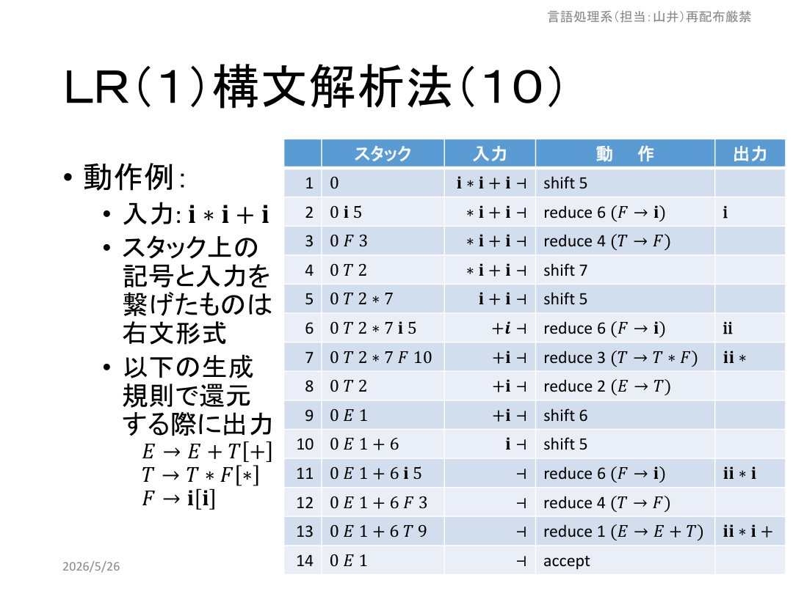

## 言語処理系202606_p016
<!-- source: 言語処理系202606.pdf page 16 -->

ＬＲ（１）構文解析法（１１）
• 動作例
• 入力:
𝐢𝐢+ 𝐢𝐢∗𝐢𝐢
16
スタック
入力
動
作
出力
1
0
𝐢𝐢+ 𝐢𝐢∗𝐢𝐢⊣
shift 5
2
0 𝐢𝐢5
+ 𝐢𝐢∗𝐢𝐢⊣
reduce 6 (𝐹𝐹→𝐢𝐢)
i
3
0 𝐹𝐹3
+ 𝐢𝐢∗𝐢𝐢⊣
reduce 4 (𝑇𝑇→𝐹𝐹)
4
0 𝑇𝑇2
+ 𝐢𝐢∗𝐢𝐢⊣
reduce 2 (𝐸𝐸→𝑇𝑇)
5
0 𝐸𝐸1
+ 𝐢𝐢∗𝐢𝐢⊣
shift 6
6
0 𝐸𝐸1 + 6
𝐢𝐢∗𝐢𝐢⊣
shift 5
7
0 𝐸𝐸1 + 6 𝐢𝐢5
∗𝐢𝐢⊣
reduce 6 (𝐹𝐹→𝐢𝐢)
𝐢𝐢𝐢𝐢
8
0 𝐸𝐸1 + 6 𝐹𝐹3
∗𝐢𝐢⊣
reduce 4 (𝑇𝑇→𝐹𝐹)
9
0 𝐸𝐸1 + 6 𝑇𝑇9
∗𝐢𝐢⊣
shift 7
10
0 𝐸𝐸1 + 6 𝑇𝑇9 ∗7
𝐢𝐢⊣
shift 5
11
0 𝐸𝐸1 + 6 𝑇𝑇9 ∗7 𝐢𝐢5
⊣
reduce 6 (𝐹𝐹→𝐢𝐢)
𝐢𝐢𝐢𝐢𝐢𝐢
12
0 𝐸𝐸1 + 6 𝑇𝑇9 ∗7 𝐹𝐹10
⊣
reduce 3 (𝑇𝑇→𝑇𝑇∗𝐹𝐹)
𝐢𝐢𝐢𝐢𝐢𝐢∗
13
0 𝐸𝐸1 + 6 𝑇𝑇9
⊣
reduce 1 (𝐸𝐸→𝐸𝐸+ 𝑇𝑇)
𝐢𝐢𝐢𝐢𝐢𝐢∗+
14
0 𝐸𝐸1
⊣
accept
2026/5/26
言語処理系（担当：山井）再配布厳禁

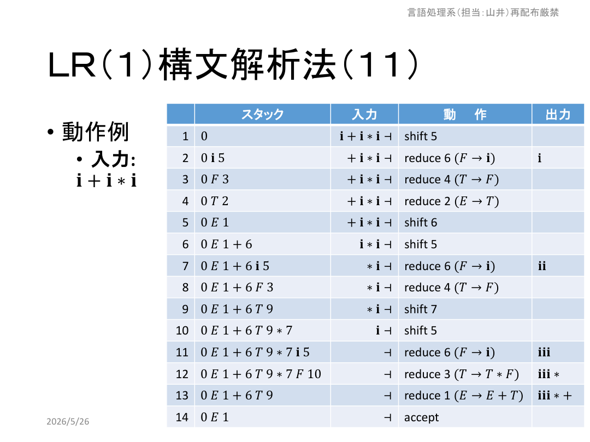

## 言語処理系202606_p017
<!-- source: 言語処理系202606.pdf page 17 -->

ｙａｃｃ/ｂｉｓｏｎ（１）
• LALR(1)構文解析器生成プログラム
• 仕様書ファイルの構成
定義部
%%
ルール部
%%
サブルーチン部
• 定義部
• yaccのオプションやC言語の宣言関係のコードを記載
• ルール部
• 「生成規則  {アクション（Cプログラム）}」を列挙
• サブルーチン部
• 主にルール部で使用する関数を記述
17
2026/5/26
言語処理系（担当：山井）再配布厳禁

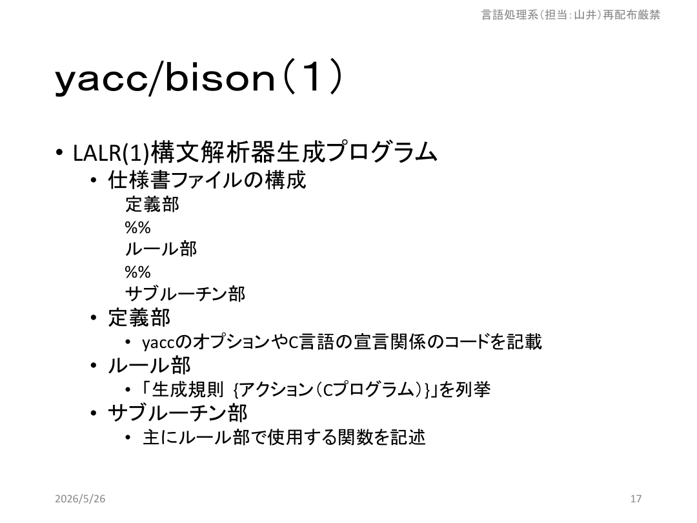

## 言語処理系202606_p018
<!-- source: 言語処理系202606.pdf page 18 -->

ｙａｃｃ/ｂｉｓｏｎ（２）
• 電卓プログラムを例題として説明（calc.y）
• 定義部（一部省略）
%start lines
非終端記号「lines」が開始記号
%union {double  dval;}
記号の値（共用体）はdouble型dval
%token <dval>   NUM
終端記号NUMの値はdvalでアクセス
%token QUIT
終端記号QUITが存在
%left   '+' '-'
「+」「-」は左結合で優先度最下位
%left   '*' '/'
「*」「/」は左結合で優先度3番目
%nonassoc UMINUS
単項演算子「-」用で優先度2番目
%right  '^'

「^」は右結合で優先度最高
%type <dval> expr
非終端記号exprの値はdvalでアクセス
• サブルーチン部
#include "lex.yy.c"
字句解析プログラムの取り込み
18
2026/5/26
言語処理系（担当：山井）再配布厳禁

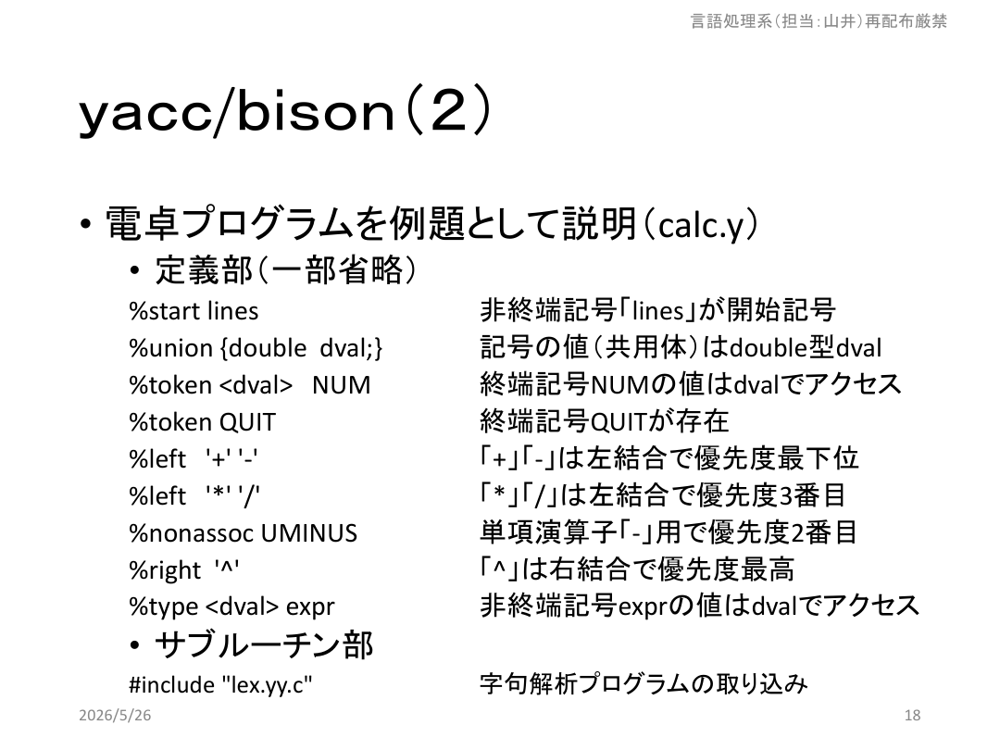

## 言語処理系202606_p019
<!-- source: 言語処理系202606.pdf page 19 -->

ｙａｃｃ/ｂｉｓｏｎ（３）
• ルール部
lines :       /* empty */ { printf(">> "); }
最初にプロンプトを表示
|       lines expr '¥n' { printf("= %g¥n>> ", $2); }
$2はexprの値(dval)
|       lines error '¥n' { yyerrok; printf(">> "); }
エラー処理
|       lines '¥n' { printf(">> "); }
空行
|       lines QUIT '¥n' { exit(0); }
「quit」入力時に終了
;
expr :       expr '+' expr { $$ = $1 + $3; }
左辺値に和を代入
|       expr '-' expr { $$ = $1 - $3; }
左辺値に差を代入
|       expr '*' expr { $$ = $1 * $3; }
左辺値に積を代入
|       expr '/' expr { $$ = $1 / $3; }
左辺値に商を代入
|       expr '^' expr { $$ = pow($1,$3); }
左辺値に累乗を代入
|       '-' expr %prec UMINUS { $$ = - $2; }
単項演算子
|       '(' expr ')' { $$ = $2; }
括弧つき式
|       NUM
数字のみ（$$=$1が省略）
;
19
2026/5/26
言語処理系（担当：山井）再配布厳禁

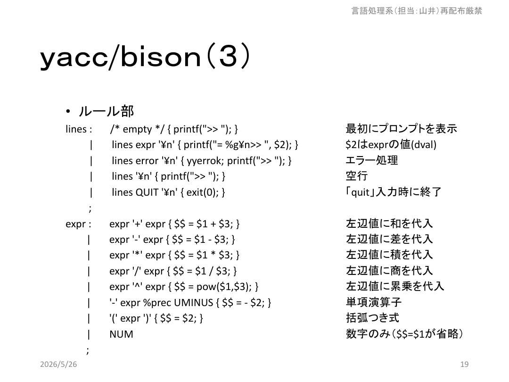

## 言語処理系202606_p020
<!-- source: 言語処理系202606.pdf page 20 -->

ｙａｃｃ/ｂｉｓｏｎ（４）
• 字句解析器（calc.l）
D
[0-9]
マクロ定義
E
([eE][+-]?{D}+)
%%
[␣¥t]
;
空白文字はスキップ
{D}+{E}?
|
{D}+"."{D}*{E}?
|
{D}*"."{D}+{E}?
{
整数・浮動小数点数
sscanf(yytext, "%lf", &yylval.dval) ;
return NUM;
}
quit                        return QUIT;
終端記号「quit」
.|"¥n"
return yytext[0];
その他の終端記号
%%
20
2026/5/26
言語処理系（担当：山井）再配布厳禁

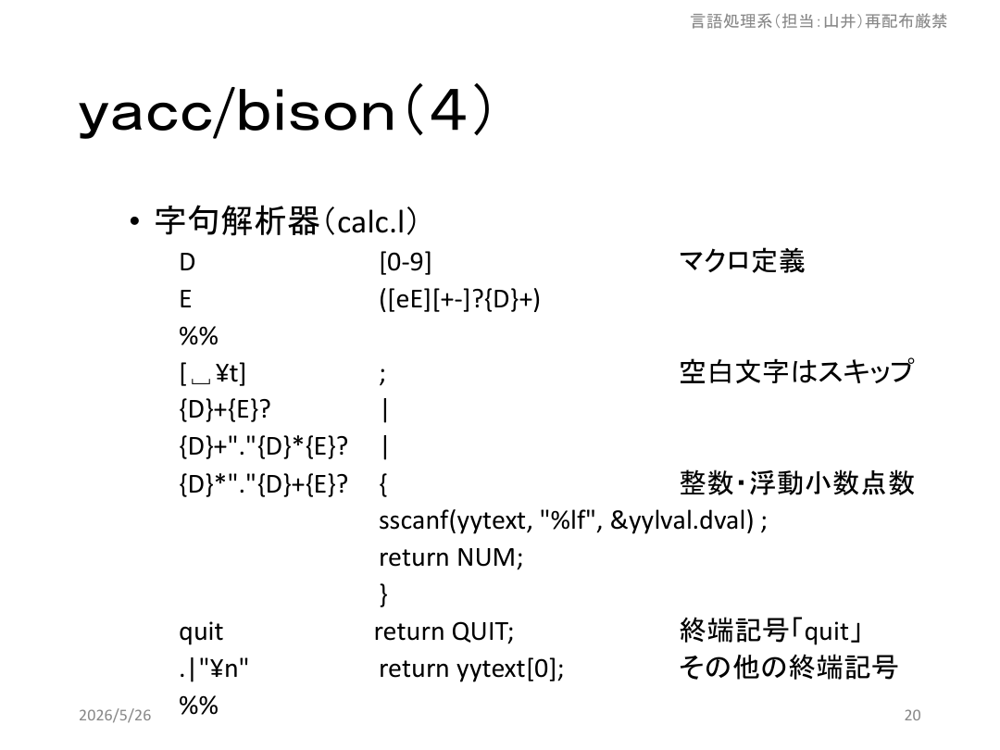

## 言語処理系202606_p021
<!-- source: 言語処理系202606.pdf page 21 -->

ｙａｃｃ/ｂｉｓｏｎ（５）
• コンパイル方法
$ lex calc.l
# calc.lからlex.yy.cを生成
$ yacc -v calc.y
# calc.yからy.tab.c，y.outputを生成
$ mv -f y.tab.c calc.c
# y.tab.cを名前変更
$ cc -c -o calc.o calc.c
# calc.cからcalc.oを生成
$ cc calc.o -o calc -lm
# calc.o，libm.aからcalcを生成
• 実行例
$ ./calc
>> 4*3/(2-1)
= 12
>> 2^3^2
= 512
>> -2^0.5
= -1.41421
>> (-2)^0.5
= -nan
>> quit
21
2026/5/26
言語処理系（担当：山井）再配布厳禁

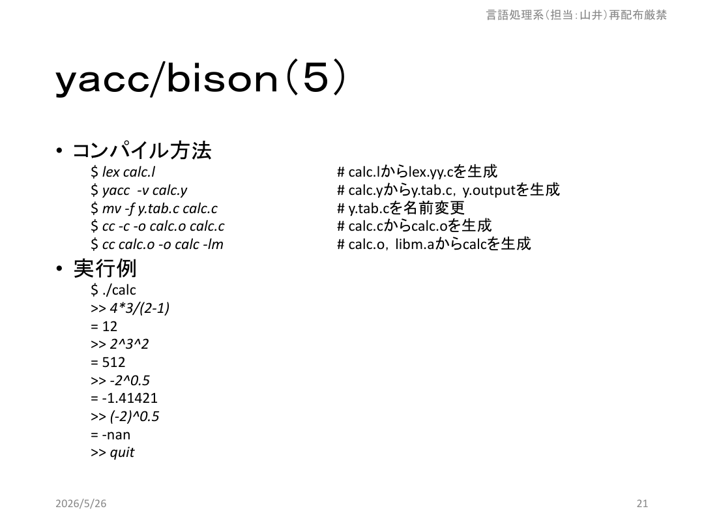

## 言語処理系202606_p022
<!-- source: 言語処理系202606.pdf page 22 -->

ｙａｃｃ/ｂｉｓｏｎ（６）
• y.outputの内容（-vオプションで出力）
• 各状態の詳細説明を記載
• 例
State 21
6 expr: expr . '+' expr
6     | expr '+' expr .
7     | expr . '-' expr
8     | expr . '*' expr
9     | expr . '/' expr
10     | expr . '^' expr
'*'  shift, and go to state 16
'/'  shift, and go to state 17
'^'  shift, and go to state 18
$default  reduce using rule 6 (expr)
22
2026/5/26
言語処理系（担当：山井）再配布厳禁

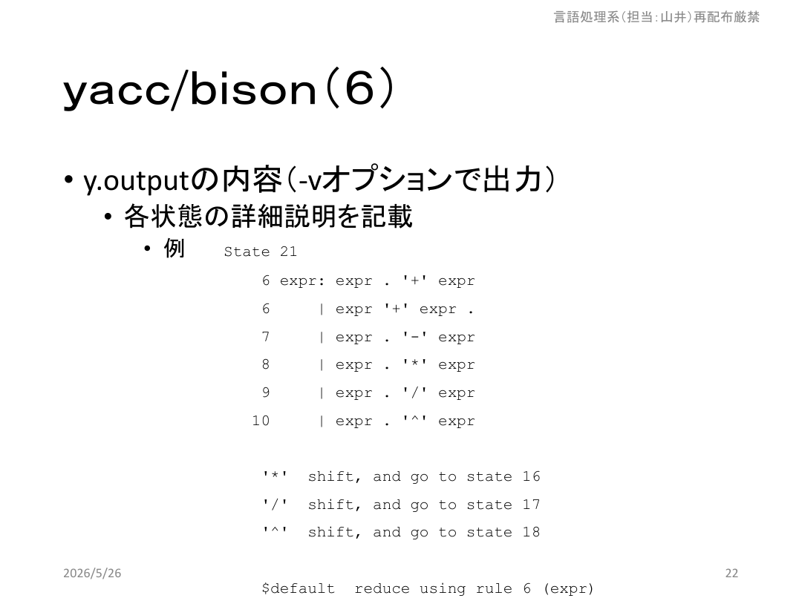

## 言語処理系202606_p023
<!-- source: 言語処理系202606.pdf page 23 -->

本日の課題
1. スライドp.13の構文解析表に基づいてLR構文解
析法を実行する場合，入力「i ∗(i + i ) ┤」に対
する動作をpp.15-16に倣って示せ．
2. スライドpp.18-20のプログラムを絶対値「|式|」を
扱えるように修正せよ．
• 期限： 6/8(月) 23:59
• Google classroomで提出
2026/5/26
言語処理系（担当：山井）再配布厳禁
23

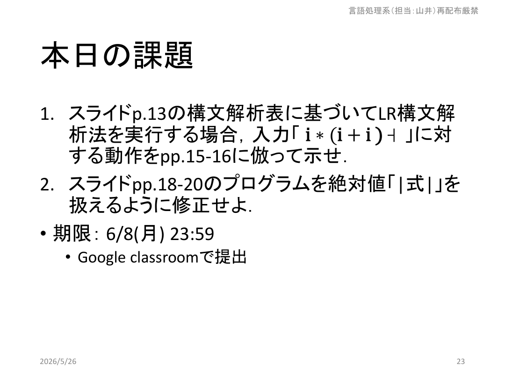
