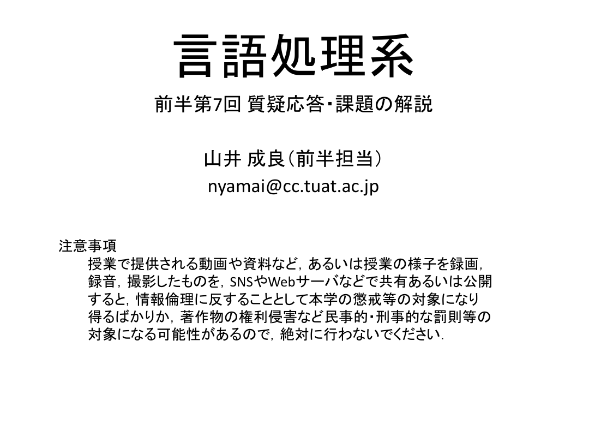
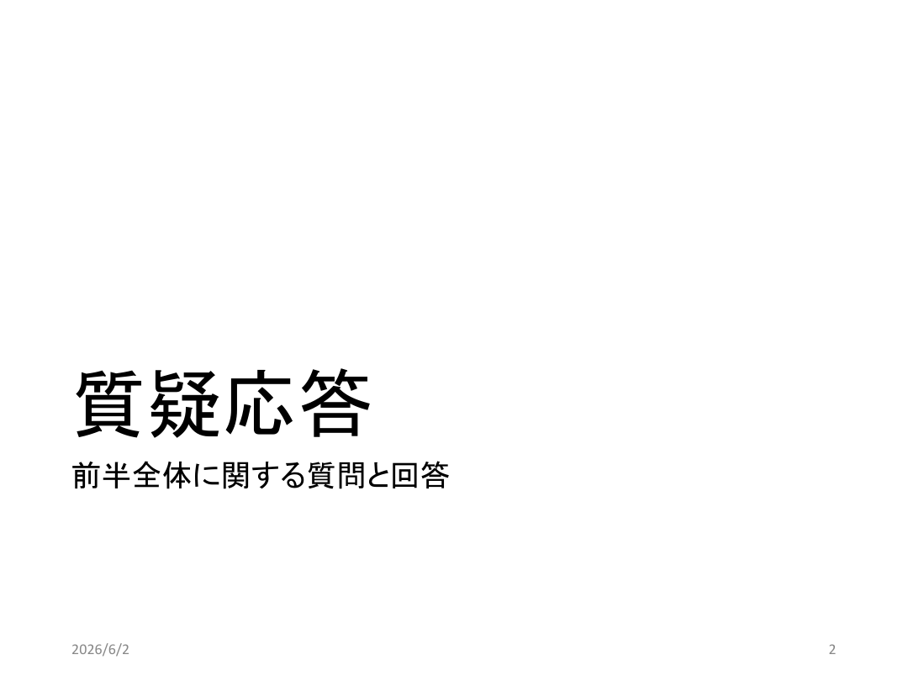
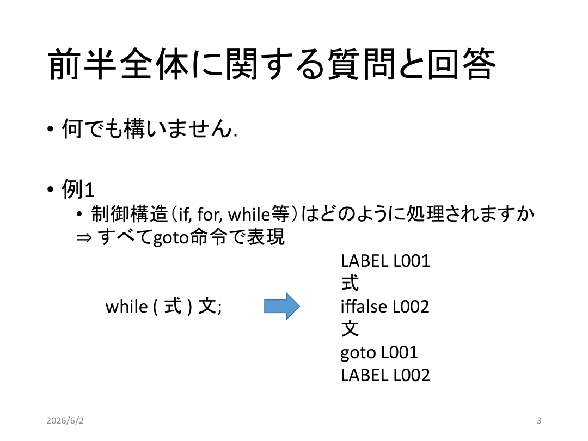
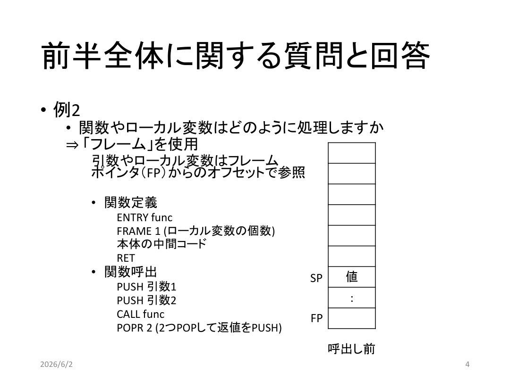
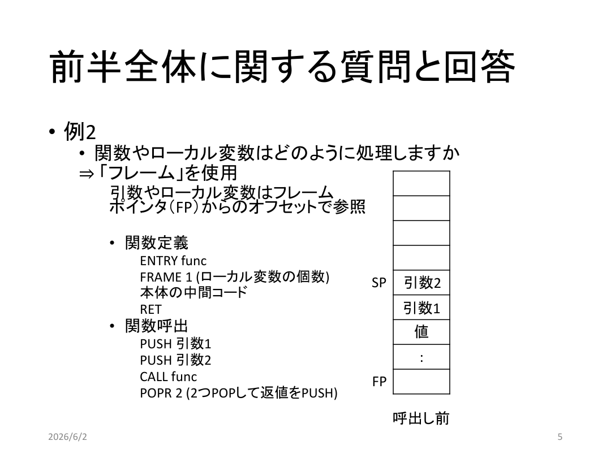
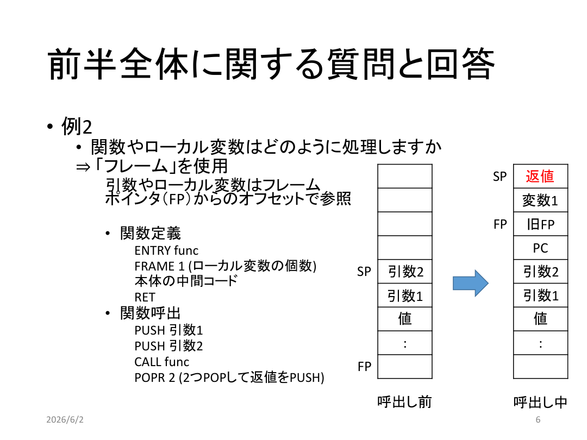
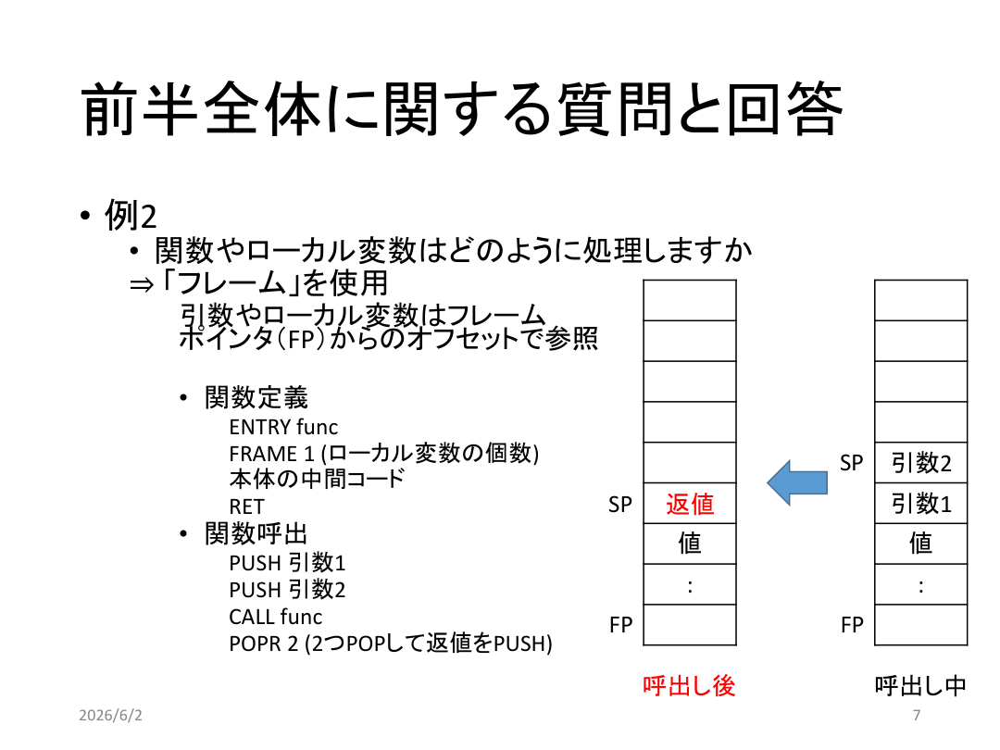
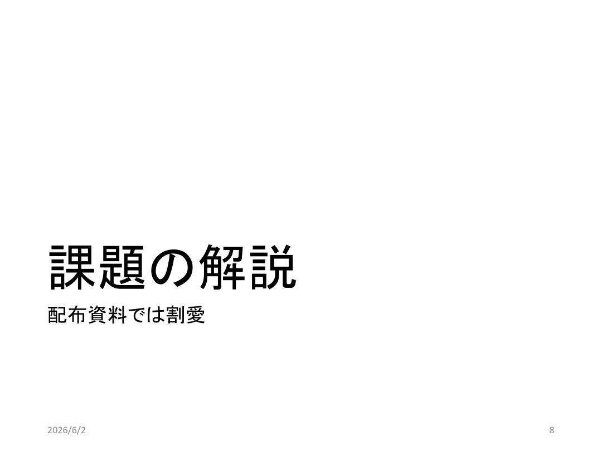

# 言語処理系202607

<!-- source: 言語処理系202607.pdf -->

## 言語処理系202607_p001
<!-- source: 言語処理系202607.pdf page 1 -->

言語処理系
前半第7回質疑応答・課題の解説
山井成良（前半担当）
nyamai@cc.tuat.ac.jp
注意事項
授業で提供される動画や資料など，あるいは授業の様子を録画，
録音，撮影したものを，SNSやWebサーバなどで共有あるいは公開
すると，情報倫理に反することとして本学の懲戒等の対象になり
得るばかりか，著作物の権利侵害など民事的・刑事的な罰則等の
対象になる可能性があるので，絶対に行わないでください．

## 言語処理系202607_p002
<!-- source: 言語処理系202607.pdf page 2 -->

質疑応答
前半全体に関する質問と回答
2026/6/2
2

## 言語処理系202607_p003
<!-- source: 言語処理系202607.pdf page 3 -->

前半全体に関する質問と回答
• 何でも構いません．
• 例1
• 制御構造（if, for, while等）はどのように処理されますか
⇒ すべてgoto命令で表現
LABEL L001
式
while ( 式) 文;
iffalse L002
文
goto L001
LABEL L002
2026/6/2
3

## 言語処理系202607_p004
<!-- source: 言語処理系202607.pdf page 4 -->

前半全体に関する質問と回答
• 例2
• 関数やローカル変数はどのように処理しますか
⇒ 「フレーム」を使用
引数やローカル変数はフレーム
ポインタ（FP）からのオフセットで参照
• 関数定義
ENTRY func
FRAME 1 (ローカル変数の個数)
本体の中間コード
RET
• 関数呼出
PUSH 引数1
PUSH 引数2
CALL func
POPR 2 (2つPOPして返値をPUSH)
2026/6/2
値
:
FP
SP
呼出し前
4

## 言語処理系202607_p005
<!-- source: 言語処理系202607.pdf page 5 -->

前半全体に関する質問と回答
• 例2
• 関数やローカル変数はどのように処理しますか
⇒ 「フレーム」を使用
引数やローカル変数はフレーム
ポインタ（FP）からのオフセットで参照
• 関数定義
ENTRY func
FRAME 1 (ローカル変数の個数)
本体の中間コード
RET
• 関数呼出
PUSH 引数1
PUSH 引数2
CALL func
POPR 2 (2つPOPして返値をPUSH)
2026/6/2
値
:
FP
SP
呼出し前
引数1
引数2
5

## 言語処理系202607_p006
<!-- source: 言語処理系202607.pdf page 6 -->

前半全体に関する質問と回答
• 例2
• 関数やローカル変数はどのように処理しますか
⇒ 「フレーム」を使用
引数やローカル変数はフレーム
ポインタ（FP）からのオフセットで参照
• 関数定義
ENTRY func
FRAME 1 (ローカル変数の個数)
本体の中間コード
RET
• 関数呼出
PUSH 引数1
PUSH 引数2
CALL func
POPR 2 (2つPOPして返値をPUSH)
2026/6/2
値
:
FP
SP
呼出し前
引数1
引数2
FP
SP
引数2
引数1
値
:
呼出し中
PC
旧FP
変数1
返値
6

## 言語処理系202607_p007
<!-- source: 言語処理系202607.pdf page 7 -->

前半全体に関する質問と回答
• 例2
• 関数やローカル変数はどのように処理しますか
⇒ 「フレーム」を使用
引数やローカル変数はフレーム
ポインタ（FP）からのオフセットで参照
• 関数定義
ENTRY func
FRAME 1 (ローカル変数の個数)
本体の中間コード
RET
• 関数呼出
PUSH 引数1
PUSH 引数2
CALL func
POPR 2 (2つPOPして返値をPUSH)
2026/6/2
値
:
FP
SP
FP
SP
引数2
引数1
値
:
呼出し中
呼出し後
返値
7

## 言語処理系202607_p008
<!-- source: 言語処理系202607.pdf page 8 -->

課題の解説
配布資料では割愛
2026/6/2
8

