# 言語処理系（３）

<!-- source: 言語処理系（３）.pdf -->

## 言語処理系（３）_p001
<!-- source: 言語処理系（３）.pdf page 1 -->

言語処理系（３）
金子敬一

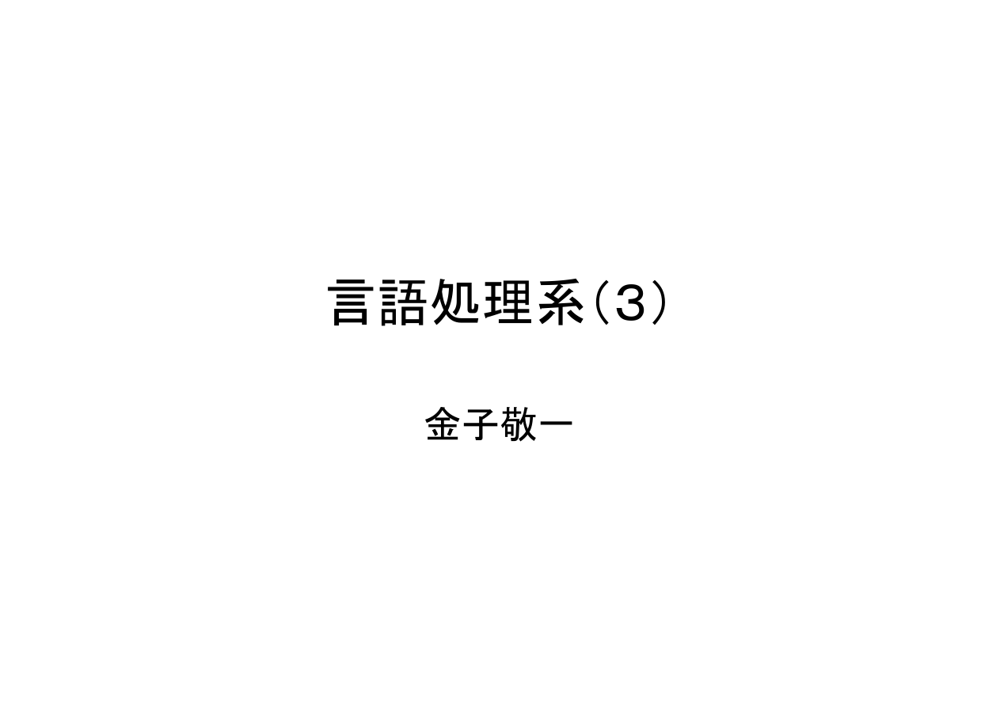

## 言語処理系（３）_p002
<!-- source: 言語処理系（３）.pdf page 2 -->

３文のコード生成
３．１宣言文
３．２複合文
３．３if文
３．４while文
３．５for文
３．６式文と代入式
要約

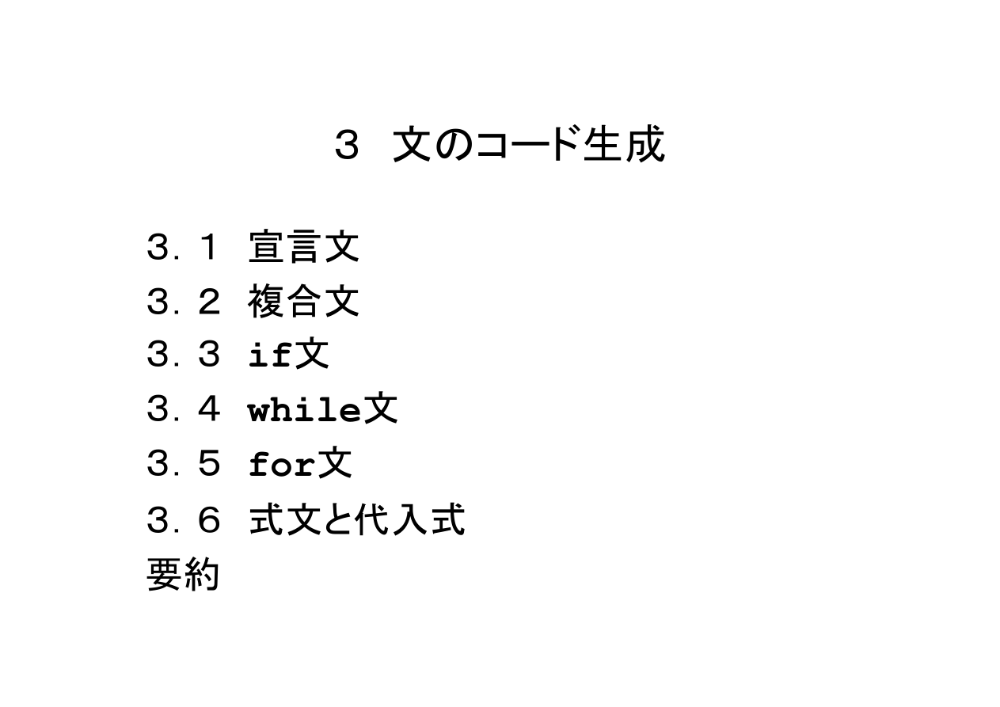

## 言語処理系（３）_p003
<!-- source: 言語処理系（３）.pdf page 3 -->

３．１宣言文
• 局所変数の割当て
• 相対番地の記憶
• 初期化
– 初期値のコード生成
– 初期化なし⇒コードなし
int x = 10;
mov  n[ebp], 10

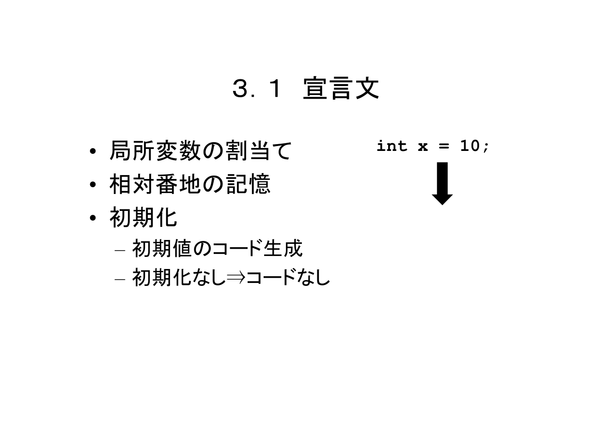

## 言語処理系（３）_p004
<!-- source: 言語処理系（３）.pdf page 4 -->

３．２複合文
{ d1 ... dn s1 ... sm }
• di: 宣言，sj: 文
d1の初期化
...
dnの初期化
s1の実行
...
smの実行
複合文の最後
⇒d1, ..., dnの変数を解放
⇒局所変数領域の再利用

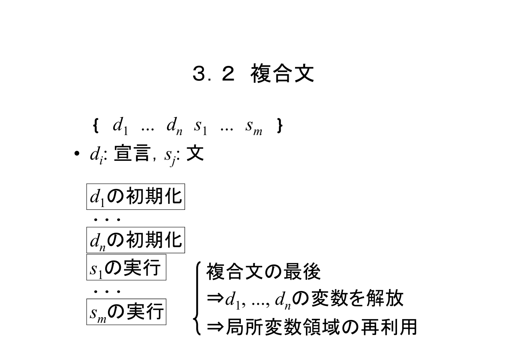

## 言語処理系（３）_p005
<!-- source: 言語処理系（３）.pdf page 5 -->

３．３if文
if (e) s
eを計算，偽ならL1へ分岐
sの実行
L1:
e ?
s
真
偽
L1

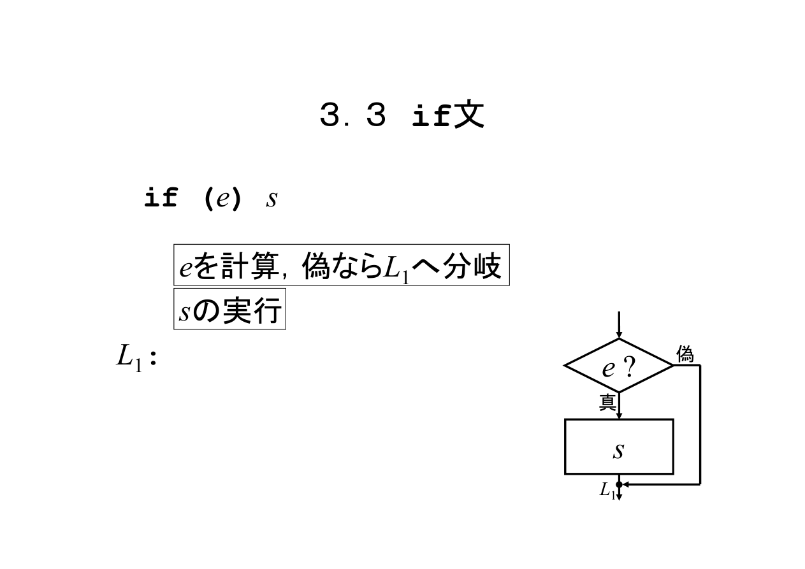

## 言語処理系（３）_p006
<!-- source: 言語処理系（３）.pdf page 6 -->

eax
-10
旧ebp
戻り番地
x
-10
10
３．３if文
if (x < 0) x = -x;
cmp  8[ebp], 0
jge  L1
mov  eax, 8[ebp]
neg  eax
mov  8[ebp], eax
L1:
cmp  8[ebp], 0
jge  L1
mov  eax, 8[ebp]
neg  eax
mov  8[ebp], eax
ebp
10

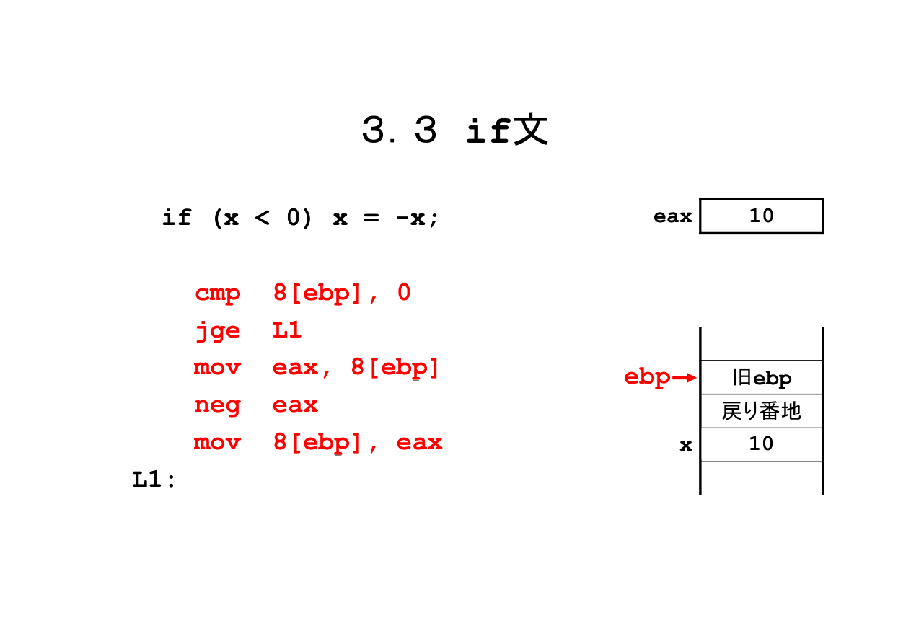

## 言語処理系（３）_p007
<!-- source: 言語処理系（３）.pdf page 7 -->

３．３if文
if (e) s1 else s2
eを計算，偽ならL1へ分岐
s1の実行
jmp  L2
L1: s2の実行
L2:
e ?
s1
s2
真
偽
L1
L2

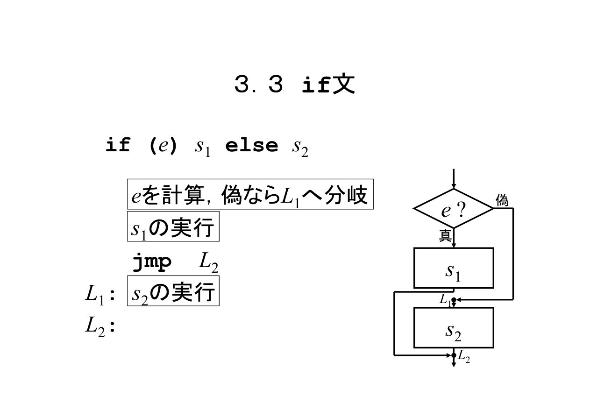

## 言語処理系（３）_p008
<!-- source: 言語処理系（３）.pdf page 8 -->

旧ebp
戻り番地
x
-10
３．３if文
if (x < 0) x--; else x++;
cmp  8[ebp], 0
jge  L1
sub  8[ebp], 1
jmp  L2
L1: add  8[ebp], 1
L2:
cmp  8[ebp], 0
jge  L1
sub  8[ebp], 1
jmp  L2
ebp
-11

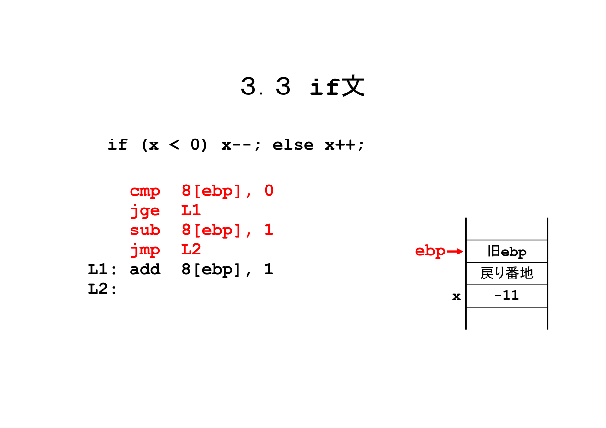

## 言語処理系（３）_p009
<!-- source: 言語処理系（３）.pdf page 9 -->

３．３if文
旧ebp
戻り番地
x
10
if (x < 0) x--; else x++;
cmp  8[ebp], 0
jge  L1
sub  8[ebp], 1
jmp  L2
L1: add  8[ebp], 1
L2:
cmp  8[ebp], 0
jge  L1
add  8[ebp], 1
ebp
11

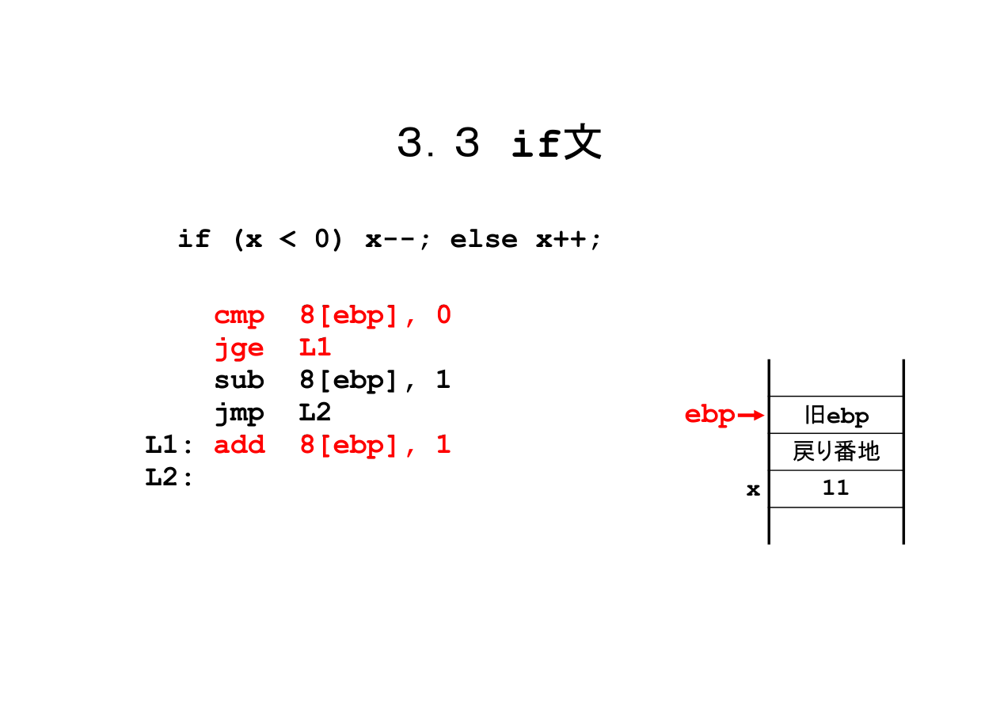

## 言語処理系（３）_p010
<!-- source: 言語処理系（３）.pdf page 10 -->

３．４while文
while (e) s
L1: eを計算，偽ならL2へ分岐
sの実行
jmp  L1
L2:
e ?
s
真
偽
L2
L1

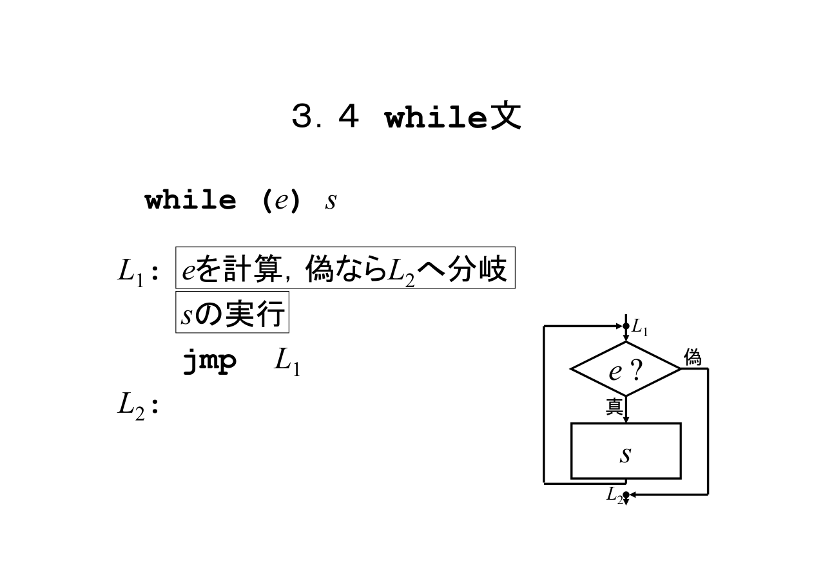

## 言語処理系（３）_p011
<!-- source: 言語処理系（３）.pdf page 11 -->

３．４while文
while (x >= 4) x -= 4;
L1: cmp  8[ebp], 4
jl   L2
sub  8[ebp], 4
jmp  L1
L2:
cmp  8[ebp], 4
jl   L2
sub  8[ebp], 4
jmp  L1
旧ebp
戻り番地
x
11
ebp
73

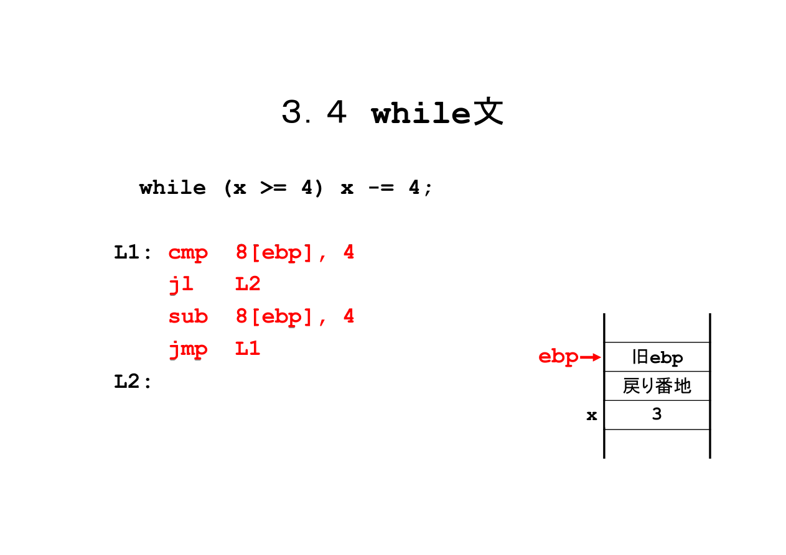

## 言語処理系（３）_p012
<!-- source: 言語処理系（３）.pdf page 12 -->

３．４while文
• break文
jmp  L2
• continue文
jmp  L1
e ?
s
真
偽
L2
L1

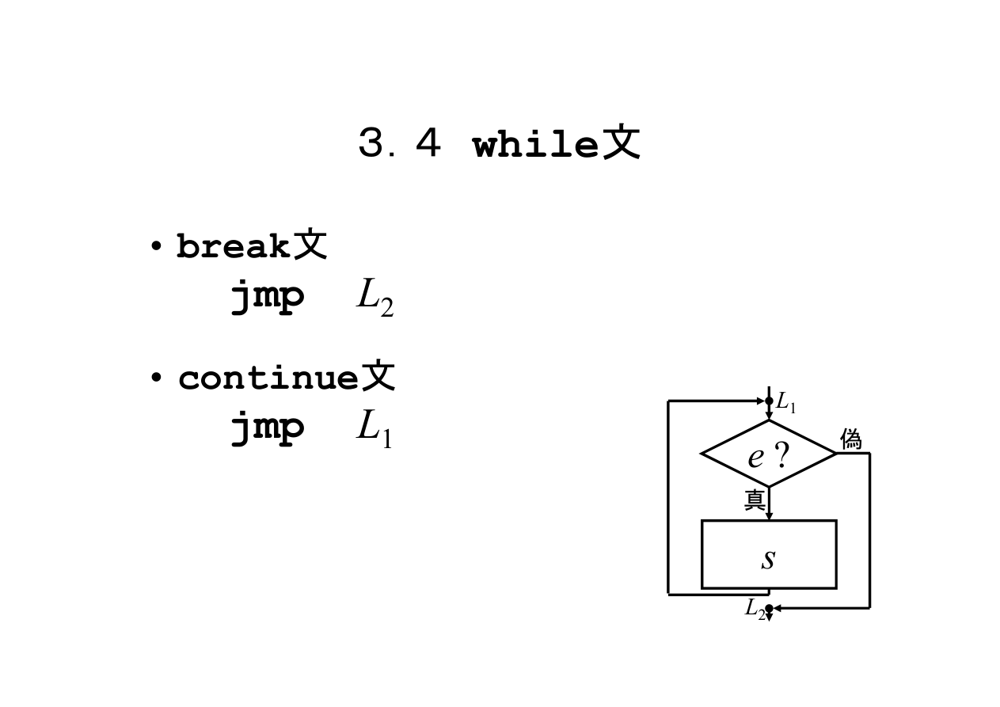

## 言語処理系（３）_p013
<!-- source: 言語処理系（３）.pdf page 13 -->

演習問題１
下図プログラムに対するコードを示せ．但し，
変数xは，-4[ebp]に割当てられているとせよ．
while (x != 0)
if (x > 0) x--; else x++;
L1: x != 0を計算，偽ならL2へ分岐
if (x > 0) x--; else x++;の実行
jmp L1
L2:

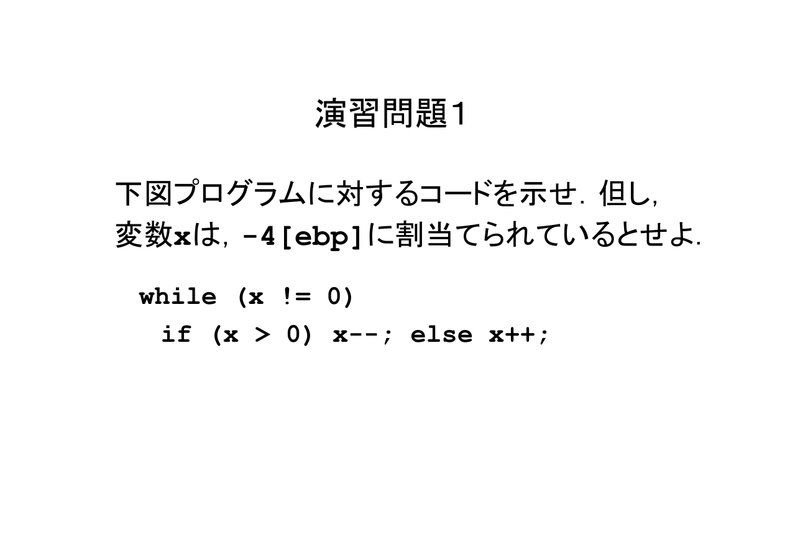

## 言語処理系（３）_p014
<!-- source: 言語処理系（３）.pdf page 14 -->

演習問題１
L1: x != 0を計算，偽ならL2へ分岐
if (x > 0) x--; else x++;の実行
jmp L1
L2:

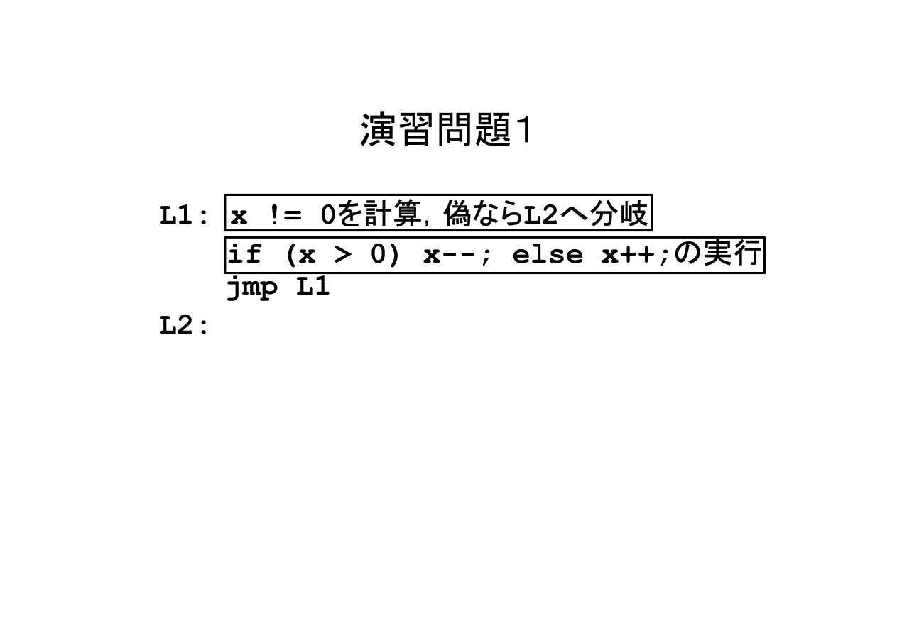

## 言語処理系（３）_p015
<!-- source: 言語処理系（３）.pdf page 15 -->

演習問題１
L1: x != 0を計算，偽ならL2へ分岐
if (x > 0) x--; else x++;の実行
jmp L1
L2:

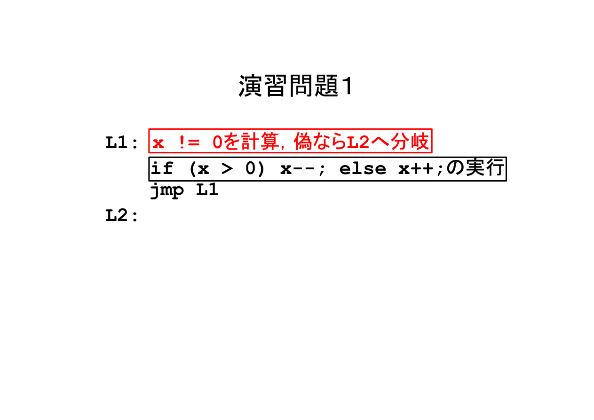

## 言語処理系（３）_p016
<!-- source: 言語処理系（３）.pdf page 16 -->

演習問題１
L1: x == 0ならL2へ分岐
if (x > 0) x--; else x++;の実行
jmp L1
L2:

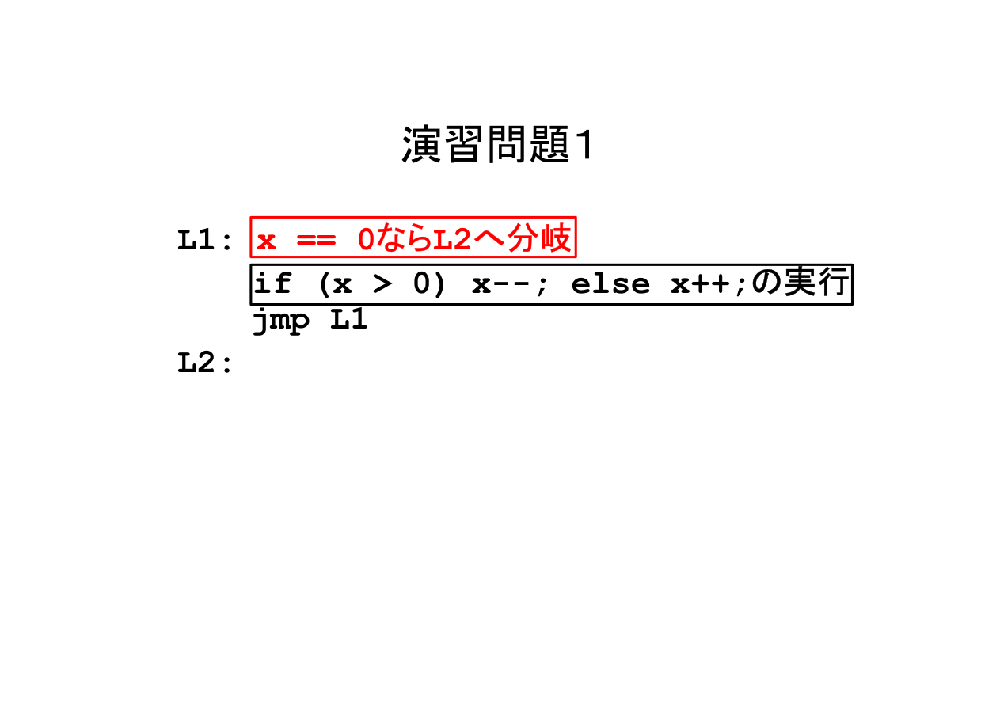

## 言語処理系（３）_p017
<!-- source: 言語処理系（３）.pdf page 17 -->

演習問題１
L1: cmp -4[ebp], 0
jz  L2
if (x > 0) x--; else x++;の実行
jmp L1
L2:

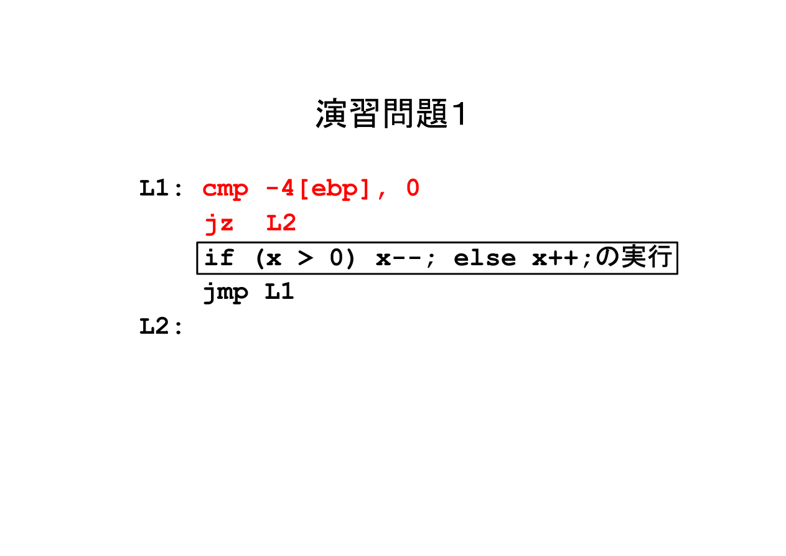

## 言語処理系（３）_p018
<!-- source: 言語処理系（３）.pdf page 18 -->

演習問題１
L1: cmp -4[ebp], 0
jz  L2
if (x > 0) x--; else x++;の実行
jmp L1
L2:

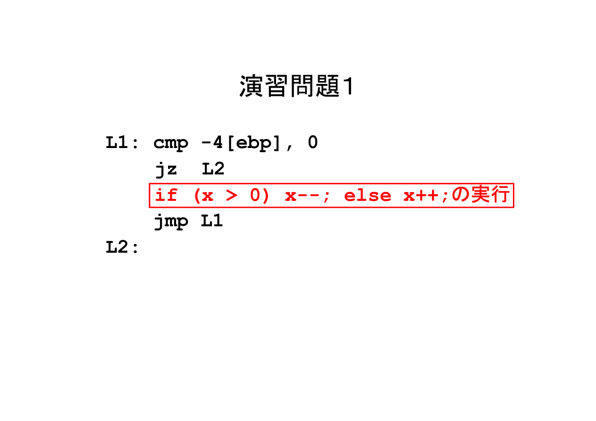

## 言語処理系（３）_p019
<!-- source: 言語処理系（３）.pdf page 19 -->

演習問題１
L1: cmp -4[ebp], 0
jz  L2
x > 0を計算，偽ならL3へ分岐
x--の実行
jmp L4
L3: x++の実行
L4: jmp L1
L2:

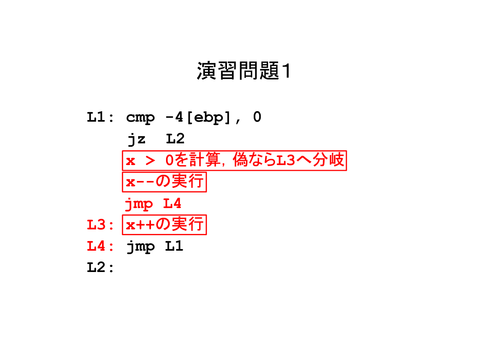

## 言語処理系（３）_p020
<!-- source: 言語処理系（３）.pdf page 20 -->

演習問題１
L1: cmp -4[ebp], 0
jz  L2
x > 0を計算，偽ならL3へ分岐
x--の実行
jmp L4
L3: x++の実行
L4: jmp L1
L2:

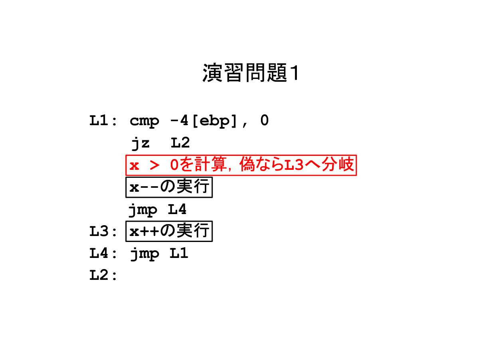

## 言語処理系（３）_p021
<!-- source: 言語処理系（３）.pdf page 21 -->

演習問題１
L1: cmp -4[ebp], 0
jz  L2
x <= 0ならL3へ分岐
x--の実行
jmp L4
L3: x++の実行
L4: jmp L1
L2:

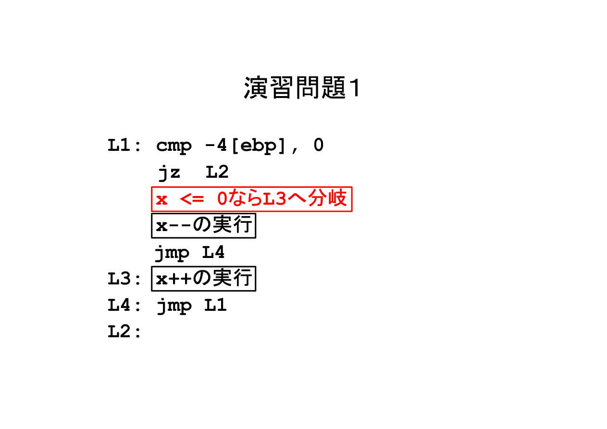

## 言語処理系（３）_p022
<!-- source: 言語処理系（３）.pdf page 22 -->

演習問題１
L1: cmp -4[ebp], 0
jz  L2
cmp -4[ebp], 0
jle L3
x--の実行
jmp L4
L3: x++の実行
L4: jmp L1
L2:

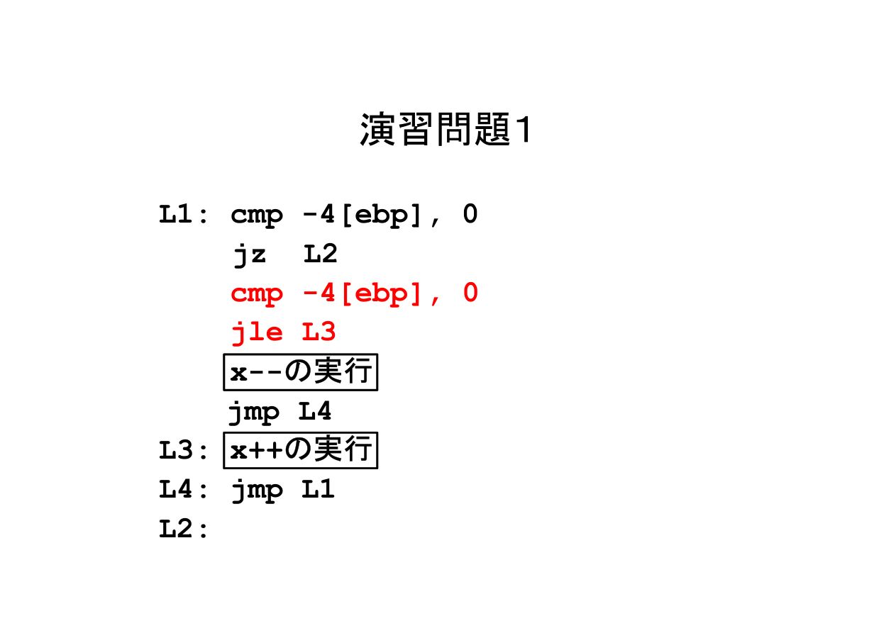

## 言語処理系（３）_p023
<!-- source: 言語処理系（３）.pdf page 23 -->

演習問題１
L1: cmp -4[ebp], 0
jz  L2
cmp -4[ebp], 0
jle L3
x--の実行
jmp L4
L3: x++の実行
L4: jmp L1
L2:

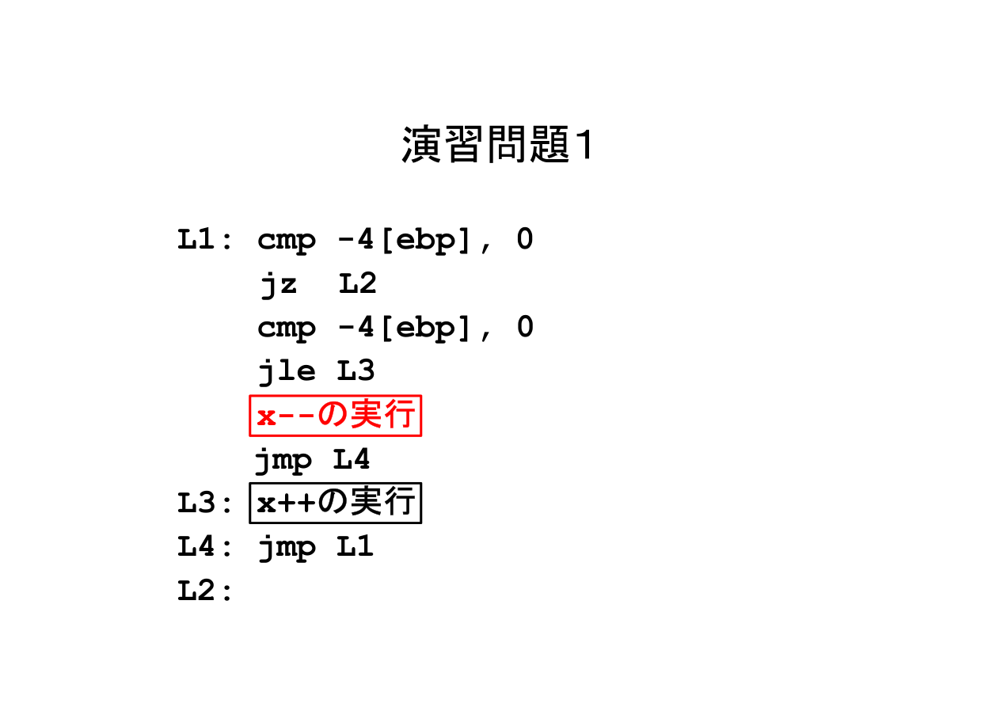

## 言語処理系（３）_p024
<!-- source: 言語処理系（３）.pdf page 24 -->

演習問題１
L1: cmp -4[ebp], 0
jz  L2
cmp -4[ebp], 0
jle L3
sub -4[ebp], 1
jmp L4
L3: x++の実行
L4: jmp L1
L2:

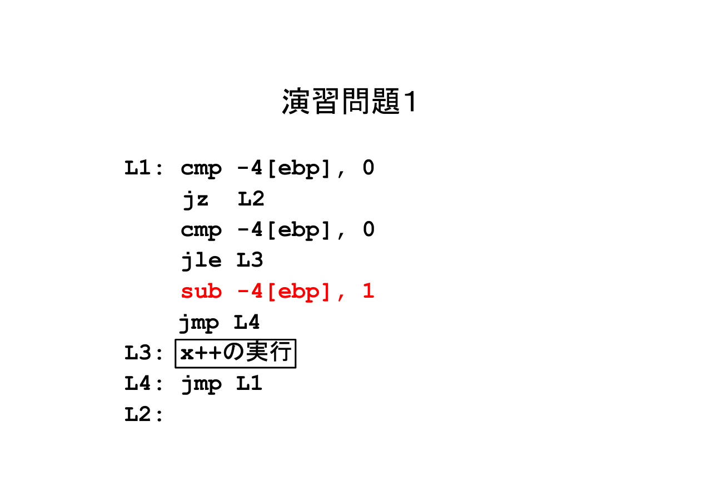

## 言語処理系（３）_p025
<!-- source: 言語処理系（３）.pdf page 25 -->

演習問題１
L1: cmp -4[ebp], 0
jz  L2
cmp -4[ebp], 0
jle L3
sub -4[ebp], 1
jmp L4
L3: x++の実行
L4: jmp L1
L2:

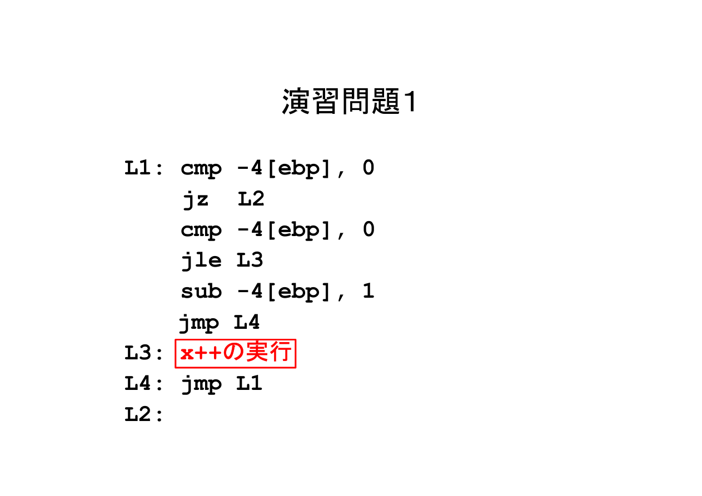

## 言語処理系（３）_p026
<!-- source: 言語処理系（３）.pdf page 26 -->

演習問題１
L1: cmp -4[ebp], 0
jz  L2
cmp -4[ebp], 0
jle L3
sub -4[ebp], 1
jmp L4
L3: add -4[ebp], 1
L4: jmp L1
L2:

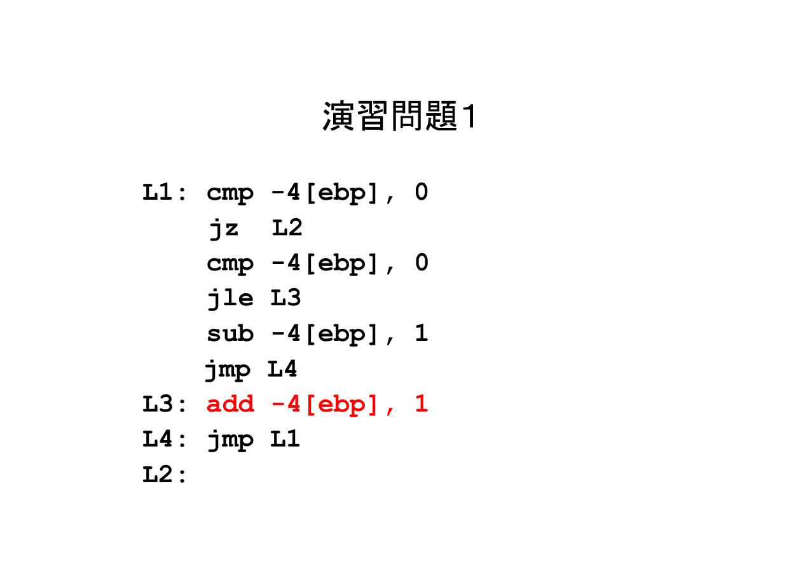

## 言語処理系（３）_p027
<!-- source: 言語処理系（３）.pdf page 27 -->

練習問題１
下図プログラムに対するコードを示せ．但し，
変数xは，8[ebp]に割当てられているとせよ．
while (x != 1)
if (x & 1 == 0) x >>= 1;
else x = x * 3 + 1;
ヒント：
&にはand，>>にはsar，*にはimul命令を．

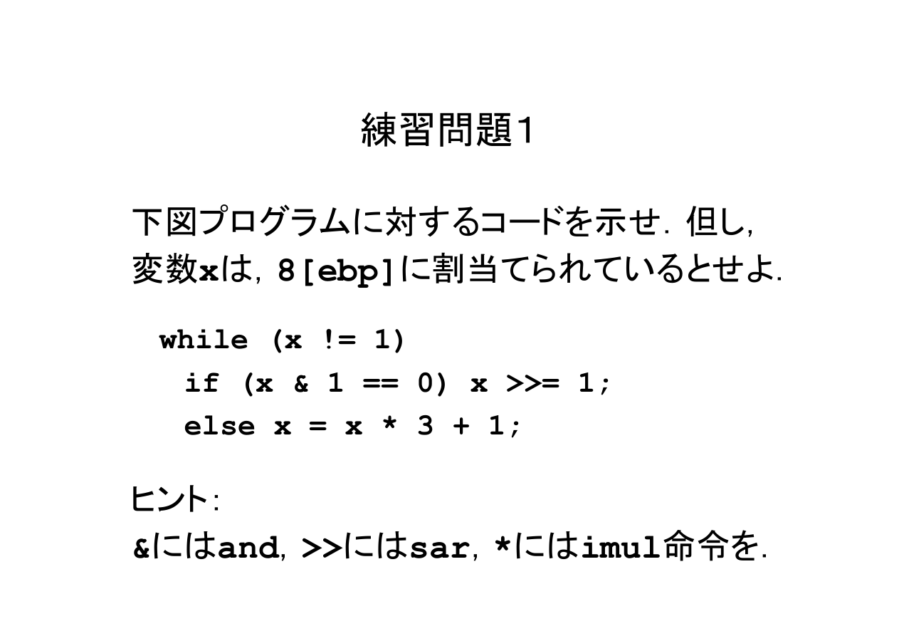

## 言語処理系（３）_p028
<!-- source: 言語処理系（３）.pdf page 28 -->

３．５for文
for (e1; e2; e3) s
e1の計算
L1: e2を計算，偽ならL3へ分岐
sの実行
L2: e3の計算
jmp  L1
L3:
e2 ?
s
e3
真
偽
L2
e1
L1
L3
L2はcontinue文用

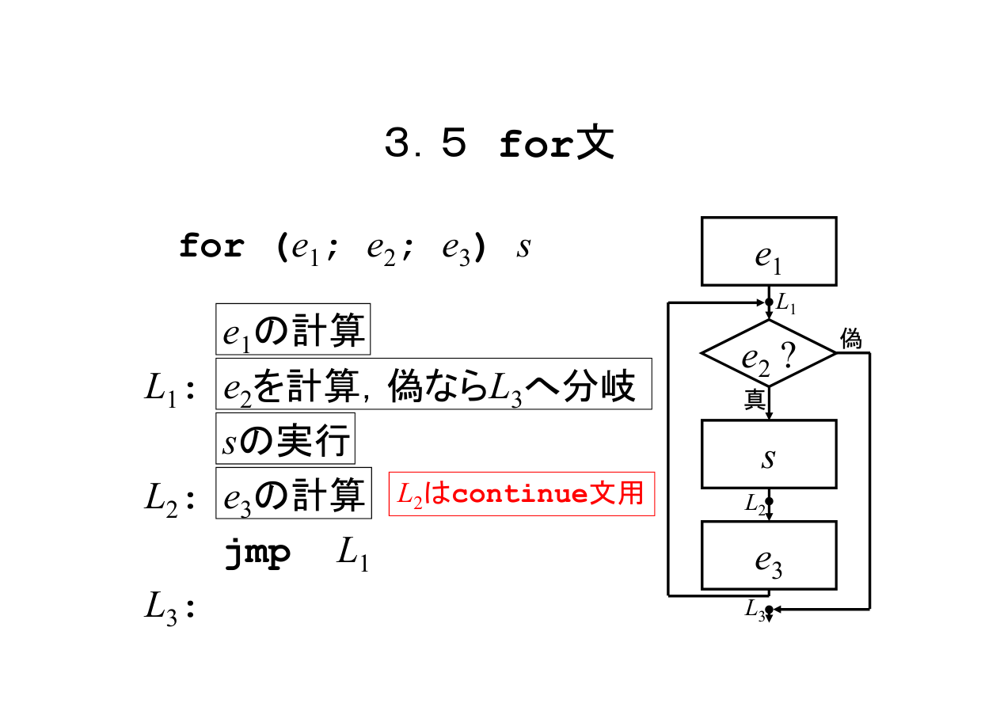

## 言語処理系（３）_p029
<!-- source: 言語処理系（３）.pdf page 29 -->

eax
i
1
旧ebp
戻り番地
x
5
12
３．５for文
for (i = 1; i < 3; i++) x += i;
mov  -4[ebp], 1
L1: cmp  -4[ebp], 3
jge  L3
mov  eax, -4[ebp]
add  8[ebp], eax
L2: add  -4[ebp], 1
jmp  L1
L3:
i = 1
i < 3
x += i
i++
mov  -4[ebp], 1
cmp  -4[ebp], 3
jge  L3
mov  eax, -4[ebp]
add  8[ebp], eax
add  -4[ebp], 1
jmp  L1
ebp
6
2
8
3

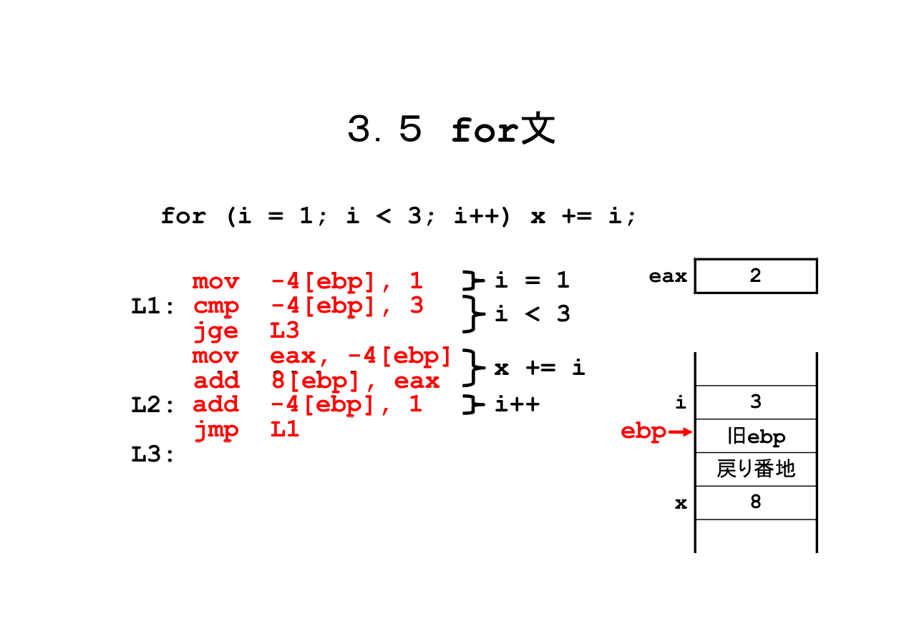

## 言語処理系（３）_p030
<!-- source: 言語処理系（３）.pdf page 30 -->

３．５for文
• break文
jmp  L3
• continue文
jmp  L2
e2 ?
s
e3
真
偽
L2
e1
L1
L3

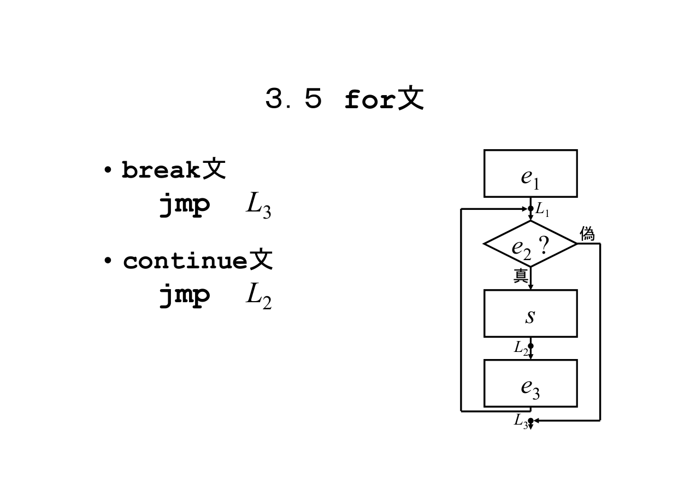

## 言語処理系（３）_p031
<!-- source: 言語処理系（３）.pdf page 31 -->

練習問題２
下図プログラム片に対するコードを示せ．但し
変数i，jは，-4[ebp]，-8[ebp] に割当て
られているとせよ．
for (i = 0; i < 5; i++)
for (j = i; j < 5; j++)
f(i, j);

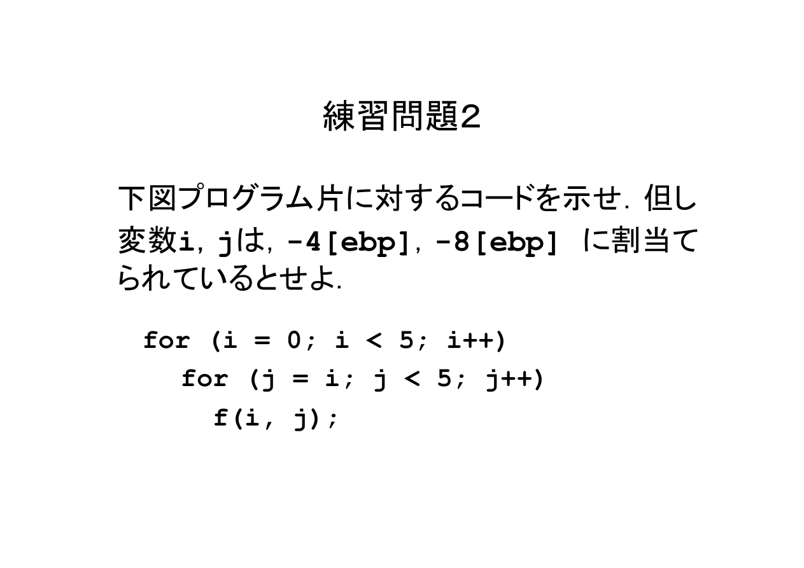

## 言語処理系（３）_p032
<!-- source: 言語処理系（３）.pdf page 32 -->

３．６式文と代入式
• 式文e;
eの計算
• 代入式v = e
eの計算
mov  loc(v), R
Rに結果を格納
loc(v)は，変数vの場所

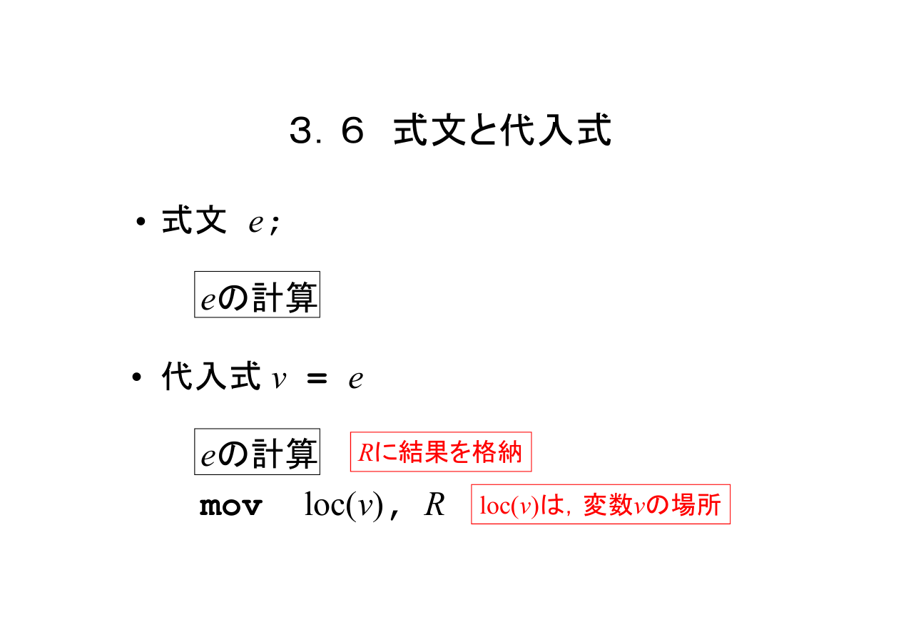

## 言語処理系（３）_p033
<!-- source: 言語処理系（３）.pdf page 33 -->

３．６式文と代入式
v1 = v2 = ... = vn = e;
eの計算
mov  loc(vn), R
mov  loc(vn-1), R
...
mov  loc(v1), R

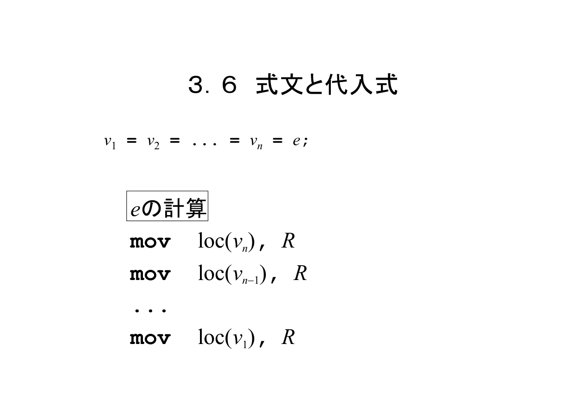

## 言語処理系（３）_p034
<!-- source: 言語処理系（３）.pdf page 34 -->

練習問題３
下図プログラム片に対するコードを示せ．但し
変数x，y，aは，8[ebp]，12[ebp]，および
-4[ebp]に割当てられており，eaxに結果を
残すものとせよ．
x = y = a + 1;

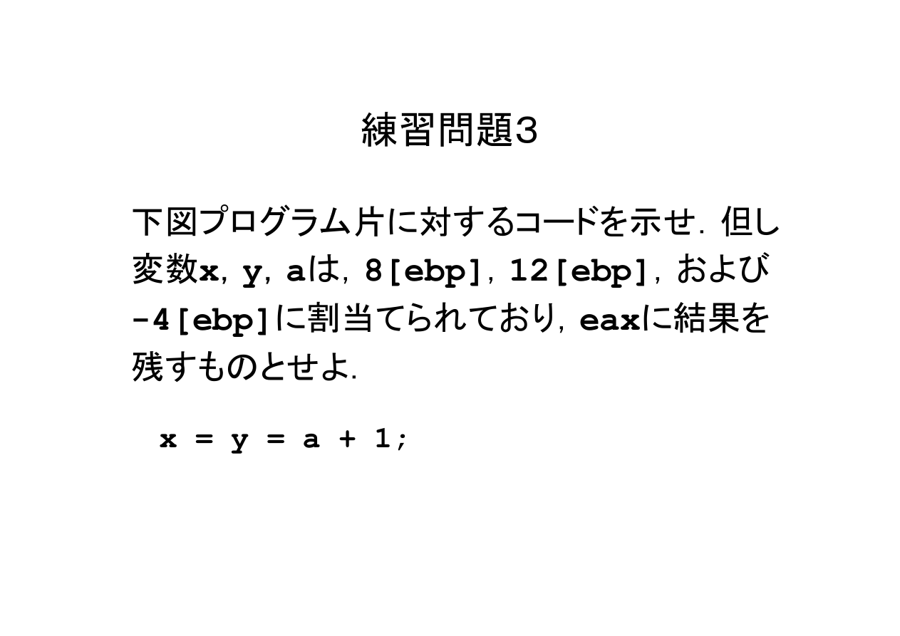

## 言語処理系（３）_p035
<!-- source: 言語処理系（３）.pdf page 35 -->

要約
• 文に対するコード生成
• 宣言文，複合文
• if文
• while文，for文，break文，continue文
• 式文と代入式

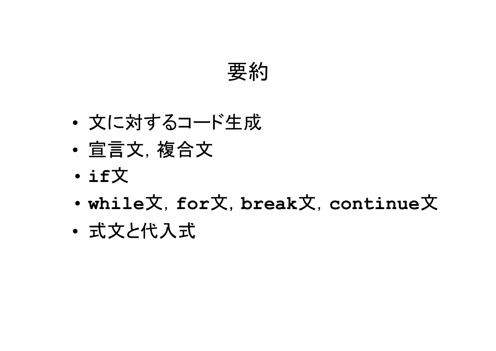
