# 言語処理系（４）

<!-- source: 言語処理系（４）.pdf -->

## 言語処理系（４）_p001
<!-- source: 言語処理系（４）.pdf page 1 -->

言語処理系（４）
金子敬一

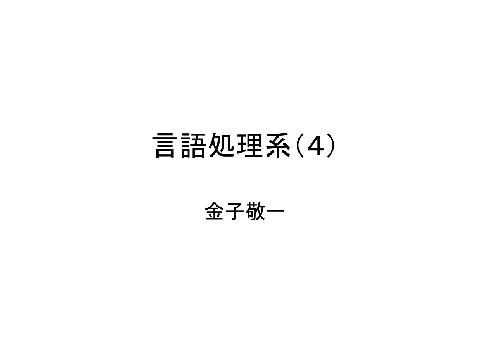

## 言語処理系（４）_p002
<!-- source: 言語処理系（４）.pdf page 2 -->

４算術式のコード生成
４．１計算順序とレジスタの有効活用
４．２可換演算と非可換演算
４．３算術式のコード生成アルゴリズム
４．４使用レジスタ数の見積り
４．５論理式のコード生成
４．６戻り値の計算コード
要約

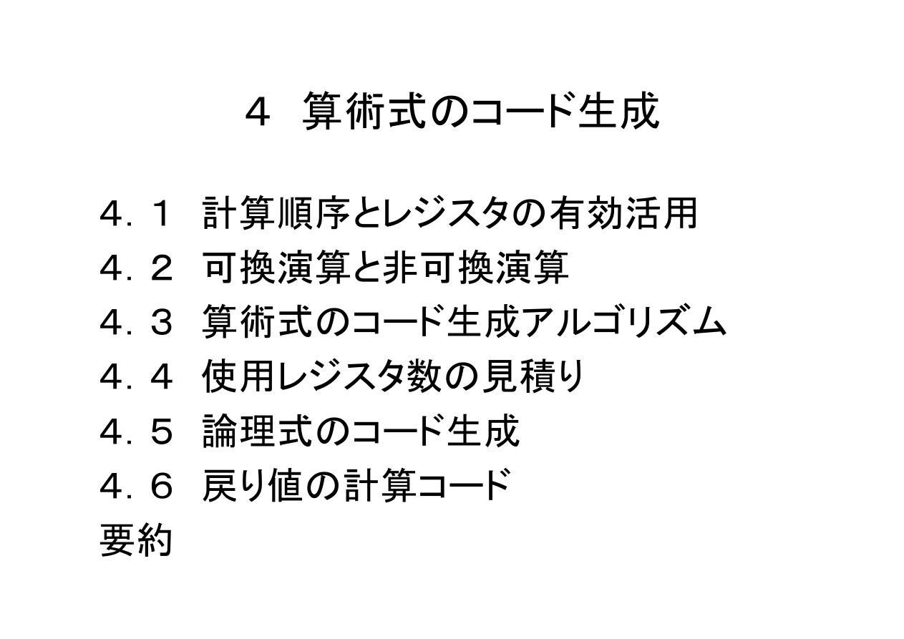

## 言語処理系（４）_p003
<!-- source: 言語処理系（４）.pdf page 3 -->

４．１計算順序とレジスタの有効活用
• 二項算術演算子。
• 対応する算術命令inst
• e1 。e2の計算手順
– e1の値をレジスタRにロード
– Rを第１，e2の値を第２オペランドとしてinstを実行
• 例：x+y
mov  R, loc(x)
add  R, loc(y)

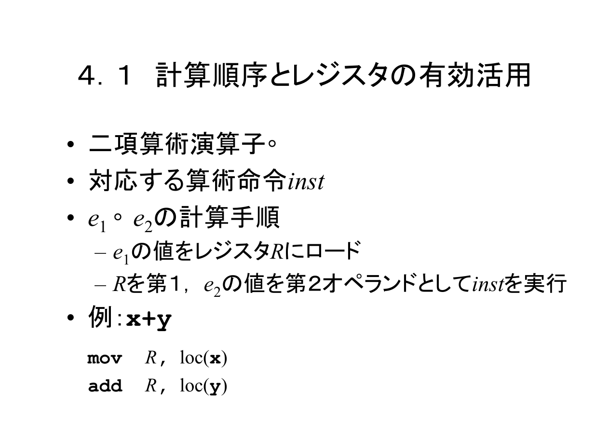

## 言語処理系（４）_p004
<!-- source: 言語処理系（４）.pdf page 4 -->

４．１計算順序とレジスタの有効活用
• e1 。e2の計算で，e1の値がレジスタR'にある
– e1の値をレジスタRにロードする必要なし
– R'を第１，e2の値を第２オペランドとしてinstを実行
• 例：a*b+y
mov  R', loc(a)
imul R', loc(b)
mov  R, R'
add  R, loc(y)
少ない命令，レジスタで計算可能
mov  R', loc(a)
imul R', loc(b)
add  R', loc(y)

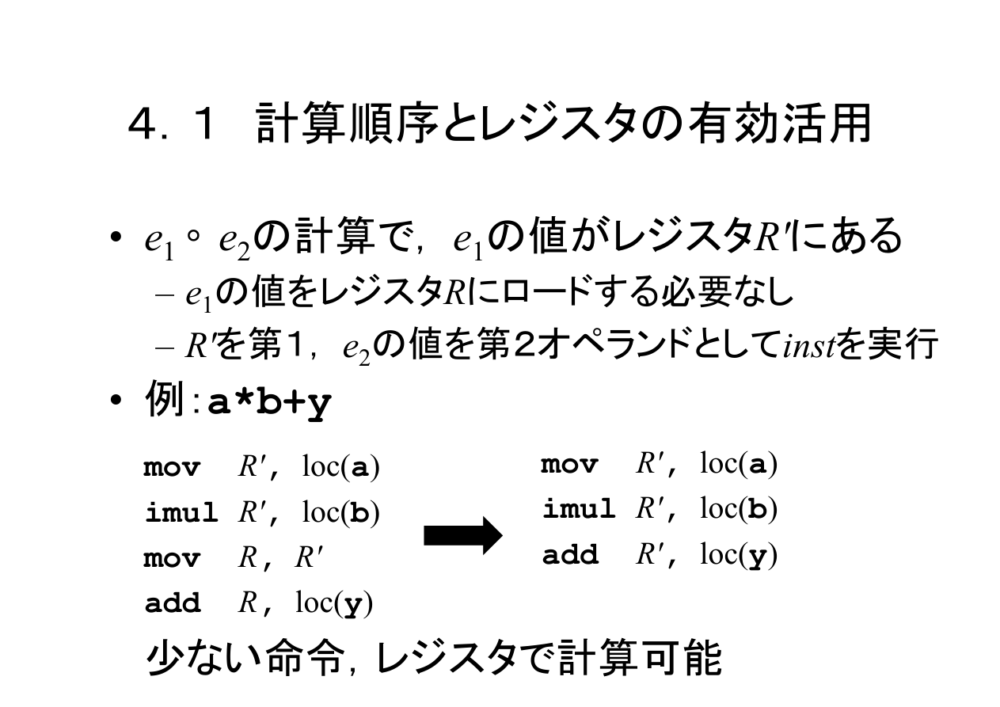

## 言語処理系（４）_p005
<!-- source: 言語処理系（４）.pdf page 5 -->

４．１計算順序とレジスタの有効活用
• 例：a*b+x*y
mov  R1, loc(a)
imul R1, loc(b)
mov  R2, loc(x)
imul R2, loc(y)
add  R1, R2
命令数増加，メモリアクセスによる速度低下も
→レジスタの有効活用を目指しコード生成
mov  R1, loc(a)
imul R1, loc(b)
mov  tmp, R1
mov  R1, loc(x)
imul R1, loc(y)
add  R1, tmp

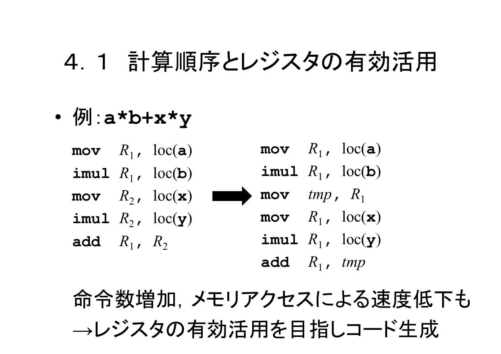

## 言語処理系（４）_p006
<!-- source: 言語処理系（４）.pdf page 6 -->

４．２可換演算と非可換演算
• e1 。e2 = e2 。e1 （可換）
• e1 。e2 e2 。e1 （非可換）
• 例：a*b-x*y
mov  R1, loc(a)
imul R1, loc(b)
mov  tmp, R1
mov  R1, loc(x)
imul R1, loc(y)
sub  R1, tmp
mov  R1, loc(x)
imul R1, loc(y)
mov  tmp, R1
mov  R1, loc(a)
imul R1, loc(b)
sub  R1, tmp

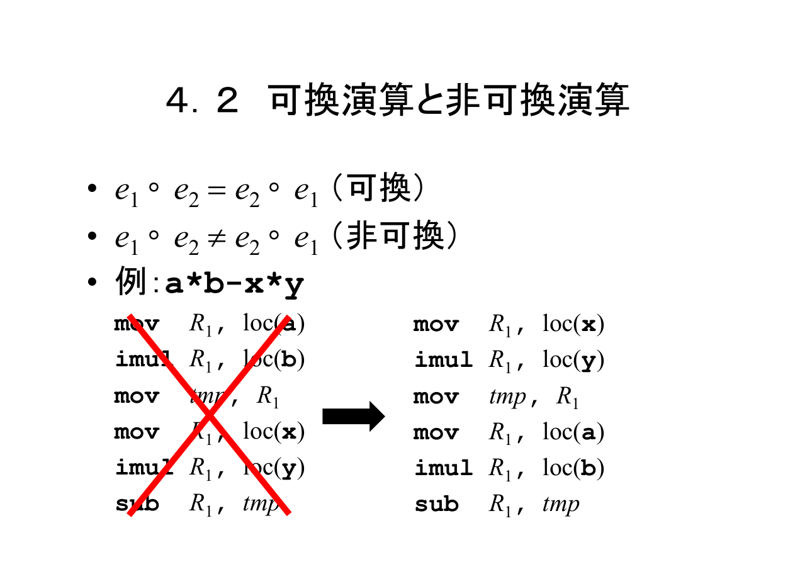

## 言語処理系（４）_p007
<!-- source: 言語処理系（４）.pdf page 7 -->

４．２可換演算と非可換演算
• e1 。e2の計算順序
– 計算に利用可能なレジスタ数N
– eiの計算に必要なレジスタ数r(ei)
– 演算子。の可換性
に依存
• ただしr(e1)=r(e2)=Nなら，常にe2から計算

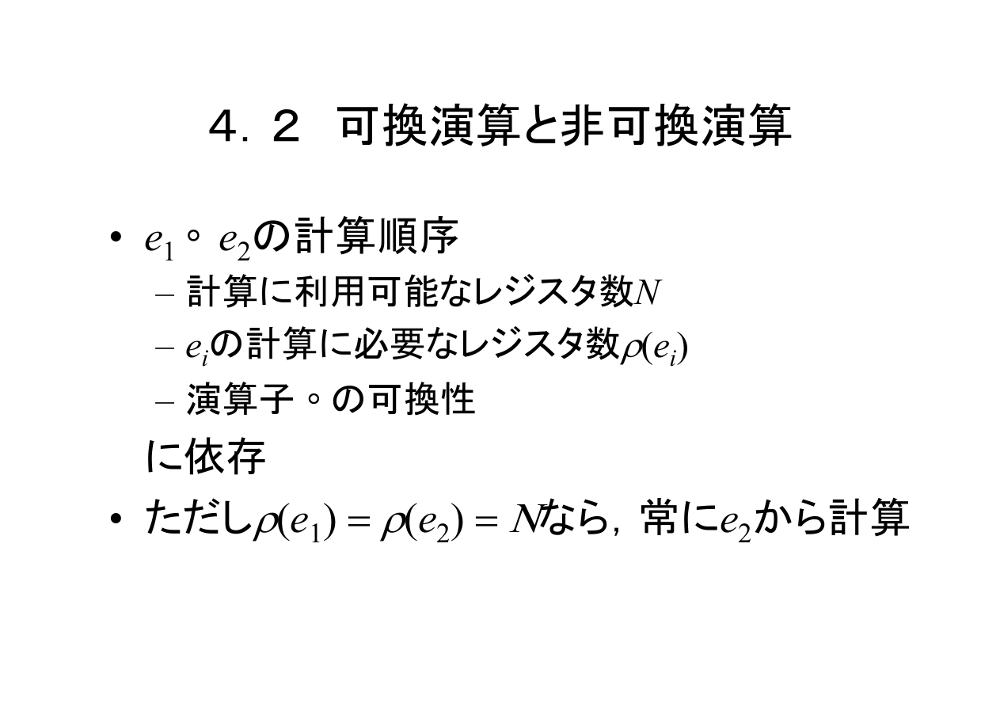

## 言語処理系（４）_p008
<!-- source: 言語処理系（４）.pdf page 8 -->

４．３算術式のコード生成アルゴリズム
• N: 利用可能な汎用レジスタ数
• r(e):eの計算に必要なレジスタ数
• e1 。e2の計算順序
– ＲＳＬ型：e2を計算，退避後，e1を計算，演算実行
– ＲＬ型：e2を計算後，e1を計算，演算実行
– Ｒ型：e2を計算，演算実行
– ＬＲ型：e1を計算後，e2を計算，演算実行
– Ｌ型：e1を計算，演算実行

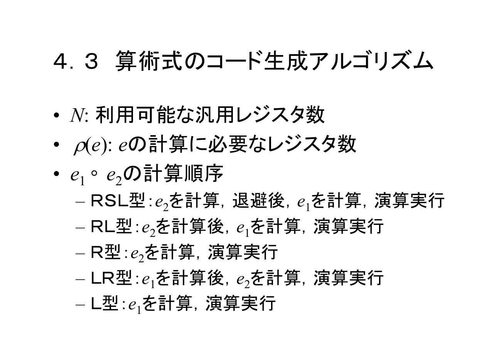

## 言語処理系（４）_p009
<!-- source: 言語処理系（４）.pdf page 9 -->

４．３算術式のコード生成アルゴリズム
• ＲＳＬ型
– e2を計算（結果R2）
– 一時変数に退避
– e1を計算（結果R1）
– R1を使って演算実行
• r(e1)=r(e2)=Nのとき
• 非可換演算の場合を考慮し，e2を先に計算
e2の計算（結果R2）
mov  tmp, R2
e1の計算（結果R1）
inst R1, tmp

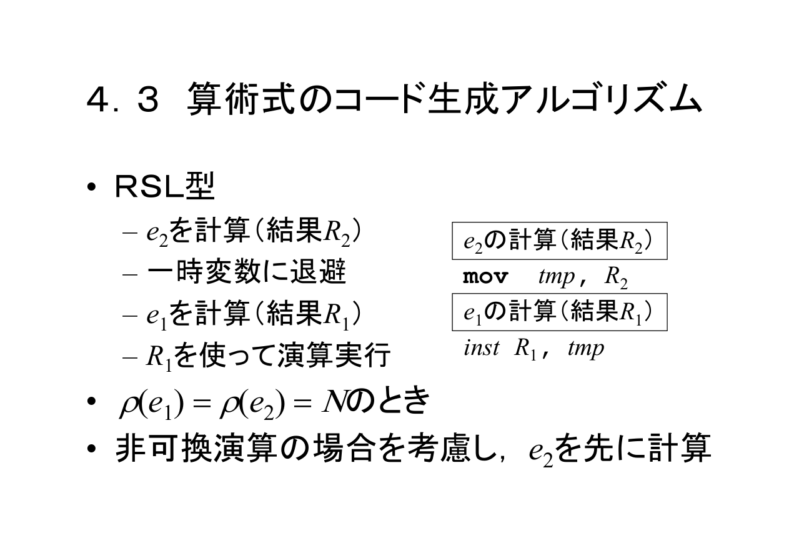

## 言語処理系（４）_p010
<!-- source: 言語処理系（４）.pdf page 10 -->

４．３算術式のコード生成アルゴリズム
• ＲＬ型
– e2を計算（結果R2）
– e1を計算（結果R1）
– R1を使って演算実行
• r(e1)< Nのとき
e2の計算（結果R2）
e1の計算（結果R1）
inst R1, R2

## 言語処理系（４）_p011
<!-- source: 言語処理系（４）.pdf page 11 -->

４．３算術式のコード生成アルゴリズム
• Ｒ型
– e2を計算（結果R2）
– R2を使って演算実行
• e1:変数（または定数）vのとき
• 可換演算の場合のみ
e2の計算（結果R2）
inst R2, loc(v)

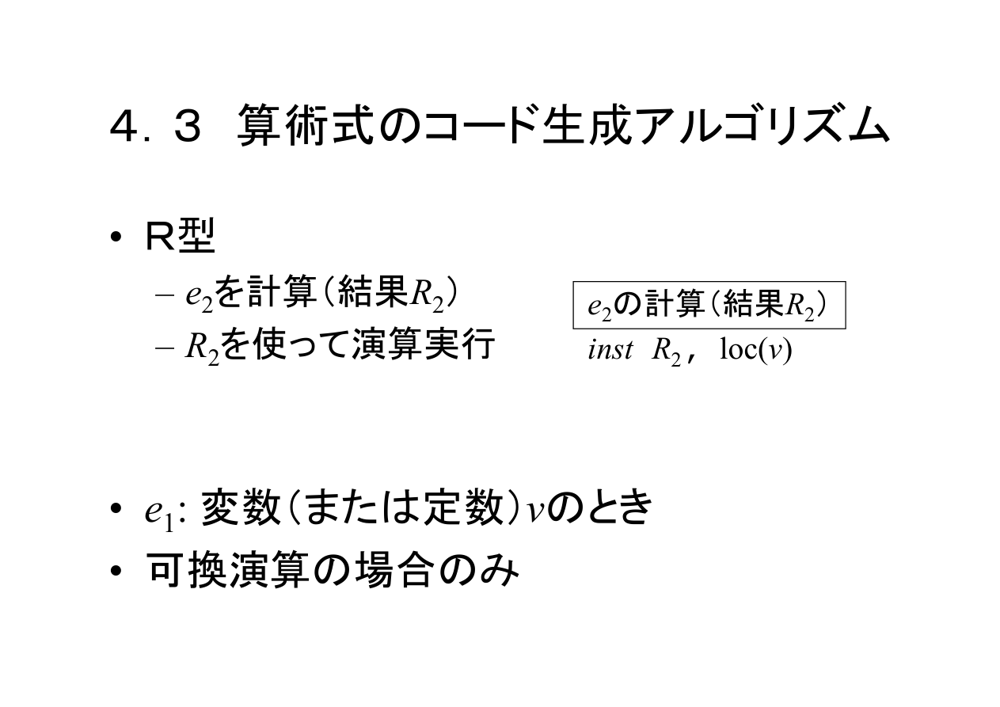

## 言語処理系（４）_p012
<!-- source: 言語処理系（４）.pdf page 12 -->

４．３算術式のコード生成アルゴリズム
• ＬＲ型
– e1を計算（結果R1）
– e2を計算（結果R2）
– R1を使って演算実行
• r(e2)< Nのとき
e1の計算（結果R1）
e2の計算（結果R2）
inst R1, R2

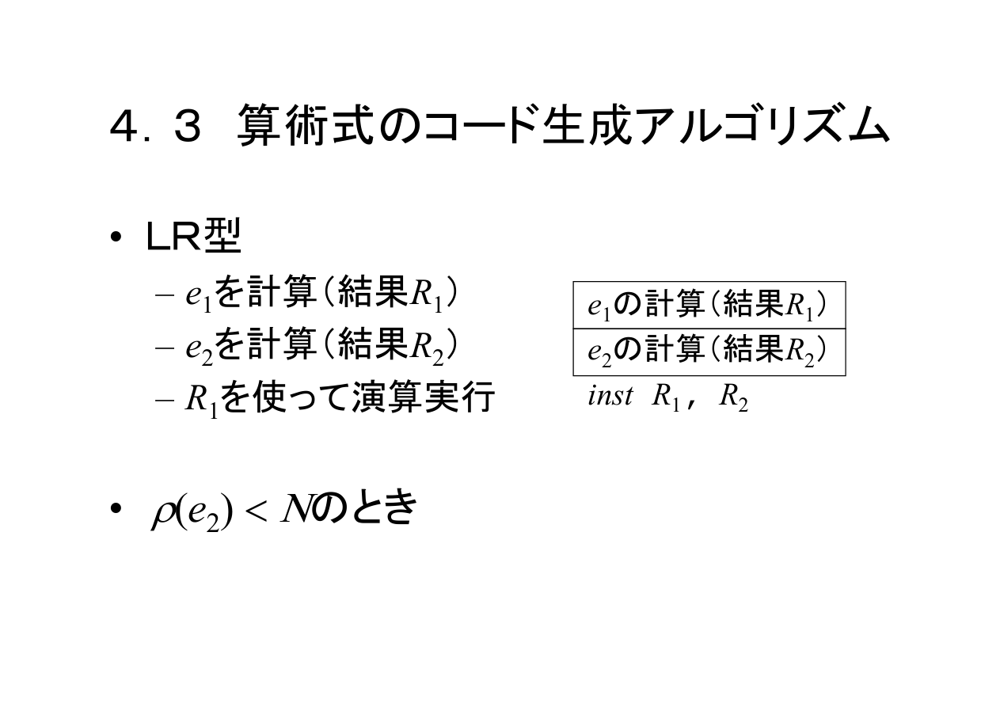

## 言語処理系（４）_p013
<!-- source: 言語処理系（４）.pdf page 13 -->

４．３算術式のコード生成アルゴリズム
• Ｌ型
– e1を計算（結果R1）
– R1を使って演算実行
• e2:変数（または定数）vのとき
e1の計算（結果R1）
inst R1, loc(v)

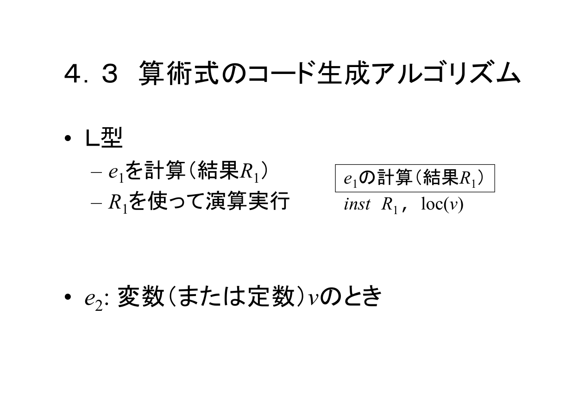

## 言語処理系（４）_p014
<!-- source: 言語処理系（４）.pdf page 14 -->

４．３算術式のコード生成アルゴリズム
表４．１算術式e1 。e2のコード生成型
r(e2)=N
0<r(e2)<N
r(e2)=0
r(e1)=N
ＲＳＬ
ＬＲ
Ｌ
0<r(e1)<N
ＲＬ
ＲＬor ＬＲ
Ｌ
r(e1)=0（非
可換）
ＲＬ
ＲＬ
Ｌ
r(e1)=0（可
換）
Ｒ
Ｒ
Ｌor Ｒ

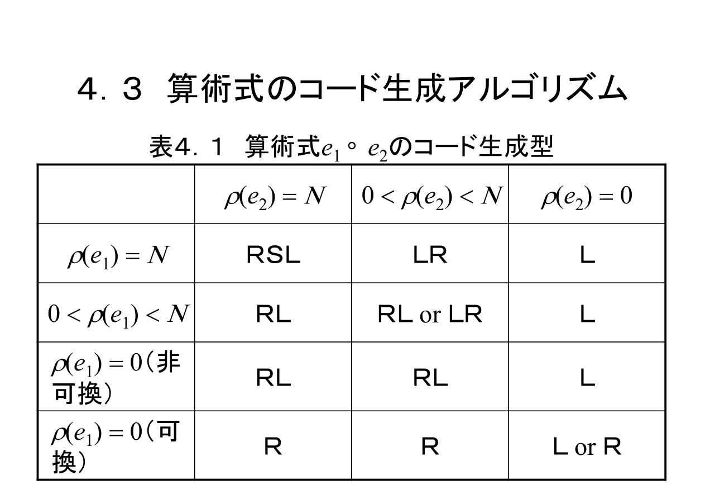

## 言語処理系（４）_p015
<!-- source: 言語処理系（４）.pdf page 15 -->

４．３算術式のコード生成アルゴリズム
表４．１算術式e1 。e2のコード生成型
r(e2)=N
0<r(e2)<N
r(e2)=0
r(e1)=N
ＲＳＬ
ＬＲ
Ｌ
0<r(e1)<N
ＲＬ
ＲＬor ＬＲ
Ｌ
r(e1)=0（非
可換）
ＲＬ
ＲＬ
Ｌ
r(e1)=0（可
換）
Ｒ
Ｒ
Ｌor Ｒ

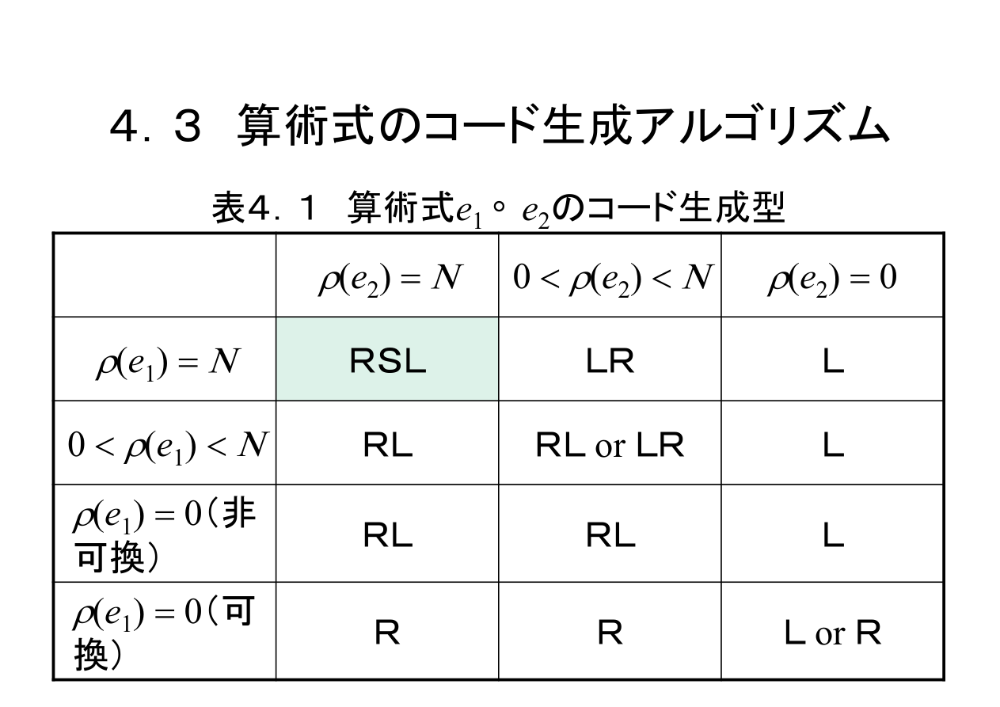

## 言語処理系（４）_p016
<!-- source: 言語処理系（４）.pdf page 16 -->

４．３算術式のコード生成アルゴリズム
表４．１算術式e1 。e2のコード生成型
r(e2)=N
0<r(e2)<N
r(e2)=0
r(e1)=N
ＲＳＬ
ＬＲ
Ｌ
0<r(e1)<N
ＲＬ
ＲＬor ＬＲ
Ｌ
r(e1)=0（非
可換）
ＲＬ
ＲＬ
Ｌ
r(e1)=0（可
換）
Ｒ
Ｒ
Ｌor Ｒ

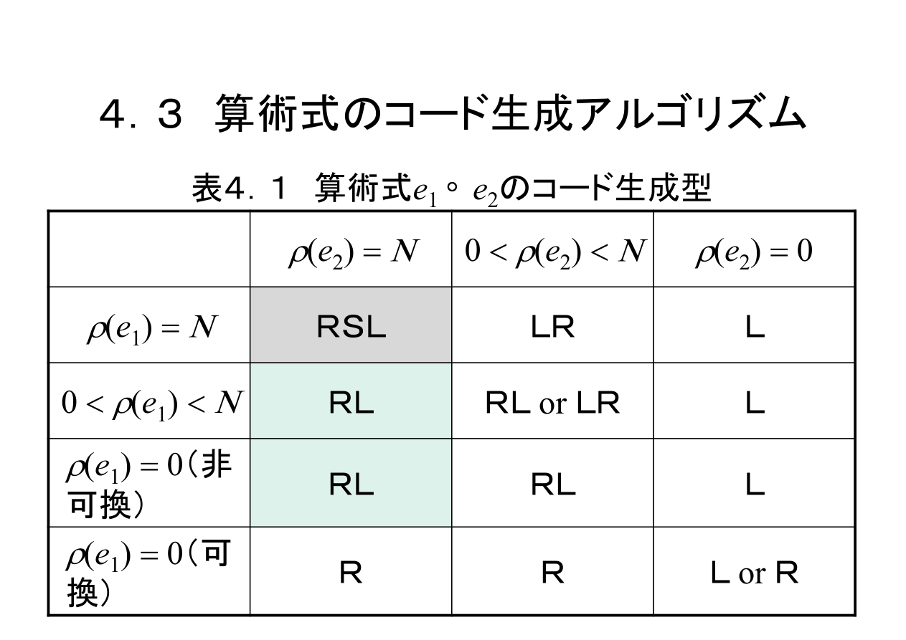

## 言語処理系（４）_p017
<!-- source: 言語処理系（４）.pdf page 17 -->

４．３算術式のコード生成アルゴリズム
表４．１算術式e1 。e2のコード生成型
r(e2)=N
0<r(e2)<N
r(e2)=0
r(e1)=N
ＲＳＬ
ＬＲ
Ｌ
0<r(e1)<N
ＲＬ
ＲＬor ＬＲ
Ｌ
r(e1)=0（非
可換）
ＲＬ
ＲＬ
Ｌ
r(e1)=0（可
換）
Ｒ
Ｒ
Ｌor Ｒ

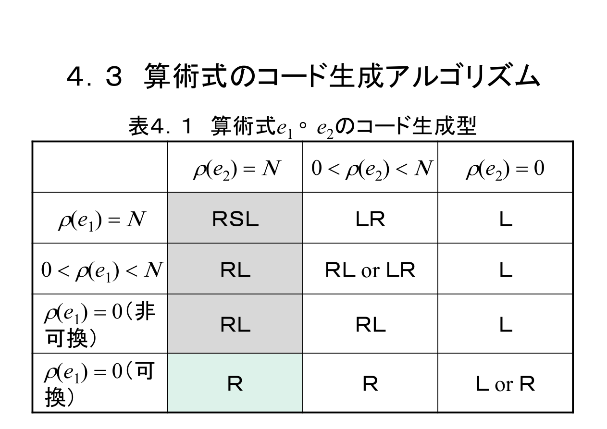

## 言語処理系（４）_p018
<!-- source: 言語処理系（４）.pdf page 18 -->

４．３算術式のコード生成アルゴリズム
表４．１算術式e1 。e2のコード生成型
r(e2)=N
0<r(e2)<N
r(e2)=0
r(e1)=N
ＲＳＬ
ＬＲ
Ｌ
0<r(e1)<N
ＲＬ
ＲＬor ＬＲ
Ｌ
r(e1)=0（非
可換）
ＲＬ
ＲＬ
Ｌ
r(e1)=0（可
換）
Ｒ
Ｒ
Ｌor Ｒ

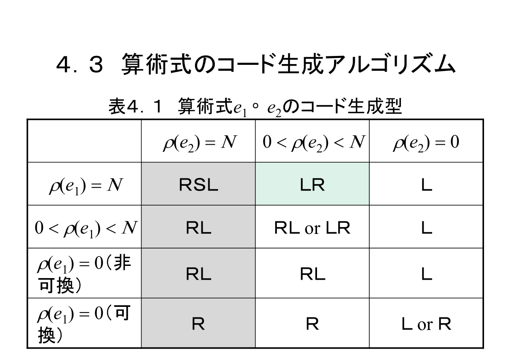

## 言語処理系（４）_p019
<!-- source: 言語処理系（４）.pdf page 19 -->

４．３算術式のコード生成アルゴリズム
表４．１算術式e1 。e2のコード生成型
r(e2)=N
0<r(e2)<N
r(e2)=0
r(e1)=N
ＲＳＬ
ＬＲ
Ｌ
0<r(e1)<N
ＲＬ
ＲＬor ＬＲ
Ｌ
r(e1)=0（非
可換）
ＲＬ
ＲＬ
Ｌ
r(e1)=0（可
換）
Ｒ
Ｒ
Ｌor Ｒ

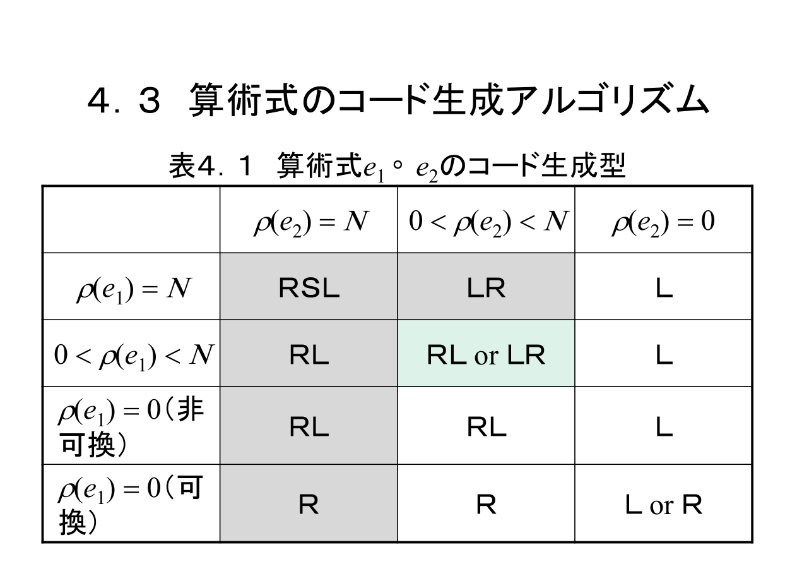

## 言語処理系（４）_p020
<!-- source: 言語処理系（４）.pdf page 20 -->

４．３算術式のコード生成アルゴリズム
表４．１算術式e1 。e2のコード生成型
r(e2)=N
0<r(e2)<N
r(e2)=0
r(e1)=N
ＲＳＬ
ＬＲ
Ｌ
0<r(e1)<N
ＲＬ
ＲＬor ＬＲ
Ｌ
r(e1)=0（非
可換）
ＲＬ
ＲＬ
Ｌ
r(e1)=0（可
換）
Ｒ
Ｒ
Ｌor Ｒ

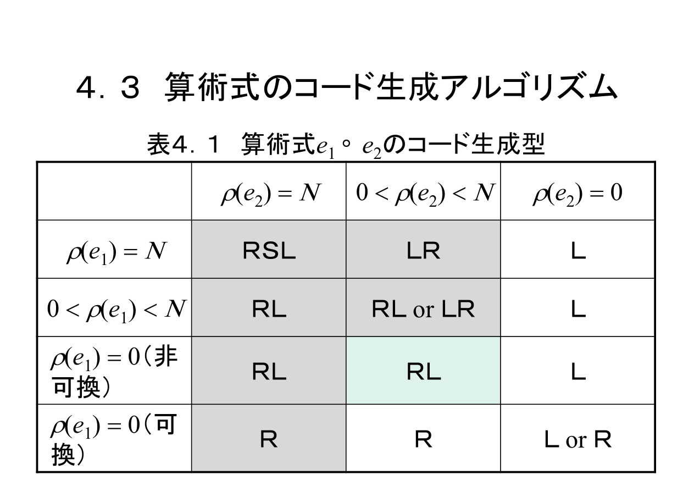

## 言語処理系（４）_p021
<!-- source: 言語処理系（４）.pdf page 21 -->

４．３算術式のコード生成アルゴリズム
表４．１算術式e1 。e2のコード生成型
r(e2)=N
0<r(e2)<N
r(e2)=0
r(e1)=N
ＲＳＬ
ＬＲ
Ｌ
0<r(e1)<N
ＲＬ
ＲＬor ＬＲ
Ｌ
r(e1)=0（非
可換）
ＲＬ
ＲＬ
Ｌ
r(e1)=0（可
換）
Ｒ
Ｒ
Ｌor Ｒ

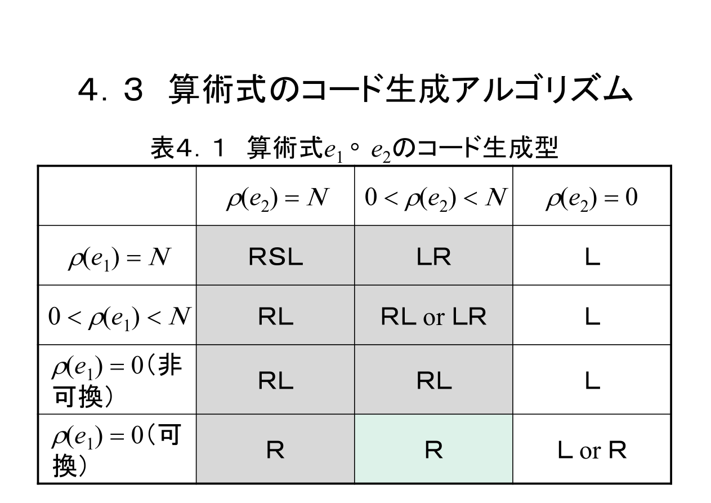

## 言語処理系（４）_p022
<!-- source: 言語処理系（４）.pdf page 22 -->

４．３算術式のコード生成アルゴリズム
表４．１算術式e1 。e2のコード生成型
r(e2)=N
0<r(e2)<N
r(e2)=0
r(e1)=N
ＲＳＬ
ＬＲ
Ｌ
0<r(e1)<N
ＲＬ
ＲＬor ＬＲ
Ｌ
r(e1)=0（非
可換）
ＲＬ
ＲＬ
Ｌ
r(e1)=0（可
換）
Ｒ
Ｒ
Ｌor Ｒ

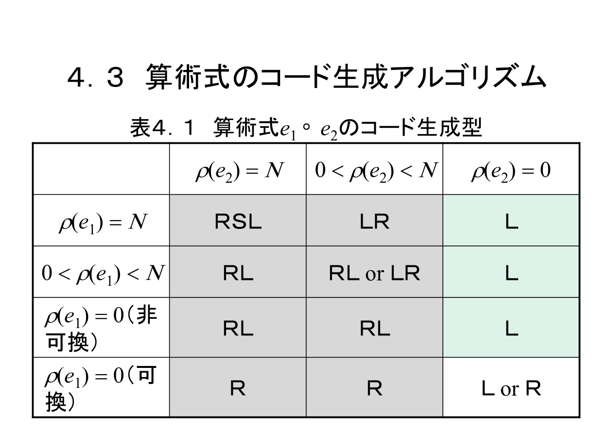

## 言語処理系（４）_p023
<!-- source: 言語処理系（４）.pdf page 23 -->

４．３算術式のコード生成アルゴリズム
表４．１算術式e1 。e2のコード生成型
r(e2)=N
0<r(e2)<N
r(e2)=0
r(e1)=N
ＲＳＬ
ＬＲ
Ｌ
0<r(e1)<N
ＲＬ
ＲＬor ＬＲ
Ｌ
r(e1)=0（非
可換）
ＲＬ
ＲＬ
Ｌ
r(e1)=0（可
換）
Ｒ
Ｒ
Ｌor Ｒ

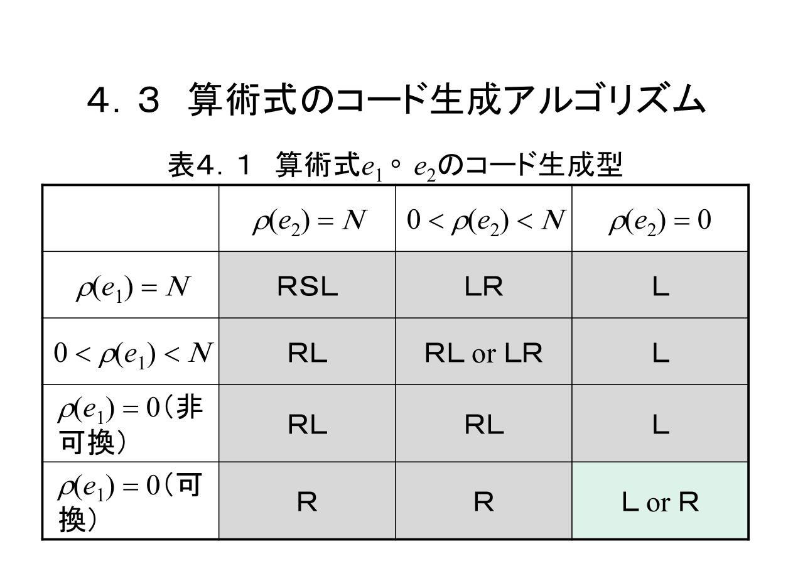

## 言語処理系（４）_p024
<!-- source: 言語処理系（４）.pdf page 24 -->

４．４使用レジスタ数の見積り
• コード生成型の決定
– レジスタ数r(e)の見積りが必要
– eが変数や定数ならばr(e)=0
• 算術式e1 。e2の場合
• 関数呼出しf(e1,e2,...,en)の場合

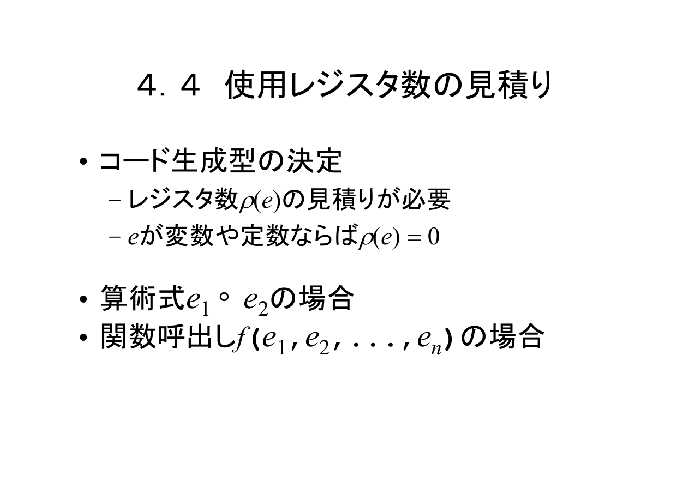

## 言語処理系（４）_p025
<!-- source: 言語処理系（４）.pdf page 25 -->

４．４使用レジスタ数の見積り
表４．２算術式e1。e2の使用レジスタ数の見積りr(e1。e2)
r(e2)=N
0<r(e2)<N
r(e2)=0
r(e1)=N
N
N
N
0<r(e1)<N
N
ＲＬ: max(r(e1)+1,r(e2))
ＬＲ: max(r(e1),r(e2)+1)
r(e1)
r(e1)=0（非
可換）
N
max(2, r(e2))
1
r(e1)=0（可
換）
N
r(e2)
1

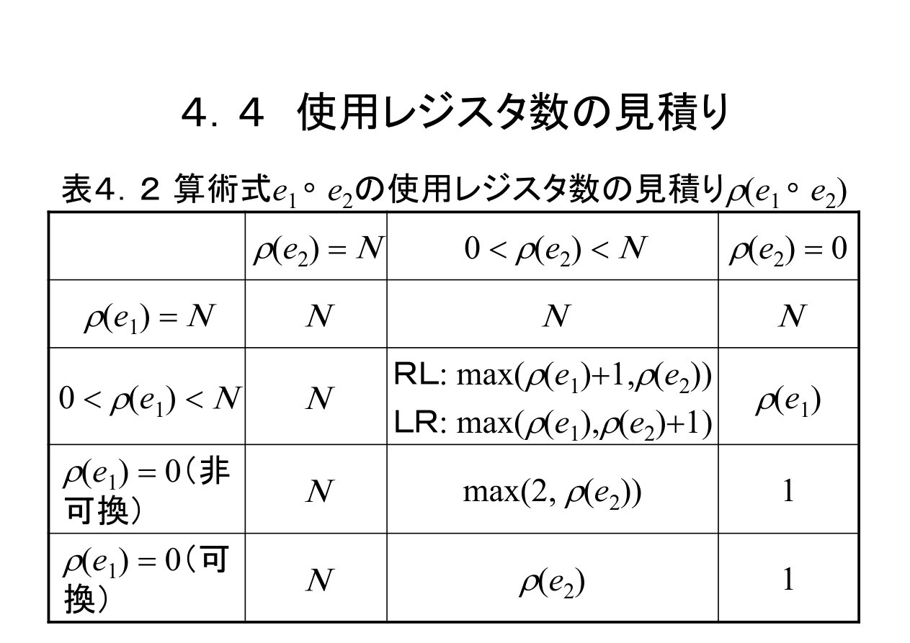

## 言語処理系（４）_p026
<!-- source: 言語処理系（４）.pdf page 26 -->

４．４使用レジスタ数の見積り
表４．２算術式e1。e2の使用レジスタ数の見積りr(e1。e2)
r(e2)=N
0<r(e2)<N
r(e2)=0
r(e1)=N
N
N
N
0<r(e1)<N
N
ＲＬ: max(r(e1)+1,r(e2))
ＬＲ: max(r(e1),r(e2)+1)
r(e1)
r(e1)=0（非
可換）
N
max(2, r(e2))
1
r(e1)=0（可
換）
N
r(e2)
1

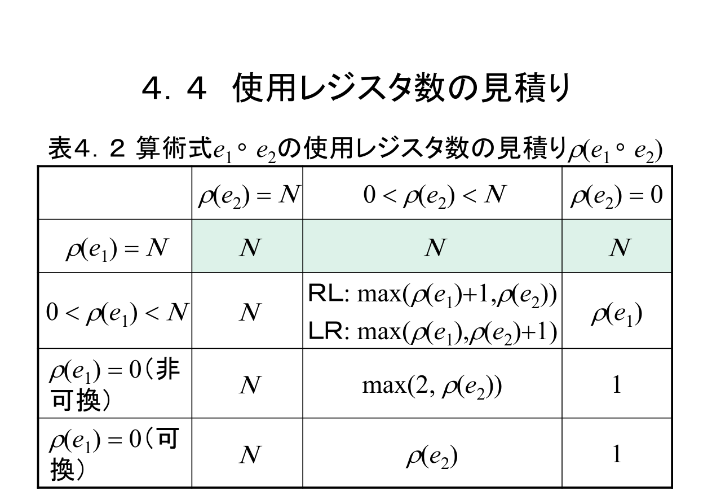

## 言語処理系（４）_p027
<!-- source: 言語処理系（４）.pdf page 27 -->

４．４使用レジスタ数の見積り
表４．２算術式e1。e2の使用レジスタ数の見積りr(e1。e2)
r(e2)=N
0<r(e2)<N
r(e2)=0
r(e1)=N
N
N
N
0<r(e1)<N
N
ＲＬ: max(r(e1)+1,r(e2))
ＬＲ: max(r(e1),r(e2)+1)
r(e1)
r(e1)=0（非
可換）
N
max(2, r(e2))
1
r(e1)=0（可
換）
N
r(e2)
1

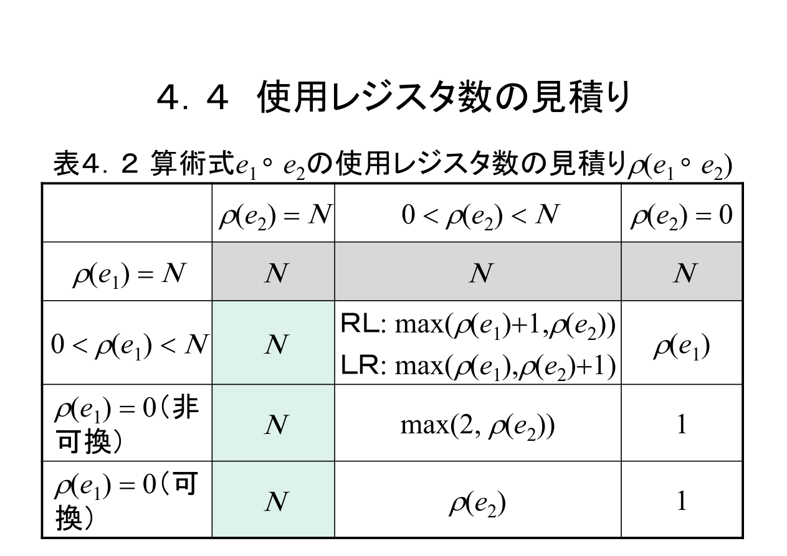

## 言語処理系（４）_p028
<!-- source: 言語処理系（４）.pdf page 28 -->

４．４使用レジスタ数の見積り
表４．２算術式e1。e2の使用レジスタ数の見積りr(e1。e2)
r(e2)=N
0<r(e2)<N
r(e2)=0
r(e1)=N
N
N
N
0<r(e1)<N
N
ＲＬ: max(r(e1)+1,r(e2))
ＬＲ: max(r(e1),r(e2)+1)
r(e1)
r(e1)=0（非
可換）
N
max(2, r(e2))
1
r(e1)=0（可
換）
N
r(e2)
1

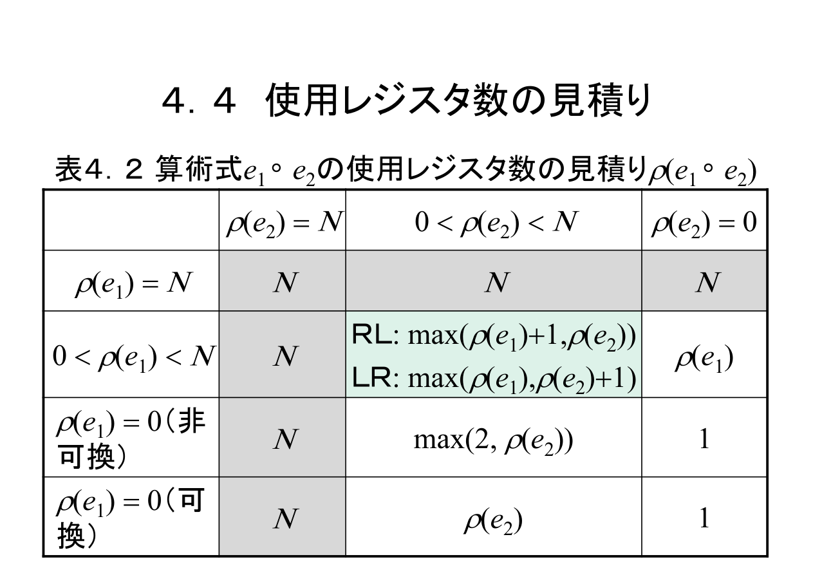

## 言語処理系（４）_p029
<!-- source: 言語処理系（４）.pdf page 29 -->

４．４使用レジスタ数の見積り
表４．２算術式e1。e2の使用レジスタ数の見積りr(e1。e2)
r(e2)=N
0<r(e2)<N
r(e2)=0
r(e1)=N
N
N
N
0<r(e1)<N
N
ＲＬ: max(r(e1)+1,r(e2))
ＬＲ: max(r(e1),r(e2)+1)
r(e1)
r(e1)=0（非
可換）
N
max(2, r(e2))
1
r(e1)=0（可
換）
N
r(e2)
1

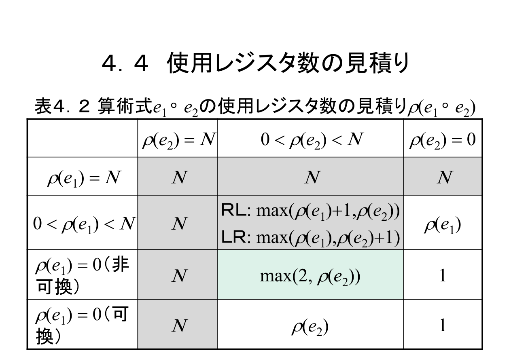

## 言語処理系（４）_p030
<!-- source: 言語処理系（４）.pdf page 30 -->

４．４使用レジスタ数の見積り
表４．２算術式e1。e2の使用レジスタ数の見積りr(e1。e2)
r(e2)=N
0<r(e2)<N
r(e2)=0
r(e1)=N
N
N
N
0<r(e1)<N
N
ＲＬ: max(r(e1)+1,r(e2))
ＬＲ: max(r(e1),r(e2)+1)
r(e1)
r(e1)=0（非
可換）
N
max(2, r(e2))
1
r(e1)=0（可
換）
N
r(e2)
1

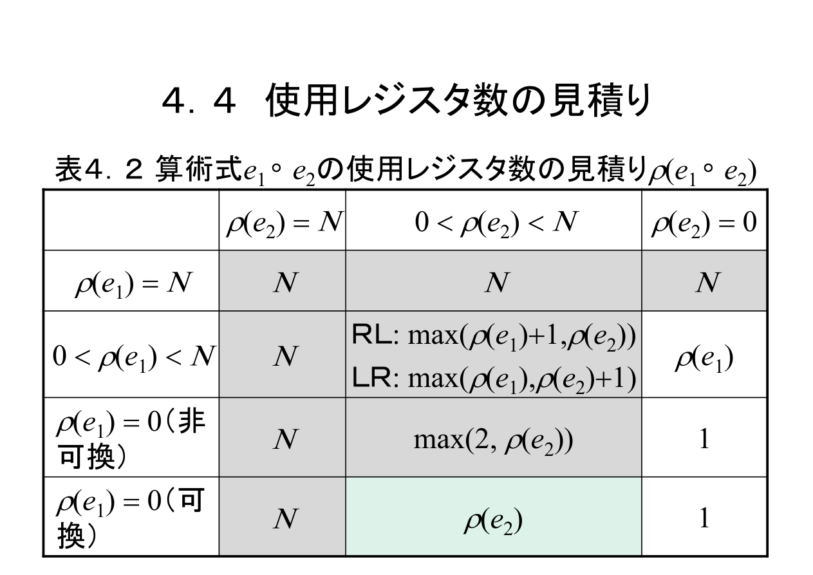

## 言語処理系（４）_p031
<!-- source: 言語処理系（４）.pdf page 31 -->

４．４使用レジスタ数の見積り
表４．２算術式e1。e2の使用レジスタ数の見積りr(e1。e2)
r(e2)=N
0<r(e2)<N
r(e2)=0
r(e1)=N
N
N
N
0<r(e1)<N
N
ＲＬ: max(r(e1)+1,r(e2))
ＬＲ: max(r(e1),r(e2)+1)
r(e1)
r(e1)=0（非
可換）
N
max(2, r(e2))
1
r(e1)=0（可
換）
N
r(e2)
1

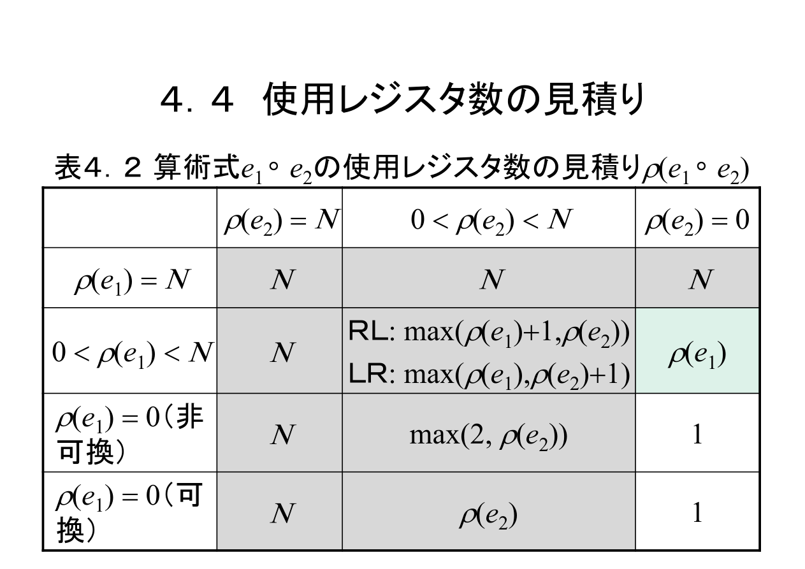

## 言語処理系（４）_p032
<!-- source: 言語処理系（４）.pdf page 32 -->

４．４使用レジスタ数の見積り
表４．２算術式e1。e2の使用レジスタ数の見積りr(e1。e2)
r(e2)=N
0<r(e2)<N
r(e2)=0
r(e1)=N
N
N
N
0<r(e1)<N
N
ＲＬ: max(r(e1)+1,r(e2))
ＬＲ: max(r(e1),r(e2)+1)
r(e1)
r(e1)=0（非
可換）
N
max(2, r(e2))
1
r(e1)=0（可
換）
N
r(e2)
1

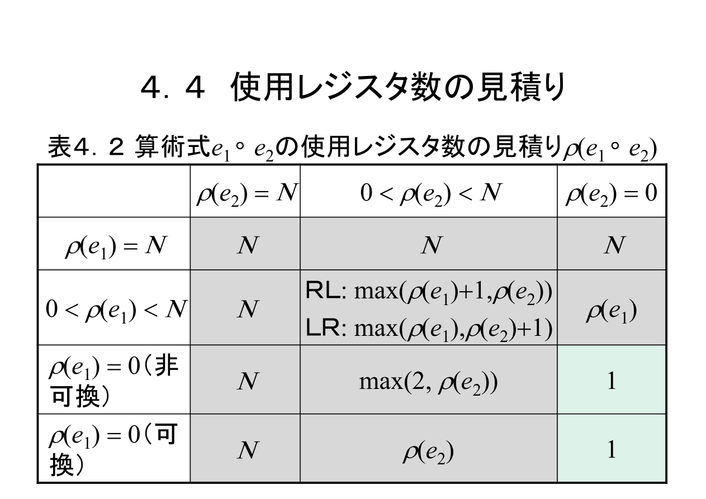

## 言語処理系（４）_p033
<!-- source: 言語処理系（４）.pdf page 33 -->

演習問題１
式a*b-x*yを計算するコードを生成せよ．但し
使用可能なレジスタ数N = 2とする．

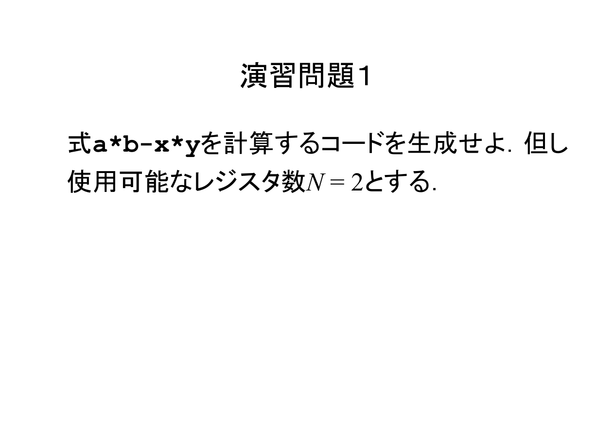

## 言語処理系（４）_p034
<!-- source: 言語処理系（４）.pdf page 34 -->

• a*b-x*y，r(a)=r(b)=r(x)=r(y)=0
演習問題１

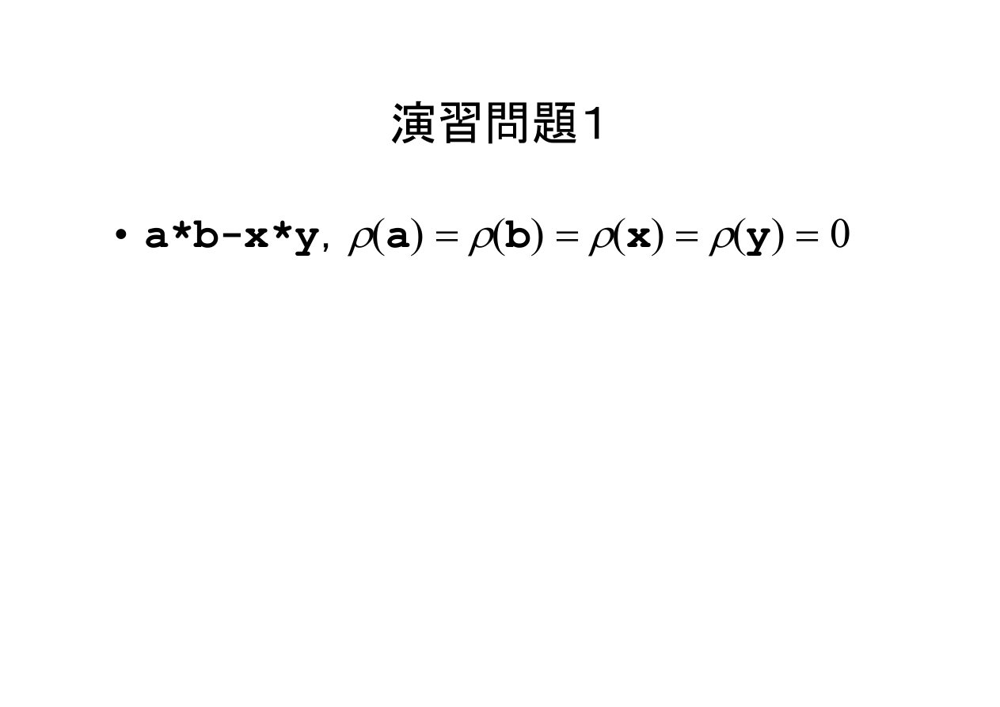

## 言語処理系（４）_p035
<!-- source: 言語処理系（４）.pdf page 35 -->

• a*b-x*y，r(a)=r(b)=r(x)=r(y)=0
• 表４．２より0<r(a*b)=r(x*y)=1<N
演習問題１
表４．２算術式e1。e2の使用レジスタ数の見積りr(e1。e2)
r(e2)=N
0<r(e2)<N
r(e2)=0
r(e1)=N
N
N
N
0<r(e1)<N
N
ＲＬ: max(r(e1)+1,r(e2))
ＬＲ: max(r(e1),r(e2)+1)
r(e1)
r(e1)=0（非
可換）
N
max(2, r(e2))
1
r(e1)=0（可
換）
N
r(e2)
1

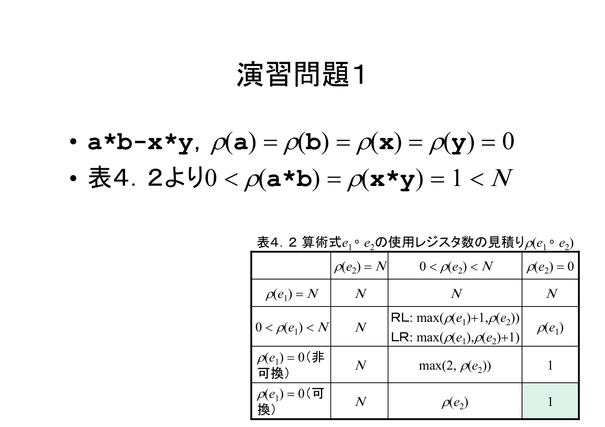

## 言語処理系（４）_p036
<!-- source: 言語処理系（４）.pdf page 36 -->

• a*b-x*y，r(a)=r(b)=r(x)=r(y)=0
• 表４．２より0<r(a*b)=r(x*y)=1<N
• 表４．１よりa*b，x*yは，Ｌ型（またはＲ型）
演習問題１
表４．１算術式e1 。e2のコード生成型
r(e2)=N
0<r(e2)<N
r(e2)=0
r(e1)=N
ＲＳＬ
ＬＲ
Ｌ
0<r(e1)<N
ＲＬ
ＲＬor ＬＲ
Ｌ
r(e1)=0（非
可換）
ＲＬ
ＲＬ
Ｌ
r(e1)=0（可
換）
Ｒ
Ｒ
Ｌor Ｒ

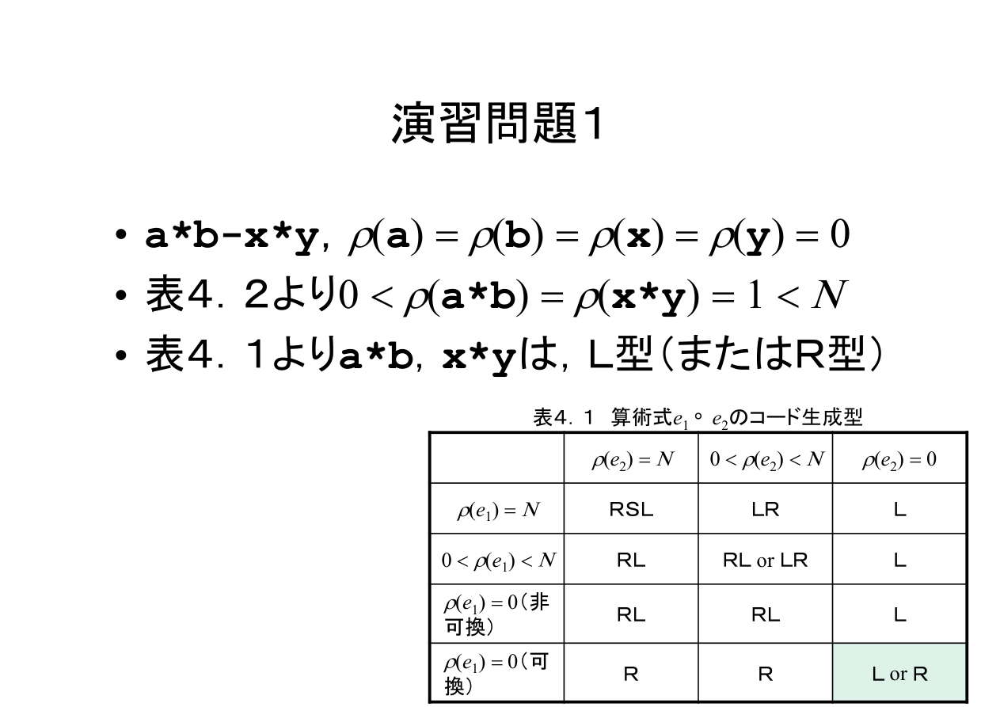

## 言語処理系（４）_p037
<!-- source: 言語処理系（４）.pdf page 37 -->

• a*b-x*y，r(a)=r(b)=r(x)=r(y)=0
• 表４．２より0<r(a*b)=r(x*y)=1<N
• 表４．１よりa*b，x*yは，Ｌ型（またはＲ型）
• 全体はＲＬ型
（またはＬＲ型）
演習問題１
表４．１算術式e1 。e2のコード生成型
r(e2)=N
0<r(e2)<N
r(e2)=0
r(e1)=N
ＲＳＬ
ＬＲ
Ｌ
0<r(e1)<N
ＲＬ
ＲＬor ＬＲ
Ｌ
r(e1)=0（非
可換）
ＲＬ
ＲＬ
Ｌ
r(e1)=0（可
換）
Ｒ
Ｒ
Ｌor Ｒ

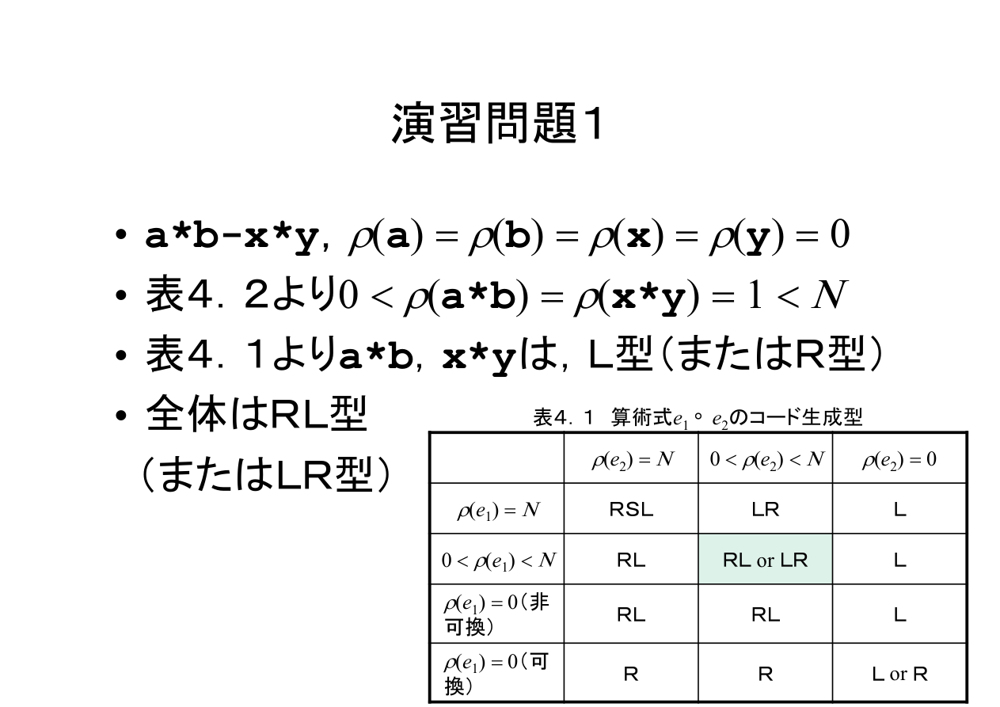

## 言語処理系（４）_p038
<!-- source: 言語処理系（４）.pdf page 38 -->

mov  R, loc(x)
imul R, loc(y)
mov  R', loc(a)
imul R', loc(b)
sub  R', R
演習問題１

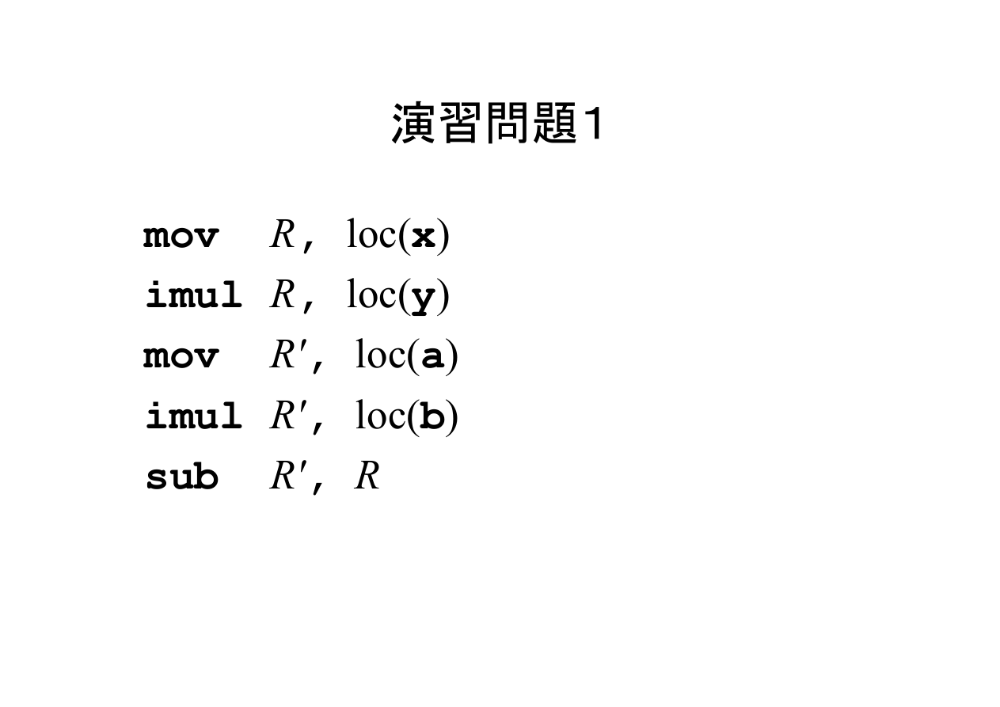

## 言語処理系（４）_p039
<!-- source: 言語処理系（４）.pdf page 39 -->

練習問題１
N = 3のとき，((a-b)*(c+d)+(e-f)*(g+h
*i))*(j*k-l*m)の計算をするコードを示せ．
但し，使用可能なレジスタは，eax，ebxおよび
ecxであるとし，変数vの位置はloc(v)で表す
ものとする．

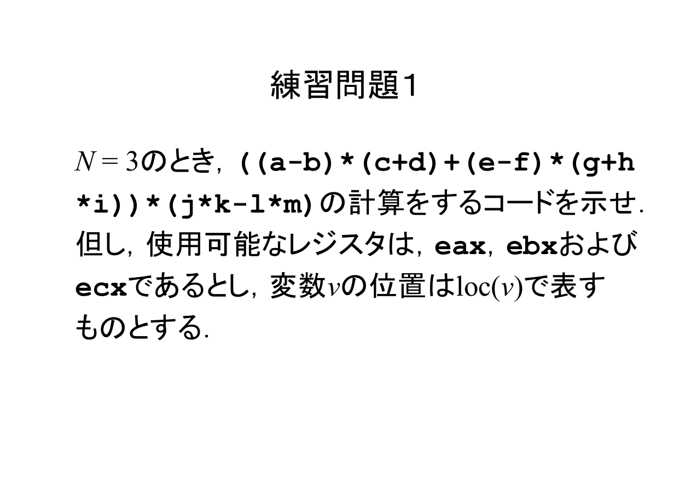

## 言語処理系（４）_p040
<!-- source: 言語処理系（４）.pdf page 40 -->

４．４使用レジスタ数の見積り
• 関数呼出しf(e1,e2,...,en)
– 各eiの計算結果はスタックに
– max(r(e1), r(e2 ), ..., r(en))
– 関数の実行中に使用するレジスタ数は不明
→Nと見積る
• したがって，r(f(e1,e2,...,en))=N

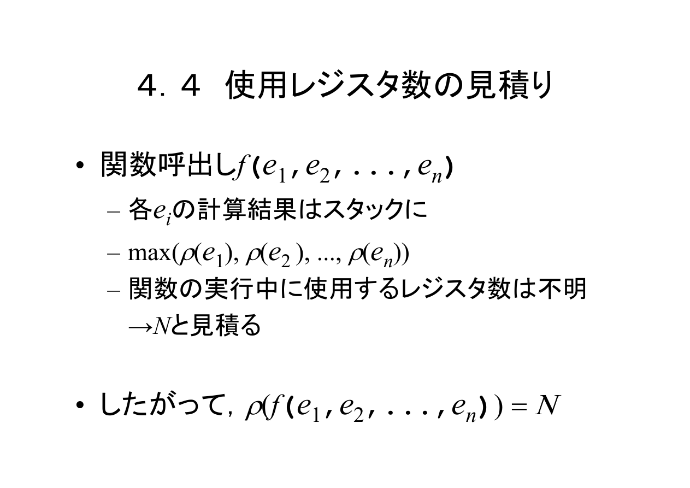

## 言語処理系（４）_p041
<!-- source: 言語処理系（４）.pdf page 41 -->

４．５論理式のコード生成
• 式eを計算し，結果が真（偽）ならばLへ分岐
eの計算（結果R）
cmp  R, 0
jne  L
• 式eが比較演算や論理演算e1 。e2の場合
→より効率的なコード生成可能
式eが論理変数vの
場合は，
cmp  loc(v), 0
とすればよい

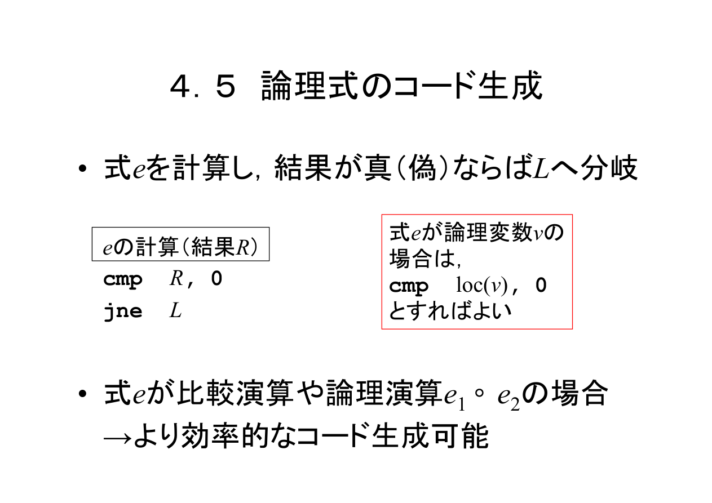

## 言語処理系（４）_p042
<!-- source: 言語処理系（４）.pdf page 42 -->

４．５論理式のコード生成
• 比較演算e1>=e2の結果が真ならばLへ
e2の計算（結果R2）
e1の計算（結果R1）
cmp  R1, R2
jge  L
• 条件分岐命令の条件変更で可換に
e2の計算（結果R2）
e1の計算（結果R1）
cmp  R2, R1
jle  L

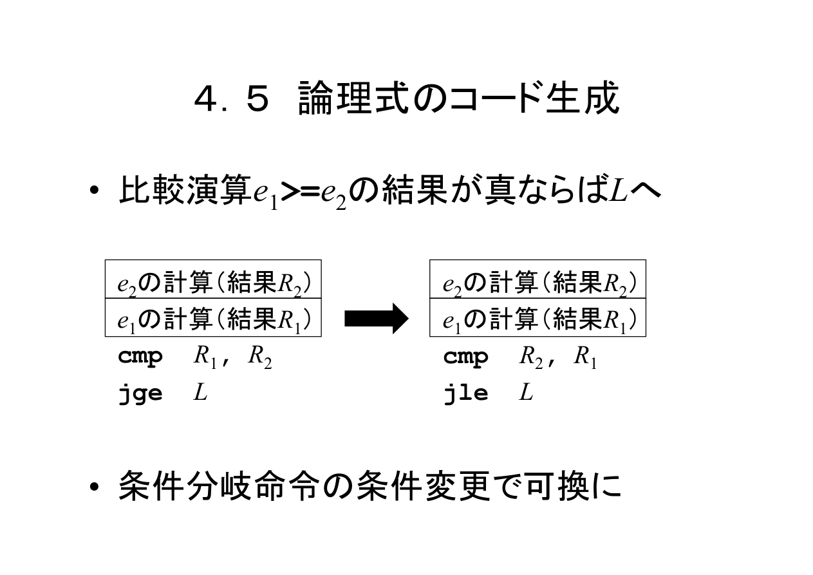

## 言語処理系（４）_p043
<!-- source: 言語処理系（４）.pdf page 43 -->

４．５論理式のコード生成
• 論理演算e1&&e2の結果が偽ならばLへ
e1が偽ならばLへ
e2が偽ならばLへ
• 論理演算e1&&e2の結果が真ならばLへ
e1が偽ならばL'へ
e2が真ならばLへ
L':

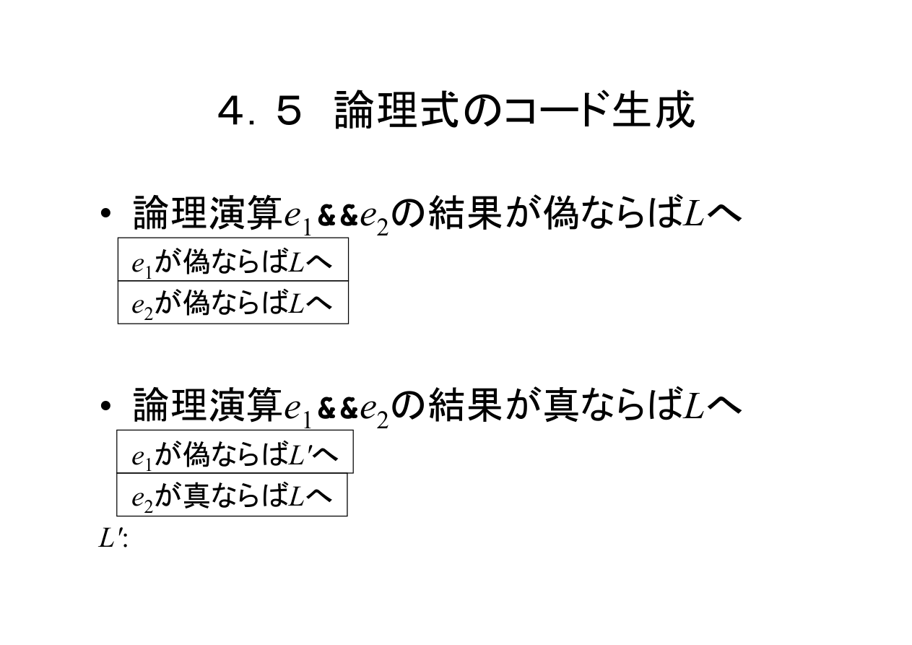

## 言語処理系（４）_p044
<!-- source: 言語処理系（４）.pdf page 44 -->

４．６戻り値の計算コード
• return e;
eの計算（結果R）
mov  eax, R
jmp  Lret
• eの計算結果をeaxに格納
→mov命令を除去可能

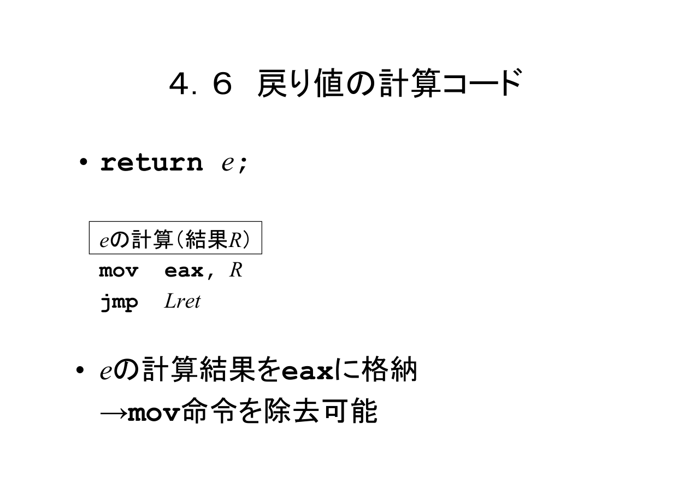

## 言語処理系（４）_p045
<!-- source: 言語処理系（４）.pdf page 45 -->

４．６戻り値の計算コード
• ＲＬ型の算術演算e1 。e2
e2の計算（結果R2）
; 結果をできるだけ非eaxに
e1の計算（結果R1）
; 結果をできるだけeaxに
inst R1, R2
• eaxモード，非eaxモード，自由モード
– ＲＳＬ型におけるe2の計算は，自由モード

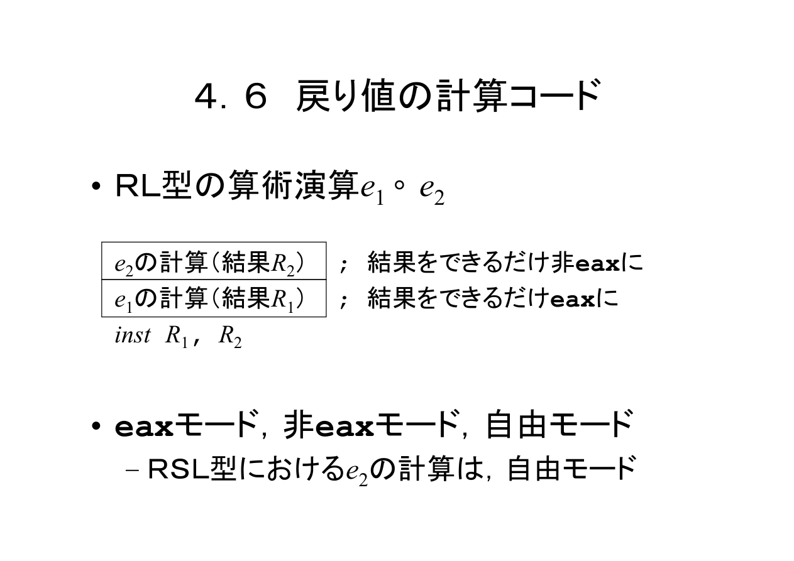

## 言語処理系（４）_p046
<!-- source: 言語処理系（４）.pdf page 46 -->

練習問題２
ＲＬ型でa*b-x*yを計算し値を戻すreturn文
return a*b-x*y;
に対するコードを生成せよ．

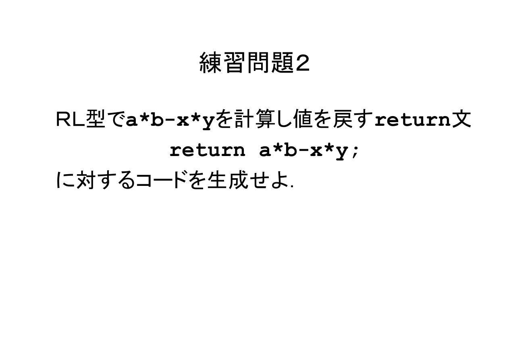

## 言語処理系（４）_p047
<!-- source: 言語処理系（４）.pdf page 47 -->

要約
• レジスタの有効活用
• 計算順序と演算の可換性
• 算術式のコード生成アルゴリズム
• 使用レジスタ数の見積り
• 論理式や戻り値の計算コード

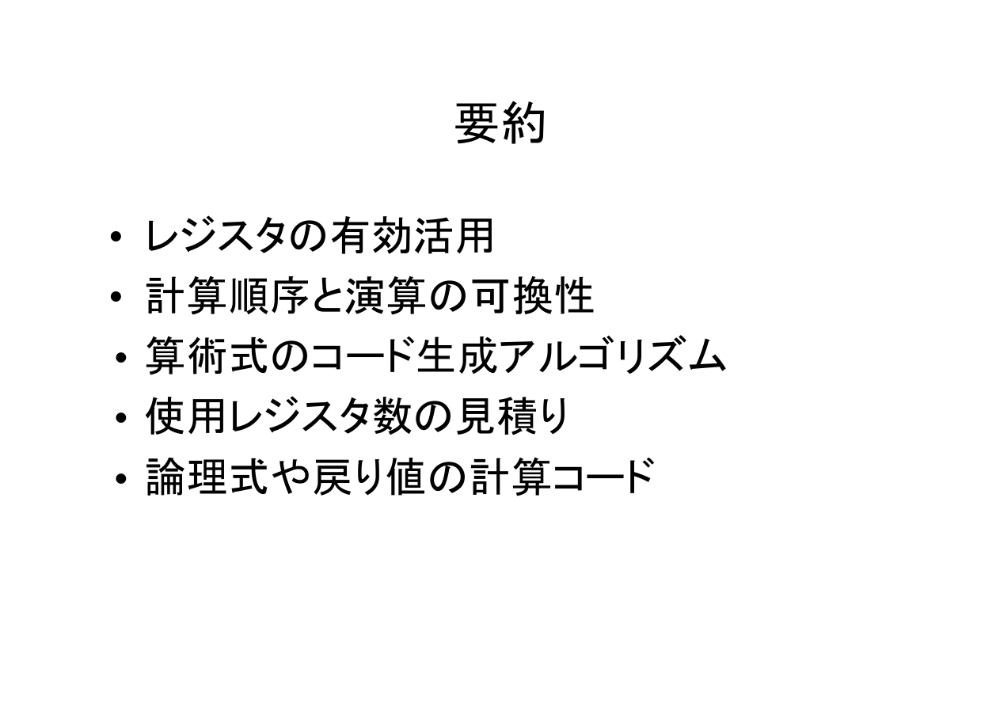
