# 言語処理系（５）

<!-- source: 言語処理系（５）.pdf -->

## 言語処理系（５）_p001
<!-- source: 言語処理系（５）.pdf page 1 -->

言語処理系（５）
金子敬一

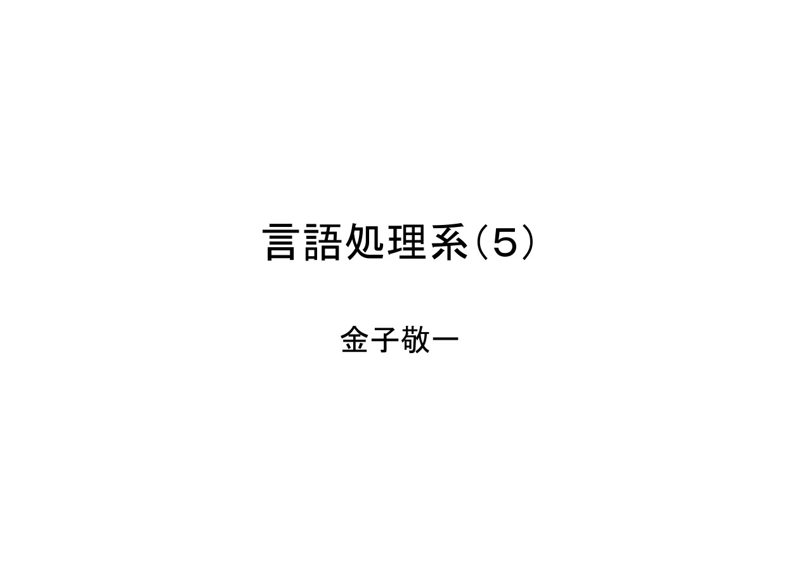

## 言語処理系（５）_p002
<!-- source: 言語処理系（５）.pdf page 2 -->

５最適化
５．１覗き穴式最適化
５．２定数計算の畳込み
５．３分岐命令
５．４レジスタ変数
５．５関数フレームの省略
５．６生存解析
要約

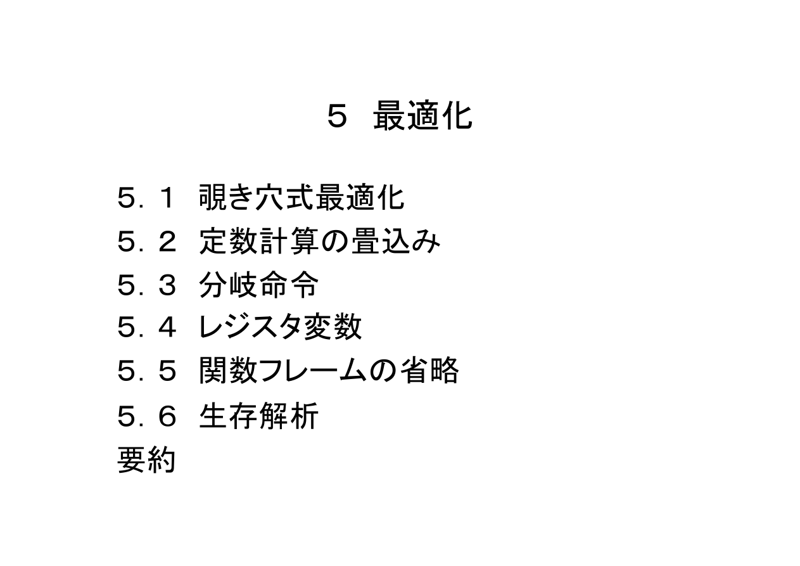

## 言語処理系（５）_p003
<!-- source: 言語処理系（５）.pdf page 3 -->

５．１覗き穴式最適化
• コードの走査，パターン照合，置換
• 単純でありながら強力
• 最適化により新しいパターンが発生
• コードが不変となるまで反復

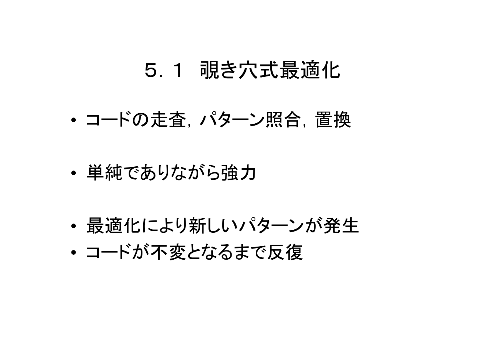

## 言語処理系（５）_p004
<!-- source: 言語処理系（５）.pdf page 4 -->

５．１覗き穴式最適化
• 冗長命令の削除１
add  eax, 0
imul eax, 1
mov  eax, eax
などのそれぞれは削除可能
フラグ変化や符号拡張を利用している場合
は注意

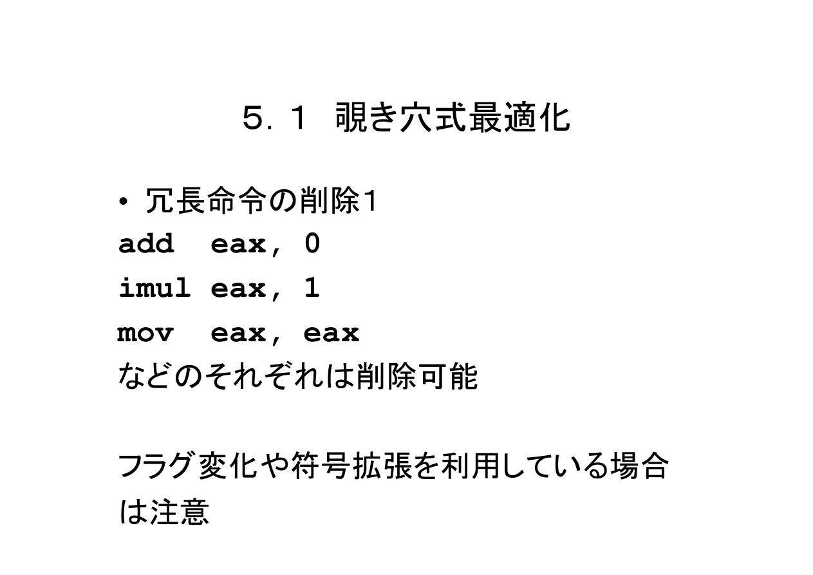

## 言語処理系（５）_p005
<!-- source: 言語処理系（５）.pdf page 5 -->

int foo(int x) {
int y = x * x;
return y + 2;
}
_foo: push ebp
mov  ebp, esp
sub  esp, 4
mov  eax, 8[ebp]
imul eax, 8[ebp]
mov  -4[ebp], eax
mov  eax, -4[ebp]
add  eax, 2
mov  esp, ebp
pop  ebp
ret
５．１覗き穴式最適化
• 冗長命令の削除２
mov -4[ebp], eax
mov eax, -4[ebp]
mov eax, [ebx]
mov eax, [ebx]
のそれぞれにおいて，２つ目の命令は冗長

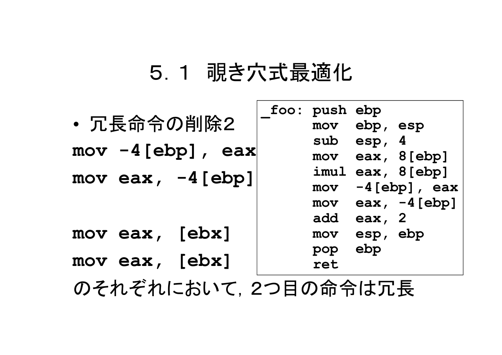

## 言語処理系（５）_p006
<!-- source: 言語処理系（５）.pdf page 6 -->

_foo: push ebp
mov  ebp, esp
sub  esp, 4
mov  eax, 8[ebp]
imul eax, 8[ebp]
mov  -4[ebp], eax
mov  eax, -4[ebp]
add  eax, 2
mov  esp, ebp
pop  ebp
ret
５．１覗き穴式最適化
• 冗長命令の削除２
mov -4[ebp], eax
mov eax, -4[ebp]
mov eax, [ebx]
mov eax, [ebx]
のそれぞれにおいて，２つ目の命令は冗長

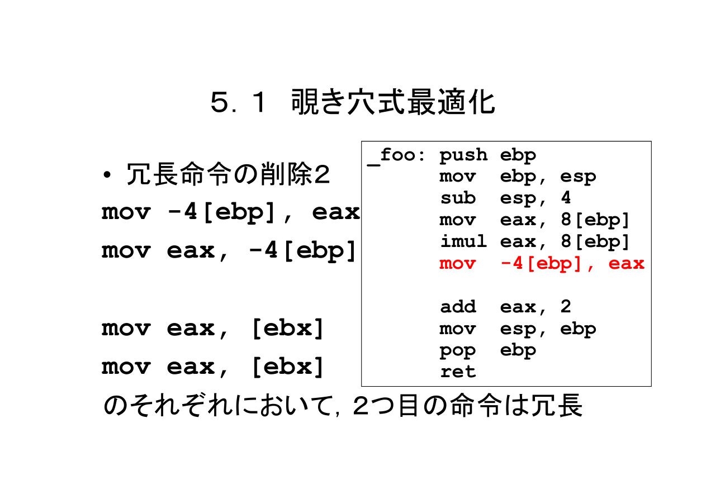

## 言語処理系（５）_p007
<!-- source: 言語処理系（５）.pdf page 7 -->

５．１覗き穴式最適化
• 専用命令による置換
add  [ebx], 1     inc  [ebx]
sub  eax, 1       dec  eax
imul eax, 16      shl  eax, 4

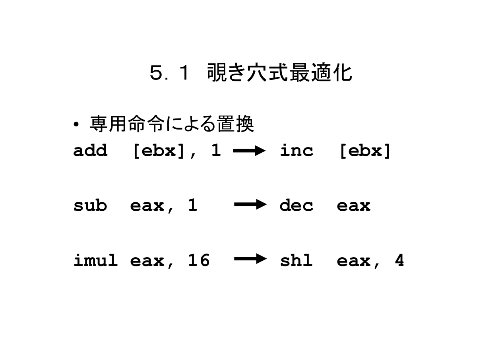

## 言語処理系（５）_p008
<!-- source: 言語処理系（５）.pdf page 8 -->

５．１覗き穴式最適化
• 移動命令後の置換
mov -8[ebp], eax
add ebx, -8[ebp]
は
mov -8[ebp], eax
add ebx, eax
に置換すべき
_foo: push ebp
mov  ebp, esp
sub  esp, 4
mov  eax, 8[ebp]
imul eax, 8[ebp]
mov  -4[ebp], eax
add  eax, 2
mov  esp, ebp
pop  ebp
ret
_foo: push ebp
mov  ebp, esp
sub  esp, 4
mov  eax, 8[ebp]
imul eax, 8[ebp]
mov  -4[ebp], eax
add  eax, 2
mov  esp, ebp
pop  ebp
ret
eax

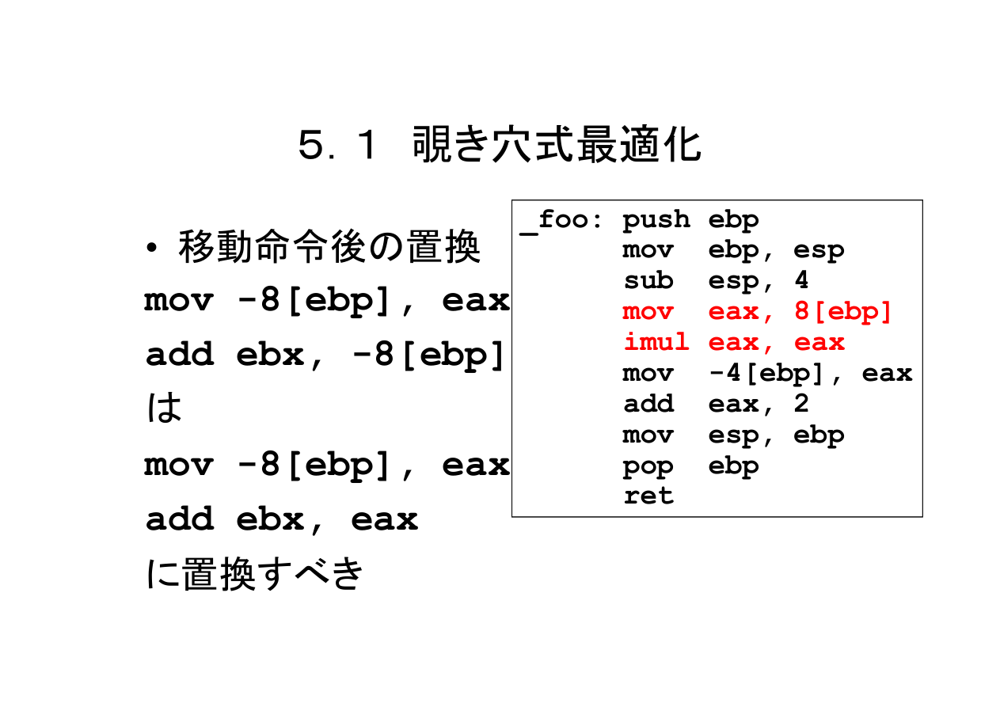

## 言語処理系（５）_p009
<!-- source: 言語処理系（５）.pdf page 9 -->

５．１覗き穴式最適化
• 冗長な分岐命令の削除
jmp L1
L1:               L1:
jcc L2            jcc L3
jmp L3
L2:               L2:

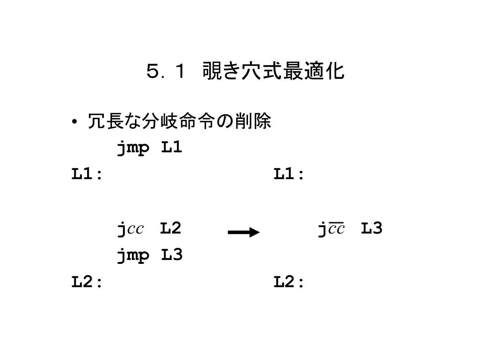

## 言語処理系（５）_p010
<!-- source: 言語処理系（５）.pdf page 10 -->

５．１覗き穴式最適化
• 到達不能命令の削除
jmp  L1             jmp L1
add  eax, 2
imul eax, eax
...
L2:                 L2:

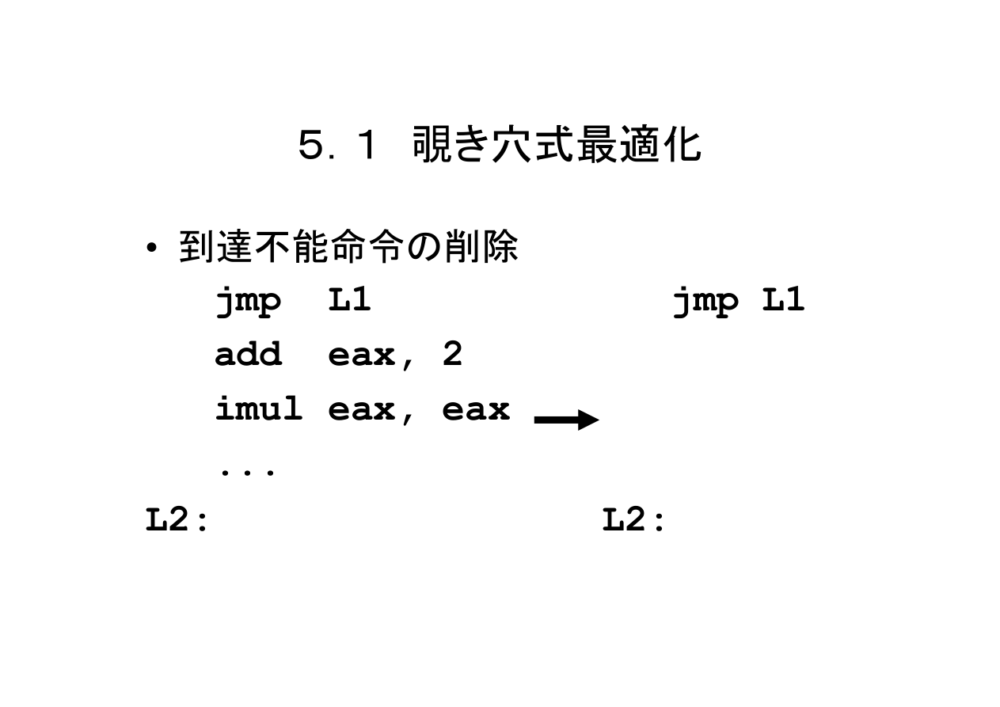

## 言語処理系（５）_p011
<!-- source: 言語処理系（５）.pdf page 11 -->

演習問題１
下記の関数fに対するコードを示せ．また，
そのコードに対して，覗き穴式最適化を施せ．
int f (int x) {
x += 2;
x = 3 * x + 1;
return x;
}

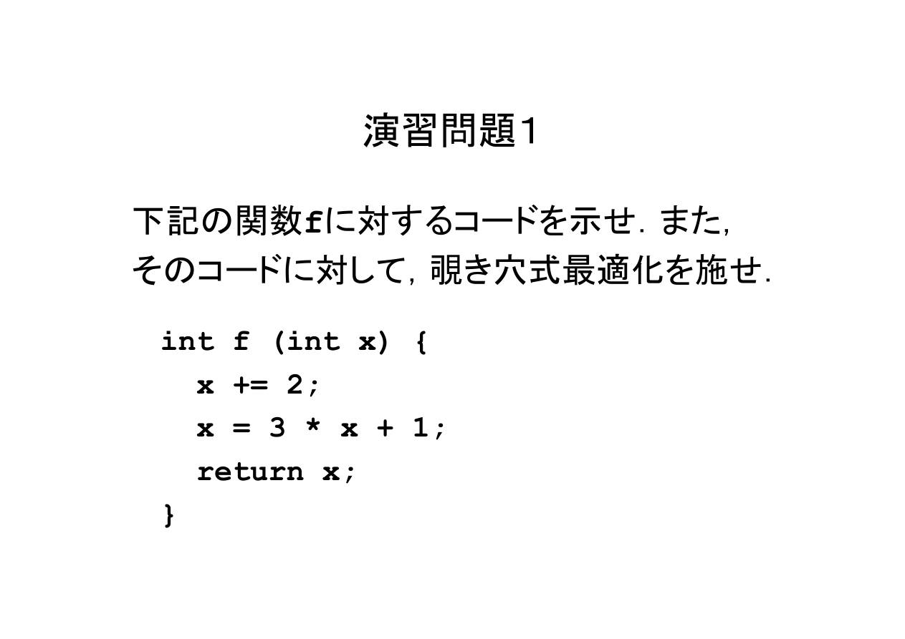

## 言語処理系（５）_p012
<!-- source: 言語処理系（５）.pdf page 12 -->

演習問題１
int f (int x) {
x += 2;
x = 3 * x + 1;
return x;
}
_f:
push ebp
mov
ebp, esp
mov
eax, 8[ebp]
add  eax, 2
mov
8[ebp], eax
mov
eax, 8[ebp]
imul eax, 3
add  eax, 1
mov
8[ebp], eax
mov
eax, 8[ebp]
Lret:
mov
esp, ebp
pop  ebp
ret

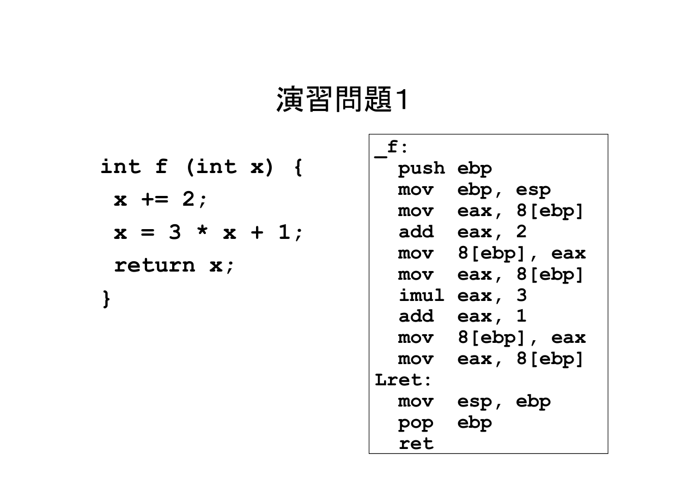

## 言語処理系（５）_p013
<!-- source: 言語処理系（５）.pdf page 13 -->

演習問題１
int f (int x) {
x += 2;
x = 3 * x + 1;
return x;
}
冗長なパターン
_f:
push ebp
mov
ebp, esp
mov
eax, 8[ebp]
add  eax, 2
mov
8[ebp], eax
mov
eax, 8[ebp]
imul eax, 3
add  eax, 1
mov
8[ebp], eax
mov
eax, 8[ebp]
Lret:
mov
esp, ebp
pop  ebp
ret

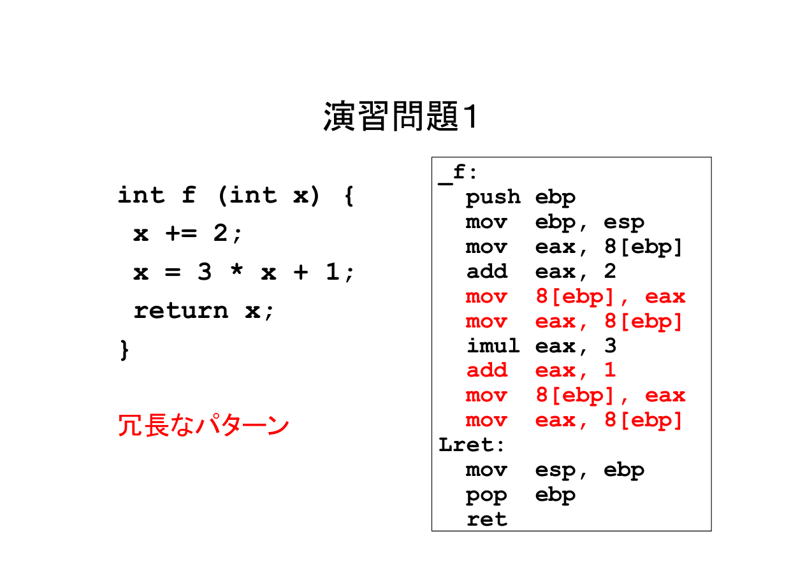

## 言語処理系（５）_p014
<!-- source: 言語処理系（５）.pdf page 14 -->

演習問題１
int f (int x) {
x += 2;
x = 3 * x + 1;
return x;
}
冗長なパターン
_f:
push ebp
mov
ebp, esp
mov
eax, 8[ebp]
add  eax, 2
mov
8[ebp], eax
imul eax, 3
inc
eax
mov
8[ebp], eax
Lret:
mov
esp, ebp
pop  ebp
ret

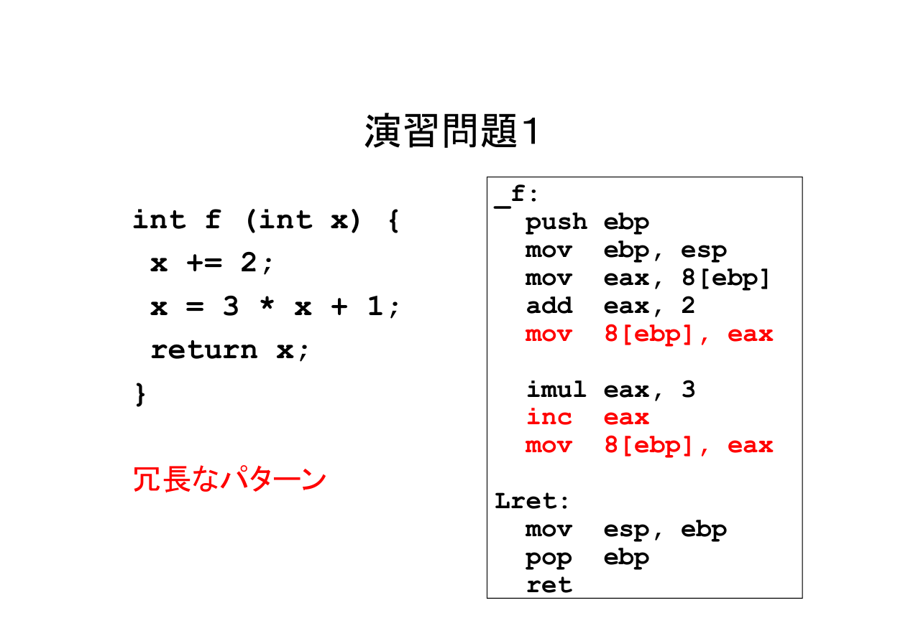

## 言語処理系（５）_p015
<!-- source: 言語処理系（５）.pdf page 15 -->

練習問題１
下記の関数maxに対するコードを示せ．また，
そのコードに対して，覗き穴式最適化を施せ．
int max (int x, int y) {
if (x >= y) x = x - y;
else x = y - x;
return x;
}

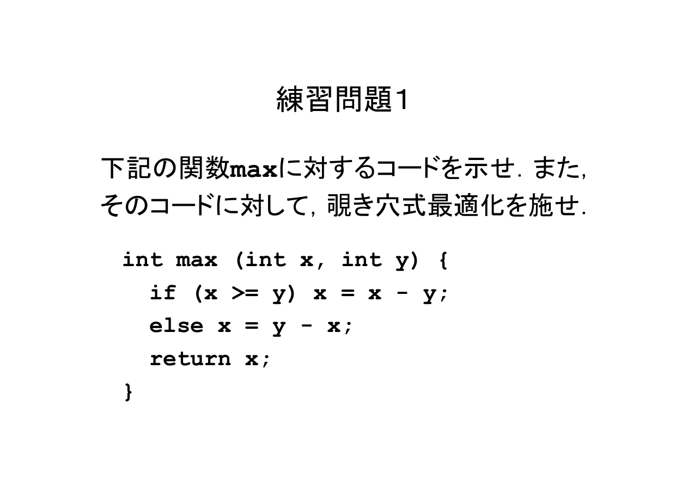

## 言語処理系（５）_p016
<!-- source: 言語処理系（５）.pdf page 16 -->

５．２不変計算の畳込みと移動
• b = 1024 * 4;
コンパイル時に定数計算を実施し，
mov  loc(b), 4096
というコードを生成可能

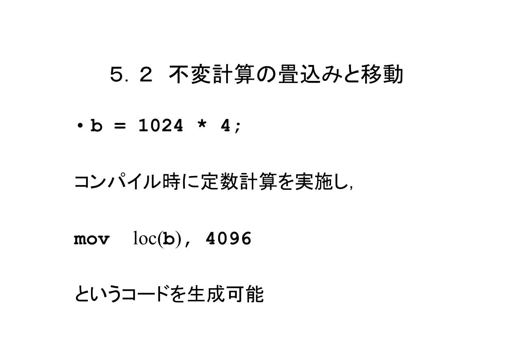

## 言語処理系（５）_p017
<!-- source: 言語処理系（５）.pdf page 17 -->

５．２不変計算の畳込みと移動
• 定数変数（代入後不変の変数）についても定
数計算の畳込みが可能
• ポインタ変数経由で代入されている可能性が
あるため要注意

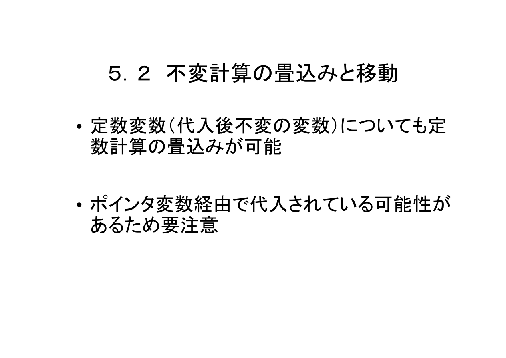

## 言語処理系（５）_p018
<!-- source: 言語処理系（５）.pdf page 18 -->

５．２不変計算の畳込みと移動
• ループ中の不変計算についてもループ外へ
の移動が可能
while (...) {...(b + c)...}
tmp = b + c;
while (...) {...tmp...}

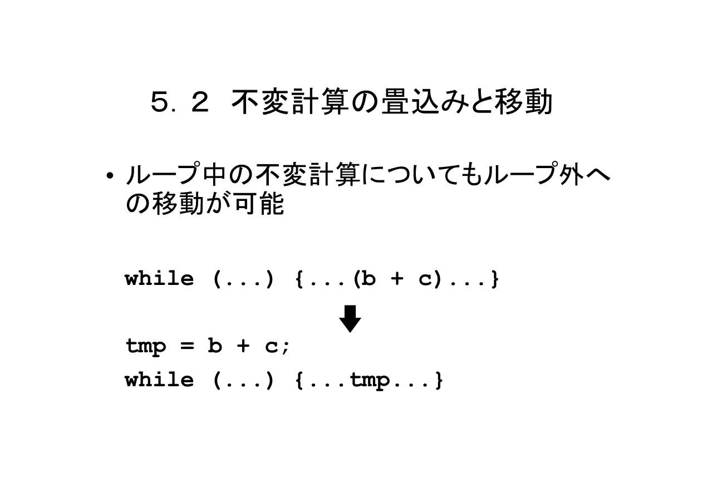

## 言語処理系（５）_p019
<!-- source: 言語処理系（５）.pdf page 19 -->

５．３分岐命令
• 鎖状分岐
jcc L1            jcc L2
...               ...
L1: jmp L2            jmp L2
...               ...
jmp L1            jmp L2
ラベル直後に無条件分岐がある場合は，その
ラベルへの分岐元を無条件分岐先で置換

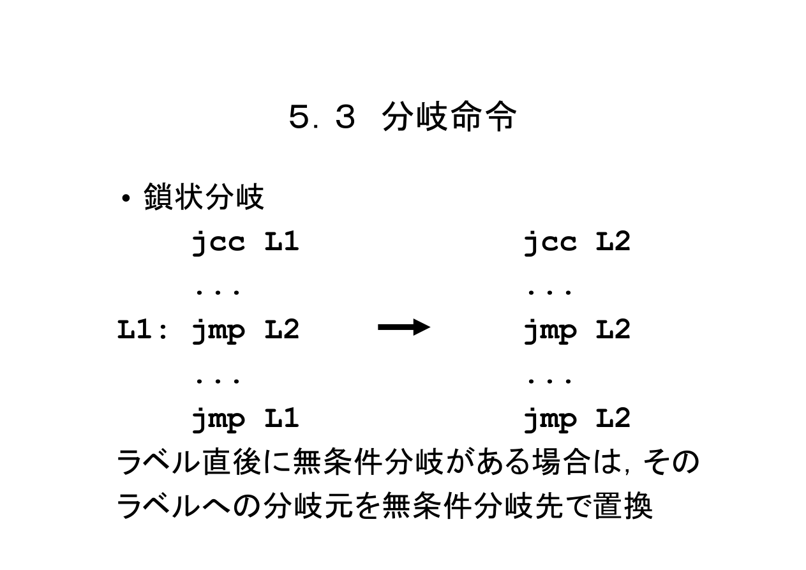

## 言語処理系（５）_p020
<!-- source: 言語処理系（５）.pdf page 20 -->

５．４レジスタ変数
• 関数本体の計算でレジスタが余る
• 余ったレジスタに局所変数や引数を割当て
• 参照回数に基づく割当ての優先順位が必要

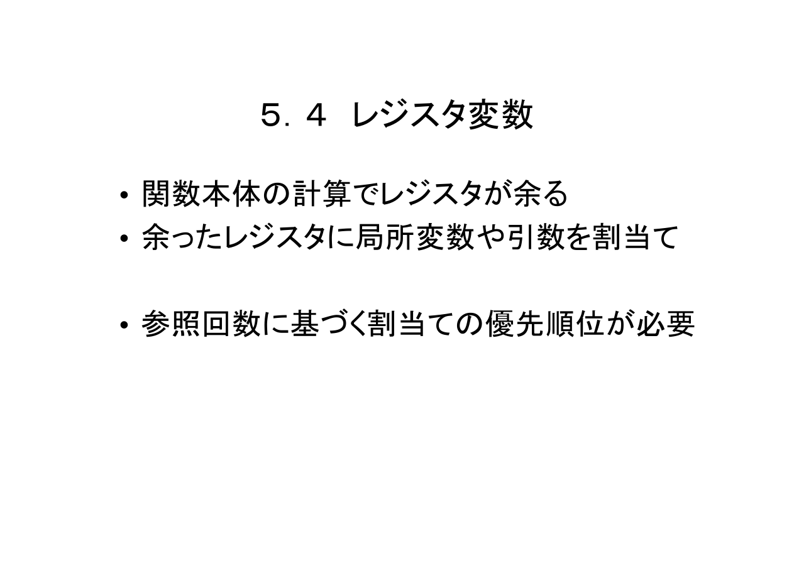

## 言語処理系（５）_p021
<!-- source: 言語処理系（５）.pdf page 21 -->

５．４レジスタ変数
• 変数の参照回数
– 代入１回，参照１回
• ループ中の参照：ループをK回として推定
for (j = i; j < n; j++) s += j;
j：4K+2回，s：2K回，n：K+1回，i：1回
• 条件文中の参照：確率を均等に割振り推定
if ( e ) s1 else s2;
(eでの参照回数)+((s1での参照回数)+(s2での参照回数)) / 2

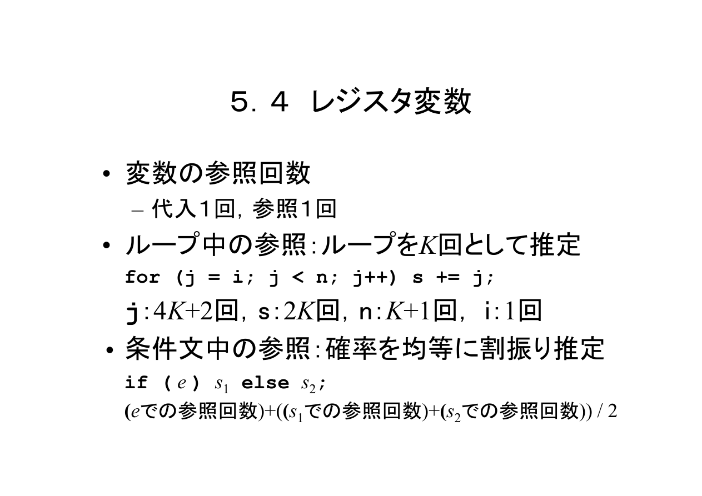

## 言語処理系（５）_p022
<!-- source: 言語処理系（５）.pdf page 22 -->

５．５関数フレームの省略
• 関数中でespの値が不変
→関数フレームを省略可能
_foo: push ebp
mov  ebp, esp
sub  esp, 4
mov  eax, 8[ebp]
imul eax, eax
mov  -4[ebp], eax
add  eax, 2
mov  esp, ebp
pop  ebp
ret
_foo:
sub  esp, 4
mov  eax, 8[esp]
imul eax, eax
mov  [esp], eax
add  eax, 2
add  esp, 4
ret

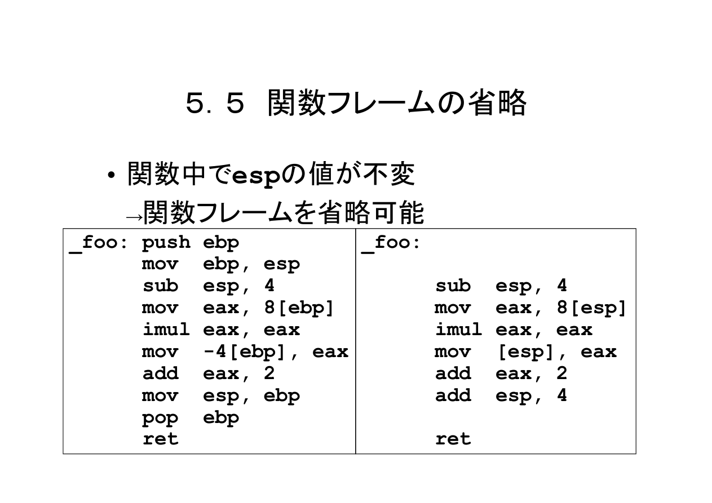

## 言語処理系（５）_p023
<!-- source: 言語処理系（５）.pdf page 23 -->

eax
戻り番地
5
5
25
５．５関数フレームの省略
_foo: sub  esp, 4
mov  eax, 8[esp]
imul eax, eax
mov  [esp], eax
add  eax, 2
add  esp, 4
ret
esp
25
27
sub  esp, 4
mov  eax, 8[esp]
imul eax, eax
mov  [esp], eax
add  eax, 2
ret
add  esp, 4

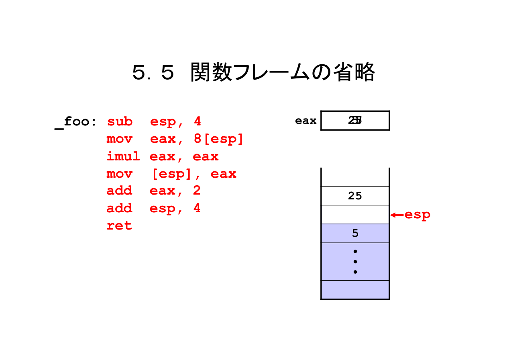

## 言語処理系（５）_p024
<!-- source: 言語処理系（５）.pdf page 24 -->

５．６生存解析
• 使用されない変数への代入，割当てを削除
_foo:
sub  esp, 4
mov  eax, 8[esp]
imul eax, eax
mov  [esp], eax
add  eax, 2
add  esp, 4
ret
_foo:
mov  eax, 4[esp]
imul eax, eax
add  eax, 2
ret

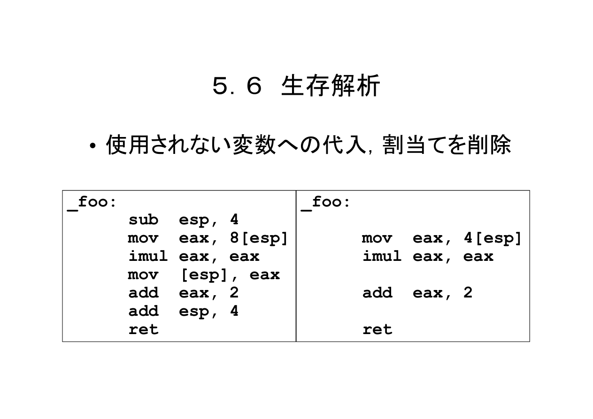

## 言語処理系（５）_p025
<!-- source: 言語処理系（５）.pdf page 25 -->

演習問題２
演習問題１で最適化したコードから関数フレー
ムを省略し，さらに生存解析をしてみよ．

## 言語処理系（５）_p026
<!-- source: 言語処理系（５）.pdf page 26 -->

演習問題２
int f (int x) {
x += 2;
x = 3 * x + 1;
return x;
}
_f:
push ebp
mov
ebp, esp
mov
eax, 8[ebp]
add  eax, 2
mov
8[ebp], eax
imul eax, 3
incr eax
mov
8[ebp], eax
Lret:
mov
esp, ebp
pop  ebp
ret

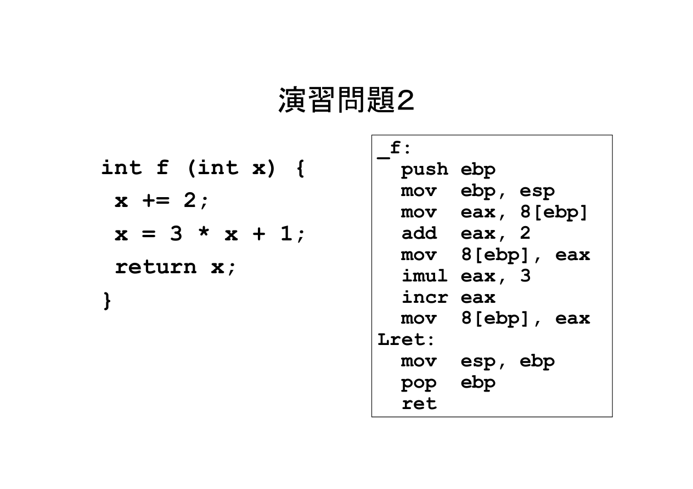

## 言語処理系（５）_p027
<!-- source: 言語処理系（５）.pdf page 27 -->

演習問題２
int f (int x) {
x += 2;
x = 3 * x + 1;
return x;
}
ebpへの操作を除去
ebp相対をesp相対に
_f:
push ebp
mov
ebp, esp
mov
eax, 8[ebp]
add  eax, 2
mov
8[ebp], eax
imul eax, 3
incr eax
mov
8[ebp], eax
Lret:
mov
esp, ebp
pop  ebp
ret

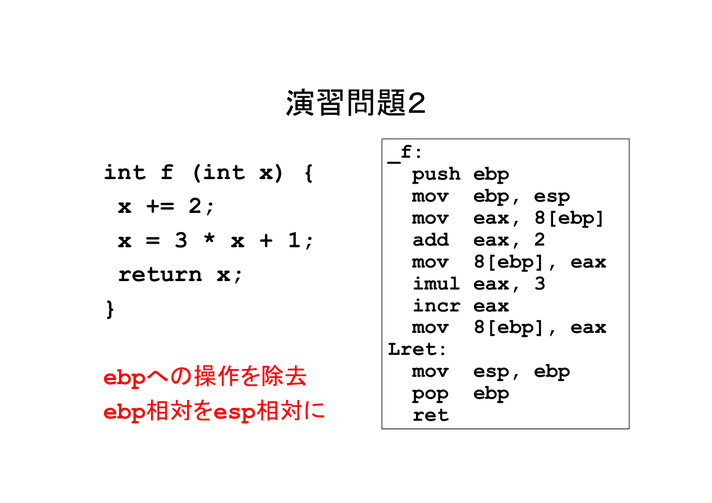

## 言語処理系（５）_p028
<!-- source: 言語処理系（５）.pdf page 28 -->

演習問題２
int f (int x) {
x += 2;
x = 3 * x + 1;
return x;
}
ebpへの操作を除去
ebp相対をesp相対に
_f:
push ebp
mov
ebp, esp
mov
eax, 8[ebp]
add  eax, 2
mov
8[ebp], eax
imul eax, 3
incr eax
mov
8[ebp], eax
Lret:
mov
esp, ebp
pop  ebp
ret

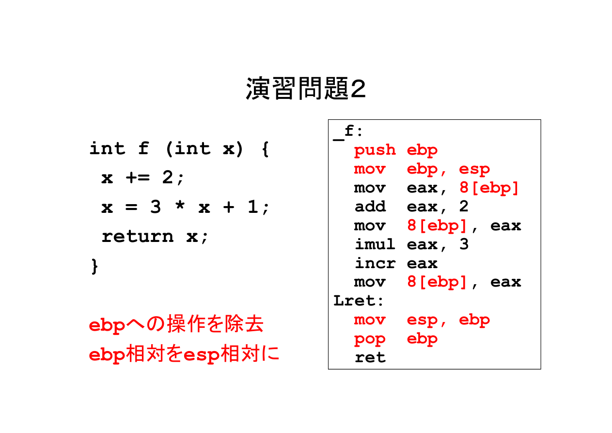

## 言語処理系（５）_p029
<!-- source: 言語処理系（５）.pdf page 29 -->

演習問題２
int f (int x) {
x += 2;
x = 3 * x + 1;
return x;
}
ebpへの操作を除去
ebp相対をesp相対に
_f:
mov
eax, 4[esp]
add  eax, 2
mov
4[esp], eax
imul eax, 3
incr eax
mov
4[esp], eax
Lret:
ret

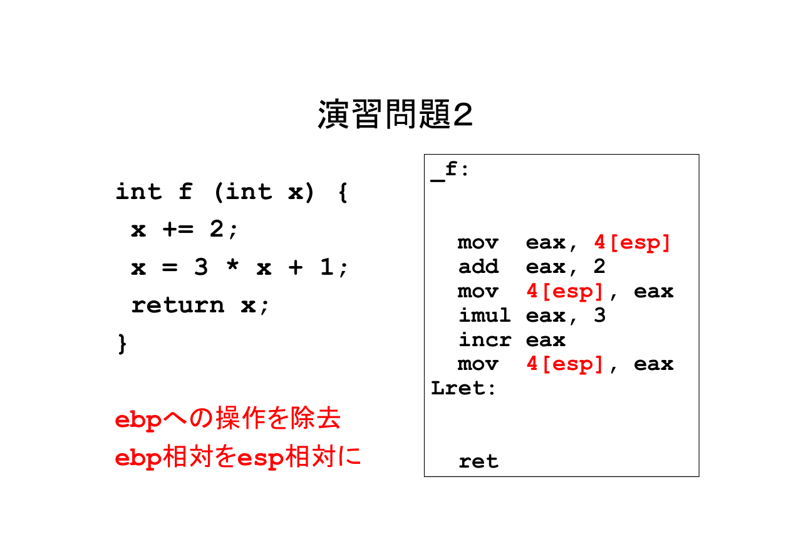

## 言語処理系（５）_p030
<!-- source: 言語処理系（５）.pdf page 30 -->

演習問題２
int f (int x) {
x += 2;
x = 3 * x + 1;
return x;
}
さらに生存解析を実施
_f:
mov
eax, 4[esp]
add  eax, 2
mov
4[esp], eax
imul eax, 3
incr eax
mov
4[esp], eax
Lret:
ret

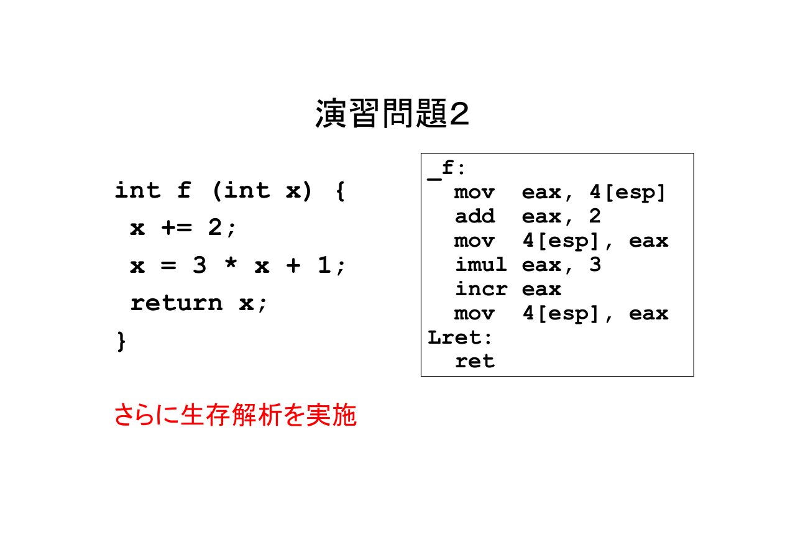

## 言語処理系（５）_p031
<!-- source: 言語処理系（５）.pdf page 31 -->

演習問題２
int f (int x) {
x += 2;
x = 3 * x + 1;
return x;
}
さらに生存解析を実施
_f:
mov
eax, 4[esp]
add  eax, 2
mov
4[esp], eax
imul eax, 3
incr eax
mov
4[esp], eax
Lret:
ret

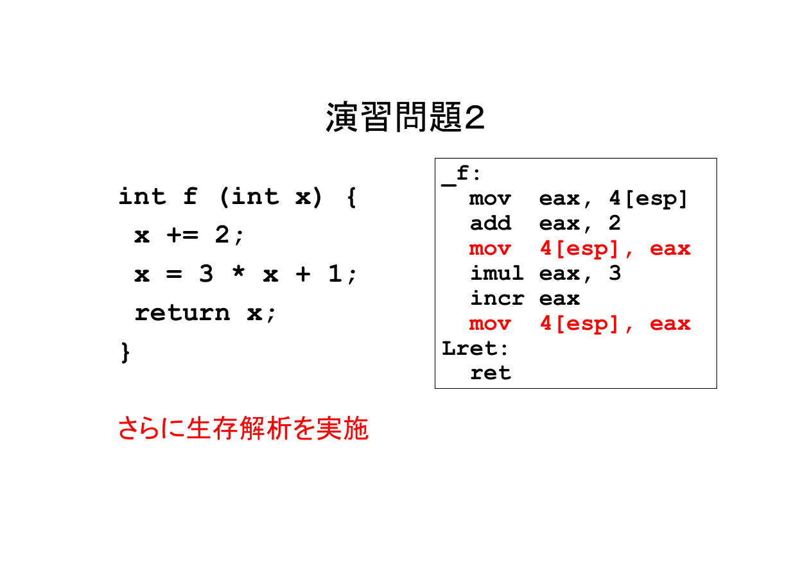

## 言語処理系（５）_p032
<!-- source: 言語処理系（５）.pdf page 32 -->

演習問題２
int f (int x) {
x += 2;
x = 3 * x + 1;
return x;
}
さらに生存解析を実施
_f:
mov
eax, 4[esp]
add  eax, 2
imul eax, 3
incr eax
Lret:
ret

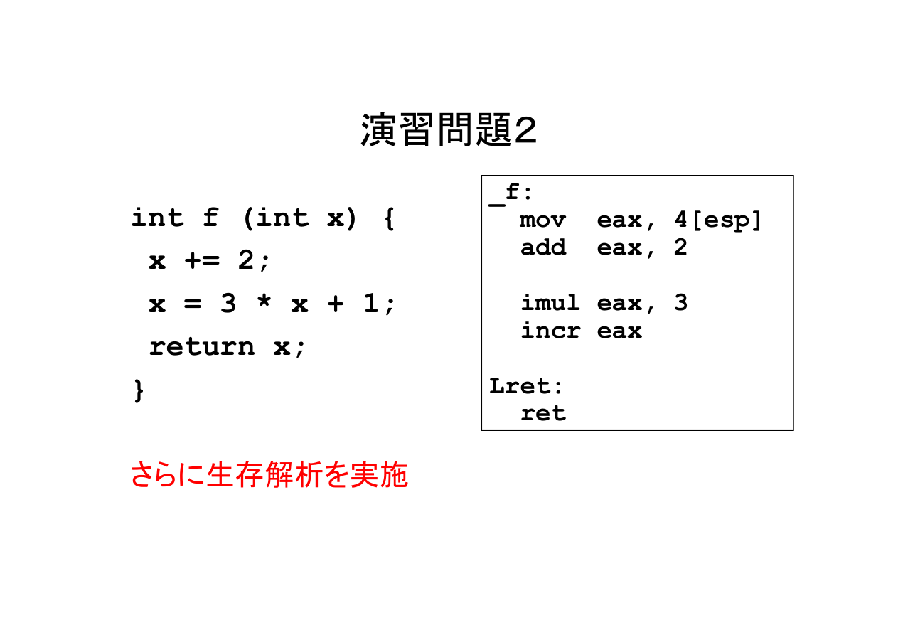

## 言語処理系（５）_p033
<!-- source: 言語処理系（５）.pdf page 33 -->

練習問題２
練習問題１で最適化したコードから関数フレー
ムを省略し，さらに生存解析をしてみよ．

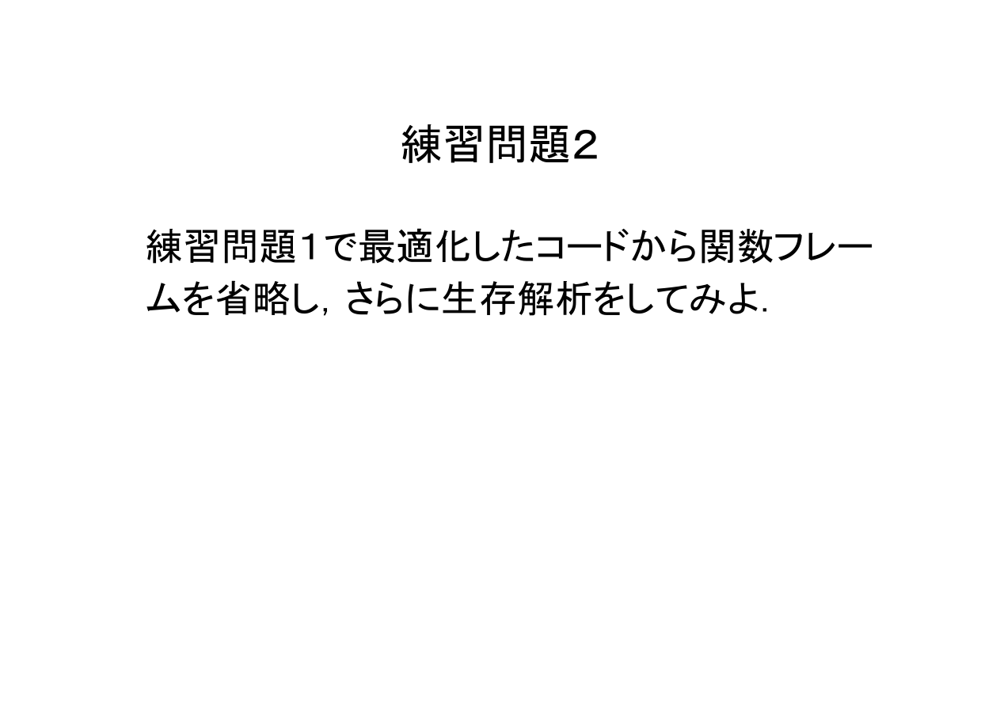

## 言語処理系（５）_p034
<!-- source: 言語処理系（５）.pdf page 34 -->

要約
• 覗き穴式最適化
• 分岐命令
• 定数計算の畳込み
• レジスタ変数
• 関数フレームの省略
• 生存解析

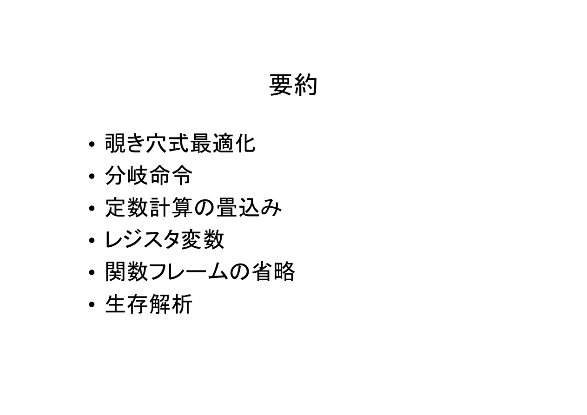
